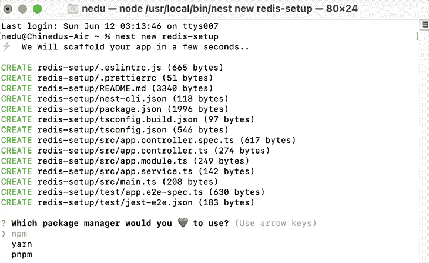
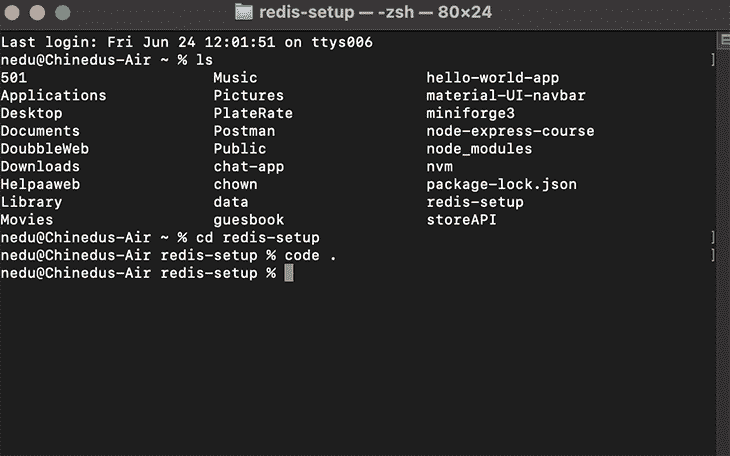
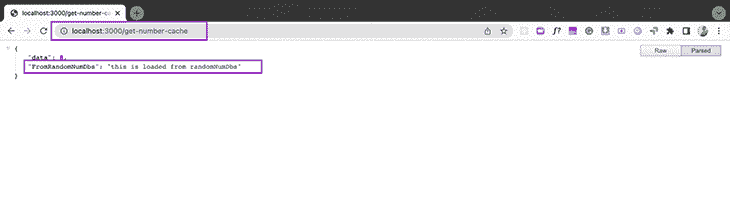
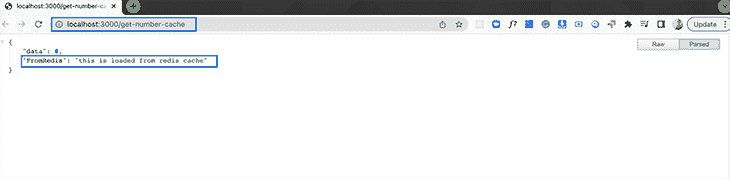
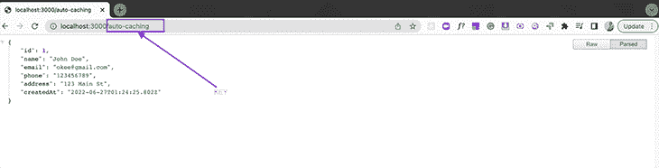

# 如何向 NestJS 应用程序添加 Redis 缓存

> 原文：<https://blog.logrocket.com/add-redis-cache-nestjs-app/>

性能，性能，性能！这就是缓存的全部意义。

缓存特别有助于提高应用程序的性能，从而显著提高其效率。

本文将研究如何使用 Redis 为 NestJS 应用程序添加缓存功能。我们将讨论什么是缓存，Redis，并回顾实现过程。

所以拿起一杯咖啡(或者任何你们这些天喝的东西)。这将会是一次有趣的经历！

## 什么是缓存？

在计算中，缓存是频繁查询的重复数据的临时存储。数据保存在易于访问的位置，以减少延迟。

让我打个比方来帮助更好地解释这个概念…

假设你最终还是得到了那杯咖啡！想象一下，每次你喝一点咖啡，你都必须回到你的咖啡机旁。你倒满杯子，喝一小口，然后把它放在那里，回到你的工作站继续阅读这篇文章。

因为你必须不停地来回走到你的咖啡机和咖啡杯前，所以你要花几个小时才能喝完你的咖啡(还有这篇文章)。这就是没有缓存的情况。

让我们想象一个不同的场景。比方说，当你走向咖啡机喝第一口咖啡时，不是喝一口然后回到你的工作间，而是倒满你的杯子，拿着它回到你的工作间。

当你继续阅读这篇文章的时候，你总是在你的办公桌上放着你的咖啡。你可以很快地啜饮一口(降低延迟)，这样你就可以专注于这篇文章，更快地完成它。[这是实现缓存时发生的情况](https://blog.logrocket.com/caching-strategies-to-speed-up-your-api/)。

如果我们把这个类比带到现实世界，咖啡机就是网络服务器，咖啡本身就是经常被查询的数据。

## 什么是里兹？

根据 Redis 官方网站[的说法，“Redis 是一个开源的内存数据结构存储，用作数据库、缓存、消息代理和流媒体引擎。”](https://redis.io/docs/about/#:~:text=Redis%20is%20an%20open%20source,%2C%20geospatial%20indexes%2C%20and%20streams.)

[需要注意的是，Redis 并不单独处理缓存](https://blog.logrocket.com/guide-to-fully-understanding-redis/)。它提供了数据结构，如散列、集合、字符串、列表、位图和带有范围查询、流、超级日志和地理空间索引的排序集合。

## 在 NestJS 应用程序中实现 Redis 缓存

### 先决条件

要阅读本文，您需要以下内容:

*   安装在计算机上的 Node.js
*   JavaScript 和 Node.js 的基础知识
*   安装在计算机上的 NestJS 命令行界面(CLI)
*   对 Nest 工作原理的基本了解

如果你没有安装 NestJS，[这将帮助你达到速度](https://docs.nestjs.com/)。

在您的机器上安装了 NestJS CLI 之后，让我们继续为我们的应用程序设置 Redis 缓存。

## 为我们的 NestJS 应用程序设置 Redis 缓存

首先，让我们创建一个新项目。我们就叫它`redis-setup`。安装 NestJS 后打开终端，运行下面一行代码:

```
nest new redis-setup

```

之后，我们要选择我们喜欢的包管理器。



就我而言，我选择了`npm`，但是请选择适合你的！之后，安装将继续。

一旦安装完成，我们会看到类似下面的截图。我们必须通过运行`cd redis-setup`来`cd`进入我们的应用。


一旦进入项目目录，我们将在终端中运行`code`。这将自动在 VS 代码中打开项目，前提是它已经安装。



下面是我们的`redis-setup`项目的样子。


在我们继续设置之前，我们需要在应用程序中安装四个主要的包。

### 安装软件包

我们需要安装的第一个包是`node-cache-manager`。节点缓存模块管理器允许在缓存、分层缓存和一致的接口中轻松包装功能。通过在终端中运行`npm install cache-manager`来安装它。

接下来，我们需要安装`node-cache-manager`的 TypeScript 实现`@types/cache-manager`。通过在终端运行`npm i @types/cache-manager`来安装它。

第三，我们将安装`cache-manager-redis-store`。这个包为将配置传递给`node_redis`包提供了一个非常简单的包装器。通过在终端运行`npm install cache-manager-redis-store --save`来安装它

最后我们需要安装`@types/cache-manager-redis-store`。这是`cache-manager-redis-store`包的 TypeScript 实现。通过在终端运行`npm i --save-dev @types/cache-manager-redis-store`来安装它。

完成安装后，我们可以继续为我们的应用程序配置`redis-cache`。

### 配置`redis-cache`

配置`redis-cache`的第一步是导入`CacheModule`并调用它的方法`register()`。这个方法将采用我们的 Redis 配置。

```
//import CacheModule from @nestjs/common'

import { Module, CacheModule } from '@nestjs/common';

```

在接受一个对象的`register()`中，我们将创建一个名为`store`的属性，并将`redisStore`赋给它。`redisStore`将代表我们安装的`cache-manager-redis-store`库。

```
//import CacheModule from '@neskjs/common/cache';
import { Module, CacheModule } from '@nestjs/common';

//import redisStore from 'cache-manager-redis-store';
import * as redisStore from 'cache-manager-redis-store';

import { AppController } from './app.controller';
import { AppService } from './app.service';

@Module({
  imports: [CacheModule.register({ store: redisStore })],
  controllers: [AppController],
  providers: [AppService],
})
export class AppModule {}

```

接下来，我们将在`register()`方法对象中设置另一个属性。我们将添加另一个名为`host`的属性，并将其值设置为默认值`localhost`。我们将把`port`设置为`6379`的默认值。

```
//import CacheModule from '@neskjs/common/cache';
import { Module, CacheModule } from '@nestjs/common';

//import redisStore from 'cache-manager-redis-store';
import * as redisStore from 'cache-manager-redis-store';

import { AppController } from './app.controller';
import { AppService } from './app.service';

@Module({
  imports: [CacheModule.register({ 
    store: redisStore, 
    host: 'localhost', //default host
    port: 6379 //default port
  })],
  controllers: [AppController],
  providers: [AppService],
})
export class AppModule {}

```

通过以上操作，我们已经在 Redis 和我们的 NestJS 应用程序之间建立了一个简单的基本配置！

第二步是将功能注入我们的控制器。这是为了让我们的控制器可以与 Redis 商店通信。我们需要注射`CacheManager`。

在我们的项目目录中，前往`app.controller.ts`。在这个文件中，我们将从`@nestjs/common`导入`Get`、`Inject`和`CACHE_MANAGER`。

```
//importing Get, Inject, Inject, and CACHE_MANAGER from nestjs/common
import { Controller, Get, Inject, CACHE_MODULE } from '@nestjs/common';

```

之后，我们将传入`Inject`和`CACHE_MANAGER`令牌。接下来，我们将从`cache-manager`导入`Cache`，并将其传递给我们的`cacheManager`。

```
//importing Get, Inject, Inject, and CACHE_MANAGER from nestjs/common
import { Controller, Get, Inject, CACHE_MANAGER } from '@nestjs/common';
//import the cache manager
import Cache from 'cache-manager';
import { AppService } from './app.service';

@Controller()
export class AppController {
  constructor(@Inject(CACHE_MANAGER) private cacheManager: Cache{}

  @Get()
  getHello(): string {
    return this.appService.getHello();
  }
}

```

**N.B.** ，`Cache`类从`cache-manager`库导入，`CACHE_MANAGER`令牌从`@nestjs/common`导入。

`CACHE_MANAGER`注入了`redis-cache-store`，而`Cache`提供了默认的`Cache`通信方法，也适用于任何其他商店。

先来了解一下 Redis 商店的`get`和`set`方法。

### `get`和`set`方法

`Cache`实例有`get`方法，这是我们从`cache-manager`包中得到的。这个方法使我们能够从缓存中获取项目。如果缓存为空，则返回`null`。

```
let val = await this.cacheManager.get('key');

```

我们使用`get`方法向缓存中添加一个条目。默认的缓存时间是 5 秒，但是我们可以根据需要随时手动设置生存时间(TTL)。这将取决于应用程序的规格。

```
await this.cacheManager.set('key', 'value', {ttl: 2000});

```

在我们的`get`方法中，我们将传递 URL 来检查我们的 Redis 存储。

```
@Get('get-number-cache')

```

接下来，在我们的`app.controller.ts`中，我们将创建一个获取数字的方法。我们将使用字符串`number`检查我们的号码在 Redis 商店中是否可用。

```
const val = await this.cacheManager.get('number')
    if(val) {
      return { 
        data: val,
        FromRedis: 'this is loaded from redis cache'
      }
    }

```

如果是这种情况，我们将把数据返回给端点。但是，如果数据不存在于`redis-store`中，我们使用键`number`存储它，并将 TTL 设置为任何所需的值。在我们的例子中，我们将使用`1000`。

最后，我们将从我们的虚拟数据库`randomNumDbs`返回存储的数据。在这种情况下，我们随机生成数字。我们可以使用字符串，但是在现实世界的生产应用程序中，这是我们从数据库中为每个第一个请求获取数据的地方。

```
if(!val){
      await this.cacheManager.set('number', this.randomNumDbs , { ttl: 1000 })
      return {
        data: this.randomNumDbs,
        FromRandomNumDbs: 'this is loaded from randomNumDbs'
    }

```

下面是完整的代码:

```
@Controller()
export class AppController {
  //This would be our dummy database since we won't be connecting to a database in the article
  randomNumDbs = Math.floor(Math.random() * 10)
  constructor(@Inject(CACHE_MANAGER) private cacheManager: Cache) {}

  @Get('get-number-cache')
  async getNumber(): Promise<any> {
    const val = await this.cacheManager.get('number')
    if(val) {
      return { 
        data: val,
        FromRedis: 'this is loaded from redis cache'
      }
    }

    if(!val){
      await this.cacheManager.set('number', this.randomNumDbs , { ttl: 1000 })
      return {
        data: this.randomNumDbs,
        FromRandomNumDbs: 'this is loaded from randomNumDbs'
    }
  }
}

```

现在是时候运行我们的应用程序并测试我们到目前为止所做的事情了。要在终端中实现这一点，运行`npm start`并在浏览器中访问 URL[http://localhost:3000/get-number-cache](http://localhost:3000/get-number-cache)。

在第一次加载时，我们的请求将从我们的虚拟随机数数据库中提取。



第二个请求(和其他请求)将从 Redis 存储中加载，直到缓存的数据过期。



Redis 缓存还有另外两种方法:`del`和`reset`。

### `del`和`reset`方法

如果还不清楚的话，`del`方法可以帮助我们从缓存中移除一个条目。

```
await this.cacheManager.del('number');

```

另一方面，`reset`方法清除整个 Redis 存储缓存

```
await this.cacheManager.reset();

```

## 使用拦截器设置自动缓存

自动缓存使用`CacheInterceptor`启用控制器内部每个`Get`动作方法的缓存。

在我们的`app.module.ts`文件中，我们将导入`CacheInterceptor`。使用`TTL`属性为我们的自动缓存全局配置过期时间。要启用`CacheInterceptor`，我们需要将其导入到数组`providers`中。

```
//import CacheModule from '@neskjs/common/cache';
import { Module, CacheModule, CacheInterceptor } from '@nestjs/common';

//import redisStore from 'cache-manager-redis-store';
import * as redisStore from 'cache-manager-redis-store';

import { AppController } from './app.controller';
import { AppService } from './app.service';
import { APP_INTERCEPTOR } from '@nestjs/core';

@Module({
  imports: [CacheModule.register({ 
    store: redisStore, 
    host: 'localhost', //default host
    port: 6379, //default port
    ttl: 2000, //ttl
  })],
  controllers: [AppController],
  providers: [
    {
      provide:APP_INTERCEPTOR,
      useClass: CacheInterceptor
    },
    AppService],
})
export class AppModule {}

```

接下来，在`app.controller.ts`中，我们从`@nestjs/common`导入`UseInterceptor`和`CacheInterceptor`。

```
import { Controller, Get, Inject, CACHE_MANAGER, UseInterceptors, CacheInterceptor } from '@nestjs/common';

```

我们直接在`@controller()`下面使用`UseInterceptors`装饰器，并将`CacheInterceptor`传递给它。这将为控制器中的所有`Get`端点启用自动缓存。

```
//importing Get, Inject, Inject, and CACHE_MANAGER from nestjs/common
import {Controller, Get, Inject, CACHE_MANAGER, UseInterceptors, CacheInterceptor} from '@nestjs/common';
//import the cache manager
import {Cache} from 'cache-manager';
import { AppService } from './app.service';
//import Profile.ts
import {User} from './shared/model/User';

@UseInterceptors(CacheInterceptor)
@Controller()
export class AppController {
  fakeModel:User = {
    id: 1,
    name: 'John Doe',
    email: '[email protected]',
    phone: '123456789',
    address: '123 Main St',
    createdAt: new Date(),
  }

  @Get('auto-caching')
  getAutoCaching() {
    return this.fakeModel;
  }
}

```

对于自动缓存，`key`是`route`值。这是将要存储在我们缓存中的内容，如下面的截图所示。



我们可以在 CLI 中输入`keys *`命令来确认这一点。

在我们想要存储特定路线的数据的情况下，我们不会使用全局定义的`time`和`key`。我们可以定制我们的方法来获得不同的时间。

在`app.controller.ts`中，我们使用一个叫做`@CacheTTL()`的装饰器。对于惟一键，我们使用另一个装饰器`@CacheKey()`，从`@nestjs/common`导入。

```
//importing Get, Inject, Inject, and CACHE_MANAGER from nestjs/common
import {Controller, Get, Inject, CACHE_MANAGER, UseInterceptors, CacheInterceptor, CacheKey, CacheTTL} from '@nestjs/common';

```

指定一个将数据保存到 Redis 存储中的字符串，并为我们的控制器指定一个私有时间。

```
@Get('auto-caching')
  @CacheKey('auto-caching-fake-model')
  @CacheTTL(10)
  getAutoCaching() {
    return this.fakeModel;
  }

```

下面是`app.controller.ts`文件自动缓存代码的完整代码。

```
//importing Get, Inject, Inject, and CACHE_MANAGER from nestjs/common
import {Controller, Get, Inject, CACHE_MANAGER, UseInterceptors, CacheInterceptor, CacheKey, CacheTTL} from '@nestjs/common';
//import the cache manager
import {Cache} from 'cache-manager';
import { AppService } from './app.service';
//import Profile.ts
import {User} from './shared/model/User';

@UseInterceptors(CacheInterceptor)
@Controller()
export class AppController {
  fakeModel:User = {
    id: 1,
    name: 'John Doeeee',
    email: '[email protected]',
    phone: '123456789',
    address: '123 Main St',
    createdAt: new Date(),
  }

  @Get('auto-caching')
  @CacheKey('auto-caching-fake-model')
  @CacheTTL(10)
  getAutoCaching() {
    return this.fakeModel;
  }
}

```

## 结论

就是这样！在本文中，我们讨论了如何向 NestJS 应用程序添加 Redis 缓存。

Redis 支持更低的应用程序延迟和非常高的数据访问。这使得软件工程师能够构建高性能、可靠的解决方案。

在我看来，Redis 利大于弊(如果有的话)。我希望我已经分享了一些关于 NestJS 和 Redis 商店如何工作的深入信息！

如果你喜欢这篇文章，请在评论区发表评论！谢谢你陪我看完这一集。再见！！！

## 使用 [LogRocket](https://lp.logrocket.com/blg/signup) 消除传统错误报告的干扰

[](https://lp.logrocket.com/blg/signup)

[LogRocket](https://lp.logrocket.com/blg/signup) 是一个数字体验分析解决方案，它可以保护您免受数百个假阳性错误警报的影响，只针对几个真正重要的项目。LogRocket 会告诉您应用程序中实际影响用户的最具影响力的 bug 和 UX 问题。

然后，使用具有深层技术遥测的会话重放来确切地查看用户看到了什么以及是什么导致了问题，就像你在他们身后看一样。

LogRocket 自动聚合客户端错误、JS 异常、前端性能指标和用户交互。然后 LogRocket 使用机器学习来告诉你哪些问题正在影响大多数用户，并提供你需要修复它的上下文。

关注重要的 bug—[今天就试试 LogRocket】。](https://lp.logrocket.com/blg/signup-issue-free)