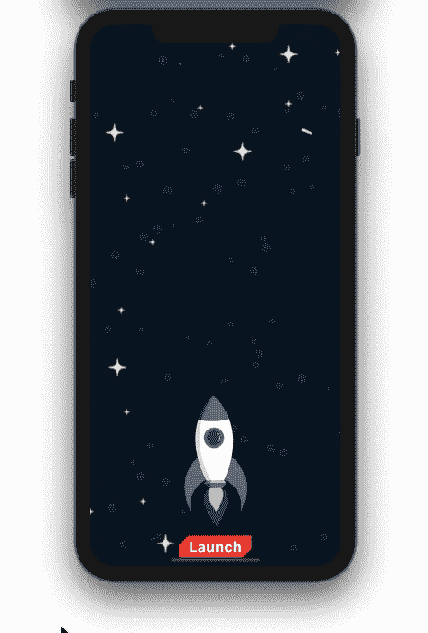
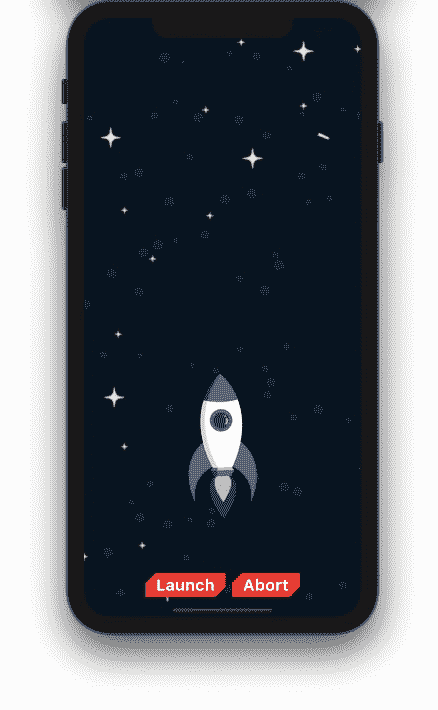
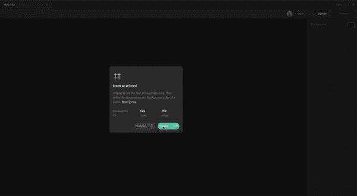
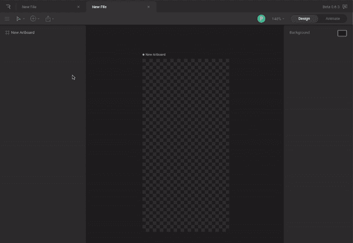
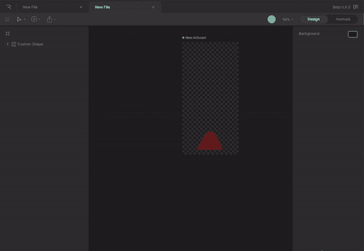
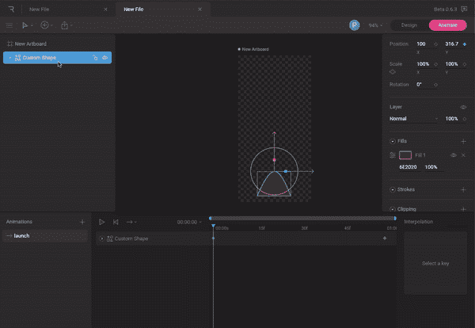
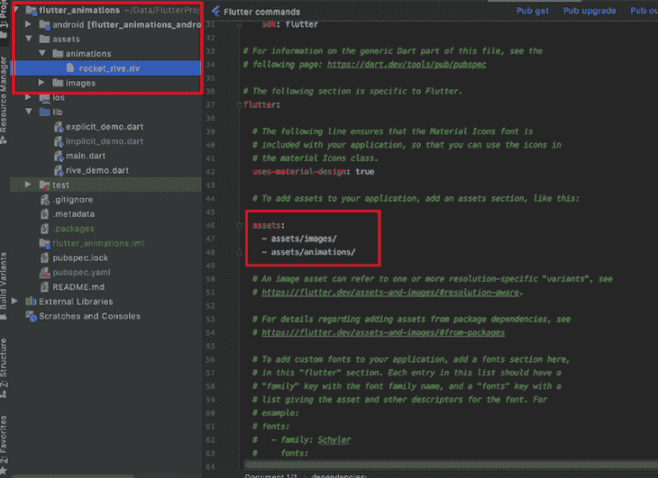
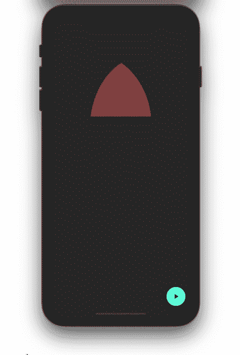

# 向你的 Flutter 应用程序添加动画

> 原文：<https://blog.logrocket.com/adding-animations-to-your-flutter-app/>

简而言之，将动画添加到您的移动应用程序可以增强用户体验。一个精心设计的动画可以使应用程序的外观和感觉更加直观。我们日常使用的应用程序，如 WhatsApp、Twitter 和谷歌地图，都有动画，即使它非常微妙，你几乎不会注意到。这包括从加载屏幕到过渡的一切。

[在你的 Flutter 应用中添加动画](https://blog.logrocket.com/introducing-flutters-new-animations-package/)会影响用户再次使用该应用。它减少了与数据加载相关的挫折，并在降低流失率和提高参与度方面发挥了重要作用。

如果你是一个正在寻找在你的应用中实现动画的 Flutter 开发者，但是不知道从哪里开始，或者如果你不知道哪一个动画部件最适合你的特定用例，这个指南就是为你准备的。我们将向您介绍 Flutter 中的动画类型，并帮助您根据项目的目标和要求决定使用哪一种。

以下是我们将要介绍的内容:

## 颤振中的动画类型

移动应用中的动画主要有两类:基于代码的动画和基于绘图的动画。

### 基于代码的动画

基于代码的动画倾向于关注现有小部件的动画，比如容器、行、列、堆栈等。它允许你改变大小，比例，位置等。小部件的。

例如，您可以使用基于代码的动画将产品图片从购物列表移动到购物车图标。在 Flutter 中，您可以使用隐式或显式动画来创建基于代码的动画。

### 基于绘图的动画

很简单，基于绘图的动画是用来制作绘图动画的。这通常是使用一个定制画师或任何其他动画框架来完成的，比如 T2 驱动。

接下来，让我们仔细看看隐式和显式动画，包括何时使用每种类型和一些实际的例子。

## 隐式动画

隐式动画属于基于代码的动画。与其他类型的动画相比，它通常很容易实现。你所需要做的就是设置一个新值，然后点击`setState`来激活这个新值。

### 何时在 Flutter 中使用隐式动画

如果你想为任何部件开发一个简单的动画，我建议你在 Flutter 网站上找一个[隐式动画部件。例如，如果您只想移动某个东西一次，只需将它包在`AnimatedContainer`或`AnimatedPositioned`中。](https://flutter.dev/docs/reference/widgets)

Flutter 的隐式动画小部件包括:

### 隐式动画示例

目的是通过点击发射按钮让火箭飞起来。从技术上讲，你只需要在点击按钮时改变火箭的位置:



Rocket and Background image source: [https://www.vecteezy.com/free-vector/star](https://www.vecteezy.com/free-vector/star)

将火箭图像包裹在`AnimatedContainer` *内。*

```
duration: Duration(milliseconds: 500),
Stack(
  alignment: AlignmentDirectional.bottomCenter,
  children: <Widget>[
   // Night sky image here
    AnimatedContainer(
      duration: Duration(milliseconds: 500),
      height: 350,
      width: 250,
      margin: EdgeInsets.only(bottom: bottomMargin),
      child: Image.asset('assets/images/rocket.png'),
    ),
    // Launch button here
  ],
)

```

对于任何隐式小部件，duration 参数都是确定动画完成时间所必需的。

在本例中，我们将持续时间参数设置为 500 毫秒，要求火箭在半秒内到达顶部:

```
duration: Duration(milliseconds: 500),

```

底部边距当前设置为`bottomMargin`变量，应用启动时为`0`。

```
double bottomMargin = 0;

```

单击按钮后，剩下的唯一工作就是设置新值。在这种情况下，我们将把`bottomMargin`增加到`500`:

```
RaisedButton(
  onPressed: () {
    _flyRocket();
  },
  child: Text(
    'Launch',
    style: TextStyle(fontWeight: FontWeight.bold, fontSize: 24),
  ),
)
void _flyRocket() {
  setState(() {
    bottomMargin = 500;
  });
}

```

## 明确的动画

显式动画也属于基于代码的动画的范畴。之所以称为显式，是因为你必须显式地启动它。

与隐式动画相比，您可能会发现自己为显式动画编写了更多的代码，但这也有其自身的好处。例如，它可以让您更好地控制小部件上的动画。

### 何时在 Flutter 中使用显式动画

当您需要动画永远运行或以相反的顺序运行时，或者当您希望以相同的方式制作多个小部件的动画时，您应该使用显式动画。例如，如果你想移动某物并把它放回原来的位置。您可以使用 [`SlideTransition`](https://api.flutter.dev/flutter/widgets/SlideTransition-class.html) 移动，使用 [`AnimationController`](https://api.flutter.dev/flutter/animation/AnimationController-class.html) 到达起始位置。

以下是一些显式动画小部件的示例:

### 显式动画示例

为了演示显式动画的概念，我们将使用同一个示例，但是这次使用了中止飞行的新特性。



首先，添加`AnimationController`和`Animation`:

```
Animation<Offset> animation;
AnimationController animationController;

```

`AnimationController`是这里的主要演员；它可以控制动画在任何给定的时间，如播放，暂停，停止，听取当前动画值等。

接下来，初始化`AnimationController`和`Animation`。创建`AnimationController`时指定持续时间。

补间生成介于`Offset(0, 0)`和`Offset(0, -1.2)`之间的值。您可以创建任何对象的补间。这提供了更高层次的灵活性来动画化小部件的几乎所有属性。

```
@override
void initState() {
  super.initState();

  animationController =
      AnimationController(vsync: this, duration: Duration(seconds: 1));
  animation = Tween<Offset>(begin: Offset(0, 0), end: Offset(0, -1.2))
      .animate(animationController);
}

```

下一步是编写一个小部件来制作动画。`SlideTransition`是一个消耗动画值的小部件。

```
SlideTransition(
    position: animation,
    child: Container(
      height: 350,
      width: 250,
      decoration: BoxDecoration(
          image: DecorationImage(
        image: AssetImage('assets/images/rocket.png'),
      )),
    ))

```

现在让我们发射火箭。使用`animationController.forward();`移动火箭:

```
RaisedButton(
  onPressed: () {
    animationController.forward();
  },
  child: Text(
    'Launch',
    style:
        TextStyle(fontWeight: FontWeight.bold, fontSize: 24),
  ),
  color: Colors.red,
  textColor: Colors.white,
  shape: BeveledRectangleBorder(
      borderRadius: BorderRadius.only(
          topLeft: Radius.circular(15),
          bottomRight: Radius.circular(15))),
)

```

为了让火箭中止，我们将使用`animationController.reverse();`把它带回起点:

```
RaisedButton(
  onPressed: () {
    if (animationController.isCompleted) {
      animationController.reverse();
    }
  },
  child: Text(
    'Abort',
    style:
        TextStyle(fontWeight: FontWeight.bold, fontSize: 24),
  ),
  color: Colors.red,
  textColor: Colors.white,
  shape: BeveledRectangleBorder(
      borderRadius: BorderRadius.only(
          topLeft: Radius.circular(15),
          bottomRight: Radius.circular(15))),
)

```

## 使用 Rive 在 Flutter 中创建动画

使用 Rive 创建的动画属于基于绘图的动画类别。Rive 是一个动画框架，旨在帮助你在任何平台上创造令人惊叹的视觉效果。在撰写本文时，Rive 目前处于测试阶段，并支持 Flutter、Android、iOS、Web 和 C++的动画。

在这一节中，我们将演示如何在 Rive 中创建一个简单的火箭动画，并将其集成到 Flutter 应用程序中。

### 创建和配置画板

选择合适的画板大小并使其透明:



### 设计火箭

为了演示的目的，我们将只创建一个火箭的鼻子使用钢笔工具。您还可以玩一些预定义的形状。



### 给火箭做动画

切换到动画选项卡，并使用关键点定义火箭在动画结束时的位置。你还应该给动画一个合适的名字，我们将使用它来启动我们的 Flutter 应用程序中的动画。



### 导出 Rive 文件

点击左侧的**导出**菜单，选择运行时间:



### 在你的 Flutter 应用中安装 rive

找到 Rive 的[最新版本并粘贴到你的`pubspec.yaml`文件中:](https://pub.dev/packages/rive)

```
dependencies:
  flutter:
    sdk: flutter
  cupertino_icons: ^1.0.2
  rive: ^0.7.0

```

要将 Rive 导入到项目中，请在项目的根目录下创建一个文件夹结构，例如 assets/animation，并将。riv 文件在那里。您还应该在`pubspec.yaml`文件中提供对它的引用。



### 加载 Rive 文件

加载。使用以下代码将 riv 文件复制到画板中:

```
Artboard _riveArtboard;
RiveAnimationController _controller;
@override
void initState() {
  super.initState();

  rootBundle.load('assets/animations/rocket_rive.riv').then(
    (data) async {
      final file = RiveFile.import(data);
      final artboard = file.mainArtboard;
      setState(() => _riveArtboard = artboard);
    },
  );
}

```

`RiveAnimationController`在任何给定时间控制 Rive 动画。

### 编写一个小部件来显示 Rive 画板

使用 Rive widget 显示整个画板:

```
Center(
  child: _riveArtboard == null
      ? const SizedBox()
      : Rive(artboard: _riveArtboard),
)

```

### 触发动画

我们将使用`FloatingActionButton`来开始动画:

```
FloatingActionButton(
  onPressed: _launchRocket,
  child: Icon(Icons.play_arrow),
)

```

### 播放动画

我们只需添加一个控制器，动画名称设置为`launch` *，就可以播放动画了。* `launch`是我们在 rive.app 创建的动画的名字:

```
void _launchRocket() {
  _riveArtboard.addController(_controller = SimpleAnimation('launch'));
}

```

这是成品应该的样子。你可以在 [GitHub](https://github.com/pinkeshdarji/flutter_animations) 上找到完整的源代码。



## 结论

当构建任何类型的应用程序时，经过深思熟虑和精心编排的动画可以为用户体验创造奇迹。在本教程中，我们解释了基于代码的动画和基于绘图的动画之间的区别，并向您介绍了如何在您的 Flutter 应用程序中使用隐式和显式动画。我们还列出了每个动画类别下的部件，并概述了一些提示，以帮助您决定在下一个 Flutter 项目中使用哪些部件。

## 使用 [LogRocket](https://lp.logrocket.com/blg/signup) 消除传统错误报告的干扰

[](https://lp.logrocket.com/blg/signup)

[LogRocket](https://lp.logrocket.com/blg/signup) 是一个数字体验分析解决方案，它可以保护您免受数百个假阳性错误警报的影响，只针对几个真正重要的项目。LogRocket 会告诉您应用程序中实际影响用户的最具影响力的 bug 和 UX 问题。

然后，使用具有深层技术遥测的会话重放来确切地查看用户看到了什么以及是什么导致了问题，就像你在他们身后看一样。

LogRocket 自动聚合客户端错误、JS 异常、前端性能指标和用户交互。然后 LogRocket 使用机器学习来告诉你哪些问题正在影响大多数用户，并提供你需要修复它的上下文。

关注重要的 bug—[今天就试试 LogRocket】。](https://lp.logrocket.com/blg/signup-issue-free)