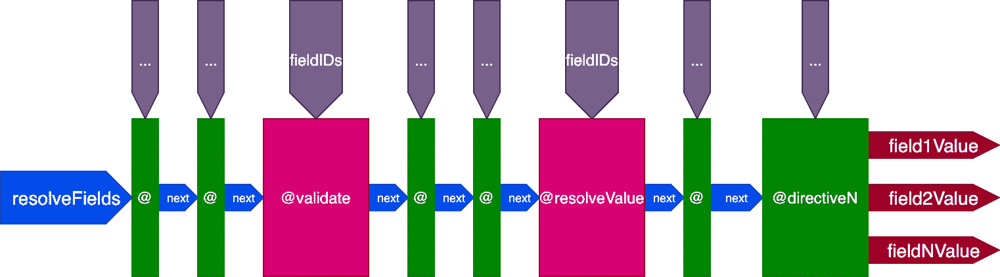
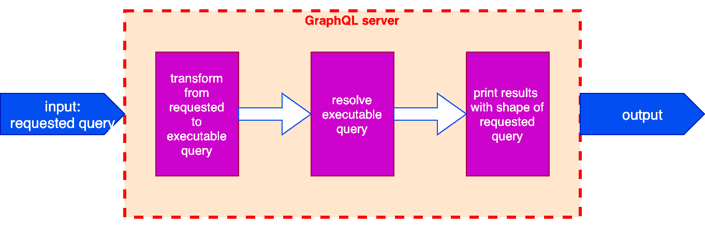

# 在代码优先的 GraphQL 服务器- LogRocket 博客中向模式添加指令

> 原文：<https://blog.logrocket.com/adding-directives-schema-code-first-graphql-servers/>

创建 GraphQL 服务器有两种方法:SDL 优先(模式定义语言)方法和代码优先方法，这两种方法各有优缺点。有两种类型的指令:模式类型的指令(如`@deprecated`)，通过 SDL 在模式上声明；以及查询类型的指令(比如`@include`和`@skip`)，它们被添加到客户端的查询中。

代码优先方法的一个缺点是，因为它没有 SDL，所以不能自然地支持模式类型的指令。代码优先的服务器可以提供通过代码而不是 SDL 来声明模式类型指令的选择。然而，`graphql-js`(graph QL 的参考实现)的维护者已经决定[不支持通过代码](https://github.com/graphql/graphql-js/issues/1343)注册指令。

因此，依赖于`graphql-js`的代码优先服务器可能无法提供依赖于这些指令的特性，除非他们找到一些变通方法。例如， [Nexus 不能与 Apollo Federation](https://github.com/graphql-nexus/schema/issues/53#issuecomment-549683541) 集成，这需要您在模式上定义一个 [`@key`指令。](https://www.apollographql.com/docs/apollo-server/federation/introduction/#federated-schema-example)

但是其他的 GraphQL 服务器不需要在这方面模仿`graphql-js`,并且可以通过代码提供声明模式类型指令的支持。毕竟，GraphQL 规范本身并不关心如何实现指令。

在本文中，我将通过 PoP 描述我为 [GraphQL 实现的策略(我创作的用 PHP 编写的代码优先的 GraphQL 服务器),通过代码提供对模式类型指令的支持。](https://graphql-by-pop.com)

## 对比模式和查询类型指令

`@deprecated`是一个模式类型指令，因此它必须应用于模式。然而，如果我们暂时假设它是一个查询类型的指令，并直接在查询中的某个字段上添加`@deprecated`,会发生什么呢？

例如，当执行以下查询时:

```
query {
  posts {
    id
    title
    content @deprecated(reason: "Use newContent instead")
  }
}
```

嗯，这也行得通！因为，毕竟，一个指令只是在现场执行的一些功能；通过模式或直接在查询中声明该功能，不会使该功能的行为有任何不同。

事情是这样的，即使它有效，也没有任何意义；你不能强迫你的客户将`@deprecated`添加到他们的查询中。这是由服务器端的应用程序决定的功能，而不是客户端的。

然而，好处是功能本身仍然有效。因此，从功能的角度来看，指令是添加到模式还是添加到查询并不重要。此外，每个指令最终都会出现在查询中，因为这是它执行的地方。

因此，如果我们没有 SDL，我们仍然可以在运行时将指令嵌入到查询中。

## 分离请求的和可执行的查询

在文章 *[将 GraphQL 指令视为中间件](https://blog.logrocket.com/treating-graphql-directives-as-middleware/)* 中，我描述了指令管道，这是一种使服务器引擎能够解析、验证和执行查询的架构。为了使引擎尽可能简单，与查询解析相关的每个操作都通过指令在管道中进行。



The directive pipeline.

调用解析器来验证和解析一个字段，并将其输出合并到响应中，这是通过几个特殊的指令来完成的:`@validate`和`@resolveValueAndMerge`。这些指令属于特殊类型；它们不是由应用程序(在查询或模式上)添加的，而是由引擎本身添加的。这两个指令是隐式的，它们总是被添加到每个查询的每个字段中。

从这个策略中，我们可以看到，当在 GraphQL 服务器上执行查询时，实际上涉及到两个查询:

1.  请求的查询
2.  可执行查询

最终由服务器解析的可执行查询是通过对请求的查询应用转换而产生的，其中包括每个字段的指令`@validate`和`@resolveValueAndMerge`。



Inner process within the GraphQL server.

例如，如果请求的查询是这样的:

```
{
  posts {
    url
    title @uppercase
    content @include(if: $addContent)
  }
}
```

可执行的查询将是这样的:

```
{
  posts @validate @resolveValueAndMerge {
    url @validate @resolveValueAndMerge
    title @validate @resolveValueAndMerge @uppercase
    content @validate @include(if: $addContent) @resolveValueAndMerge
  }
}
```

事实上，我们可以转换查询来添加任何指令，而不仅仅是特殊类型的指令。这样，即使没有 SDL，我们仍然可以在运行时在字段中插入一个`@deprecated`指令。

顺便提一下，将查询分离成请求的和可执行的实例还有其他潜在的用途。例如，它可以为[平链语法问题](https://github.com/graphql/graphql-spec/issues/174)提供一个解决方案，通过以下步骤将快捷方式`programs.shortName`解析为字符串数组(`["name1", "name2", ...]`)而不是对象数组(`[{shortName: "name1"}, {shortName: "name2"}, ...]`):

*   将来自所请求查询的字段`programs.shortName`转换成可执行查询中的相应连接`programs { shortName }`
*   解析这部分可执行查询
*   通过某种指令`@copyConnectionDataUpwards`将解析的数据复制到图的节点上
*   通过某个`@flatten`指令将对象数组的结果转换成预期的字符串数组
*   将此结果放在名为`programs.shortName`的条目下的查询对象的响应中

## IFTTT 通过指令

接下来，我们必须产生一种机制来告诉服务器何时以及如何将指令添加到查询中。我开发的机制是基于 IFTTT 的概念(if this，then that)，我通过指令称之为 [IFTTT。](https://graphql-by-pop.com/docs/dynamic-schema/ifttt-through-directives.html)

一般来说，IFTTT 是每当特定事件发生时触发动作的规则。在我们的情况下，事件/动作对是:

*   如果“在查询中找到字段 X”，则“将指令 Y 附加到字段 X”
*   如果“在查询中找到指令 Z”，那么“在指令 Z 之前/之后执行指令 Y”

我们如何通过 IFTTT 向模式添加指令？比方说，我们想要创建一个自定义指令`@authorize(role: String!)`来验证执行字段`myPosts`的用户是否拥有预期的角色`author`，否则显示一个错误。

如果我们可以使用 SDL，我们将创建如下模式:

```
directive @authorize(role: String!) on FIELD_DEFINITION

type User {
  myPosts: [Post] @authorize(role: "author")
}
```

IFTTT 规则定义了与上面的 SDL 声明相同的意图:每当请求字段`myPosts`时，在其上执行指令`@authorize(role: "author")`。

在 PHP 中，PoP 为 GraphQL 编写的规则看起来像这样:

```
$iftttManager = IFTTTManagerFacade::getInstance();
$iftttManager->addEntriesForFields(
  'authorize'
  [
    [RootTypeResolver::class, 'myPosts', ['role' => 'author']],
  ]
);
```

现在，只要在查询中找到字段`myPosts`，引擎就会自动将`@authorize(role: 'author')`附加到可执行查询中的该字段。

IFTTT 规则也可以在遇到指令时触发，而不仅仅是字段。例如，规则“每当在查询中找到指令`@translate`时，在该字段上执行指令`@cache(time: 3600)`”编码如下:

```
$iftttManager = IFTTTManagerFacade::getInstance();
$iftttManager->addEntriesForDirectives(
  'translate'
  [
    ['cache', ['time' => 3600]],
  ]
);
```

将 IFTTT 指令添加到查询中是一个递归过程:它将触发一个新事件由 IFTTT 规则处理，可能会将其他指令附加到查询中，等等。

例如，规则“无论何时发现指令`@cache`，执行指令`@log`将记录一个关于字段执行的条目，然后触发一个关于这个新添加的指令的新事件。

## 如果是配置，而不是代码

使用 IFTTT 方法通过指令执行功能的一个有趣的副作用是，我们现在可以通过配置添加指令，而不是将指令硬编码到模式中，这适合于执行预定的操作，这适合于使 API 更加灵活。

例如，我们可以方便地调用即插即用第三方的操作，或者授权给我们的用户(不仅仅是我们的开发人员！)修改服务行为的机会。

例如，对于 graph QL by PoP-powered[graph QL API for WordPress](https://github.com/GraphQLAPI/graphql-api-for-wp)我已经为用户构建了一个接口来配置在模式上应用什么访问控制规则:


Providing access control to the schema through IFTTT.

引擎正在字段上执行一连串的指令，但是它事先不知道要执行哪些指令。这些由用户通过界面定义，并因此存储为 IFTTT 规则。

通过配置插入到服务中的来自第三方的一些可能的指令可能是:

*   通过`createPost`改变数据后，通过电子邮件/Slack 向用户发送通知
*   请求`forgotPassword`后，发送 2FA 的 SMS(如果启用)
*   在静态 Jamstack 站点上调用`addComment`之后，执行一个 webhook 来重新生成站点
*   调用`uploadImage`后，调用云服务压缩图像
*   来源`imageSrc`通过 CDN

## 通过字段别名处理多种配置

正如我们已经看到的，我们可以通过编码的 IFTTT 规则在运行时向查询添加指令，以这种方式绕过 SDL。但是仅仅这样还不足以构建一个通用的模式。

例如，假设我们的网站是英文的，我们需要把它翻译成法文。然后我们可以创建规则“每当请求字段`Post.title`和`Post.content`时，将指令`@translate(from: "en", to: "fr")`附加到该字段。”

现在，每当请求此查询时:

```
{
  posts {
    id
    title
    content
  }
}
```

服务器将执行以下查询:

```
{
  posts {
    id
    title @translate(from: "en", to: "fr")
    content @translate(from: "en", to: "fr")
  }
}
```

到目前为止，一切顺利。但是，如果我们想检索数据而不做任何处理，用英语返回，会发生什么呢？现在我们不能再这样做了，因为字段`Post.title`和`Post.content`将总是有指令`@translate`附加在它们上面。

解决方案是创建字段别名，但是在服务器端(GraphQL 上的[字段别名的概念是在客户端执行的，而不是在服务器端)。然后，我们可以创建以下字段别名:](https://graphql.org/learn/queries/#aliases)

*   `Post.title`=>= 
*   `Post.content`=>= 

字段及其别名在模式中都是可用的，并且由解析器以完全相同的方式进行解析，因此`Post.title`和`Post.frenchTitle`都将被解析为`"Hello world!"`。但是，我们可以只在有别名的字段上定义 IFTTT 规则，以便只将有别名的字段翻译成法语:

```
$directiveArgs = ['from' => 'en', 'to' => 'fr'];
$iftttManager = IFTTTManagerFacade::getInstance();
$iftttManager->addEntriesForFields(
  'translate'
  [
    [PostTypeResolver::class, 'frenchTitle', $directiveArgs],
    [PostTypeResolver::class, 'frenchContent', $directiveArgs],
  ]
);
```

现在，这个查询:

```
{
  posts {
    id
    title
    frenchTitle
    content
    frenchContent
  }
}
```

将由服务器像这样执行:

```
{
  posts {
    id
    title
    frenchTitle @translate(from: "en", to: "fr")
    content
    frenchContent @translate(from: "en", to: "fr")
  }
}
```

同样，我们可以创建指令别名。

## 通过别名提高模式的可读性

本节是一个旁注，展示了服务器端的别名还有其他很好的用途。

在文章[graph QL](https://blog.logrocket.com/versioning-fields-graphql/)中的版本控制字段中，我描述了我们如何为我们的模式提供基于字段或指令的版本控制(与发展模式相对照)，其中我们传递一个字段(或指令)参数`versionConstraint`来指示使用字段的哪个版本。

字段别名可以是暴露模式中字段的所有版本的便利机制；我们可以为字段的特定版本“标记”一个别名，如下所示:

*   `Post.v1Title`=>= 

另一个用途是避免命名空间自定义指令，这是 spec 推荐的一种做法[:](http://spec.graphql.org/draft/#sel-GAHnBTFCBxBB3BlqK)

> 定义指令时，建议在指令名称前加前缀，以使其使用范围清晰，并防止与本文档未来版本可能指定的指令冲突(其名称中不包括`_`)。例如，脸书的 GraphQL 服务使用的自定义指令应该被命名为`@fb_auth`而不是`@auth`。

这种做法的问题是它使模式变得丑陋，其中`@fb_auth`不如简单的`@auth`优雅。更糟糕的是，它在避免冲突方面不是 100%可靠的，因为公司可能使用相同的名称空间来标识自己。例如，一个图书馆提供指令`@fb_auth`可能不仅仅由脸书产生，也可能由谷歌的 Firebase 产生。

别名提供的另一种解决方案是，仅当实际发生冲突时，才生成指令的别名版本。

例如，如果我们正在使用脸书提供的指令`@auth`，并且我们稍后也需要使用 Firebase 提供的指令`@auth`，那么我们才会为它们创建别名，例如`@fb_auth`和`@g_fb_auth`。

的确，从理论上讲，用这种策略打破变更的可能性增加了:如果我们调用指令`@auth`，然后 GraphQL 规范要求`@auth`是规范要求的指令(例如`@include`和`@skip`)，那么命名空间我们的指令将是不够的；我们还必须更改查询以使用新的命名空间名称。

但是这种情况实际发生的几率有多大呢？考虑到修改规范的[支持无变化](https://github.com/graphql/graphql-spec/blob/master/CONTRIBUTING.md#guiding-principles)方针，以及对引入官方指令的[沉默(除了潜在的少数例外，如`@stream`、`@defer`，也许还有`@export`)，遇到命名冲突的可能性几乎为零。](https://github.com/graphql/graphql-js/issues/1343#issuecomment-422222814)

有了指令别名，我们的模式在默认情况下可以是优雅和易读的，命名空间只是在极小的机会需要时才引入，而且并不总是如此。

## 结论

现在，你可能已经得出结论，我喜欢指令。如果是那样的话，你就对了。在我看来，[指令是 GraphQL 最强大的特性](https://blog.logrocket.com/graphql-directives-are-underrated/)之一，我相信提供对它们的良好访问应该是任何 GraphQL 服务器的首要任务之一。

在本文中，我描述了代码优先服务器(没有 SDL)如何设法提供对模式类型指令的支持。想法很简单:不是在模式中定义它们，而是在运行时通过 IFTTT 规则将它们附加到查询中。这当然不是唯一的方法，但是我已经在我的 GraphQL 服务器上实现了，而且效果很好。

## 继续多看

本文是正在进行的关于概念化、设计和实现 GraphQL 服务器的系列文章的一部分。该系列的前几篇文章是:

1.  *[设计 GraphQL 服务器以获得最佳性能](https://blog.logrocket.com/designing-graphql-server-optimal-performance/)*
2.  *[简化 GraphQL 数据模型](https://blog.logrocket.com/simplifying-the-graphql-data-model/)*
3.  *[graph QL 中模式优先与代码优先的开发](https://blog.logrocket.com/code-first-vs-schema-first-development-graphql/)*
4.  *[加速对 GraphQL 模式的修改](https://blog.logrocket.com/speeding-up-changes-to-the-graphql-schema/)*
5.  *[graph QL 中的版本控制字段](https://blog.logrocket.com/versioning-fields-graphql/)*
6.  *[GraphQL 指令被低估](https://blog.logrocket.com/graphql-directives-are-underrated/)*
7.  [*将 GraphQL 指令视为中间件*](https://blog.logrocket.com/treating-graphql-directives-as-middleware/)
8.  [*创建@export GraphQL 指令*](https://blog.logrocket.com/creating-an-export-graphql-directive/)

## 监控生产中失败和缓慢的 GraphQL 请求

虽然 GraphQL 有一些调试请求和响应的特性，但确保 GraphQL 可靠地为您的生产应用程序提供资源是一件比较困难的事情。如果您对确保对后端或第三方服务的网络请求成功感兴趣，

[try LogRocket](https://lp.logrocket.com/blg/graphql-signup)

.

[](https://lp.logrocket.com/blg/graphql-signup)[https://logrocket.com/signup/](https://lp.logrocket.com/blg/graphql-signup)

LogRocket 就像是网络和移动应用的 DVR，记录下你网站上发生的每一件事。您可以汇总并报告有问题的 GraphQL 请求，以快速了解根本原因，而不是猜测问题发生的原因。此外，您可以跟踪 Apollo 客户机状态并检查 GraphQL 查询的键值对。

LogRocket 检测您的应用程序以记录基线性能计时，如页面加载时间、到达第一个字节的时间、慢速网络请求，还记录 Redux、NgRx 和 Vuex 操作/状态。

[Start monitoring for free](https://lp.logrocket.com/blg/graphql-signup)

.