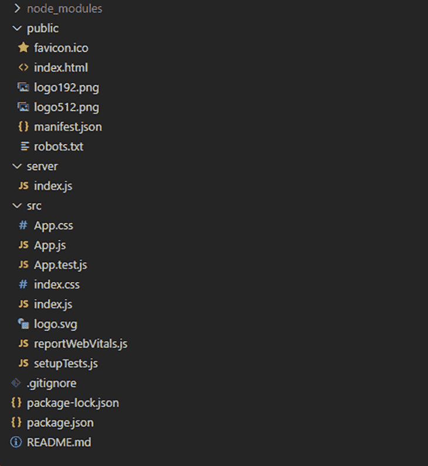
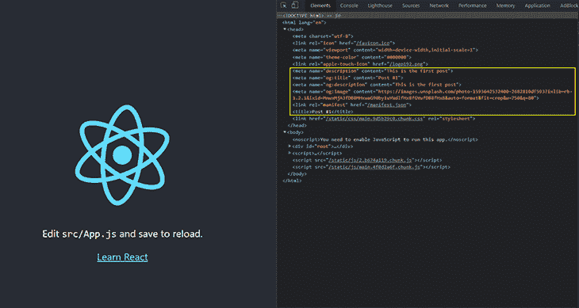
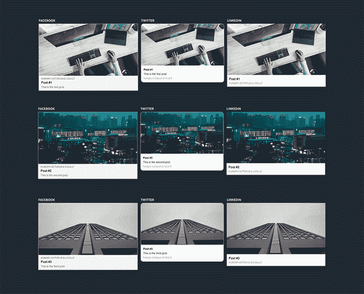
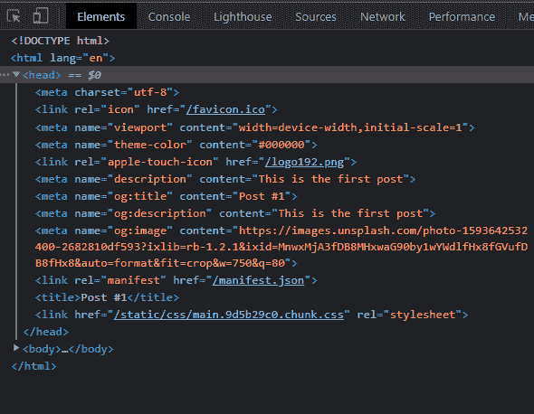
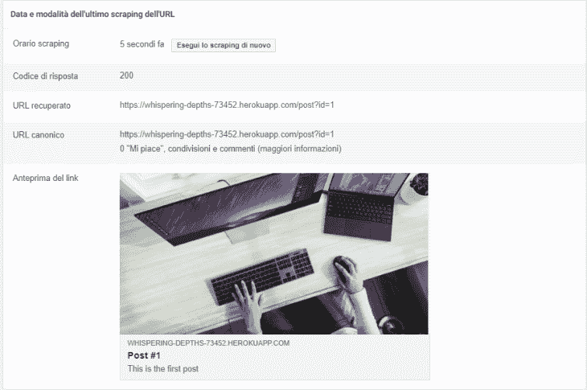

# 在没有 SSR 的 React 应用程序中添加动态元标签

> 原文：<https://blog.logrocket.com/adding-dynamic-meta-tags-react-app-without-ssr/>

## 什么是元标签？

Meta 标签是一种特殊的 HTML 标签，可以向搜索引擎和网站访问者提供更多关于网页的详细信息。

它们对于搜索引擎优化(SEO)至关重要。不仅如此——你见过当你在脸书或推特等社交平台上分享链接时出现的漂亮预览吗？多亏了元标签，这才成为可能。

如果你想让你的应用在搜索结果、社交媒体和信息平台上脱颖而出，你需要设置 SEO 元标签。特别是，您应该始终指定[开放图协议](https://ogp.me/)的 meta 标签，这是最常用的协议，用于提供有关 web 上任何网页的信息。

在 React 应用程序中，有两种主要的方法来整合 SEO 的元标签。如果你的元标签是静态的，只要把它们写在你的应用程序的`index.html`中，你就准备好了。

如果你想在你的项目中基于不同的 URL(例如，`/home`，`/about`，`/detail?id=1`，`/detail?id=2`)来设置动态元标签，在服务器端完成。当检查网页时，网络爬虫并不总是执行 JavaScript 代码，所以如果你想确保它们读取你的 meta 标签，你需要在浏览器接收页面之前设置它们。

现在，把你带到这里的问题来了:如果我的应用程序没有服务器端渲染(SSR)怎么办？在本文中，我们将看到一个简单而有效的解决方案应用于这个真实的场景。

## 在 React 中设置元标签

让我们假设你有一个用 [Create React App (CRA)](https://blog.logrocket.com/tag/create-react-app) 创建的博客。你的博客有两条路线:

1.  主页，用户可以在这里看到文章列表
2.  `/post?id=<POST-ID>`，这引出了一篇具体的博文

第二条路线是我们需要放置动态元标签的地方，因为我们希望基于作为查询字符串传递的`<POST-ID>`来更改`og:title`、`og:description`和`og:image`标签。

为了实现这一点，我们将从 Node/Express 后端提供我们的应用程序。在将响应返回给浏览器之前，我们将在页面的`<head>`中注入所需的标签。

通过运行`npx create-react-app dynamic-meta-tags`创建项目。我会保留 CRA 的初始模板，这样我们就可以直接关注我们感兴趣的点。

在我们进入后端代码之前，我们需要在`index.html`页面中添加标记占位符。稍后，我们将在返回页面之前用文章信息替换这些占位符。

```
  <head>
    ...
    <meta name="description" content="__META_DESCRIPTION__"/>
    <meta name="og:title" content="__META_OG_TITLE__"/>
    <meta name="og:description" content="__META_OG_DESCRIPTION__"/>
    <meta name="og:image" content="__META_OG_IMAGE__"/>
    ...
  </head>

```

在`src`文件夹的同一层添加一个`server`文件夹，并创建一个新的`index.js`文件。项目结构应该是这样的:



## 设置节点/快速后端

用`npm i express`安装 Express，打开`server/index.js`文件。让我们写我们的后端。

要做的第一件事是配置中间件来服务来自构建文件夹的静态资源。

```
const express = require('express');
const app = express();
const path = require('path');
const PORT = process.env.PORT || 3000;

// static resources should just be served as they are
app.use(express.static(
    path.resolve(__dirname, '..', 'build'),
    { maxAge: '30d' },
));

```

然后，我们准备服务器监听定义的端口。

```
app.listen(PORT, (error) => {
    if (error) {
        return console.log('Error during app startup', error);
    }
    console.log("listening on " + PORT + "...");
});

```

为了测试，我在`server/stub/posts.js`中创建了一个静态的帖子列表。从下面的代码可以看出，每篇文章都有标题、描述和缩略图。`getPostById`是我们用来从列表中获取特定文章的函数。

```
const posts = [
    {
        title: "Post #1",
        description: "This is the first post",
        thumbnail: "https://images.unsplash.com/photo-1593642532400-2682810df593?ixlib=rb-1.2.1&ixid=MnwxMjA3fDB8MHxwaG90by1wYWdlfHx8fGVufDB8fHx8&auto=format&fit=crop&w=750&q=80"
    },
    {
        title: "Post #2",
        description: "This is the second post",
        thumbnail: "https://images.unsplash.com/photo-1625034712314-7bd692b60ecb?ixid=MnwxMjA3fDB8MHxwaG90by1wYWdlfHx8fGVufDB8fHx8&ixlib=rb-1.2.1&auto=format&fit=crop&w=750&q=80"
    },
    {
        title: "Post #3",
        description: "This is the third post",
        thumbnail: "https://images.unsplash.com/photo-1625034892070-6a3cc12edb42?ixid=MnwxMjA3fDB8MHxwaG90by1wYWdlfHx8fGVufDB8fHx8&ixlib=rb-1.2.1&auto=format&fit=crop&w=766&q=80"
    }
]
module.exports.getPostById = id => posts[id-1];

```

自然，在一个真实的项目中，这些数据可以从一个数据库或另一个远程数据源中检索到。

## 在 React 中处理请求

现在我们可以专注于主处理程序了。

```
 // here we serve the index.html page
app.get('/*', (req, res, next) => {
  // TODO
});

```

这是我们要做的:

1.  从构建文件夹中读取`index.html`页面
2.  获取请求的帖子
3.  用文章数据替换元标签占位符
4.  返回 HTML 数据

第一步是将索引页加载到内存中。为此，我们利用了来自`fs`模块的`readFile`函数。

```
const indexPath  = path.resolve(__dirname, '..', 'build', 'index.html');
app.get('/*', (req, res, next) => {
    fs.readFile(indexPath, 'utf8', (err, htmlData) => {
        if (err) {
            console.error('Error during file reading', err);
            return res.status(404).end()
        }
        // TODO get post info

        // TODO inject meta tags
    });
});

```

一旦我们得到了它，我们就使用`getPostById`根据作为查询字符串传递的 ID 来获得请求的 post。

```
app.get('/*', (req, res, next) => {
    fs.readFile(indexPath, 'utf8', (err, htmlData) => {
        if (err) {
            console.error('Error during file reading', err);
            return res.status(404).end()
        }
        // get post info
        const postId = req.query.id;
        const post = getPostById(postId);
        if(!post) return res.status(404).send("Post not found");

        // TODO inject meta tags
    });
});

```

接下来，我们用文章标题、描述和缩略图替换占位符。

```
app.get('/*', (req, res, next) => {
    fs.readFile(indexPath, 'utf8', (err, htmlData) => {
        if (err) {
            console.error('Error during file reading', err);
            return res.status(404).end()
        }
        // get post info
        const postId = req.params.id;
        const post = getPostById(postId);
        if(!post) return res.status(404).send("Post not found");

        // inject meta tags
        htmlData = htmlData.replace(
            "<title>React App</title>",
            `<title>${post.title}</title>`
        )
        .replace('__META_OG_TITLE__', post.title)
        .replace('__META_OG_DESCRIPTION__', post.description)
        .replace('__META_DESCRIPTION__', post.description)
        .replace('__META_OG_IMAGE__', post.thumbnail)
        return res.send(htmlData);
    });
});

```

我们还用文章标题替换了默认的页面标题。

* * *

### 更多来自 LogRocket 的精彩文章:

* * *

最后，我们将 HTML 数据发送给客户端。

概括一下，这就是我们的`server/index.js`应该是什么样子:

```
const express = require('express');
const path = require('path');
const fs = require("fs"); 
const { getPostById } = require('./stub/posts');
const app = express();

const PORT = process.env.PORT || 3000;
const indexPath  = path.resolve(__dirname, '..', 'build', 'index.html');

// static resources should just be served as they are
app.use(express.static(
    path.resolve(__dirname, '..', 'build'),
    { maxAge: '30d' },
));
// here we serve the index.html page
app.get('/*', (req, res, next) => {
    fs.readFile(indexPath, 'utf8', (err, htmlData) => {
        if (err) {
            console.error('Error during file reading', err);
            return res.status(404).end()
        }
        // get post info
        const postId = req.query.id;
        const post = getPostById(postId);
        if(!post) return res.status(404).send("Post not found");

        // inject meta tags
        htmlData = htmlData.replace(
            "<title>React App</title>",
            `<title>${post.title}</title>`
        )
        .replace('__META_OG_TITLE__', post.title)
        .replace('__META_OG_DESCRIPTION__', post.description)
        .replace('__META_DESCRIPTION__', post.description)
        .replace('__META_OG_IMAGE__', post.thumbnail)
        return res.send(htmlData);
    });
});
// listening...
app.listen(PORT, (error) => {
    if (error) {
        return console.log('Error during app startup', error);
    }
    console.log("listening on " + PORT + "...");
});

```

## 运行测试

### 测试我们的应用

为了运行应用程序，我们首先需要用`npm run build`生成一个新的构建，然后我们可以用`node server/index.js`运行服务器。

或者，您可以在您的`package.json`文件中定义一个新的脚本来自动执行这个任务。如下图所示，我把它叫做“服务器”，所以现在我可以用`npm run server`运行这个应用程序了。

```
"scripts": {
    "start": "react-scripts start",
    "build": "react-scripts build",
    "test": "react-scripts test",
    "eject": "react-scripts eject",
    "server" : "npm run build&&node server/index.js"
}

```

如果一切正常，您的应用程序现在正在`[http://localhost:3000](http://localhost:3000)`上运行。对我来说，它只是显示 CRA 的默认主页。

### 在 React 中测试我们的动态元标签

现在，让我们测试一下什么对我们真正重要:元标签！

通过打开 URL `[http://localhost:3000/post?id=1](http://localhost:3000/post?id=1)`，您应该可以获得第一篇文章的正确元标签。您可以通过打开**检查**面板查看页面并查看`<head>`标签来查看它们。



同样的事情也应该发生在岗位 2 和岗位 3 上。

### 发布应用程序前测试页面预览

如果你需要在发布应用程序之前测试你的页面预览，你可以使用像 [opengraph.xyz](https://www.opengraph.xyz) 这样的平台，让你通过检查页面上的 meta 标签来测试预览。为了测试它，我们需要一个可公开访问的 URL。

为了获得本地环境的公共 URL，我们可以使用一个叫做 [localtunnel](https://github.com/localtunnel/localtunnel) 的工具。用`npm i localtunnel`安装好之后，我们可以通过执行`lt --port 3000`来运行它。它将连接到隧道服务器，建立隧道，并为我们提供用于测试的 URL。

有了这些，我们就可以在 [opengraph.xyz](https://www.opengraph.xyz) 上测试了。如果您做的一切都是正确的，您应该会看到类似这样的内容:



## 在 Heroku 上部署搜索引擎优化应用

我将描述如何在 [Heroku](https://blog.logrocket.com/free-services-deploy-node-js-app/) 上部署应用程序，但是您可以在任何能够托管节点应用程序的平台上部署它。我使用 Heroku 是因为它使应用程序的部署变得容易。

为了继续，您必须具备:

*   一个免费的 Heroku 账户
*   Heroku CLI
*   Procfile ，这是一个配置文件，告诉 Heroku 如何启动你的应用程序

创建帐户并安装 CLI 后，在应用程序的根级别创建一个名为`Procfile`的新文件，并在文件中编写命令 web: `ENV_SILENT=true npm run server`。提交并将所有更改推送到您的回购:

```
git add .
git commit -m “Add Procfile”
git push
```

现在我们的 Procfile 已经准备好了，我们可以在 Heroku 上部署应用程序了。首先，在你的终端上运行`heroku login`登录 Heroku。登录后，运行`heroku create`创建一个新的 Heroku 应用程序。在这个过程的最后，你会看到你新创建的应用程序的 URL(在我的例子中，是 https://whispering-depths-73452.herokuapp.com 的)。

最后，我们用`git push work main`把我们的主要分支推到 Heroku。

通过打开之前的网址，你应该看到你的应用程序的主页。如果您在这里导航，您可以看到它正确地设置了 meta 标签。



如果你想在一个特定的平台上测试页面预览，有像[脸书调试器](https://developers.facebook.com/tools/debug/)和[推特调试器](https://cards-dev.twitter.com/validator)这样的官方工具可以给你关于元标签的有用提示。在下图中，您可以看到我们的页面在脸书调试器上的测试。



## 结论

我们已经看到了如何向 React 应用程序动态添加 meta 标签。当然，我所使用的示例只是您可以应用此解决方案的场景之一。你可以在我的 GitHub 上找到[支持库。](https://github.com/AngeloFaella/react-dynamic-meta-tags)

请注意，我编写的后端代码只关注于添加 meta 标签，因此对于本文来说事情更加简单。如果您计划在生产中使用这个解决方案，请确保您至少添加了基本的安全机制，以避免像 XSS 和 CSRF 这样的漏洞。在 Express 网站上，您可以找到专门介绍安全最佳实践的整个部分。

## 使用 LogRocket 消除传统反应错误报告的噪音

[LogRocket](https://lp.logrocket.com/blg/react-signup-issue-free)

是一款 React analytics 解决方案，可保护您免受数百个误报错误警报的影响，只针对少数真正重要的项目。LogRocket 告诉您 React 应用程序中实际影响用户的最具影响力的 bug 和 UX 问题。

[ ](https://lp.logrocket.com/blg/react-signup-general) [  ](https://lp.logrocket.com/blg/react-signup-general) [LogRocket](https://lp.logrocket.com/blg/react-signup-issue-free)

自动聚合客户端错误、反应错误边界、还原状态、缓慢的组件加载时间、JS 异常、前端性能指标和用户交互。然后，LogRocket 使用机器学习来通知您影响大多数用户的最具影响力的问题，并提供您修复它所需的上下文。

关注重要的 React bug—[今天就试试 LogRocket】。](https://lp.logrocket.com/blg/react-signup-issue-free)