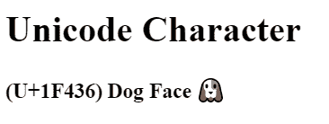

# 将表情符号添加到 React 应用程序日志博客

> 原文：<https://blog.logrocket.com/adding-emojis-react-app/>

众所周知，Unicode 使互联网成为可能！它在很大程度上解决了不同字符集之间的 [Mojibake](https://en.wikipedia.org/wiki/Mojibake#:~:text=Mojibake%20(%E6%96%87%E5%AD%97%E5%8C%96%E3%81%91%3B%20IPA%3A,from%20a%20different%20writing%20system.) (乱码文本)问题。

Unicode 本质上是一个巨大的字典，它的映射(例如 U+058E)指向我们可以使用的符号(֎).在过去，当不同的国家、公司或个人对于哪个字符映射应该对应于哪个符号都有不同的想法时，就会出现问题。

这意味着你会经常尝试阅读网页，比如 thisⅇ↫⋀₿≝┿⣶⤚⹭⺬⨺➄⧻⒏⥱➯⢃⢻⽱⓽⅘␶⋵⿠⟖➝⹣⚠❐≷↼ⲝ┃ℵ⚔☪⸺⧷ⱟℱ⥹⧖⿞⏗ₓ⡐⟄⏪┸⓳⡷⊢⠒┣⋰⡫.

乱七八糟，对吧？

Unicode 兼容现在不仅允许我们可靠地使用除英语之外的其他语言，还允许我们使用其他独特的字符，如[埃及象形文字](https://unicode.org/charts/PDF/U13000.pdf) (𓀀 𓂕 𓁎)、[苏美尔楔形文字](https://en.wikipedia.org/wiki/Cuneiform_(Unicode_block)) (𒀖 𒁝𒃿)或表情符号(😃).

你可以在这里查看 Unicode 字符集[中定义的每一个表情符号。](https://unicode.org/emoji/charts/full-emoji-list.html)

事实证明，在某些情况下，使用表情符号[可以将参与度提高 25.4%](https://www.wordstream.com/blog/ws/2015/11/19/twitter-emoji) ，这解释了为什么——基于过去十年的 67 亿条推文——[表情符号的使用从未如此之高](https://blog.emojipedia.org/emoji-use-at-all-time-high/)。

但是仅仅知道 Unicode 支持表情符号的一致使用是不够的——关于表情符号还有很多问题，比如:

*   我们如何为它们创建可重用的 React 组件？
*   我们如何确保屏幕阅读器可以使用表情符号？
*   使用它们的最佳实践是什么？
*   我们应该使用表情符号本身还是使用地图？

让我们开始吧！⛏️

## React 中的表情符号用法

在代码库中包含表情符号有多种方式，但有些方式比其他方式更好。
您的一些选择包括:

*   要内联复制和粘贴表情符号:😃
*   来引用 emoji HTML 实体的 Unicode 标识符/映射，比如:`& #x1F603`；
*   要内联复制和粘贴表情符号，然后将其包装在 HTML 元素中:😃
*   安装一个依赖项来处理它

所有这些都可以工作！但是“让它工作”并不总是最佳的解决方案，所以让我们讨论一下每种方法的优缺点。

## 在线使用表情符号

这可能是最简单的解决方案。

复制粘贴表情符号，工作就完成了。

此外，屏幕阅读器足够聪明，知道如何阅读表情符号。因此，简单地这样做就可以让你的应用程序使用表情符号，而且在大多数情况下，它们是可访问的。

但是表情符号通常不像屏幕阅读器描述的那样简单。它们通常有第二个意思。

比如，你知道表情符号的这些“第二含义”吗？

1.  [🐐](https://emojipedia.org/goat/)
2.  🐍
3.  👏

山羊表情符号是“最伟大的 T2”和“最伟大的 T4”的首字母缩写，所以人们可能经常会说，有史以来最伟大的说唱歌手(山羊)是图帕克，或者有史以来最伟大的冰球运动员(山羊)是韦恩·格雷兹基。

蛇表情通常用来描述背后捅刀子的人，或者是两面派。

拍手通常用来强调一个观点，比如👏这👏在...之间👏每个👏词。请注意，这种特殊的写作方式对于屏幕阅读器来说是很糟糕的，并且不鼓励让你的内容对屏幕阅读器友好。如果你有兴趣阅读更多关于无障碍表情符号用法的信息，这里的是一个很好的资源，[这个](https://readabilityguidelines.co.uk/images/emojis/)也是。

但是屏幕阅读器不能传达那个意思。即使他们这样做了，随着语言变化如此之大，定义可能是错误的，需要不断更新。

正是因为这个原因，我建议不要在线使用表情符号。

这是一种被指责的表情符号方式。再说一个。

## 使用 HTML 实体 Unicode 映射

您可以在代码中直接使用来自 Unicode 的十六进制或十进制代码点的表情符号，这样类似于:

```
<!DOCTYPE html>
  <div>
    <h1>Unicode Character</h1>
    <h3 style="display: inline">(U+1F436)</h3>
    <h3 style="display: inline">Dog Face</h3>
    <h3 style="display: inline">&#128054;</h3>
</div>

```

将呈现以下内容:



您也可以很容易地找到这些十六进制/十进制表示。这是一个巨大的表情 HTML 十六进制代码列表的例子。

或者你可以通过[这里](https://unicodelookup.com/)的查找表找到它们。

即使使用这种方法仍然不能解决我们提到的第二含义丢失的问题，而且，作为一名开发人员，我认为这很难操作。

像这样在你的代码中看到表情符号要容易得多:`😃`，而不是像这样读取它们的映射:`& #x1F603`；

当你直接复制/粘贴一个表情符号时，你马上就知道这个表情符号是什么，以及它被使用的上下文。表情符号更好地保持了它们的语义，我认为它们使用起来更简单。

## 将内嵌表情包在 DOM 元素中

这是最好的方法。你可以简单地用一个基本的 DOM 元素包装一个内嵌表情符号，就像这样:

```
<span role="img" aria-label="dog">🐕</span>

```

如果你认为屏幕阅读器选择的内容与你的书写不一致，这允许你添加更好的替代文本。

* * *

### 更多来自 LogRocket 的精彩文章:

* * *

如果你不确定屏幕阅读器会为每个表情符号读什么，你可以在[表情百科](https://emojipedia.org/)上搜索，表情符号的标题就是屏幕阅读器可能会说的。

一些例子是:

*   🥰:笑脸带红心
*   🌏:全球展示亚洲-澳大利亚
*   🕴️:西装革履的人悬浮

编写高质量的替代文本是很难的，如果你决定稍微改写默认文本以更好地传达你的意思，请记住[情绪很重要](https://jakearchibald.com/2021/great-alt-text/)。

为了实现最佳重用，您可以创建一个非常简单的功能组件，传递所有必要的元数据，[类似于](https://medium.com/@seanmcp/%EF%B8%8F-how-to-use-emojis-in-react-d23bbf608bf7)这样:

```
import React from 'react';
const Emoji = props => (
    <span
        className="emoji"
        role="img"
        aria-label={props.label ? props.label : ""}
        aria-hidden={props.label ? "false" : "true"}
    >
        {props.symbol}
    </span>
);
export default Emoji;

```

然后[这个组件](https://medium.com/@seanmcp/%EF%B8%8F-how-to-use-emojis-in-react-d23bbf608bf7)可以在整个代码库中以标准化的方式导入和使用:

```
<Emoji symbol="🐑" label="sheep"/>

```

通过这种方法，你可以确保在你的代码库中使用表情符号的一致性和可重用性，并且因为默认情况下`<span>` [显示为内嵌](https://stackoverflow.com/questions/1611065/span-vs-div-inline-block/1611172#:~:text=A%20span%20is%20by%20default,as%20width%2C%20height%2C%20etc.)，所以它可以用在文本的正中间，只需要最小的 CSS 修改。

您可以为组件属性提供合理的默认值，比如将`aria-hidden`默认为`false`，如果这也适合您的用例的话。

这样做可以确保你的表情符号是可访问的，在这里你可以解释任何第二含义或你想伴随你的表情符号的额外解释。

## 安装一个依赖项来处理它

安装一个依赖项使工作变得更容易，但是如果你需要做一些特定的事情或者作为一个独特的用例，它通常是不可配置的。

有几个很棒的 npm 包可供使用:[表情符号-选取器-反应](https://www.npmjs.com/package/emoji-picker-react)、 [Unicode 表情符号](https://www.npmjs.com/package/unicode-emoji)，或者[节点-表情符号](https://www.npmjs.com/package/node-emoji)。它们都很容易安装，安装方式也很相似。

例如，表情符号 picker react 的设置非常简单。要将它包含在您的依赖项中，只需运行`npm i emoji-picker-react`。它为你想要选择的表情符号提供了一个下拉选项。


An emoji dropdown selector found [here](https://www.npmjs.com/package/emoji-picker-react).

npm 包使用 React 钩子，所以你需要使用 React 16.8 或更高版本！

[文档](https://www.npmjs.com/package/emoji-picker-react)对如何包含它也有有用的解释:

```
import React, { useState } from 'react';
import Picker from 'emoji-picker-react';

const App = () => {
  const [chosenEmoji, setChosenEmoji] = useState(null);

  const onEmojiClick = (event, emojiObject) => {
    setChosenEmoji(emojiObject);
  };

  return (
    <div>
      {chosenEmoji ? (
        <span>You chose: {chosenEmoji.emoji}</span>
      ) : (
        <span>No emoji Chosen</span>
      )}
      <Picker onEmojiClick={onEmojiClick} />
    </div>
  );
};

```

## 结论

我希望这已经提供了信息！🤓

有多种方法可以将表情符号添加到 React 应用程序中，但考虑到可访问性和可重用性，一个简单的功能组件应该适合几乎所有的用例。

## [LogRocket](https://lp.logrocket.com/blg/react-signup-general) :全面了解您的生产 React 应用

调试 React 应用程序可能很困难，尤其是当用户遇到难以重现的问题时。如果您对监视和跟踪 Redux 状态、自动显示 JavaScript 错误以及跟踪缓慢的网络请求和组件加载时间感兴趣，

[try LogRocket](https://lp.logrocket.com/blg/react-signup-general)

.

[ ](https://lp.logrocket.com/blg/react-signup-general) [](https://lp.logrocket.com/blg/react-signup-general) 

LogRocket 结合了会话回放、产品分析和错误跟踪，使软件团队能够创建理想的 web 和移动产品体验。这对你来说意味着什么？

LogRocket 不是猜测错误发生的原因，也不是要求用户提供截图和日志转储，而是让您回放问题，就像它们发生在您自己的浏览器中一样，以快速了解哪里出错了。

不再有嘈杂的警报。智能错误跟踪允许您对问题进行分类，然后从中学习。获得有影响的用户问题的通知，而不是误报。警报越少，有用的信号越多。

LogRocket Redux 中间件包为您的用户会话增加了一层额外的可见性。LogRocket 记录 Redux 存储中的所有操作和状态。

现代化您调试 React 应用的方式— [开始免费监控](https://lp.logrocket.com/blg/react-signup-general)。