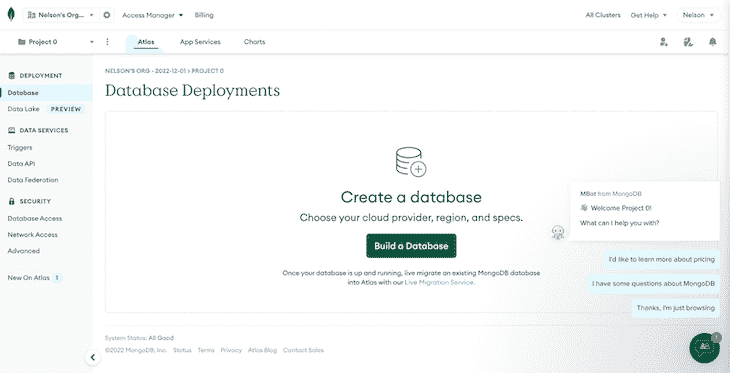
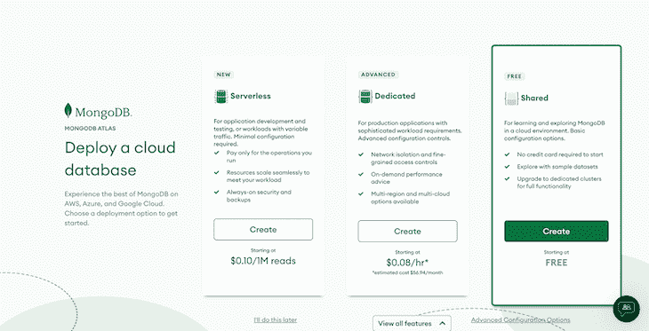
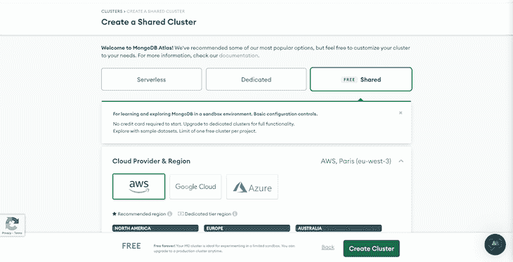
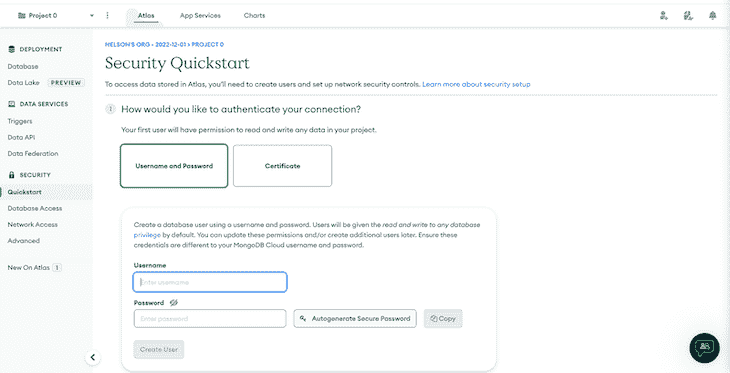
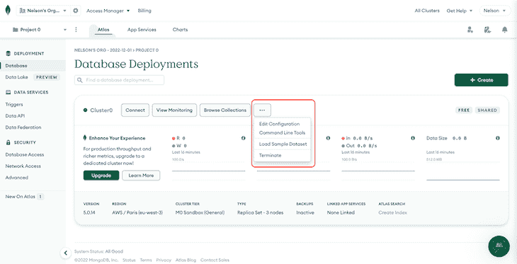

# 添加登录验证以保护 React 应用程序

> 原文：<https://blog.logrocket.com/adding-login-authentication-secure-react-apps/>

***编者按**:本 React 和 Express.js 登录认证教程最后一次更新于 2022 年 11 月 30 日，定义和评估 React 应用中服务器端登录认证的好处。这个更新还包括关于注销以及如何连接到 MongoDB 数据库的部分。*

众所周知，客户端由于其暴露的本质而不安全。在您的 web 应用程序中，您可以有条件地呈现视图，以便向不同的用户显示不同的内容。但是，如果这些信息已经存储在客户端，它就不再安全了。

为了确保只有安全登录的用户才能看到受限内容，您应该在身份验证时从服务器发送内容数据。

在本教程中，我们将向您展示如何通过为 [Express.js](https://expressjs.com) 服务器实现基本的服务器端认证来保护您的 [React 应用](https://blog.logrocket.com/tag/react/)。虽然客户端将是一个 React 应用程序，但您可以将其应用于几乎任何其他类型的客户端应用程序。我们还将讨论一些在服务器端实现安全登录功能的 React 身份验证最佳实践。

*向前跳转:*

## 什么是服务器端登录认证？

服务器端登录认证是一种对试图登录服务器的用户的身份进行认证的方法。这种类型的身份验证通常需要用户提供用户名和密码，然后将用户名和密码发送到服务器进行验证。如果凭据有效，服务器将允许用户登录并访问服务器上的资源。

## 使用服务器端登录身份验证的好处

使用服务器端登录身份验证有多种用途和好处。首先，它有助于确保服务器及其包含的资源的安全性。通过要求用户提供用户名和密码，服务器可以验证试图登录的人是否被授权这样做。

服务器端登录身份验证的另一个好处是，它可以提供一个集中的系统来管理用户帐户。这意味着服务器管理员可以轻松地添加、删除或更新用户帐户，并且这些更改会立即反映在整个服务器上。这可以更容易地管理用户访问，并确保只有授权用户才能访问服务器及其资源。

此外，服务器端登录身份验证可以为用户提供一种从任何设备安全访问资源的方式，只要他们拥有必要的凭据。这对于拥有多个地点的组织或需要远程访问资源的员工尤其有用。

总的来说，服务器端登录身份验证是保护服务器及其包含的资源的安全的一个有用而重要的工具。它可以帮助防止未经授权的访问，并提供一个集中的系统来管理用户帐户，使其成为任何安全服务器环境的重要组成部分。

## React 身份验证服务器端登录设置

引导 React 项目最简单的方法是使用 [Create React App](https://blog.logrocket.com/getting-started-with-create-react-app-d93147444a27/) 包。当您用这个包创建一个项目并运行`npm start`时，您实际上启动了一个 [webpack 服务器](https://blog.logrocket.com/changes-coming-to-webpack-in-2021/)。这在您的本地机器上运行良好，但是当您想要将它部署到远程服务器时，您需要自己的服务器来服务您的 React 应用程序。这基本上就是一个 [HTML](https://blog.logrocket.com/type-html-faster-react-emmet-vs-code/) 、 [JavaScript](https://blog.logrocket.com/tag/vanilla-javascript/) 、 [CSS](https://blog.logrocket.com/tag/css/) 的包。

对于这个 React 身份验证示例项目，我们将参考以下文件夹结构:

```
--- Project Folder
 |__ client (React App)
 |__ server.js
 |__ package.json

```

有一个`Project Folder`和一个包含 React 应用程序的`client`文件夹。该文件夹还包含一个`server.js`和`package.json`文件，您可以在终端的项目目录下使用以下命令创建这些文件:

```
npm init -y
touch server.js

```

## 从 Express.js 服务器提供 React 应用程序

### 代理 React 应用

您部署的 React 应用程序将被构建，并且,`build`文件夹将由 Express.js 服务器提供服务。然而，当在本地开发应用程序时，你不应该在每一个变化上都为生产而构建。为了避免这种情况，你可以[代理你的 React 应用](https://blog.logrocket.com/why-you-should-use-proxy-server-create-react-app/)到一个特定的端口。

这样，您将使用内置的 webpack 服务器在本地运行 React 应用程序，并且仍然能够与 Express.js 服务器通信。

将下面一行添加到 React 应用程序的`package.json`中，假设 Express 服务器将在`port 5000`上提供服务:

```
"proxy": "http://localhost:5000/"

```

### 奉上`build`文件夹

Express.js 服务器应该服务于`build`文件夹，该文件夹将在部署到远程服务器的过程中创建。

以下代码片段是一个基本的 Express.js 服务器。我们将在此基础上添加身份验证和其他功能:

```
const express = require('express');
const path = require('path');
const app = express();

const PORT = process.env.PORT || 5000;

app
  .use(express.static(path.join(__dirname, '/client/build')))
  .listen(PORT, () => console.log(`Listening on ${PORT}`));

app.get('/', (req, res) => {
  res.sendFile(path.join(__dirname, '/client/build/index.html'));
});

```

### 在本地运行 Express.js 服务器

如前所述，React 应用程序仍将使用 webpack 服务器，因为它将代理到`port 5000`。然而，我们仍然必须单独运行[快速服务器](https://blog.logrocket.com/organizing-express-js-project-structure-better-productivity/)。

Nodemon 包对于运行和监听变化非常方便。只需在项目文件夹的主目录中运行`nodemon server.js`，就可以全局安装，然后运行服务器。至于 React 应用程序，我们只需运行`client`文件夹中的`npm start`。

### 如何在远程服务器上运行

虽然这是一个可选的步骤，但值得一提的是。让我们假设我们想要将我们的应用程序部署到一个 [Heroku](https://www.heroku.com) dyno。

[Heroku](https://blog.logrocket.com/deploying-decoupled-monorepo-project-heroku/) 检测 Node.js 应用程序，安装依赖项，并自动运行它。但是，您仍然需要告诉它进入特定的文件夹，安装依赖项，并为生产构建 React 应用程序。在我们的例子中，这将分别进入`/client`运行`npm install`，然后进入`npm run build`。

为此，Heroku 有一个`post-build`命令:`"heroku-postbuild": "cd client && npm install && npm run build"`

将此添加到服务器的`package.json`内的`"scripts"`键下。另外，确保 Node.js 应用程序的入口点是`package.json`文件中的`server.js`。

如果你用`-y`标志初始化你的 npm 包为用`"main": "server.js"`初始化的`npm init -y`，这很可能是`index.js`。

## React 和 Express.js 中的基本身份验证

顾名思义， [express-basic-auth](https://www.npmjs.com/package/express-basic-auth) 是一个非常方便易用的包，用于基本的身份验证目的。

首先，安装软件包，然后要求它位于您的`server.js`的顶部。我们将通过使用包的实例来定义安全登录凭据:

```
const basicAuth = require('express-basic-auth');

const auth = basicAuth({
  users: {
    admin: '123',
    user: '456',
  },
});

```

现在，当`auth`变量被用作端点的参数，并且当且仅当凭证与请求匹配一起发送时，来自该端点的响应才返回到客户端。

在下面的代码中，您将看到服务器端的`/authenticate`端点和客户端发送的`GET`请求，以及包含凭证的`auth`对象:

```
// End-point on Server

app.get('/authenticate', auth, (req, res) => {
  if (req.auth.user === 'admin') {
    res.send('admin');
  } else if (req.auth.user === 'user') {
    res.send('user');
  }
});

// Request on Client

const auth = async () => {
  try {
    const res = await axios.get('/authenticate', { auth: { username: 'admin', password: '123' } });
    console.log(res.data);
  } catch (e) {
    console.log(e);
  }
};

```

在上面的例子中，传递正确的凭证会将`admin`或`user`作为字符串响应发送回来，这取决于所使用的用户名。错误的登录凭证将简单地返回一个响应`401 (Unauthorized)`。

## 使用 HTTP cookies 进行身份验证

既然我们已经知道了如何在凭证正确的情况下将数据从服务器发送到客户机，下一步就是通过一个 [cookie 会话](https://developer.mozilla.org/en-US/docs/Web/HTTP/Cookies)来持久化认证。

我们可以从服务器在客户机上设置一个 cookie，而不是从`authenticate`端点发送响应。通过部署另一个端点，我们可以检查 cookie 并实际发送数据来填充视图。

一旦用户通过身份验证，这些信息应该存储在客户端的某个地方，这样用户就不需要每次都进行身份验证。通常的做法是使用 cookies 来存储这个会话信息。只要设置了正确的标志，Cookies 就是安全的。

### 反应饼干

当使用 cookie 会话在 React 中持久化身份验证时，`httpOnly`标志确保除了服务器之外，任何客户端脚本都不能访问 cookie。

`secure`标志确保 cookie 信息通过 HTTPS 协议与加密请求一起发送到服务器。使用`secure`标志时，还需要一个密钥来对 cookie 进行签名。为此，我们为 Express.js 服务器使用了`cookie-parser`中间件。

一个 cookie 只有一个`name`和一个`value`。即使有上述标志，也不要在 cookie 参数中泄露任何易受攻击的信息。

* * *

### 更多来自 LogRocket 的精彩文章:

* * *

### 如何在 React 中使用 cookies 创建用户会话

在下面的代码示例中，`server.js`在身份验证时设置一个唯一的 cookie。正如您所看到的，设置 cookie 后，响应也发送一个带有`screen:admin`或`screen:user`键值对的对象。

这个响应稍后将在客户端的 React 应用程序中使用:

```
const cookieParser = require('cookie-parser');

// A random key for signing the cookie
app.use(cookieParser('82e4e438a0705fabf61f9854e3b575af'));

app.get('/authenticate', auth, (req, res) => {
  const options = {
    httpOnly: true,
    signed: true,
  };

  if (req.auth.user === 'admin') {
    res.cookie('name', 'admin', options).send({ screen: 'admin' });
  } else if (req.auth.user === 'user') {
    res.cookie('name', 'user', options).send({ screen: 'user' });
  }
});

```

由于 cookie 有一个`httpOnly`标志，我们既不能在客户端读取也不能删除它。因此，我们还需要两个端点来读取和删除 cookie，并相应地发送回响应。

### 从服务器读取 cookie

从服务器读取 cookie 非常简单，但是您应该记住，该功能的端点不应该有`auth`变量，因为不需要对该端点进行身份验证。

在注销用户部分下面，我们有两个端点:`/read-cookie`和`/clear-cookie`。带有`res`的`signedCookies`对象包含我们为 cookie 设置的`name:value`对:

```
res.cookie('name', 'admin', options)

```

根据 cookie 名称的值，我们将发送一个响应。

### 注销用户

至于`/clear-cookie`端点，删除 cookie 是通过引用 cookie 的名字来完成的，这个名字就是`name`。这反过来执行一个简单的`logout`功能，因为它清除了用户的会话:

```
app.get('/read-cookie', (req, res) => {
  if (req.signedCookies.name === 'admin') {
    res.send({ screen: 'admin' });
  } else if (req.signedCookies.name === 'user') {
    res.send({ screen: 'user' });
  } else {
    res.send({ screen: 'auth' });
  }
});

app.get('/clear-cookie', (req, res) => {
  res.clearCookie('name').end();
});

```

按照这个逻辑，您可以创建几个端点，根据应用程序的性质发送不同类型的数据。您需要做的就是检查 cookie 并相应地发送响应。

下面，您可以找到完整的`server.js`文件，它服务于客户端 React 应用程序，我们将在下一节中讨论:

```
const express = require('express');
const basicAuth = require('express-basic-auth');
const cookieParser = require('cookie-parser');
const path = require('path');

const app = express();

const auth = basicAuth({
  users: {
    admin: '123',
    user: '456',
  },
});

const PORT = process.env.PORT || 5000;

app.use(cookieParser('82e4e438a0705fabf61f9854e3b575af'));

app
  .use(express.static(path.join(__dirname, '/client/build')))
  .listen(PORT, () => console.log(`Listening on ${PORT}`));

app.get('/', (req, res) => {
  res.sendFile(path.join(__dirname, '/client/build/index.html'));
});

app.get('/authenticate', auth, (req, res) => {
  const options = {
    httpOnly: true,
    signed: true,
  };

  console.log(req.auth.user);

  if (req.auth.user === 'admin') {
    res.cookie('name', 'admin', options).send({ screen: 'admin' });
  } else if (req.auth.user === 'user') {
    res.cookie('name', 'user', options).send({ screen: 'user' });
  }
});

app.get('/read-cookie', (req, res) => {
  console.log(req.signedCookies);
  if (req.signedCookies.name === 'admin') {
    res.send({ screen: 'admin' });
  } else if (req.signedCookies.name === 'user') {
    res.send({ screen: 'user' });
  } else {
    res.send({ screen: 'auth' });
  }
});

app.get('/clear-cookie', (req, res) => {
  res.clearCookie('name').end();
});

app.get('/get-data', (req, res) => {
  if (req.signedCookies.name === 'admin') {
    res.send('This is admin panel');
  } else if (req.signedCookies.name === 'user') {
    res.send('This is user data');
  } else {
    res.end();
  }
});

```

## 一个 React 认证实例

假设您有一个管理屏幕和一个普通用户屏幕，您在其中显示不同的内容。

我们需要的第一件事是身份验证请求，它将凭证发送到服务器。我们还需要从 [`componentDidMount`生命周期挂钩](https://blog.logrocket.com/react-lifecycle-methods-tutorial-examples/#componentDidMount)发送的另一个请求，以检查是否已经有一个 cookie，以便我们可以自动登录。

然后，我们可能需要一些其他的请求来获取额外的数据。最终，我们需要能够发送一个请求来清除 cookie，以便会话不再持续。

你可以在 [CodeSandbox](https://codesandbox.io/s/basic-auth-example-o73bh?from-embed) 上找到完整的客户端代码。然而，为了让它工作，很明显，您应该在服务器旁边运行它:

正在连接到 MongoDB

## 要将 Node.js 应用程序连接到 [MongoDB Atlas 数据库](https://www.mongodb.com/atlas/database)，您需要执行以下步骤:

为 Node.js 安装 MongoDB 驱动程序，这将允许您从 Node.js 应用程序连接 MongoDB 数据库并与之交互。你可以通过在你的终端中运行`npm install mongodb`来实现。

创建一个 [MongoDB Atlas 账户](https://account.mongodb.com/account/register)。这将为您提供一个可以用来连接数据库的 URL。

成功创建帐户后，您应该会看到如下图所示的仪表板。接下来，要创建一个数据库，点击**建立一个数据库**按钮:



选择自由**共享**选项:



然后，通过单击页面底部的**创建集群**按钮来创建集群。您还可以在此页面上决定编辑和更改集群:



接下来，为您的集群设置用户名和密码。然后，向下滚动到页面底部，点击**连接到我的本地环境**并添加您的 IP 地址:



如果您正确遵循了上述步骤，您应该能够看到下图所示的页面:



从那里，点击以红色突出显示的**菜单**按钮，然后点击**加载样本数据集**。MongoDB 为我们提供了一个模拟数据集，我们可以使用它来快速测试应用程序与数据库之间的连接。

接下来，选择最左边的**连接**按钮，如上图所示。您应该会看到一个弹出模式。选择**连接您的应用程序**选项。这将帮助我们使用 MongoDB 的一个本地驱动程序连接到我们的应用程序，在我们的例子中，它是[节点本地驱动程序](https://mongodb.github.io/node-mongodb-native/)。

使用 MongoDB 驱动程序

### 从屏幕上出现的下一个弹出模式中复制连接字符串。我们将把它添加到我们的`server.js`文件中。

在 Node.js 应用程序中，使用 MongoDB 驱动程序通过 MongoDB Atlas 提供的 URL 连接到数据库。您可以使用以下代码来实现这一点:

在这段代码中，您需要分别用您的 MongoDB Atlas 用户名和密码替换`<username>`和`<password>`。

```
const MongoClient = require('mongodb').MongoClient;
const url = 'mongodb+srv://<username>:<password>@cluster0.mongodb.net/test?retryWrites=true&w=majority';

MongoClient.connect(url, { useNewUrlParser: true, useUnifiedTopology: true }, (err, client) => {
  if (err) {
    console.log(err);
  } else {
    console.log('Connected to MongoDB Atlas');
    // do something with your database here
  }
});

```

一旦 Node.js 应用程序连接到 MongoDB Atlas 数据库，就可以使用 MongoDB 驱动程序对数据库执行`CRUD`操作。例如，您可以使用`insertOne()`方法将文档插入到集合中，或者使用`find()`方法从集合中检索文档。

关键要点

## 让我们回顾一下通过登录身份验证保护 React 应用程序的最重要步骤。

我们有三个不同的状态变量:`screen`，`username`，`password`。

`username`和`password`用于存储输入的现场数据，并通过`auth`函数通过`/authenticate`端点发送给服务器。因此，登录按钮的 [onClick 事件](https://blog.logrocket.com/a-guide-to-react-onclick-event-handlers-d411943b14dd/)调用`auth`函数。只有在用户进行初始身份验证时，才需要这样做。

为了检查用户是否已经登录，我们在`readCookie`函数中使用了`/read-cookie`端点。这个函数在`component mount`上只被调用一次。来自该端点的响应设置`screen`状态以将视图改变到`admin`或`user`屏幕。

在这个 React 身份验证示例中，`admin`和`user`屏幕是同一个组件。但是，由于来自服务器的响应会根据身份验证而变化，因此同一组件会呈现不同的内容。

此外，`/get-data`端点演示了来自服务器的特定于 cookie 的响应的另一个用例。

最后，`/clear-cookie`与注销按钮的`onClick`事件一起使用，以清除 cookie 并将`screen`状态变量设置回其初始状态。

结论

## 本教程的目的是让您对使用`express-basic-auth` npm 包的 Express.js 服务器上的基本服务器端 React 身份验证有一个基本的了解。这种简单的身份验证系统的潜在用例从小型个人项目到具有固定用户数量的界面的安全页面。

保护安全登录机制背后的数据的需求几乎是普遍的。如果您知道如何在 React 和 Express.js 中实现安全登录身份验证，那么您几乎可以在任何其他类型的客户端应用程序中实现相同的功能。

如果您对如何在 Node.js 中进一步提高您的 web 应用程序安全性感兴趣，请查看我们的使用 bcrypt 在 Node.js 中进行[密码散列的指南。](https://blog.logrocket.com/password-hashing-node-js-bcrypt/)

使用 LogRocket 消除传统反应错误报告的噪音

## 是一款 React analytics 解决方案，可保护您免受数百个误报错误警报的影响，只针对少数真正重要的项目。LogRocket 告诉您 React 应用程序中实际影响用户的最具影响力的 bug 和 UX 问题。

[LogRocket](https://lp.logrocket.com/blg/react-signup-issue-free)

自动聚合客户端错误、反应错误边界、还原状态、缓慢的组件加载时间、JS 异常、前端性能指标和用户交互。然后，LogRocket 使用机器学习来通知您影响大多数用户的最具影响力的问题，并提供您修复它所需的上下文。

[ ](https://lp.logrocket.com/blg/react-signup-general) [  ](https://lp.logrocket.com/blg/react-signup-general) [LogRocket](https://lp.logrocket.com/blg/react-signup-issue-free)

关注重要的 React bug—[今天就试试 LogRocket】。](https://lp.logrocket.com/blg/react-signup-issue-free)

Focus on the React bugs that matter — [try LogRocket today](https://lp.logrocket.com/blg/react-signup-issue-free).