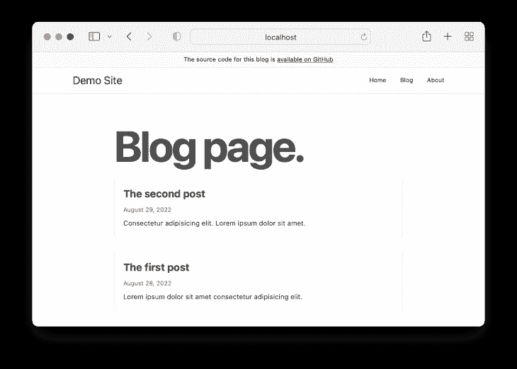
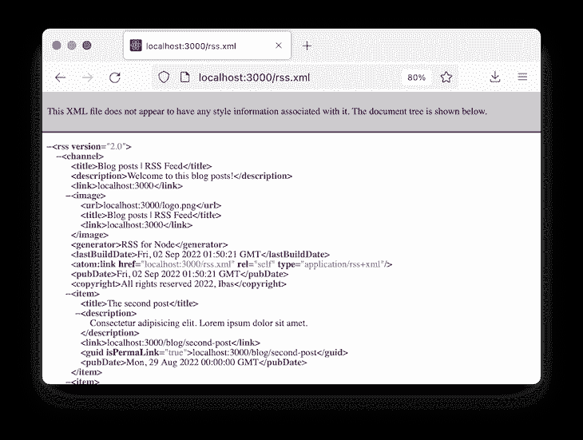
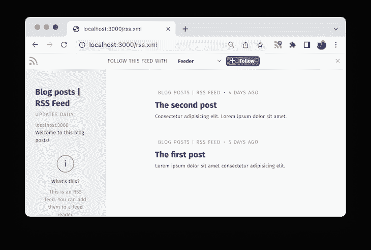
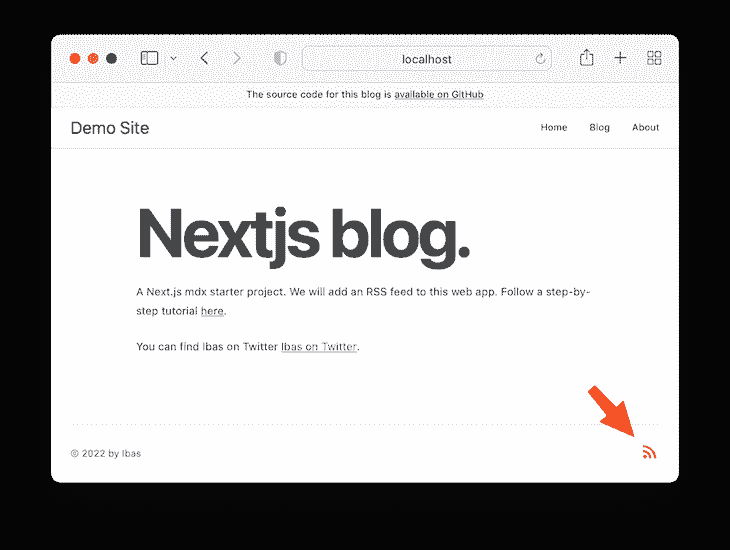

# 将 RSS 提要添加到 Next.js 应用程序

> 原文：<https://blog.logrocket.com/adding-rss-feed-next-js-app/>

RSS，或真正简单的联合，是站点发布者用来及时发布内容的手段之一。它让网站访问者保持对最新内容的更新，而不必定期检查新内容。

RSS 提要使用一个 XML 文件，该文件包含有关内容片段的详细信息，如按时间倒序排列的文章或播客列表，最新的内容显示在顶部。这是一个可以自动更新以满足不同用途的文件。

当该文件可用于网站时，用户可以使用 RSS 源阅读器或聚合器来访问和参与网站的内容。这个阅读器是一个可以获取 XML 内容并以用户友好的格式显示数据的工具。

在为网站的时事通讯发起活动时，RSS 提要也很有用。电子邮件营销平台可以使用它来拉内容，如博客文章，所以他们可以自动发送新的内容给订户。

在这一课中，我们将学习如何将 RSS 提要集成到 Next.js 应用程序中。要学习本教程，请确保您熟悉 Next.js。

我们将涵盖的内容:

要向 Next.js 添加 RSS 提要，我们需要一个 Next 应用程序。为了让我们能够专注于这个主题，我已经创建了一个 [Next blog starter 项目](https://github.com/Ibaslogic/nextjs-mdx-blog-starter)，其中包含了一个[的 MDX 博客文章列表](https://blog.logrocket.com/create-next-js-mdx-blog/)，我们可以通过 RSS 订阅。

让我们使用以下命令克隆它:

```
git clone https://github.com/Ibaslogic/nextjs-mdx-blog-starter

```

然后，运行以下命令安装[…]:

```
cd nextjs-mdx-blog-starter

npm install
# or
yarn

```

最后，使用以下命令运行项目:

```
npm run dev
# or
yarn dev

```

项目博客页面应该如下所示:



让我们看看我们是如何在同一页面上生成帖子列表的。了解文章列表是如何生成的将有助于为我们的博客文章生成 RSS 提要。

如果您打开`utils/mdx.js`文件，您会看到我们导出了一个名为`getSortedPost()`的异步函数，返回一个包含标题、slug、描述、日期等主要细节的帖子列表。

然后，我们调用 blog 页面文件`pages/blog/index.js`中的`getStaticProps()`获取方法内的函数来访问数据并呈现组件。

对于我们的 RSS 提要项目，我们将创建一个函数来生成 XML 提要文件，并在`getStaticProps()`中调用它。这是因为在生产站点的构建期间会调用`getStaticProps()`。这是生成 RSS 提要的最佳时机。

注意，在开发过程中，每次请求都会调用这个获取方法。因此，当我们导航到博客页面时，XML 文件将在开发中生成。

如果你曾经与一个 WordPress 支持的网站互动过，你可能知道你可以通过在网站 URL 的末尾添加`/feed/`来查看该网站的 RSS 提要，如下所示:

```
https://example.com/feed/

```

在我们的项目中，以类似的方式添加路径——比如`[http://localhost:3000/feed/](http://localhost:3000/feed/)`——将显示一个 404 错误页面。因此，让我们在下一节中将 RSS 提要添加到 Next.js 应用程序中。

创建 RSS 提要有不同的方法。在下面的小节中，我们将看看两个不同的包:`rss`包和`feed` npm 包。

`[rss](https://github.com/dylang/node-rss)`[包](https://github.com/dylang/node-rss)让我们生成一个 RSS 提要并将其添加到我们的下一个项目中。让我们通过运行以下命令来添加它:

```
npm i rss
#or
yarn add rss

```

一旦我们添加了包，我们就可以创建一个新的 RSS 提要，向提要添加条目，等等。

让我们创建一个`utils/generateRSSFeed.js`文件并添加以下代码:

```
import RSS from 'rss';

export default async function generateRssFeed() {
 const feedOptions = {};
 const feed = new RSS(feedOptions);
}

```

我们从从`rss`模块导入`RSS`并创建一个新的 feed 实例开始。`RSS`提要接受一个由提要选项组成的对象。

让我们通过将文件内容更新为以下内容来添加提要选项:

```
import RSS from 'rss';

export default async function generateRssFeed() {
 const site_url = 'localhost:3000';

 const feedOptions = {
  title: 'Blog posts | RSS Feed',
  description: 'Welcome to this blog posts!',
  site_url: site_url,
  feed_url: `${site_url}/rss.xml`,
  image_url: `${site_url}/logo.png`,
  pubDate: new Date(),
  copyright: `All rights reserved ${new Date().getFullYear()}, Ibas`,
 };

 const feed = new RSS(feedOptions);
}

```

提要选项是不言自明的。

我们使用`localhost` URL 作为`site_URL`。如果要部署到生产环境，该 URL 必须是生产 URL。

`feed_URL`指定了 RSS 提要的路径。将在开发中的`[http://localhost:3000/rss.xml](http://localhost:3000/rss.xml)`上市。

请记住此路径，因为在本课稍后向客户端写入 XML 内容时，我们将维护相同的 URL。你可以指定你的路径，比如用`/feed.xml`代替`/rss.xml`或者任何你想要的名字。

我们需要获取文章列表，以便将我们的博客文章添加到提要中。如前所述，`getSortedPost()`函数返回文章详细信息的列表。

我们将导入该函数，遍历帖子列表，并将每个帖子添加到提要中。

`utils/generateRSSFeed.js`文件现在看起来像这样:

```
import RSS from 'rss';
import { getSortedPost } from './mdx';

export default async function generateRssFeed() {
 const site_url = 'localhost:3000';

 const allPosts = await getSortedPost();

 const feedOptions = {
  // ...
 };

 const feed = new RSS(feedOptions);

 allPosts.map((post) => {
  feed.item({
   title: post.title,
   description: post.description,
   url: `${site_url}/blog/${post.slug}`,
   date: post.date,
  });
 });
}

```

由于来自`utils/mdx.js`文件的`getSortedPost()`函数是一个异步函数，我们使用`await`关键字等待它，并将返回的帖子分配给`allPosts`变量。我们使用`map`函数遍历了`allPosts`变量，并将每个帖子添加到一个提要条目中。

### 向客户端发送 XML 数据

接下来，我们将使用 Node.js `fs`函数将 RSS 提要作为 [XML 写入一个文件。让我们导入`fs`并像这样使用`fs.writeFileSync()` API:](https://blog.logrocket.com/reading-writing-xml-node-js/)

```
import fs from 'fs';
import RSS from 'rss';
import { getSortedPost } from './mdx';

export default async function generateRssFeed() {
 // ...
 allPosts.map((post) => {
  // ...
 });

 fs.writeFileSync('./public/rss.xml', feed.xml({ indent: true }));
}

```

这个 API 在`public`文件夹中创建一个`rss.xml`文件，并将 XML 数据写入该文件。

保存文件。

最后，在您的项目中找到`getStaticProps()`获取方法并调用`generateRssFeed()`函数。在我们的项目中，我们可以在博客页面文件中找到它，`pages/blog/index.js`。所以让我们导入`generateRssFeed()`并在`getStaticProps()`中这样调用它:

```
// ....
import generateRssFeed from '../../utils/generateRSSFeed';

export async function getStaticProps() {
 await generateRssFeed();
 // ....
}

// .... 

```

让我们保存所有文件。

如果我们运行`npm run build` production build 命令，将在 public 文件夹中自动生成一个 RSS 提要。然而，由于我们正在开发中，如果我们导航到博客页面，我们将生成该文件。记住，持有`generateRssFeed()`的获取方法存在于博客页面文件中。

因此，导航到`[http://localhost:3000/blog](http://localhost:3000/blog)`页面来生成文件。之后，在浏览器中访问`[http://localhost:3000/rss.xml](http://localhost:3000/rss.xml)`,会看到一个 XML 页面，如下所示:



正如我们在上面的图片中看到的，XML 文件中的最新条目是最新的博客文章。现在，每当我们添加一个新帖子时，文件将重新生成以包含该帖子，任何订阅的用户都将自动获得更新。

### 使用提要阅读器

现在我们有了一个有效的 RSS 提要链接——尽管在`localhost:3000`还在开发中——用户可以使用这个链接在 RSS 阅读器中订阅提要。

如果我们[为 Chrome 安装一个 feed 阅读器扩展](https://chrome.google.com/webstore/detail/rss-feed-reader/pnjaodmkngahhkoihejjehlcdlnohgmp/related?hl=en)并访问 feed URL，我们将会看到以下内容:



这里的内容对用户很友好，帖子都链接回了出处。一旦用户订阅了提要，他们就会收到新更新的通知。

## 使用`feed`库

`[feed](https://github.com/jpmonette/feed)`[NPM 包](https://github.com/jpmonette/feed)比`rss`包更健壮。它允许我们生成不同的提要格式，包括 RSS、Atom 和 JSON。

让我们将它添加到我们的项目中:

```
npm i feed
#or
yarn add feed

```

接下来，用以下内容替换`utils/generateRSSFeed.js`文件的内容:

```
import fs from 'fs';
import { Feed } from 'feed';
import { getSortedPost } from './mdx';

export default async function generateRssFeed() {
 const allPosts = await getSortedPost();
 const site_url = 'localhost:3000';

 const feedOptions = {
  title: 'Blog posts | RSS Feed',
  description: 'Welcome to this blog posts!',
  id: site_url,
  link: site_url,
  image: `${site_url}/logo.png`,
  favicon: `${site_url}/favicon.png`,
  copyright: `All rights reserved ${new Date().getFullYear()}, Ibas`,
  generator: 'Feed for Node.js',
  feedLinks: {
   rss2: `${site_url}/rss.xml`,
  },
 };

 const feed = new Feed(feedOptions);

 allPosts.forEach((post) => {
  feed.addItem({
   title: post.title,
   id: `${site_url}/blog/${post.slug}`,
   link: `${site_url}/blog/${post.slug}`,
   description: post.description,
   date: new Date(post.date),
  });
 });

 fs.writeFileSync('./public/rss.xml', feed.rss2());
}

```

实现`feed`包类似于实现`rss`包。您可以遵循与上面相同的步骤。如果我们保存文件，我们也应该得到类似的结果。

为了为我们的 Next.js 应用生成其他格式的 RSS 提要，包括 JSON，我们将把`feedLinks`更新为:

```
feedLinks: {
  rss2: `${site_url}/rss.xml`,
  // other feed formats
  json: `${site_url}/rss.json`,
  atom: `${site_url}/atom.xml`,
},

```

然后，我们将把 RSS 提要写到它们各自在`public`文件夹中的文件中，就像这样:

```
// write other feed formats to public folder
fs.writeFileSync('./public/rss.json', feed.json1());
fs.writeFileSync('./public/atom.xml', feed.atom1());

```

保存`utils/generateRSSFeed.js`文件并导航到博客页面生成提要文件后，我们可以在浏览器中访问`[http://localhost:3000/rss.json](http://localhost:3000/rss.json)`和`[http://localhost:3000/atom.xml](http://localhost:3000/atom.xml)`来查看各自格式的 RSS 提要。

为了确保站点用户能够容易地找到 RSS 提要 URL，我们将在 web 项目的底部添加一个指向 RSS 提要的图标。我们可以从 React 图标库中获取图标。

让我们安装`react-icons`:

```
yarn add react-icons
#or
npm install react-icons

```

打开`components/Footer.js`文件并导入顶部的 feed 图标组件:

```
import { MdRssFeed } from 'react-icons/md';

```

然后，找到这个代码:

```
><div className={styles.footer__content}>
 <p>&copy; {new Date().getFullYear().toString()} by Ibas</p>
</div>

```

并将其更新为以下内容:

```
<div className={styles.footer__content}>
 <p>
  &copy; {new Date().getFullYear().toString()} by Ibas
 </p>
 <a
  href="http://localhost:3000/rss.xml"
  rel="noreferrer"
  target="_blank"
 >
  <MdRssFeed color="#ee802f" size="30px" />
 </a>
</div>

```

在生产中，URL 路径必须是生产 URL。如果我们保存并测试我们的项目，图标应该出现在站点页脚中，如下所示:



## 结论

将 RSS 提要添加到 Next.js 应用程序是让用户了解您站点上共享的最新内容的一种方式。本课讨论了在 Next.js 应用程序中集成 RSS XML 文件。

如果你喜欢这一课，在网络上分享它。完整的源代码[在 GitHub](https://github.com/Ibaslogic/nextjs-mdx-blog-rss) 上可用，完成的[项目在这里直播](https://nextjs-mdx-blog-rss.vercel.app/)。

## [LogRocket](https://lp.logrocket.com/blg/nextjs-signup) :全面了解生产 Next.js 应用

调试下一个应用程序可能会很困难，尤其是当用户遇到难以重现的问题时。如果您对监视和跟踪状态、自动显示 JavaScript 错误、跟踪缓慢的网络请求和组件加载时间感兴趣，

[try LogRocket](https://lp.logrocket.com/blg/nextjs-signup)

.

[](https://lp.logrocket.com/blg/nextjs-signup)[](https://lp.logrocket.com/blg/nextjs-signup)

LogRocket 就像是网络和移动应用的 DVR，记录下你的 Next.js 应用上发生的一切。您可以汇总并报告问题发生时应用程序的状态，而不是猜测问题发生的原因。LogRocket 还可以监控应用程序的性能，报告客户端 CPU 负载、客户端内存使用等指标。

LogRocket Redux 中间件包为您的用户会话增加了一层额外的可见性。LogRocket 记录 Redux 存储中的所有操作和状态。

让您调试 Next.js 应用的方式现代化— [开始免费监控](https://lp.logrocket.com/blg/nextjs-signup)。