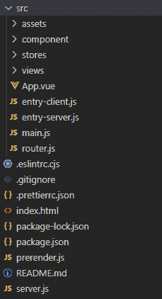
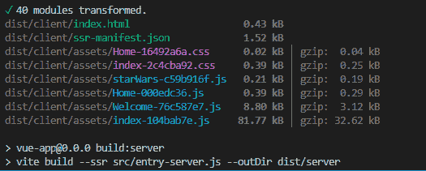
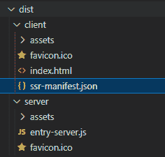
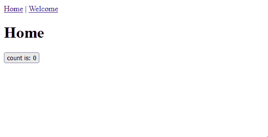
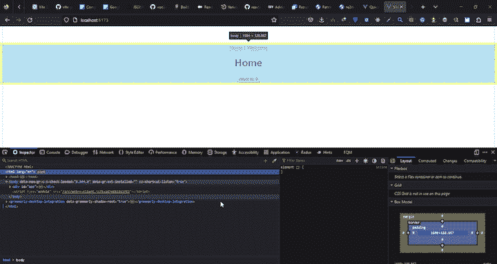

# 将 SSR 添加到现有 Vue 3 应用程序的指南

> 原文：<https://blog.logrocket.com/adding-ssr-existing-vue-3-app/>

当讨论服务器端呈现(SSR)时，像 Next.js、Remix、SvelteKit 和 Nuxt.js 这样的框架经常出现在脑海中，因为它们提供了内置的 SSR 功能。然而，重要的是要认识到客户端渲染框架，如 React 和 Vue.js，也需要 SSR 来创建优化的和 SEO 友好的应用程序。

将 SSR 集成到现有的应用程序中可能是一项艰巨的任务，这可能解释了为什么这不是一个更广泛讨论的话题。在本文中，我们将研究服务器端渲染的优缺点，并探索使用 Vue 的默认捆绑器 [Vite](https://vitejs.dev) 将服务器端渲染整合到现有 Vue 3 应用程序中的过程。

*向前跳转:*

## 先决条件

为了遵循本文中的示例，建议您具备以下条件:

*   对 Vue 3 的基本理解
*   Express.js 的工作知识
*   安装在计算机上的 Node.js

## 什么是 SSR？

服务器端呈现(SSR)是指在服务器上而不是在客户端浏览器上生成和交付完全呈现的页面的过程。这种方法用于客户端 JavaScript 应用程序，允许更快的加载时间和更好的搜索引擎优化。

SSR 的兴起可以归因于单页应用程序(spa)的日益流行。SPAs 是一种 web 开发架构，它为传统的多页面应用程序提供了一种替代方案。由于使用了异步 javascript，它们可以创建客户端应用程序，这些应用程序可以动态更新部分用户界面，而不需要重新加载整个页面。SSR 是一个解决方案，旨在增强这些类型的应用程序的性能和 SEO。

如今，许多单页面应用程序都是使用流行的 UI 框架(如 React、Vue.js 和 Angular)构建的。这些 spa 由单个 HTML 页面组成，该页面从服务器异步检索数据。这使得实时更新对用户可见，而不需要完全刷新页面。

SPA 架构是创建类似于本地移动和桌面应用程序的 web 应用程序的一次雄心勃勃的尝试。然而，因为浏览器必须在初始加载期间一次生成应用的所有方面，包括用户界面、数据和功能，所以 spa 往往较慢。这是因为 SPA 的 HTML 页面包含一个空的根元素，浏览器在下载并处理包含页面上所有其他元素的 JavaScript 包后会填充这个根元素。这种方法被称为客户端渲染(CSR)。

以下是 SPA 的 HTML 页面外观示例:

```
<!DOCTYPE html>
<html lang="en">
  <head>
    <meta charset="UTF-8">
    <link rel="icon" href="/favicon.ico">
    <meta name="viewport" content="width=device-width, initial-scale=1.0">
    <title>Vite App</title>
  </head>
  <body>
    <div id="app"></div>
    <script type="module" src="/src/main.js"></script>
  </body>
</html>

```

因为浏览器必须在显示任何内容之前下载并执行整个应用程序，所以初始页面加载时间通常很慢。这导致了糟糕的用户体验，因为用户可能会长时间看到空白屏幕或加载微调器。此外，缓慢的页面加载会对网站的 SEO 性能产生负面影响。

相比之下，SSR 在服务器上生成静态 HTML 标记，允许浏览器在初始加载期间接收完全呈现的页面。这是通过使用 Node.js 等后端运行时来执行 JavaScript 代码和构建用户界面来实现的。

下面的示例展示了 HTML 文件如何从服务器端呈现的页面接收内容:

```
<!DOCTYPE html>
<html lang="en">
  <head>
    <meta charset="UTF-8" />
    <meta name="viewport" content="width=device-width, initial-scale=1.0" />
    <title>Vite App</title>

```

元素中的 HTML 内容在服务器上生成，然后在初始加载时发送到客户端。

如前所述，Vue 框架支持创建客户端应用程序，默认情况下，客户端应用程序在浏览器中呈现生成和操作 DOM 的组件。也可以在服务器上呈现相同的组件，将它们直接传输到浏览器，然后在客户端将静态标记合并到完全交互式的应用程序中。

我们将在本文的后面探讨如何实现这一点。

## 为什么要在你的 Vue 3 应用中加入 SSR？

您可能选择将服务器端呈现合并到现有的 Vue.js 3 应用程序中有几个原因:

*   **改进的性能** : SSR 通过在服务器上生成静态 HTML 标记，可以显著缩短应用程序的初始加载时间，从而允许浏览器在初始加载期间接收完整呈现的页面
*   增强的 **SEO** :搜索引擎很难索引大量使用 JavaScript 的应用程序。使用 SSR，页面的初始呈现在服务器上完成，搜索引擎可以很容易地读取 HTML
*   **改进的可访问性** : SSR 可以让网速慢的用户或使用辅助技术的用户更容易访问网络应用
*   **更好的用户体验**:服务器端渲染可以确保在浏览器中禁用或阻止了 JavaScript 的用户仍然可以看到与启用了 JavaScript 的用户相同的内容和布局
*   **后端集成** : SSR 允许与后端系统和服务轻松集成

## 考虑和权衡

如果您正在创建一个新的 Vue.js 3 应用程序，并且服务器端呈现非常重要，那么您可以使用一个现代的 JavaScript 元框架，比如 Nuxt.js，它提供了内置的服务器端呈现。另一种选择是使用由[Vue 核心团队](http://%E2%80%8B%E2%80%8Bhttps://github.com/vitejs/vite-plugin-vue/tree/main/playground/ssr-vue)提供的[官方 SSR 设置](http://%E2%80%8B%E2%80%8Bhttps://github.com/vitejs/vite-plugin-vue/tree/main/playground/ssr-vue) [。](http://%E2%80%8B%E2%80%8Bhttps://github.com/vitejs/vite-plugin-vue/tree/main/playground/ssr-vue)

然而，如果您有一个现有的 Vue 应用程序，并且迁移到 Nuxt.js 不是一个选项，那么值得注意的是，将 SSR 添加到您的应用程序可能会带来额外的复杂性和开发工作。在走上这条道路之前，评估添加 SSR 的利弊是很重要的。以下是一些注意事项:

*   **维护**:SSR 应用程序可能比传统的客户端应用程序需要更多的维护
*   **性能**:服务器端渲染可以改善初始加载时间，但也会给应用程序带来额外的延迟和复杂性。SSR 还可能增加代码库的复杂性，并需要额外的服务器资源
*   **浏览器兼容性**:一些较旧的浏览器可能不支持 SSR 实施中使用的某些功能或技术，这可能需要额外的测试和兼容性解决方案
*   **安全** : SSR 可能会引入额外的安全问题。它要求应用程序在服务器上运行，而服务器很容易受到不同类型的网络攻击
*   **状态管理**:与传统的 SPA 相比，SSR 需要不同的状态管理方法；实施可能具有挑战性，需要额外的努力

## 入门指南

对于本教程，我将假设您已经设置了一个现有的 Vue.js 应用程序。因此，我们将从安装教程所需的必要依赖项开始。

如果您没有项目设置，并且希望按照本文中的示例进行操作，那么您可以使用以下命令引导一个 Vue 3 项目:

```
npm init [email protected]

```

默认情况下，Vue CLI 会为 Vue 项目安装大多数必需的依赖项(例如，vue-router、Pinia 和 vue-jsx ),因此您只需安装 Express 即可开始。

为此，打开您的计算机的终端，cd 到您的项目文件夹，并运行以下命令:

```
npm i express

```

## 文件夹结构

要将 SSR 集成到我们的应用程序中，我们需要执行以下步骤:

*   在`package.json`中调整构建脚本，以生成客户端和 SSR 构建并生成预加载指令
*   使用`express`创建服务器
*   为服务器和客户机开发一个入口点

这将需要对文件结构进行更改，并向项目中添加新文件。典型的 SSR 应用程序具有以下目录结构:

```
- index.html
- server.js 
- src/
 - main.js    
 - entry-client.js 
 - entry-server.js  

```

正如您可能已经观察到的，这是 Vue 项目模板的标准文件夹结构，除了一些额外的文件，如`server.js`、`entry-client.js`和`entry-server.js`。

这些文件将用于在应用程序中建立 SSR 功能。`server.js`文件将作为应用程序的主服务器。`entry-server.js`文件将包含负责从服务器生成内容的 render 函数。而`entry-client.js`文件将负责使用 SSR API 渲染应用程序，还将处理应用程序的水合过程。

如果这些文件不存在，请将其添加到项目目录中。文件的位置并不重要，但是建议将`server.js`文件放在根目录中，将条目文件`entry-server.js`和`entry-client.js`放在`src`目录中:



## 设置客户端文件

在建立服务器端文件之前，我们需要建立客户端文件，如`router.js`、`main.js`和`index.html`文件。

### `main.js`

`main.js`文件通常包含一个利用应用程序的函数，其内容通常类似于下面的示例代码:

```
import { createApp } from "vue";
import { createPinia } from "pinia";
import App from "./App.vue";
import router from "./router";
import "./assets/main.css";
const app = createApp(App);
app.use(createPinia());
app.use(router);
app.mount("#app");

```

然而，在这个应用程序的上下文中，我们将使用`createSSRApp`和`createRouter`函数来创建应用程序的 SSR 版本，并建立一个路由器实例。

打开`main.js`文件，用以下代码替换上面的代码:

```
//main.js
import { createPinia } from "pinia";
import { createSSRApp } from "vue";
import App from "./App.vue";
import { createRouter } from "./router";

export function createApp() {
 const app = createSSRApp(App);
 const pinia = createPinia();
 app.use(pinia);
 const router = createRouter();
 app.use(router);
 return { app, router };
}

```

### `router.js`

要为我们的服务器端渲染的 Vue 应用程序配置路由器，我们只需在服务器端使用`createMemoryHistory()`函数来记录历史，在客户端使用`createWebHistory()`函数。我们还需要为应用程序中的页面创建路径，并使用`createRouter`功能注册它们:

```
//router.js

import {
  createMemoryHistory,
  createRouter as _createRouter,
  createWebHistory,
} from "vue-router";

const routes = [
  {
    path: "/",
    component: () => import("../pages/Home.vue"),
  },
  {
    path: "/welcome",
    component: () => import("../pages/Welcome.vue"),
  },
];

export const createRouter = () =>
  _createRouter({
    history: import.meta.env.SSR
      ? createMemoryHistory("/")
      : createWebHistory("/"),
    routes,
  });

```

在这里，我们为`pages`文件夹中的`home`和`welcome`页面文件创建路径。

* * *

### 更多来自 LogRocket 的精彩文章:

* * *

### `index.html`

在`index.html`文件中需要做的就是用客户机条目文件替换默认的条目目标`main.js`:

```
//index.html

<!DOCTYPE html>
<html lang="en">
  <head>
    <meta charset="UTF-8" />
    <meta name="viewport" content="width=device-width, initial-scale=1.0" />
    <title>Vite App</title>
    <!--preload-links-->
  </head>
  <body>
    <div id="app"><!--app-html--></div>
    <script type="module" src="/src/entry-client.js"></script>
  </body>
</html>

```

***注意，`entry-client.js`尚未创建，稍后我们将在本文*** 中学习如何创建

## 配置`package.json`文件

我们需要对`package.json`文件进行必要的调整，以启用我们计划在项目中实现的 SSR 功能。具体来说，我们将定制`package.json`文件中的脚本，以包含构建服务器端呈现版本和客户端呈现版本的选项，用于生产和生成预加载指令。

为此，打开`package.json`文件并用以下内容替换现有脚本:

```
//package.json

"scripts": {
    "dev": "node server",
    "build": "npm run build:client && npm run build:server",
    "build:noExternal": "npm run build:client && npm run build:server:noExternal",
    "build:client": "vite build --ssrManifest --outDir dist/client",
    "build:server": "vite build --ssr src/entry-server.js --outDir dist/server",
    "build:server:noExternal": "vite build --config vite.config.noexternal.js --ssr src/entry-server.js --outDir dist/server",
    "generate": "vite build --ssrManifest --outDir dist/static && npm run build:server && node prerender",
    "serve": "NODE_ENV=production node server",
    "debug": "node --inspect-brk server"
  },

```

您可能还想在`package.json`文件中添加一个`"type": "module"`属性，以防止节点抛出“不能在模块外使用导入语句”错误:

```
"type": "module",

```

## 使用 Express.js 设置服务器

Node.js 服务器将处理应用程序的呈现，方法是将其转换为字符串，将字符串注入到`index.html`文件中，并用呈现的内容替换`app` div 中的占位符。我们将在下面几节中更详细地介绍这个过程。

现在，打开`server.js`文件并导入以下包:

```
import fs from "node:fs";
import path from "node:path";
import { fileURLToPath } from "node:url";
import express from "express";

```

在这一步，我们利用`express`创建服务器，`path`处理文件路径，`fileUrlToPath`将文件 URL 转换成文件路径，`fs`包读取`index.html`文件。

接下来，在前面的导入下面添加以下代码:

```
const isTest = process.env.VITEST;

export async function createServer(
  root = process.cwd(),
  isProd = process.env.NODE_ENV === "production",
  hmrPort
) {
  const __dirname = path.dirname(fileURLToPath(import.meta.url));
  const resolve = (p) => path.resolve(__dirname, p);

  const indexProd = isProd
    ? fs.readFileSync(resolve("dist/client/index.html"), "utf-8")
    : "";

  const manifest = isProd
    ? JSON.parse(
        fs.readFileSync(resolve("dist/client/ssr-manifest.json"), "utf-8")
      )
    : {};

  const app = express();

  /**
   * @type {import('vite').ViteDevServer}
   */
  let vite;
  if (!isProd) {
    vite = await (
      await import("vite")
    ).createServer({
      base: "/",
      root,
      logLevel: isTest ? "error" : "info",
      server: {
        middlewareMode: true,
        watch: {
          usePolling: true,
          interval: 100,
        },
        hmr: {
          port: hmrPort,
        },
      },
      appType: "custom",
    });
    app.use(vite.middlewares);
  } else {
    app.use((await import("compression")).default());
    app.use(
      "/",
      (await import("serve-static")).default(resolve("dist/client"), {
        index: false,
      })
    );
  }

  app.use("*", async (req, res) => {
    try {
      const url = req.originalUrl;

      let template, render;
      if (!isProd) {
        template = fs.readFileSync(resolve("index.html"), "utf-8");
        template = await vite.transformIndexHtml(url, template);
        render = (await vite.ssrLoadModule("/src/entry-server.js")).render;
      } else {
        template = indexProd;
        render = (await import("./dist/server/entry-server.js")).render;
      }

      const [appHtml, preloadLinks] = await render(url, manifest);

      const html = template
        .replace(`<!--preload-links-->`, preloadLinks)
        .replace(`<!--app-html-->`, appHtml);

      res.status(200).set({ "Content-Type": "text/html" }).end(html);
    } catch (e) {
      vite && vite.ssrFixStacktrace(e);
      console.log(e.stack);
      res.status(500).end(e.stack);
    }
  });

  return { app, vite };
}

if (!isTest) {
  createServer().then(({ app }) =>
    app.listen(6173, () => {
      console.log("http://localhost:6173");
    })
  );
}

```

这里，我们通过读取`index.html`文件来配置 Vite 服务器，利用来自`entry-server.js`文件的 render 函数，传入初始 URL，在本例中是主页，最后，用呈现的内容替换`<!--app-html-->`占位符。

`createServer`函数负责整个服务器的逻辑。该功能的初始部分用于将 Vite 从生产环境中分离出来，并在中间件模式中使用它，使我们能够完全控制主服务器:

```
let vite;
  if (!isProd) {
    vite = await (
      await import("vite")
    ).createServer({
      base: "/",
      root,
      logLevel: isTest ? "error" : "info",
      server: {
        middlewareMode: true,
        watch: {
          usePolling: true,
          interval: 100,
        },
        hmr: {
          port: hmrPort,
        },
      },
      appType: "custom",
    });
    // use vite's connect instance as middleware
    app.use(vite.middlewares);
  } else {
    app.use((await import("compression")).default());
    app.use(
      "/",
      (await import("serve-static")).default(resolve("dist/client"), {
        index: false,
      })
    );
  }

```

这里，`if`语句在执行其中的代码块之前检查应用程序是否不处于生产模式。这段代码在中间件模式下创建了一个`ViteDevServer`实例，并将应用类型配置为`custom`，禁用了 Vite 的内置服务逻辑，并允许服务器接管处理请求。

服务器的另一个重要部分是`*`处理程序的实现，它负责提供服务器呈现的 HTML。这是通过读取`index.html`文件，从`entry-server.js`文件调用呈现函数，传入当前 URL，然后用呈现的内容替换`<!--app-html-->`占位符来实现的。这确保了服务器可以将应用程序作为完全呈现的 HTML 字符串来提供，而不仅仅是客户端的 JavaScript 包:

```
app.use("*", async (req, res) => {
    try {
      const url = req.originalUrl;

      let template, render;
      if (!isProd) {
        template = fs.readFileSync(resolve("index.html"), "utf-8");
        template = await vite.transformIndexHtml(url, template);
        render = (await vite.ssrLoadModule("/src/entry-server.js")).render;
      } else {
        template = indexProd;
        render = (await import("./dist/server/entry-server.js")).render;
      }

      const [appHtml, preloadLinks] = await render(url, manifest);

      const html = template
        .replace(`<!--preload-links-->`, preloadLinks)
        .replace(`<!--app-html-->`, appHtml);

      res.status(200).set({ "Content-Type": "text/html" }).end(html);
    } catch (e) {
      vite && vite.ssrFixStacktrace(e);
      console.log(e.stack);
      res.status(500).end(e.stack);
    }
  });

  return { app, vite };
}

```

`else`块做的事情很简单。它将生产`index.html`文件分配给模板变量，并在生产环境中导入`entry-server.js`文件，将其分配给`render`变量。这将用于呈现应用程序的服务器端版本，并将其注入到`index.html`文件中，代替占位符。

注意，代码中引用的`dist/client/`路径指向客户端构建中的资产链接。因此，不在条件块内的文件从`dist/client/`开始处理。

在条件块之外，我们将根路径(`url`)和`manifest`传递给`render`函数，并从中析构`appHtml`和`preloadLinks`:

```
const [appHtml, preloadLinks] = await render(url, manifest);

```

使用我们之前添加到`package.json`文件中的`build:client`脚本的`--ssrManifest`标志生成的`manifest.json`文件将被`render`函数用来标识可用的客户端资产。

最后，呈现的 HTML 和预加载链接被注入到`index.html`文件的占位符中:

```
 const html = template
 .replace(`<!--preload-links-->`, preloadLinks)
 .replace(`<!--app-html-->`, appHtml);

 res.status(200).set({ "Content-Type": "text/html" }).end(html);

```

既然服务器已经设置好了；在构建和服务我们的应用程序之前，我们可以继续创建和填充`entry-client.js`和`entry-server.js`文件。

## 配置条目文件

`entry-client.js`和`entry-server.js`文件用于在我们的应用程序中设置 SSR 功能。`entry-server.js`文件包含使用`createSSRApp` API 为 SSR 创建 Vue 应用程序实例和使用`renderToString` API 将应用程序呈现为字符串的逻辑。然后，生成的字符串被发送到浏览器，在客户端进行处理和呈现。`entry-client.js`文件负责初始化应用程序的水合过程，并使用 SSR API 创建应用程序的客户端实例。

### `entry-server.js`

在`entry-server.js`文件中，我们需要创建一个渲染函数来初始化一个 Vue 实例，配置必要的中间件，比如路由器和商店，并接受一个 URL 路径作为参数。然后，该函数应导出此实例，供服务器使用，以将应用程序呈现为用于服务器端呈现的字符串。

首先，导航到`src`文件夹中的`entry-server.js`文件，并添加以下代码:

```
//server.js

import { basename } from "node:path";
import { renderToString } from "vue/server-renderer";
import { createApp } from "./main";

export async function render(url, manifest) {
  const { app, router } = createApp();

  await router.push(url);
  await router.isReady();

  const ctx = {};
  const html = await renderToString(app, ctx);

  const preloadLinks = renderPreloadLinks(ctx.modules, manifest);
  return [html, preloadLinks];
}

function renderPreloadLinks(modules, manifest) {
  let links = "";
  const seen = new Set();
  modules.forEach((id) => {
    const files = manifest[id];
    if (files) {
      files.forEach((file) => {
        if (!seen.has(file)) {
          seen.add(file);
          const filename = basename(file);
          if (manifest[filename]) {
            for (const depFile of manifest[filename]) {
              links += renderPreloadLink(depFile);
              seen.add(depFile);
            }
          }
          links += renderPreloadLink(file);
        }
      });
    }
  });
  return links;
}

function renderPreloadLink(file) {
  if (file.endsWith(".js")) {
    return `<link rel="modulepreload" crossorigin href="${file}">`;
  } else if (file.endsWith(".css")) {
    return `<link rel="stylesheet" href="${file}">`;
  } else if (file.endsWith(".woff")) {
    return ` <link rel="preload" href="${file}" as="font" type="font/woff" crossorigin>`;
  } else if (file.endsWith(".woff2")) {
    return ` <link rel="preload" href="${file}" as="font" type="font/woff2" crossorigin>`;
  } else if (file.endsWith(".gif")) {
    return ` <link rel="preload" href="${file}" as="image" type="image/gif">`;
  } else if (file.endsWith(".jpg") || file.endsWith(".jpeg")) {
    return ` <link rel="preload" href="${file}" as="image" type="image/jpeg">`;
  } else if (file.endsWith(".png")) {
    return ` <link rel="preload" href="${file}" as="image" type="image/png">`;
  } else {
    return "";
  }
}

```

这里我们使用`render`函数创建一个 context 对象，该对象自动关联 Vue SSR 上下文中使用的组件模块 id，并呈现请求的页面。该函数还使用了`renderToString()`方法来返回解析应用程序的呈现 HTML 的承诺。

`renderPreloadLinks`和`renderPreloadLink`函数用于在客户端渲染 CSS、字体、JavaScript 文件等资源。前一个函数将模块和清单参数作为`render`函数中的参数，并与应用程序的静态标记一起导出，以便在`server.js`文件中使用:

```
function renderPreloadLinks(modules, manifest) {
  let links = "";
  const seen = new Set();
  modules.forEach((id) => {
    const files = manifest[id];
    if (files) {
      files.forEach((file) => {
        if (!seen.has(file)) {
          seen.add(file);
          const filename = basename(file);
          if (manifest[filename]) {
            for (const depFile of manifest[filename]) {
              links += renderPreloadLink(depFile);
              seen.add(depFile);
            }
          }
          links += renderPreloadLink(file);
        }
      });
    }
  });
  return links;
}

```

值得注意的是，`manifest`文件是从客户端构建生成的，包含模块 id 到它们对应的块和资产文件的映射。我们必须运行`build`命令，并为服务器和入口文件生成一个客户机构建来访问该文件。

为此，在当前工作目录中打开您的终端并运行以下命令:

```
npm run build

```



这将构建您的应用程序，并在根目录下生成一个包含一个`manifest.json`文件的 dist 文件夹:



在这个阶段，我们可以通过在终端中运行`npm run serve`命令来启动应用程序，允许我们查看应用程序的内容:


在本例中，我们加入了导航功能，可以导航到我们之前创建的`home`和`welcome`页面，还加入了一个按钮，单击该按钮可以增加计数状态:

```
//App.vue

<template>
  <div>
    <router-link to="/">Home</router-link> |
    <router-link to="/welcome">Welcome</router-link>
    <router-view />
  </div>
</template>

```

如果您尝试与该应用程序交互，您会注意到它不起作用，并且所提供的应用程序是静态的:



这是因为`entry-client.js`文件还需要设置，app 还需要补水。

### `entry-client.js`

在这种情况下，水合是一个将已经呈现的 HTML 页面转化为客户端完全交互式应用程序的过程。这是通过在页面中注入 JavaScript 代码和其他资产来实现的。这通过将静态 HTML 元素绑定到相应的 Vue.js 组件并重新激活事件监听器和其他动态功能来“水合”静态 HTML 元素。

`entry-client.js`文件负责这个过程；它导出一个函数来创建新的 Vue 实例，配置路由器和其他特定于客户端的选项，并将应用程序附加到 DOM。

`entry-client.js`文件是客户端唯一需要的入口文件，所以我们不需要`main.j``s`文件，它是前一个入口文件。然而，由于 SSR 功能被添加到一个现有的项目中，`main.js`文件可能包含其他功能；因此，我们在其中编写了`createApp()`函数。

在`entry-client.js`文件中，我们需要从`main.js`文件中导入`createApp`函数，析构 app 和路由器方法，并在附加 app 之前验证路由器是否准备好，以确保水合匹配:

```
import { createApp } from "./main";

const { app, router } = createApp();

router.isReady().then(() => {
  app.mount("#app");

  console.log("hydrated");
});

```

这样，我们就成功地将服务器端渲染集成到了现有的 Vue 3 应用程序中。现在，如果您保存您的进度并返回浏览器，应用程序应该正确加载其资源:


要确认内容正在从服务器呈现，您可以通过导航到`Network`选项卡来检查浏览器的开发人员工具。在那里，当您单击 URL 并导航到 response 选项卡时，您应该会看到页面上的内容，如下所示:



## 结论

在本文中，我们讨论了服务器端呈现的概念、它的优点和缺点，并演示了如何将 SSR 整合到一个预先存在的 Vue 3 项目中。我们使用的过程包括为应用程序创建一个主服务器，并为服务器端和客户端添加新的条目文件。

## 像用户一样体验您的 Vue 应用

调试 Vue.js 应用程序可能会很困难，尤其是当用户会话期间有几十个(如果不是几百个)突变时。如果您对监视和跟踪生产中所有用户的 Vue 突变感兴趣，

[try LogRocket](https://lp.logrocket.com/blg/vue-signup)

.

[](https://lp.logrocket.com/blg/vue-signup)[https://logrocket.com/signup/](https://lp.logrocket.com/blg/vue-signup)

LogRocket 就像是网络和移动应用程序的 DVR，记录你的 Vue 应用程序中发生的一切，包括网络请求、JavaScript 错误、性能问题等等。您可以汇总并报告问题发生时应用程序的状态，而不是猜测问题发生的原因。

LogRocket Vuex 插件将 Vuex 突变记录到 LogRocket 控制台，为您提供导致错误的环境，以及出现问题时应用程序的状态。

现代化您调试 Vue 应用的方式- [开始免费监控](https://lp.logrocket.com/blg/vue-signup)。