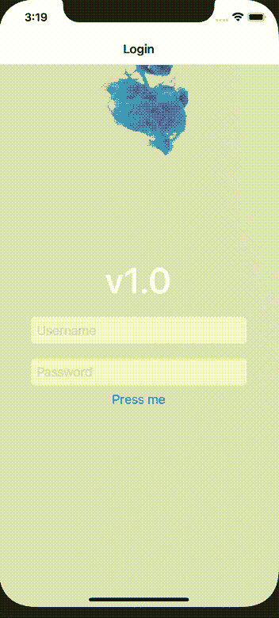

# 使用 react-native-video 添加 React Native 视频

> 原文：<https://blog.logrocket.com/adding-videos-react-native-react-native-video/>

[React Native](https://reactnative.dev/) 可能是当今使用最广泛的混合应用框架，因为它使开发人员能够通过编写 [React](https://reactjs.org/) 代码来创建原生应用，这在网站和应用之间提供了类似的开发人员体验。创建应用从未如此简单。

但这是否意味着你可以通过将所有 React 代码复制到 React 原生应用程序中，直接将你的网站变成一个应用程序呢？不，很不幸，没那么简单。尽管 React 本机应用程序的代码看起来与用 React 编写的 web 应用程序的代码相似，但仍有一些微小但重要的差异。

与网站和浏览器相比，移动应用有许多原生界面和功能。虽然 React 原生应用被编译成 iOS 或 Android 的原生应用，但一些简单元素的实现与我们在 React 的 web 版本中看到的不同。比如`<div>`变成了`<view>` , `<p>`变成了`<text>`，以此类推。

这使得 React Native 不同于所有基于 [Cordova 的](https://cordova.apache.org/)混合应用框架。但听起来像是一个主要缺点的东西实际上使应用程序有可能编译成本地代码，而不是模拟的网络视图。

与原生 web 元素不同的一个元素是视频。在 HTML 和 web 的世界里，观看视频就像使用原生的 [HTML 元素`<video>`](https://developer.mozilla.org/en-US/docs/Web/HTML/Element/video) 一样简单。

在应用程序的上下文中，实现视频不像在 web 上那么容易。好的一面是，React 本地社区已经针对这个问题开发了非常流行的解决方案。

本文重点介绍了最常见的包 react-native-video，用于在 React Native 应用程序中使用视频。您还将学习如何在 React 本机应用程序中实现它。

## 先决条件

因为安装和使用可能会因您开发的设备而异，所以对于所有示例，我们将重点关注 iOS 版本以及在基于 Mac 的开发环境中开发应用程序。

为各种类型的设备或平台(例如 Android)进行开发是相似的，但是您需要知道的差异在包的文档中有详细的描述。

## 什么是 react-native-video？

在撰写本文时，对于最广泛使用的包， [react-native-video](https://github.com/react-native-video/react-native-video) ，还没有真正的替代品。

虽然我喜欢比较不同的包，但这在这里没有意义，所以我们只强调这个库的用法、优点和缺点，然后学习如何使用它。react-native-video 包大小为 500kB，可以在 React Native 世界的所有设备上使用。

### 安装软件包

在使用该库之前，您必须将软件包安装在项目的根目录下:

```
npm install --save react-native-video

```

如果在 Mac 上运行本机 React 应用程序，还必须运行以下命令:

```
npx pod-install

```

对于其他环境和应用环境，请[参考您平台的官方安装指南](https://github.com/react-native-video/react-native-video#android-installation)。

## 使用反应-本地-视频

在我解释如何使用这个包之前，让我们从一个例子开始，看看我们想用它实现什么。应用程序中视频的一个常见用例是动态背景，这是我们希望在登录屏幕中实现的应用程序。

它应该是这样的:



首先，我们将视频组件从库中导入到要显示视频的组件中。

当然，为了让视频组件显示任何内容，我们需要一个视频文件。这可以是项目中的文件，也可以是指向外部资源的链接。

现在，让我们把所有东西放在一起:

```
import Video from 'react-native-video';
import video from '../test-video.mp4';

const MyComponent = () => {
    return (
        <Video  
            source={video}                  // the video file
            paused={false}                  // make it start    
            style={styles.backgroundVideo}  // any style you want
            repeat={true}                   // make it a loop
        />
    )
}

```

如您所见，我们已经将导入的视频文件从我们的项目直接传递到组件。如果您喜欢外部视频文件的链接，也可以使用源属性，如下所示:

```
<Video  
    source={{ url: 'http://link-to-your-video.mp4'}}
    ...
/>

```

为了实现背景视频的外观，我们还向组件传递了一些 React 本机样式。此外，我们将属性`pause`设置为`false`，这告诉组件随后立即开始播放视频。我们还设置道具`repeat`为`true`，使视频循环。

## 在 react-native-video 中使用的附加组件道具

我们只用了组件的四个道具就很快实现了我们的用例。但是，道具的使用方式还有很多。您可以[查看文档](https://github.com/react-native-video/react-native-video#configurable-props)来查看完整列表，但是让我向您展示一些我认为非常有用的选项。

这个道具允许视频由外部资源控制，如 AirPlay 或 HDMI，但这仅在 iOS 上可用。

使用此选项指定当应用程序关闭时，视频是否应该继续播放。当然，只有音频会继续播放，但对于某些用例来说，即使应用程序已经关闭，保持视频播放也是有帮助的。

这个道具创建一个图像，当视频正在加载或尚未开始时显示，例如通常在 YouTube 上看到的缩略图。此外，您可以使用`[posterResizeMode](https://github.com/react-native-video/react-native-video#posterresizemode)`调整图像。

在上面的例子中，我们不想显示视频的控件，因为它只是在后台运行，这是组件的默认行为。如果你想让用户控制视频，你只需将`controls`设置为`true`，控件就会自动显示。

> 注意:在 iOS 上，即使该标志设置为 false，控件也以全屏模式显示。

## 创建外部视频控制

该组件还提供了从外部控制视频所需的一切，因此可以创建自己独特的用户界面来控制它。

像`[paused](https://github.com/react-native-video/react-native-video#paused)`、`[muted](https://github.com/react-native-video/react-native-video#muted)`、`[volume](https://github.com/react-native-video/react-native-video#volume)`、`[onprogress](//github.com/react-native-video/react-native-video#onprogress)`或`[rate](https://github.com/react-native-video/react-native-video#rate)`这样的属性是你可以使用反应状态定制的道具，你可以让任何其他元素控制它们。这里有一个简单的例子来说明我的意思:

```
function Home(props) {  
    const [isPlaying, setIsPlaying] = React.useState(false);  
    const [isMuted, setIsMuted] = React.useState(false);  

    const togglePlaying = () => {};  

    return (  
        <View>  
            <Video
                source={video}  
                paused={!isPlaying}  
                controls={true}  
                style={styles.backgroundVideo}  
                muted={isMuted}  
            />  
            <Button
                onPress={() => setIsPlaying(p => !p)}  
                title={isPlaying ? 'Stop' : 'Play'}  
            />  
            <Button
                onPress={() => setIsMuted(m => !m)}  
                title={isMuted ? 'Unmute' : 'Mute'}  
            />  
        </View> 
    );  
}

```

正如你所看到的，通过一个简单的状态和使用按钮，我们可以按照我们想要的方式控制视频，这使我们能够拥有一个完全自定义的视频用户界面。

## 调用视频元素中的方法

您还可以调用 video 元素中的一些方法来对它进行更多的控制，例如使用像`save`这样的操作将视频保存到您的设备照片中，或者控制视频的全屏模式。

* * *

### 更多来自 LogRocket 的精彩文章:

* * *

为了实现这一点，您需要创建一个对`videoPlayer`的引用，并将其存储在一个`useRef`中:

```
import Video from 'react-native-video';
import video from '../test-video.mp4';

const MyComponent = () => {
    const videoPlayer = React.useRef();

    const goFullScreen = () => {  
        if (videoPlayer.current) {  
            videoPlayer.current.presentFullscreenPlayer();  
        }  
    };

    return (
        <Video  
            ref={ref => (videoPlayer.current = ref)}
            source={video}                  // the video file
            paused={false}                  // make it start    
            style={styles.backgroundVideo}  // any style you want
            repeat={true}                   // make it a loop
        />
    )
}

```

## 结论

React Native 是一个强大的工具，因为它提供了使用 React 编写应用程序的可能性，这与 web 上使用的非常相似。

唯一的区别是我们不写 HTML 元素。然而，我们确实包含了本土元素。这些元素中的一些已经包含在框架中，但像视频这样的元素也必须安装。

虽然视频的行为类似于网络，但开发者需要考虑建立一些功能，如全屏模式或当应用程序最小化时恢复播放的选项。

react-native-video library 为您提供了所有这些选项，以便您可以轻松地将视频添加到您的应用程序并对其进行自定义，从而确保您的用户在您的应用程序上观看视频时拥有出色的体验！

## [LogRocket](https://lp.logrocket.com/blg/react-native-signup) :即时重现 React 原生应用中的问题。

[](https://lp.logrocket.com/blg/react-native-signup)

[LogRocket](https://lp.logrocket.com/blg/react-native-signup) 是一款 React 原生监控解决方案，可帮助您即时重现问题、确定 bug 的优先级并了解 React 原生应用的性能。

LogRocket 还可以向你展示用户是如何与你的应用程序互动的，从而帮助你提高转化率和产品使用率。LogRocket 的产品分析功能揭示了用户不完成特定流程或不采用新功能的原因。

开始主动监控您的 React 原生应用— [免费试用 LogRocket】。](https://lp.logrocket.com/blg/react-native-signup)