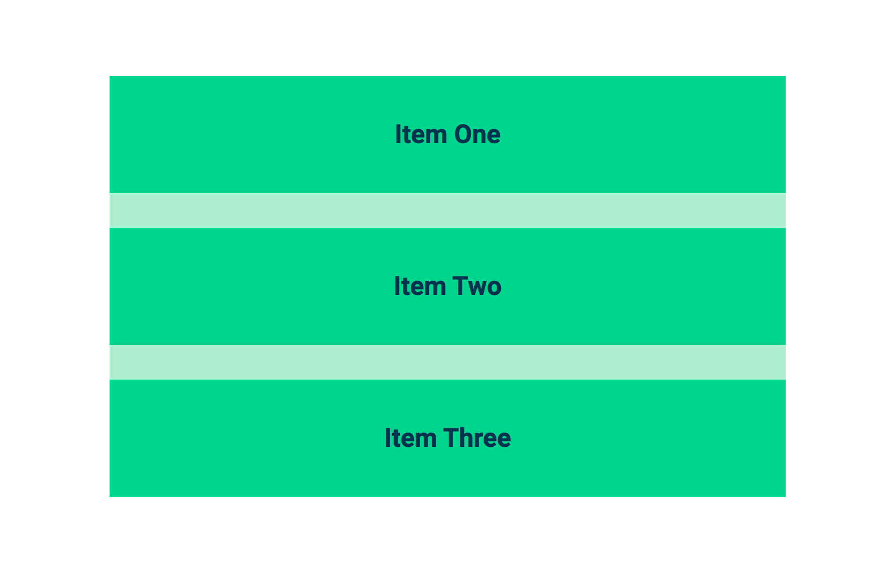

# 常见场景的高级 CSS 选择器

> 原文：<https://blog.logrocket.com/advanced-css-selectors-for-common-scenarios/>

CSS 很奇怪。它不同于 web 开发人员使用的任何其他语言，但它对于网站的视觉表现——用户与之交互的部分——是至关重要的。就其最基本的形式而言，CSS 很简单。例如，`background-color: red`表示背景颜色为红色。然而，正如任何处理过大型 CSS 代码库的人会告诉你的，它会很快变得非常复杂和令人困惑。

[CSS 格子](https://seesparkbox.com/foundry/css_grid_layout_guide_with_flexbox_fallbacks)， [BEM](https://seesparkbox.com/foundry/bem_by_example) ， [Dart Sass](https://seesparkbox.com/foundry/dart_sass_update_version_1.23.0) ，关于 CSS 总是有新的东西要学。简直铺天盖地！与其看什么是新的，不如让我们关注 CSS 的一个基本构件——选择器。通过更好地理解选择器，以及如何以更高级的方式使用它，您可以用更少的代码和更简洁的 CSS 解决常见的场景。

## 什么是选择器？

让我们确保我们在同一页上。一个 [CSS 选择器](https://developer.mozilla.org/en-US/docs/Learn/CSS/Building_blocks/Selectors)是你如何告诉浏览器什么元素应用属性。它们可以是通用的，适用于一大组元素，也可以是更具体的，仅适用于单个 HTML 元素。有五种[类型的选择器](https://www.w3schools.com/css/css_selectors.asp):

*   [简单的选择器](https://www.w3schools.com/css/css_selectors.asp)，用于选择 HTML 片段，如`div`、`#id`或`.class`
*   [组合子选择器](https://www.w3schools.com/css/css_combinators.asp)，它们基于代码关系，如“子代”`p > div`或“相邻兄弟”`div + div`
*   [伪类选择器](https://www.w3schools.com/css/css_pseudo_classes.asp)，用于选择元素的特定**状态**，如`:hover`、`:first-child`或`:nth-of-type`
*   [伪元素选择器](https://www.w3schools.com/css/css_pseudo_elements.asp)，用于选择元素的特定**部分**，如`::after`、`::selection`或`::first-letter`。请注意，与使用单个冒号的伪类选择器相比，它们总是使用双冒号符号`::`
*   [属性选择器](https://www.w3schools.com/css/css_attribute_selectors.asp)选择具有某些属性的元素，如(`[class|="class-name"]`、`[type="text"]`或`[target]`

如果使用两个单独的选择器来声明同一个元素的样式，那么更具体的选择器将胜出——不管它们在 CSS 文件中的顺序如何。比如像`.class-name`这样的类选择器就比`span`这样的一般 HTML 元素选择器更具体。如果你需要复习一下浏览器如何决定应用何种 CSS 样式，也就是所谓的 [CSS 级联](https://blog.logrocket.com/how-css-works-understanding-the-cascade-d181cd89a4d8/)，试试这个[测试。](https://wattenberger.com/blog/css-cascade)

现在我们已经了解了什么是选择器，让我们深入了解如何有效地使用它们。您可以利用鲜为人知的选择器，甚至将它们组合起来，以减少所需的代码量！这里有一些我在 CSS 中使用的更高级的选择器。

## :第 n 个最后一个孩子(-n + 2)

有许多 CSS 伪类选择器可以用来从一组相关元素中选择一个元素——或者一个父元素的子元素。

```
<parent>
    <child></child>
    <child></child>
</parent>
```

有`[:first-child](https://developer.mozilla.org/en-US/docs/Web/CSS/:first-child)`、`[:nth-child](https://developer.mozilla.org/en-US/docs/Web/CSS/:nth-child)`、[、`:nth-of-type`、](https://developer.mozilla.org/en-US/docs/Web/CSS/:nth-of-type)、[的单子还有](https://css-tricks.com/how-nth-child-works/)。当转换成使用数字、`n`计数器、`odd`或`even`的表达式时，这些选择器变得更加强大。您可以通过数学计算来选择一个组中任意数量的元素。例如，`n`是一种创建代数表达式的方法。因此`(2n+4)`等同于`(2*n)+4`，它将从第四个元素开始选择所有其他元素:

```
(2*0)+4 = 4
(2*1)+4 = 6
(2*2)+4 = 8
(2*4)+4 = 10
```

这在许多情况下都很有用。例如，您曾经需要只对列表中的最后两项进行样式化吗？您可以向这两个元素添加一个类，这会产生更多的 HTML 和 CSS，或者您可以使用一个 CSS 选择器，如下所示:

```
.item:nth-last-child(-n+2)
```

你可以把这个选择器理解为“选择`.item`的最后两个子节点。”看看这是如何工作的，`-n+2`等于`(-0+2)=2`或倒数第二个项目，然后`(-1+2)=1`或最后一个项目，然后`(-2+2)=0`不选择任何项目，然后`(-3+2=-1)`也不选择任何项目，以此类推，得到子元素的总数。由于`n`前面的负号导致倒计时，所以只选择了两个元素。如果你想选择最后三个项目，`-n+3`就是这么做的。这允许我们选择这些元素，而不需要在 HTML 中添加任何东西！

请看 [CodePen](https://codepen.io) 上安德鲁·斯潘塞( [@iam_aspencer](https://codepen.io/iam_aspencer) )
的 Pen [选择器演示——:n-last-child(-n+2)](https://codepen.io/iam_aspencer/pen/RwPoYXq)。

:not(:最后一个孩子)

## 为了进一步说明最后一个例子，您可以将`:last-child`与`:not`选择器结合起来。这在一个组中的最后一个元素具有不同样式的情况下很有帮助。网站通常会要求项目列表，项目之间要留有空格。这些方案的一个常见问题是需要删除组中最后一项下的间距。



或者你可能已经使用一个 [BEM CSS 结构](https://seesparkbox.com/foundry/bem_css_organization)向 HTML 添加了一个全新的类。这会给你这个:

Oftentimes with CSS, it can feel natural to style the most common scenario first and *then* account for any outlying scenarios with a more specific selector. Then, the styles of the more specific selector will override the styles of the more general selector. Which, in our example, might result in something like this:

```
.image {
  margin-bottom: 2rem;

  &:last-child {
    margin-bottom: 0;
  }
}
```

这两个路径都会产生七行代码和一个重写属性。这并不可怕，但是如果你把你的 CSS 看作一种编程语言，并且把逻辑“编程”到选择器中，你可以把 CSS 简化成这样:

```
.image {
  margin-bottom: 2rem;
}

.image--last {
  margin-bottom: 0;
}
```

阅读上面的选择器，它说“选择不是最后一个孩子的图像。”三行代码，没有覆盖样式——不错！

```
.image:not(:last-child) {
  margin-bottom: 2rem;
}
```

请看 [CodePen](https://codepen.io) 上安德鲁·斯潘塞( [@iam_aspencer](https://codepen.io/iam_aspencer) )
的 Pen [选择器演示——:n-last-child(-n+2)](https://codepen.io/iam_aspencer/pen/qBdqMQP)。

See the Pen [Selector Demo – :nth-last-child(-n + 2)](https://codepen.io/iam_aspencer/pen/qBdqMQP) by Andrew Spencer ([@iam_aspencer](https://codepen.io/iam_aspencer))
on [CodePen](https://codepen.io).

元素:悬停+相邻同级

## 让我们看一个不同的场景——悬停状态。有时你需要调整一个不同于被悬停元素的元素。在 JavaScript 中，这相当简单，因为 JavaScript 使得搜索特定元素变得很容易——也称为遍历 DOM 的[。不过，通常情况下，有了正确的 HTML 结构，你只需要 CSS。](https://www.digitalocean.com/community/tutorials/how-to-traverse-the-dom)

有了 CSS，你可以使用[组合子选择器](https://www.w3schools.com/css/css_combinators.asp)，比如`.parent > .child`或者`.element + .general-sibling`来针对不同的元素。CSS 不能做的一件事是定位一个被悬停元素的父元素。下面是 CSS 的目标图:

如何使用强大的兄弟选择器？如果您有两个同级元素，并且需要设置第二个元素的悬停状态的样式，您可以这样做:

```
<div>
  <a>
    The element that is hovered
    <span>This is a child, CSS can style this</span>
  </a>
  <span>This is a sibling, CSS can style this</span>
  The "parent" <div> cannot be styled with CSS when the <a> is hovered
</div>
```

请看 [CodePen](https://codepen.io) 上安德鲁·斯潘塞( [@iam_aspencer](https://codepen.io/iam_aspencer) )
的笔 [选择器演示——:悬停+同胞](https://codepen.io/iam_aspencer/pen/wvaoYoB)。

See the Pen [Selector Demo – :hover + sibling](https://codepen.io/iam_aspencer/pen/wvaoYoB) by Andrew Spencer ([@iam_aspencer](https://codepen.io/iam_aspencer))
on [CodePen](https://codepen.io).

同级选择器也可用于表单域。使用`label:hover + input`选择器，与`<label>`元素交互可以用来突出显示`<label>`之后的兄弟`<input>`。

请看 [CodePen](https://codepen.io) 上安德鲁·斯潘塞( [@iam_aspencer](https://codepen.io/iam_aspencer) )
的 Pen [选择器演示——:hover+同胞链接](https://codepen.io/iam_aspencer/pen/zYGomdR)。

轮到你了

下次你认为 CSS 是低等语言时，请三思。只是…不一样。根据你的观点，这可能是令人沮丧的，也可能是有益的。在你放弃 CSS 而求助于添加更多的 HTML 或者用一些 JavaScript 把一切搞得一团糟之前，看看你可以使用的 CSS 选择器和属性。有机会有一个你可以用来满足你的需求。

你的前端是否占用了用户的 CPU？

随着 web 前端变得越来越复杂，资源贪婪的特性对浏览器的要求越来越高。如果您对监控和跟踪生产环境中所有用户的客户端 CPU 使用、内存使用等感兴趣，

## .

LogRocket 就像是网络和移动应用的 DVR，记录你的网络应用或网站上发生的一切。您可以汇总和报告关键的前端性能指标，重放用户会话和应用程序状态，记录网络请求，并自动显示所有错误，而不是猜测问题发生的原因。

[try LogRocket](https://lp.logrocket.com/blg/css-signup)

现代化您调试 web 和移动应用的方式— [开始免费监控](https://lp.logrocket.com/blg/css-signup)。

[](https://lp.logrocket.com/blg/css-signup)[https://logrocket.com/signup/](https://lp.logrocket.com/blg/css-signup)

[LogRocket](https://lp.logrocket.com/blg/css-signup) is like a DVR for web and mobile apps, recording everything that happens in your web app or site. Instead of guessing why problems happen, you can aggregate and report on key frontend performance metrics, replay user sessions along with application state, log network requests, and automatically surface all errors.

Modernize how you debug web and mobile apps — [Start monitoring for free](https://lp.logrocket.com/blg/css-signup).