# CSS 背景混合模式的高级效果

> 原文：<https://blog.logrocket.com/advanced-effects-with-css-background-blend-modes-4b750198522a/>

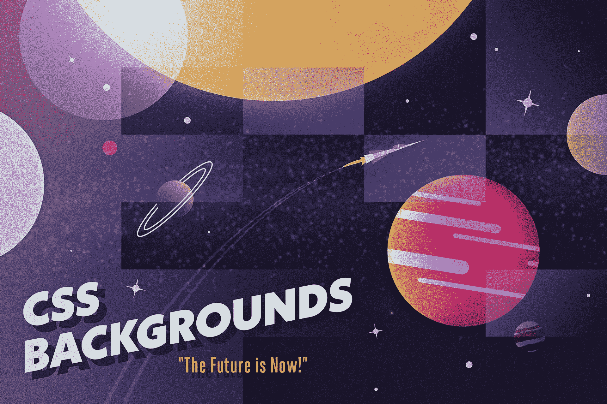

如果一张图片胜过千言万语，那么将两张图片融合在一起的价值肯定是它的数倍。同样，CSS 中混合模式的可用性所带来的设计可能性可能比您意识到的要大。

当你听到 **CSS 混合模式**被谈论时，骚动实际上是关于三个新的 CSS 属性，它们在现代浏览器中获得了相当好的支持。

这些属性包括:

*   `background-blend-mode`，用于混合元素的背景图像、渐变和背景颜色
*   `mix-blend-mode`，用于将元素混合到其他元素上，最后
*   `isolation`，mix-blend-mode 使用的较少使用的属性，用于防止元素混合在一起。

然而，本文将重点关注`background-blend-mode`，这一拥有最广泛支持的属性，以及您今天如何使用它来为您的网站创建引人注目的背景和照片效果，这些曾经只能在 Photoshop 中实现。

[](https://logrocket.com/signup/)

 [https://www.youtube.com/embed/aqzR4MUGNZ4?version=3&rel=1&showsearch=0&showinfo=1&iv_load_policy=1&fs=1&hl=en-US&autohide=2&wmode=transparent](https://www.youtube.com/embed/aqzR4MUGNZ4?version=3&rel=1&showsearch=0&showinfo=1&iv_load_policy=1&fs=1&hl=en-US&autohide=2&wmode=transparent)

视频

### 将 CSS 渐变与背景混合模式相结合

属性是我们可以使用 CSS 渐变的地方。像`linear-gradient()`、`radial-gradient()`以及两者的`repeating-linear-gradient()`和`repeating-radial-gradient()`这样的函数得到了广泛的支持，更重要的是，它们拥有跨浏览器的标准化语法。

但是`background`属性也可以接受一个以上的渐变，每个函数用逗号分隔。Lea Verou 展示了令人印象深刻的图案，这种技术可以创造出从棋盘到砖块到星星的图案。


但是现在我们有了`background-blend-mode`属性，我们可以创建更多新的渐变和图案。

### 光谱背景

让我们叠加三个渐变来制作一个可以在显示器上显示的几乎全光谱的背景。

```
.spectrum-background {
    background:
        linear-gradient(red, transparent),
        linear-gradient(to top left, lime, transparent),
        linear-gradient(to top right, blue, transparent);
    background-blend-mode: screen;
}
```

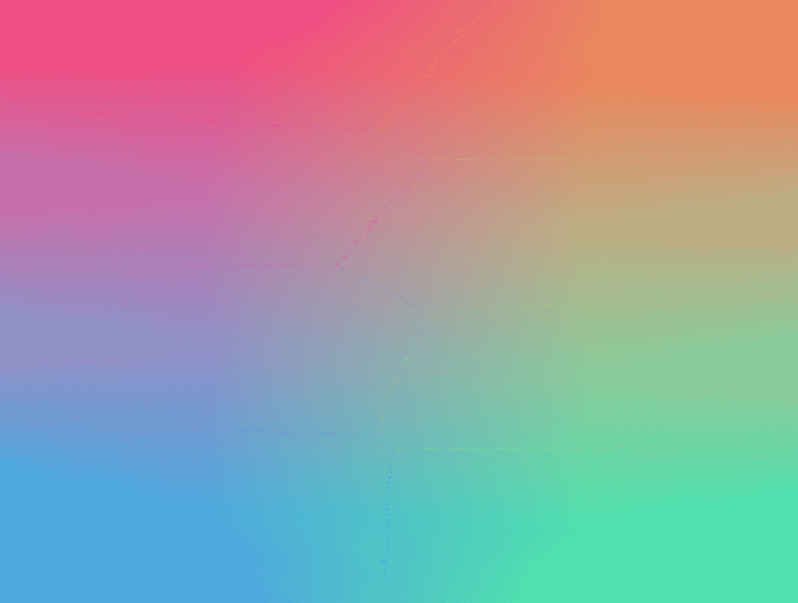

上面的效果过去只可能出现在几万千字节的图像上。但是我们刚刚用不到 200 字节的 CSS 复制了这个效果，更不用说保存一个 HTTP 请求了。

### 格子背景

我们还可以用渐变和`background-blend-mode`创造一些有趣的格子图案。

```
.plaid-background {
    background:
        repeating-linear-gradient(
            -45deg,
            transparent 0,
            transparent 25%,
            dodgerblue 0,
            dodgerblue 50%
       ),
       repeating-linear-gradient(
            45deg,
            transparent 0,
            transparent 25%,
            tomato 0,
            tomato 50%
        ),
        repeating-linear-gradient(
            transparent 0,
            transparent 25%,
            gold 0,
            gold 50%
        ), white;
    background-blend-mode: multiply;
    background-size: 100px 100px;
}
```

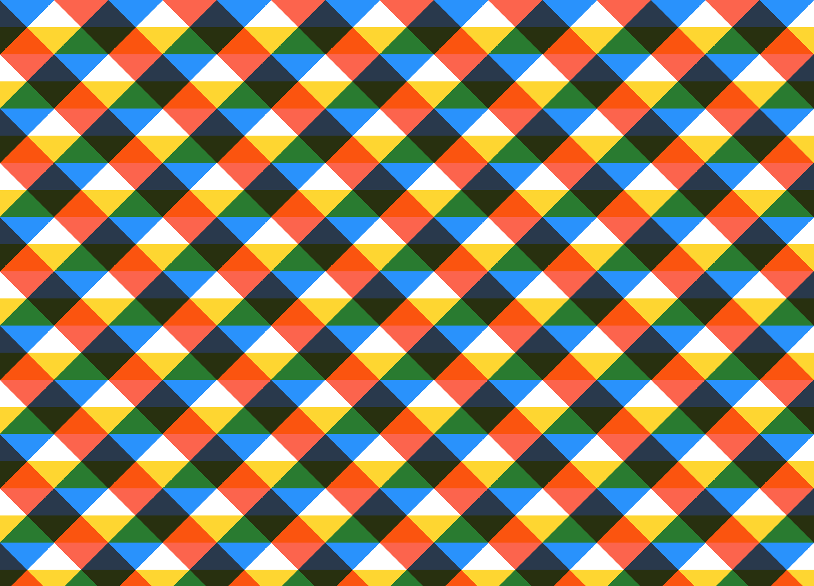

### 圆形背景

再来一个怎么样，这次是径向渐变:

```
.circles-background {
    background:
        radial-gradient(
            khaki 40px,
            transparent 0,
            transparent 100%
        ),
        radial-gradient(
            skyblue 40px,
            transparent 0,
            transparent 100%
        ),
        radial-gradient(
            pink 40px,
            transparent 0,
            transparent 100%
        ), snow;
    background-blend-mode: multiply;
    background-size: 100px 100px;
    background-position: 0 0, 33px 33px, -33px -33px;
}
```

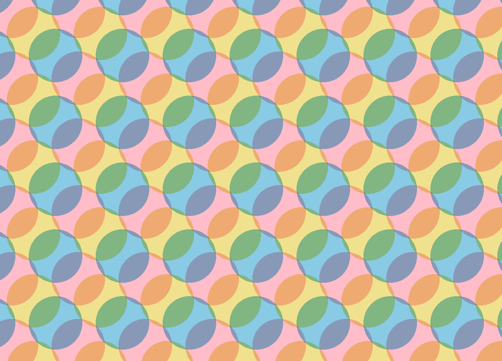

### 更多背景

在 Yoksel 和 Una 克拉韦茨的帮助下，我准备了 24 种混合模式渐变的[集合](https://bennettfeely.com/gradients/)，让你的网站看起来更快更有吸引力。

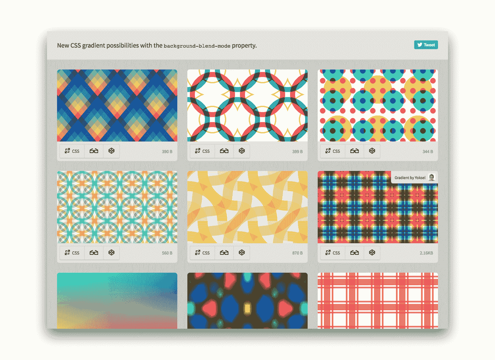

### 背景混合模式的照片效果

虽然`background-image`允许我们在一个元素上设置多个渐变，但是有一个技巧是我们也可以用`url()`语法以几乎相同的方式设置多个图像背景。当我们将它与`background-blend-mode`和像`filter`这样的属性结合起来时，事情就变得非常有趣了。

### 铅笔素描效果

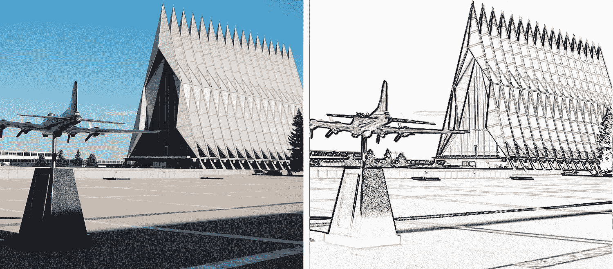

我们可以使用 CSS 使左边的照片看起来像是用铅笔和纸画的。没有 Photoshop，没有 HTML5 画布，没有 WebGL，没有 Javascript 库。我们只需要五个 CSS 属性。

尽管我们可以使用其他的块级元素，比如`<body>`、`<section>`、`<figure>`，这里是我们将要开始使用的 HTML。

```
<div class=”pencil-effect”></div> 
```

开始造型吧。将`chapel.jpg`替换为您正在使用的图像的 url。我们将设置背景图像两次，其背景大小覆盖。

```
.pencil-effect {
    background:
        url(chapel.jpg),
        url(chapel.jpg);
    background-size: cover;
}
```

下面第一个方块是我们第一步的结果:

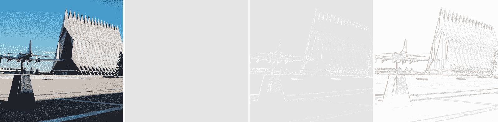

现在让我们添加一个混合模式:

```
background-blend-mode: difference;
```

哦不，东西都去哪了？我们只剩下一个全黑的正方形。差异混合模式采用两个背景，并从一个背景的较亮颜色中逐个像素地减去另一个背景的较暗颜色。

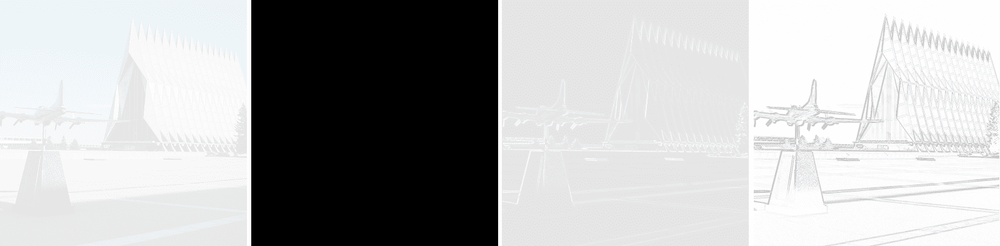

如果这里发生的事情令人困惑，让我们看看当我们用`background-position`和`calc()`稍微偏移两个背景时会发生什么。

```
background-position:
    calc(50% — 1px) calc(50% — 1px),
    calc(50% + 1px) calc(50% + 1px);
```

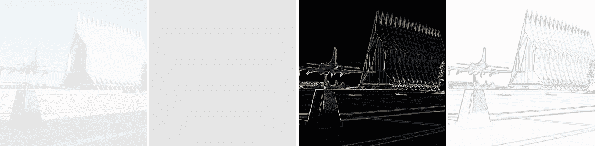

使用逗号，我们设置两个背景位置，每个位置对应于背景图像的一个副本。第一张图片，我们从 x 轴的中心向左移动一个像素，从 y 轴的中心向上移动一个像素。对于背景图像的第二个副本，我们做相反的事情，向下向右移动。

我们剩下的是两个稍微偏移的背景图像，但是整个图片仍然在我们的元素的中心。现在，差异混合模式找到了两个图像之间的差异，它揭示了照片中的边缘。很酷吗？

最后，我们将使用`filter`属性来反转照片并使其灰度化。

* * *

### 更多来自 LogRocket 的精彩文章:

* * *

```
filter: brightness(3) invert(1) grayscale(1);
```

对于这张特定的照片，我们还将提高亮度，这具有增加线条对比度的次要效果。

这是我们实现这一效果的最后一段 CSS 代码:

```
.pencil-effect {
    background:
        url(photo.jpg),
        url(photo.jpg);
    background-size: cover;
    background-blend-mode: difference;
    background-position:
        calc(50% — 1px) calc(50% — 1px),
        calc(50% + 1px) calc(50% + 1px);
    filter: brightness(3) invert(1) grayscale(1);
}
```

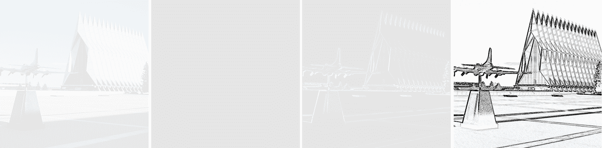

### 黑板效应

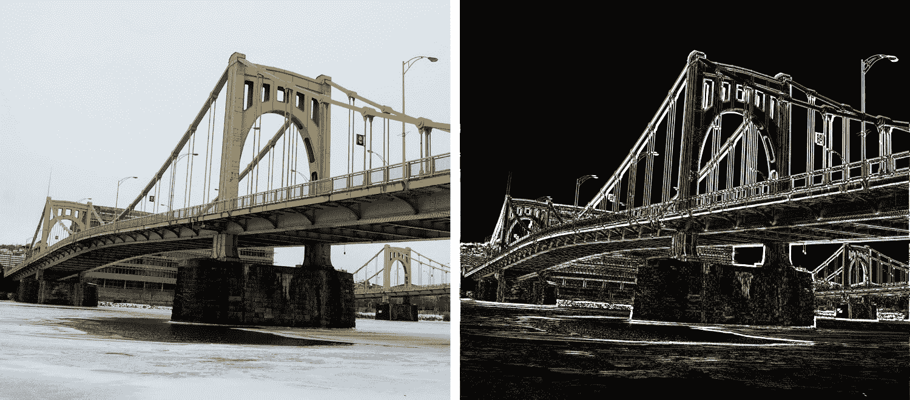

我们可以按照铅笔素描效果的步骤重新创建一个黑板效果，同时省略最后一步的`invert(1)`功能。

### 夜视效应

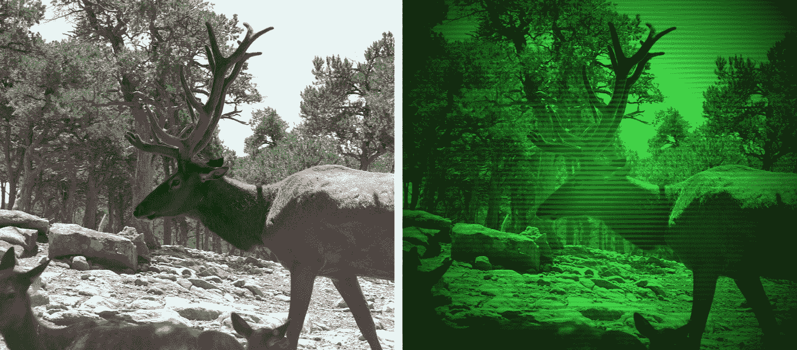

让我们试着用 CSS 混合模式再创建一个效果，让照片看起来像是我们通过夜视镜的镜头在看它。

我们的背景有三个部分，我们将用`overlay`混合模式混合在一起。这种混合模式可以使背景变亮和变暗，也可以作为另外两种混合模式`multiply`和`screen`的组合。

首先，我们将设置我们的背景图像，只是这一次。

```
background: url(moose.jpg);
background-size: cover;
background-position: center;
```

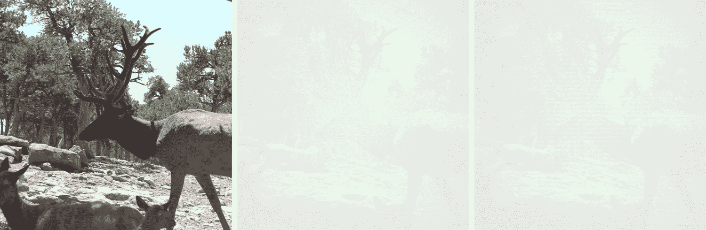

现在让我们添加一个渐变和背景混合模式。我们在这里使用了一个稍微透明的石灰到黑色的径向渐变。

```
background:
    url(moose.jpg),
    radial-gradient(
        rgba(0,255,0,.8),
        black
    );
background-blend-mode: overlay;
```

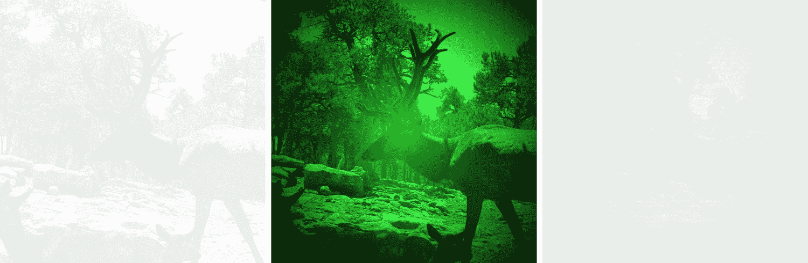

不算太坏，也许我们想就此打住。我还有一个想法可能会使效果看起来更真实，那就是用重复的背景渐变给背景添加一些人造扫描线。

```
background:
    url(moose.jpg),
    radial-gradient(
        rgba(0,255,0,.8),
        black
    ),
    repeating-linear-gradient(
        transparent 0,
        rgba(0,0,0,.2) 3px,
        transparent 6px
    );
```

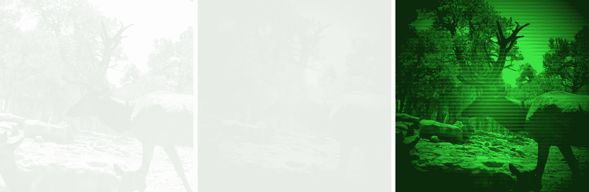

总结一下，用于这个效果的完整 CSS:

```
.night-vision-effect {
    background:
        url(moose.jpg),
        radial-gradient(
            rgba(0,255,0,.8),
            black
        ),
        repeating-linear-gradient(
            transparent 0,
            rgba(0,0,0,.2) 3px,
            transparent 6px
        );
    background-blend-mode: overlay;
    background-size: cover;
 }
```

### 更多照片效果

我做了一个图库，里面有 20 种 CSS 图像效果，你可以在你的网站上使用。

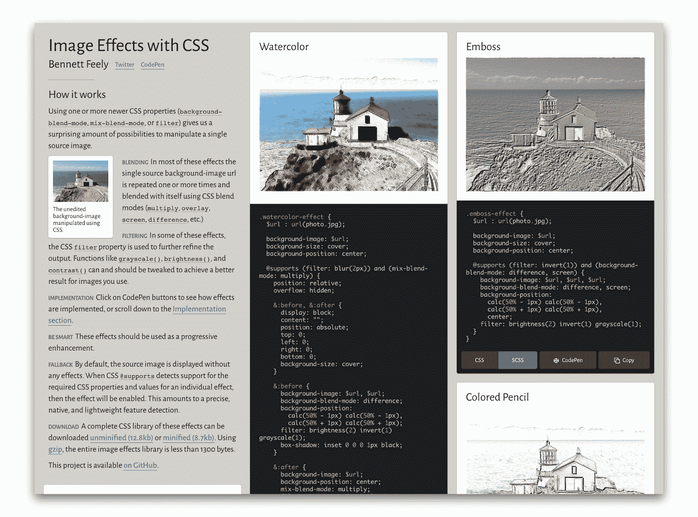

### 浏览器支持和优雅降级

好消息是,`background-blend-mode`属性在 Firefox、Chrome 和 Opera 中得到完全支持。

稍微好一点的消息是，它在 Safari 中有足够的支持来支持我们在这里概述的所有效果，而 Safari 目前缺乏对`saturation`、`hue`、`color`和`luminosity`混合模式的支持。

坏消息是，Internet Explorer 和 IE Edge 不支持任何 CSS 混合模式属性。

这意味着我们需要为尚不支持`background-blend-mode`的浏览器提前做好计划。漂亮的 CSS `@supports`规则让这变得非常容易。这里有两个例子。

对于第一个例子，如果不支持`background-blend-mode`属性，我们将使用我们的光谱背景渐变并提供一个后备。我们在这个例子中使用`background: gray;`作为后备，但是任何 CSS 都可以用在它的位置上。

```
.spectrum-background {
    background: gray;

@supports (background-blend-mode: screen) {
        background:
            linear-gradient(red, transparent),
            linear-gradient(to top left, lime, transparent),
            linear-gradient(to top right, blue, transparent);
        background-blend-mode: screen;
    }
}
```

这是有退路的铅笔素描效果。我们正在测试我们需要支持的两个关键属性:`filter`和`background-blend-mode`。如果用户的浏览器不支持这些(或者如果浏览器不支持 CSS `@supports`，我们将退回到普通的原始照片。

```
.pencil-effect {
    background-image: url(photo.jpg);
    background-size: cover;

@supports (background-blend-mode: difference) and (filter: invert(1)) {
        background-image:
            url(photo.jpg),
            url(photo.jpg);
        background-blend-mode: difference;
        background-position:
            calc(50% — 1px) calc(50% — 1px),
            calc(50% + 1px) calc(50% + 1px);
        filter: brightness(3) invert(1) grayscale(1);
    }
}
```

### 资源

[贾斯汀·麦克道尔揭开混合模式的神秘面纱](http://alistapart.com/article/blending-modes-demystified)

[Chris Coyier 的 CSS 混合模式基础知识](https://css-tricks.com/basics-css-blend-modes/)

[Lea Verou 的 CSS3 模式图库](http://lea.verou.me/css3patterns/)

[乌娜·克拉韦茨的 6 集 CSS 图像特效系列](http://una.im/vintage-washout/#%F0%9F%92%81)

[我可以使用…背景混合模式支持吗](https://caniuse.com/#search=background-blend-mode)

Bennett Feely 的 CSS 图像效果

[Bennett Feely 的背景混合模式属性的新 CSS 渐变可能性](http://bennettfeely.com/gradients/)

[Rik Cabanier 的背景混合模式实验聚合填料](https://github.com/cabanier/poly)

[W3C 的合成和混合 1 级规范](https://www.w3.org/TR/compositing-1/)

## 你的前端是否占用了用户的 CPU？

随着 web 前端变得越来越复杂，资源贪婪的特性对浏览器的要求越来越高。如果您对监控和跟踪生产环境中所有用户的客户端 CPU 使用情况、内存使用情况等感兴趣，

[try LogRocket](https://lp.logrocket.com/blg/css-signup)

.

[](https://lp.logrocket.com/blg/css-signup)[https://logrocket.com/signup/](https://lp.logrocket.com/blg/css-signup)

LogRocket 就像是网络和移动应用的 DVR，记录你的网络应用或网站上发生的一切。您可以汇总和报告关键的前端性能指标，重放用户会话和应用程序状态，记录网络请求，并自动显示所有错误，而不是猜测问题发生的原因。

现代化您调试 web 和移动应用的方式— [开始免费监控](https://lp.logrocket.com/blg/css-signup)。

* * *