# 颤振开关和切换的高级指南

> 原文：<https://blog.logrocket.com/advanced-guide-flutter-switches-toggles/>

我们都很熟悉家用开关来开关照明系统和其他电器。我们也熟悉切换按钮；如果你家里有电炊具或感应设备，你可以在它的电压和烹饪功能之间切换。

类似地，我们的移动应用程序也有开关来打开/关闭 Wi-Fi、蓝牙等等。

今天，我们正在深入了解颤振开关和触发器的参数和特性。

## 目录

开关按钮是一个只有两种状态的抖动小部件，不是真/假就是开/关。通常，开关是一个带有拇指滑块的按钮，用户可以从左向右拖动它，反之亦然，以在状态之间切换。它不会自己保持状态。您必须调用`onChanged`属性来保持按钮打开或关闭。

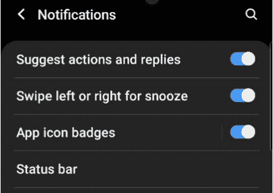

类似地，切换小部件只有两种状态:真/假或开/关。但是 toggle 小部件创建多个成行排列的按钮，允许用户在它们之间切换。

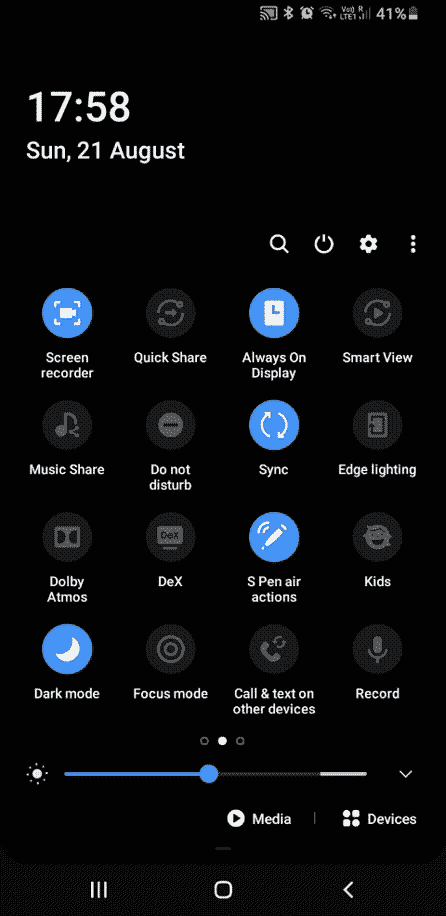

## 开关和拨动开关的关键区别

这是移动应用程序中的用例问题。在大多数情况下，这些小部件在设置页面上使用。如果您向下拖动移动应用程序的通知面板，您将看到一个切换按钮网格。但是当你进入设置页面时，那些按钮就变成了开关。

你一定明白其中的区别。在您的移动应用程序中，如果您有一个只需要两种状态的控件列表，您应该使用开关。如果在一行或一个网格中有多个控件，应该使用切换。

Flutter 提供了三种类型的开关部件:

*   开关(安卓)
*   CupertinoSwitch
*   `Switch.adaptive`(根据平台自适应)

让我们看看用于定制小部件的最常见属性:

### `Switch`(安卓)

```
Switch(
  // thumb color (round icon)
  activeColor: Colors.amber,
  activeTrackColor: Colors.cyan,
  inactiveThumbColor: Colors.blueGrey.shade600,
  inactiveTrackColor: Colors.grey.shade400,
  splashRadius: 50.0,
  // boolean variable value
  value: forAndroid,
  // changes the state of the switch
  onChanged: (value) => setState(() => forAndroid = value),
),
```

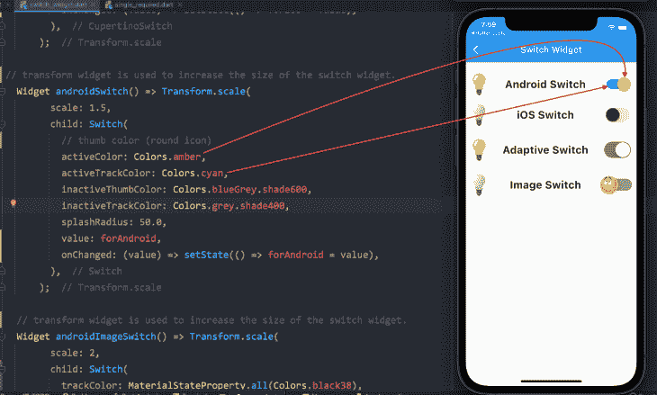

### `CupertinoSwitch` (iOS)

```
CupertinoSwitch(
  // overrides the default green color of the track
  activeColor: Colors.pink.shade200,
  // color of the round icon, which moves from right to left
  thumbColor: Colors.green.shade900,
  // when the switch is off
  trackColor: Colors.black12,
  // boolean variable value
  value: forIos,
  // changes the state of the switch
  onChanged: (value) => setState(() => forIos = value),
),
```

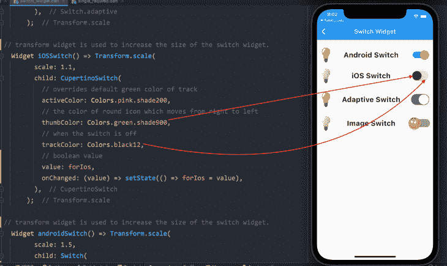

自适应开关小部件没有任何独特或不同的属性。但是，如果你想要一个图像或图标，而不是通常的拇指颜色，Android `Switch` widget 可以进一步定制。您需要用资产图像定义缩略图属性。请看下面的代码。

### 带图像的 Android `Switch`

```
Switch(
  trackColor: MaterialStateProperty.all(Colors.black38),
  activeColor: Colors.green.withOpacity(0.4),
  inactiveThumbColor: Colors.red.withOpacity(0.4),
// when the switch is on, this image will be displayed
  activeThumbImage: const AssetImage('assets/happy_emoji.png'),
// when the switch is off, this image will be displayed
  inactiveThumbImage: const AssetImage('assets/sad_emoji.png'),
  value: forImage,
  onChanged: (value) => setState(() => forImage = value),
),
```

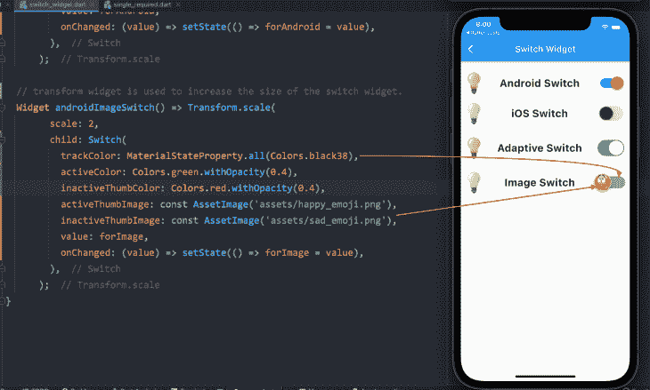

这是代码运行时的样子:

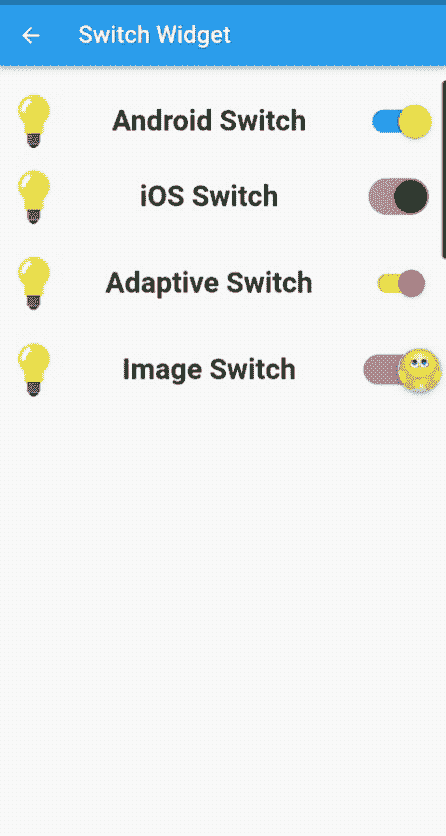

目前，我们没有保存 switch 小部件的状态；我们只是在改变它。接下来是创建一个小应用程序，我们将把主题从亮变暗，反之亦然，当你关闭应用程序时，它的状态将被保存。

这是一个简单的单页应用程序，在`appBar`中有一个切换按钮，可以改变主题。

我已经使用了 [Flutter Hive](https://blog.logrocket.com/handling-local-data-persistence-flutter-hive/) 来保存应用程序的状态。您可以使用`SharedPreferences`，但我选择了 Hive，因为它是一个快速、轻量级的 NoSQL 数据库，适用于 Flutter 和 Dart 应用程序。如果您需要一个没有大量关系的简单的键值数据库，Hive 会很有帮助。它很容易使用，并且是一个离线数据库(在本地存储数据)。

我们先来看看代码…

我们使用`ValueListenableBuilder`来更新 UI。每当它监听的值发生变化时，它都会构建特定的小部件。它的值与侦听器保持同步；也就是说，每当值改变时，`ValueListenable`监听它并更新 UI，而不使用`setState()`或任何其他状态管理技术:

```
const themeBox = 'hiveThemeBox';
void main() async {
 await Hive.initFlutter();
 await Hive.openBox(themeBox);
 runApp(const MyApp());
}

class MyApp extends StatelessWidget {
 const MyApp({Key? key}) : super(key: key);

 @override
 Widget build(BuildContext context) {
   //to update the UI without using setState()
   return ValueListenableBuilder(
     valueListenable: Hive.box(themeBox).listenable(),
     builder: (context, box, widget) {
       //saving the value inside the hive box,
       var darkMode = Hive.box(themeBox).get('darkMode', defaultValue: false);
       return MaterialApp(
           debugShowCheckedModeBanner: false,
           //switching between light and dark theme,
           themeMode: darkMode ? ThemeMode.dark : ThemeMode.light,
           title: 'Flutter Demo',
           darkTheme: ThemeData.dark(),
           home: HomePage(
             value: darkMode,
           ));
     },
   );
 }
}

class HomePage extends StatelessWidget {
 final bool value;
 const HomePage({Key? key, required this.value}) : super(key: key);

 @override
 Widget build(BuildContext context) {
   return Scaffold(
     appBar: AppBar(
       title: Text(value ? 'Hive Dark Mode' : 'Hive Light Mode'),
       actions: [
         Switch(
           value: value,
           onChanged: (val) {
             Hive.box(themeBox).put('darkMode', !value);
           },
         ),
       ],
     ),
     body: Padding(
       padding: const EdgeInsets.all(8.0),
       child: Column(
         crossAxisAlignment: CrossAxisAlignment.stretch,
         children: [ ],
       ),
     ),
   );
 }
}
```

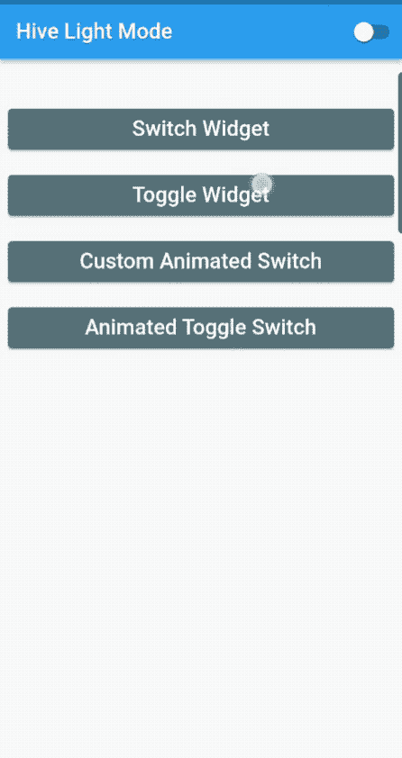

在这里，我们将看看在我们的应用程序中实现切换小部件的四种不同方式。

*   Single and required:用户必须从两个选项中至少选择一个
*   单个且不需要:用户不需要选择任何选项
*   多个和必需的:用户必须选择至少一个给定的选项，但也可以选择多个选项
*   多选和非必选:用户可以根据需要选择或取消选择，但也可以选择多个选项

首先，让我们看看一个 toggle 小部件的标准属性来定制它，然后我们将浏览每个小部件的代码，以及它的插图:

```
ToggleButtons(
  // list of booleans
  isSelected: isSelected,
  // text color of selected toggle
  selectedColor: Colors.white,
  // text color of not selected toggle
  color: Colors.blue,
  // fill color of selected toggle
  fillColor: Colors.lightBlue.shade900,
  // when pressed, splash color is seen
  splashColor: Colors.red,
  // long press to identify highlight color
  highlightColor: Colors.orange,
  // if consistency is needed for all text style
  textStyle: const TextStyle(fontWeight: FontWeight.bold),
  // border properties for each toggle
  renderBorder: true,
  borderColor: Colors.black,
  borderWidth: 1.5,
  borderRadius: BorderRadius.circular(10),
  selectedBorderColor: Colors.pink,
// add widgets for which the users need to toggle
   children: [ ],
// to select or deselect when pressed
  onPressed: (int newIndex) { }
);
```

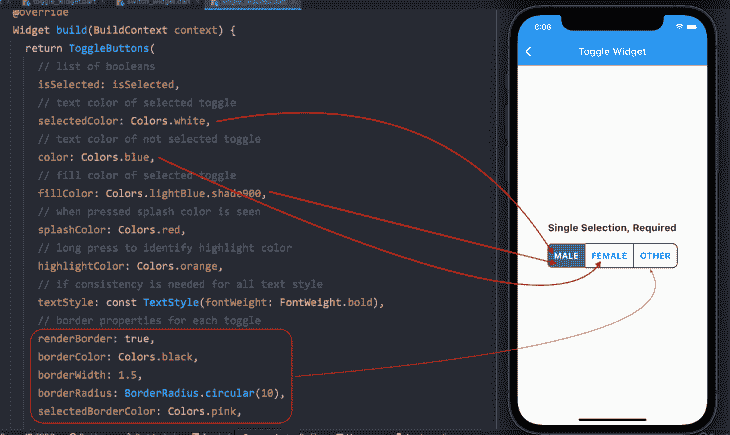

### 单一和必需的拨动开关

首先，我们必须初始化一个布尔变量列表:

```
// one must always be true, means selected.
List<bool> isSelected = [true, false, false];
```

因为我们强制系统总是选择至少一个选项，所以我们将一个值初始化为`true`。

我们已经讨论了定制切换小部件的其他属性。现在我们将子部件添加到它的`children`属性中。

*注意，您必须添加与布尔值列表相同数量的子部件。否则，它将抛出一个错误。*

```
// add widgets for which the users need to toggle
children: const [
  Padding(
    padding: EdgeInsets.symmetric(horizontal: 12),
    child: Text('MALE', style: TextStyle(fontSize: 18)),
  ),
  Padding(
    padding: EdgeInsets.symmetric(horizontal: 12),
    child: Text('FEMALE', style: TextStyle(fontSize: 18)),
  ),
  Padding(
    padding: EdgeInsets.symmetric(horizontal: 12),
    child: Text('OTHER', style: TextStyle(fontSize: 18)),
  ),
],
```

接下来，我们必须向`setState()`函数中的 toggle 小部件的`onPressed()`属性添加逻辑。

*   使用`for`循环，我们将遍历布尔值列表
*   使用`if`语句，我们将检查`index`值，并总是将其设置为`true`。其他按钮将被设置为`false`

    ```
    onPressed: (int newIndex) {   setState(() {     // looping through the list of booleans values     for (int index = 0; index < isSelected.length; index++) {       // checking for the index value       if (index == newIndex) {         // one button is always set to true         isSelected[index] = true;       } else {         // other two will be set to false and not selected         isSelected[index] = false;       }     }   }); },
    ```

这就是我们最终产品的样子。

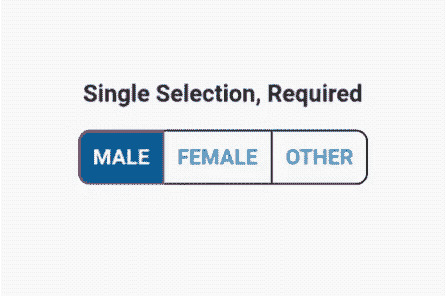

### 单个且不需要的拨动开关

我们只需要做两个改变就可以了。用户只能从三个选项中选择一个，但不要求必须选择它。

布尔变量列表中的值都被初始化为 false:

```
// all values are false
List<bool> isSelected = [false, false, false];
```

在`onPressed()`函数的`if`语句中，我们只在按钮之间切换，将其设置为`true`:

```
onPressed: (int newIndex) {
  setState(() {
    // looping through the list of booleans values
    for (int index = 0; index < isSelected.length; index++) {
      if (index == newIndex) {
        // toggling between the button to set it to true
        isSelected[index] = !isSelected[index];
      } else {
        // other two buttons will not be selected and are set to false
        isSelected[index] = false;
      }
    }
  });
},
```

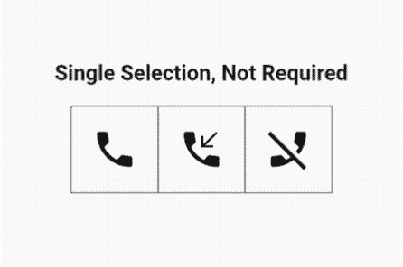

### 需要多项选择

如前所述，用户可以选择多个选项，但系统将始终保持至少一个选项处于选中状态。

是的，您猜对了，布尔列表中的一个值将是`true`:

```
List<bool> isSelected = [true, false, false];
```

在`onPressed`函数内部，事情变得有点有趣了。

首先，我们添加一个变量来循环遍历布尔列表，并确保值为 true 因此，至少会选择一个按钮:

```
final isOneSelected = isSelected.where((element) => element).length == 1;
```

如果只选择了一个按钮，用户不能将其切换到`false`，直到选择了另一个选项:

```
if (isOneSelected && isSelected[newIndex]) return;
```

接下来，在`setState()`函数中，我们再次遍历列表，检查新的索引值，并在新旧索引之间切换:

```
setState(() {
  // looping through the list of booleans
  for (int index = 0; index < isSelected.length; index++) {
    // checking for the index value
    if (index == newIndex) {
      // toggle between the old index and new index value
      isSelected[index] = !isSelected[index];
    }
  }
});
```

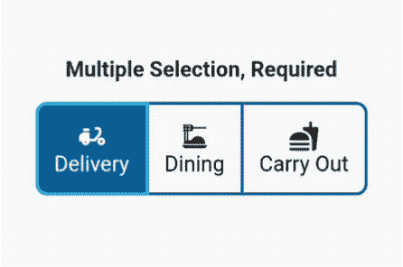

### 不需要的多项选择

这很简单。我做了一行你通常在任何文本编辑器中看到的文本编辑选项，用来格式化写好的文本。有四个选项，所以我们的列表中有四个值，并且都被设置为`false`:

```
List<bool> isSelected = [false, false, false, false];
```

在我们的`onPressed()`函数中，我们简单地在`true`和`false`值之间切换:

```
onPressed: (int index) {
  setState(() {
    // simply toggling buttons between true and false state
    isSelected[index] = !isSelected[index];
  });
```

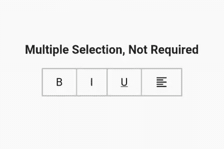

我们已经解释完了 switch 和 toggle 小部件以及如何以通常的方式使用它。现在，让我们通过创建一个定制的动画开关按钮来开始一点复杂的编程，在实现下一个代码集后，它看起来就像下面的图像。

## 创建自定义动画开关按钮

我们把这个按钮分成了两部分。第一个是无状态小部件，我将其命名为`CustomAnimatedSwitch`。在这个无状态小部件中，我们将创建自定义开关。稍后，我们将把它添加到有状态小部件中，以使用`setState()`函数来打开和关闭。

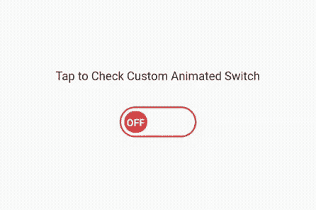

### 步骤 1:添加依赖关系

```
simple_animations: ^5.0.0+2
```

### 步骤 2:定义变量

首先，我们将使用一个枚举和一个布尔来定义我们的命名常量变量:

```
enum _CustomSwitchParams { paddingLeft, color, text, rotation }

final bool toggle;
```

第二，因为我们使用了简单的动画包和级联符号(双点操作符)，所以我们在我们创建的`MovieTween`对象上调用函数来访问它的属性。基本上，我们将动画添加到我们之前添加的枚举中:

```
var customTween = MovieTween()
  ..scene(duration: const Duration(seconds: 1))
      .tween(_CustomSwitchParams.paddingLeft, 0.0.tweenTo(60.0))
  ..scene(duration: const Duration(seconds: 1))
      .tween(_CustomSwitchParams.color, Colors.red.tweenTo(Colors.green))
  ..scene(duration: const Duration(milliseconds: 500))
      .tween(_CustomSwitchParams.text, ConstantTween('OFF'))
      .thenTween(_CustomSwitchParams.text, ConstantTween('ON'),
          duration: const Duration(milliseconds: 500))
  ..scene(duration: const Duration(seconds: 1))
      .tween(_CustomSwitchParams.rotation, (-2 * pi).tweenTo(0.0));
```

### 第三步:`CustomAnimationBuilder`

接下来，我们将构建我们的`CustomAnimationBuilder`小部件，并定义其所需的属性来组装开关动画:

```
CustomAnimationBuilder<Movie>(
   // control of the animation
   control: toggle ? Control.play : Control.playReverse,
   // the relative position where animation will start
   startPosition: toggle ? 1.0 : 0.0,
   // define unique key
   key: const Key('0'),
   duration: customTween.duration * 1.2,
   // movie tween object
   tween: customTween,
   curve: Curves.easeInOut,
   builder: (context, value, child) {
     return Container(
       decoration:
           _outerDecoration(color: value.get(_CustomSwitchParams.color)),
       width: 100.0,
       height: 40.0,
       padding: const EdgeInsets.all(4.0),
       child: Stack(
         children: [
           Positioned(
             child: Padding(
               padding: EdgeInsets.only(
                 left: value.get(_CustomSwitchParams.paddingLeft),
               ),
               child: Transform.rotate(
                 angle: value.get(_CustomSwitchParams.rotation),
                 child: Container(
                   decoration: _innerDecoration(
                     color: value.get(_CustomSwitchParams.color),
                   ),
                   width: 30.0,
                   child: Center(
                     child: Text(
                       value.get(_CustomSwitchParams.text),
                       style: const TextStyle(
                           height: 1.5,
                           fontSize: 12,
                           fontWeight: FontWeight.bold,
                           color: Colors.white),
                     ),
                   ),
                 ),
               ),
             ),
           ),
         ],
       ),
     );
   },
 );
}
```

### 第 4 步:`CustomSwitchButton`(有状态小部件)

到了创建自定义开关按钮的第二部分，我们必须添加另一个包含有状态小部件的 Dart 文件，我们称之为`CustomSwitchButton`。

首先，定义一个布尔变量，并将其值设置为`false`:

```
bool _switched = false;
```

其次，用`setState()`函数创建一个方法，在`true`和`false`之间切换:

```
void toggleSwitch() {
  setState(() {
    _switched = !_switched;
  });
}
```

最后，我们将我们的`CustomAnimatedSwitch`添加到这个用`GestureDetector`包装的 Dart 文件中，将`toggleSwitch`方法添加到`onTap()`函数中。

就是这样！我们有我们的全功能，定制，动画开关按钮。请查看下面的代码和图片:

```
@override
 Widget build(BuildContext context) {
   return Scaffold(
     appBar: AppBar(
       title: const Text('Custom Animated Switch'),
     ),
     body: GestureDetector(
       onTap: toggleSwitch,
       child: Center(
         child: Column(
           crossAxisAlignment: CrossAxisAlignment.center,
           mainAxisAlignment: MainAxisAlignment.center,
           children: [
             const Padding(
               padding: EdgeInsets.all(10.0),
               child: Text('Tap to Check Custom Animated Switch'),
             ),
             const SizedBox(
               height: 20.0,
             ),
             CustomAnimatedSwitch(toggle: _switched),
           ],
         ),
       ),
     ),
   );
 }
}
```

## 用于开关和触发器的流行颤振包

如果你不想创建你自己的开关按钮，你可以使用下面的任何一个包，和我们做的完全一样，来制作我们自己的自定义动画开关。

1.  `[AnimatedToggleSwitch](https://pub.dev/packages/animated_toggle_switch)`:简单而生动的切换开关，可进行多种选择。如果你不想使用下拉菜单
    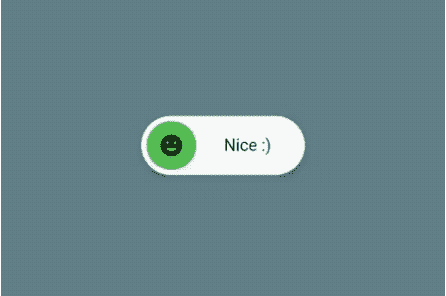，这是一个很好的选择
2.  `[FlutterSwitch](https://pub.dev/packages/flutter_switch)`:为 Flutter 打造的易于实现的定制开关。给它一个自定义的高度和宽度，开关和切换的边界，边界半径，颜色，切换大小，选择显示一个**在**和**关闭**文本，并能够在切换内添加一个图标
3.  一个简单的拨动开关部件。它可以完全定制所需的图标，宽度，颜色，文本，圆角半径，动画等。它还保持选择状态

我留下了整个项目的[链接，你可以在我的 GitHub 页面上找到。如果有任何问题，或者你可以改善代码，让我知道，我会给你我的项目访问权。](https://github.com/timelessfusionapps/toggle_switch_app)

非常感谢，注意安全！

## 使用 [LogRocket](https://lp.logrocket.com/blg/signup) 消除传统错误报告的干扰

[](https://lp.logrocket.com/blg/signup)

[LogRocket](https://lp.logrocket.com/blg/signup) 是一个数字体验分析解决方案，它可以保护您免受数百个假阳性错误警报的影响，只针对几个真正重要的项目。LogRocket 会告诉您应用程序中实际影响用户的最具影响力的 bug 和 UX 问题。

然后，使用具有深层技术遥测的会话重放来确切地查看用户看到了什么以及是什么导致了问题，就像你在他们身后看一样。

LogRocket 自动聚合客户端错误、JS 异常、前端性能指标和用户交互。然后 LogRocket 使用机器学习来告诉你哪些问题正在影响大多数用户，并提供你需要修复它的上下文。

关注重要的 bug—[今天就试试 LogRocket】。](https://lp.logrocket.com/blg/signup-issue-free)