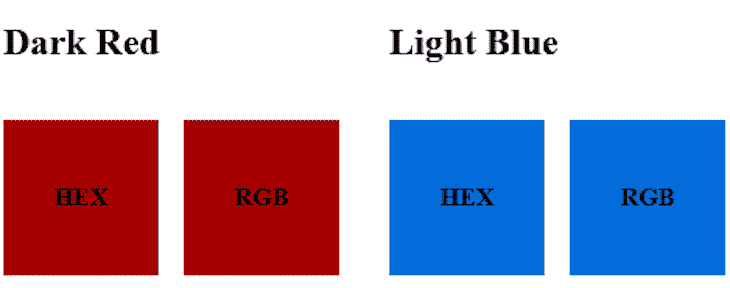
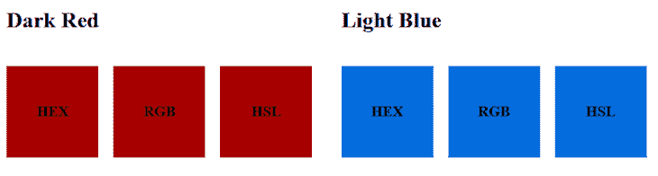
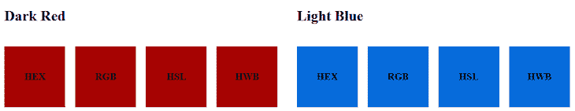
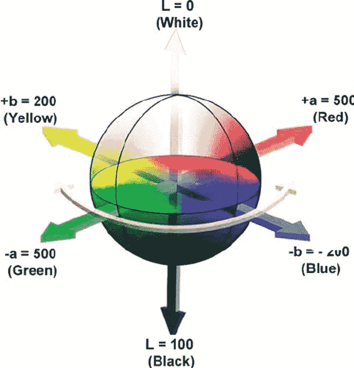
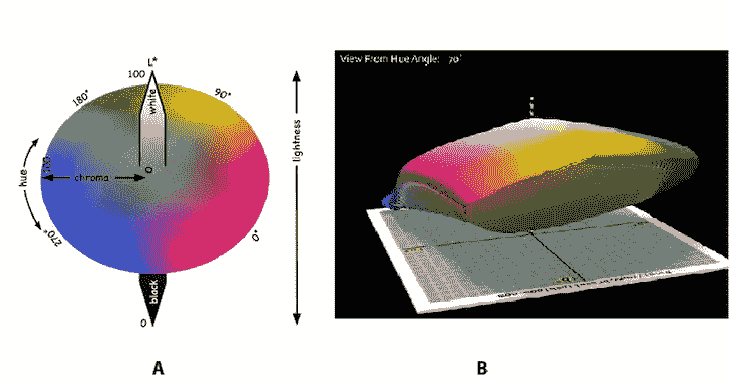

# 在 CSS 中设置颜色的高级指南

> 原文：<https://blog.logrocket.com/advanced-guide-setting-colors-css/>

在学习 CSS 时，颜色是你作为一名 web 开发人员首先要学习应用的东西之一，但是一旦你学会了基础知识，你多久会重温一次呢？

借助高级技术，通过 CSS 应用颜色可以为项目提供更多功能和深度。在这篇文章中，我们将探索 CSS 应用颜色的所有常见和更高级的方法，包括一些令人兴奋的方法，这些方法有望很快在 CSS 中被广泛采用。

## CSS 中的基本颜色语法

我们不能在不涉及每个人开始 CSS 之旅的基础知识的情况下谈论[在 CSS](https://blog.logrocket.com/colors-in-css-present-and-future/) 中应用颜色:关键字和十六进制。

### 关键词

通常，新开发人员学习在 CSS 中应用颜色的第一个方法是使用 CSS 中预定义的颜色关键字列表。这些是一系列等同于应用于元素的颜色的词:

```
.SomeElement {
  color: blue;
  background-color: black;
}

```

你可以使用相当多的预定义单词。如果你有兴趣看到它们，你可以在 MDN 的彩色页面上查看这一部分。

### 十六进制值

在你的 CSS 旅程中的某一点上，开发人员很自然地会超越 CSS 中可用的预定义单词，需要更强大的东西。通常，CSS 颜色之旅的下一步是理解十六进制值，也称为十六进制值。

十六进制值很棒，因为它们受到所有主流浏览器的支持，并且比独立的关键字提供了更多的灵活性和可定制性。

然而，十六进制值的一个主要缺点是它们不容易阅读或理解。例如，你能猜出`#ff8c00`是什么颜色吗？没错，是亮橙色…

除了难以理解之外，他们也很难共事。如果不使用颜色选择器或某种向导，在没有完全理解十六进制数字系统如何工作的情况下，很难使十六进制值变暗或变亮。

而且，即使你有这些辅助手段，也不像只调整一个参数那样简单或直观。

以下是其他一些十六进制颜色的例子:

```
.SomeElement {
  color: #ffffff; /* White */
  background-color:#ff8c00; /* Orange-y color from before */
}

```

## 了解 RGB 和 HSL

既然我们已经介绍了在网络上定义颜色的基础知识，让我们来看看两个更高级但更灵活和可用的替代方法:RGB 和 HSL。

## RGB

红色、绿色和蓝色，或 RGB，让我们可以访问与十六进制相同的颜色，但格式更加易读和用户友好。我们在 CSS 中使用了一个`rgb()`函数来定义颜色，稍后我们会看到一些例子。

通过使用传递给函数的三个参数，我们可以创建颜色；然而，请注意，这些颜色是相加的，这意味着我们添加的红色、绿色和蓝色越多，整体颜色就越浅。

如果我们将这三个值都设置得尽可能高(到 255)，那么我们最终会得到白色；如果我们将三者都设为 0，那么我们得到黑色:

```
background-color: rgb(255,255,255); /* White */

```

使用 RGB 比十六进制更符合逻辑，同时仍然提供相同的色彩空间。以下是一些显示十六进制后跟相同 RGB 值的示例来说明这一点:

```
/* Dark Red */
#a60000;
rgb(166,0,0);

/* Light Blue */
#046cdb
rgb(4, 108, 219);

```



虽然可能不清楚 RGB 会产生什么，但它比十六进制可读性强得多。在对颜色进行小的改变时，RGB 比 HEX 好得多。

例如，如果你想给一个十六进制颜色添加更多的红色，你知道要改变什么吗？但是，对于 RGB，您只需将红色值增加 1 或 2 即可实现这一点。

### high-speedlaunch 高速快艇

虽然 RGB 很好，并且是从 HEX 向正确方向迈出的一步，但当谈到“你能为我把这个调暗 30%吗？”这个问题时，它仍然有它的陷阱

从上面取一个 RGB 值，尝试在没有辅助的情况下使其中一种颜色暗 30%。虽然您可能会比使用十六进制更快，但它仍然远非理想，因为 RGB 值不会直接映射到亮度值。

要使颜色变深，您需要试验所有三个值以获得想要的结果。但是，这就是美妙的色调、饱和度和亮度(HSL)的来源。

作为一名开发人员，HSL 是一个梦想，因为它提供了一种更符合逻辑的方法来处理和操纵颜色，因为它使用参数来调整颜色属性。

然而，当使用 HSL 时，有一个更陡峭的学习曲线，因为不像 RGB，我们处理我们已经知道的颜色(红色，蓝色和绿色)，HSL 需要我们学习一些颜色科学，如颜色的色调和饱和度。

现在让我们看一下用 HSL 的三个主要参数定义颜色，以便更好地理解这种配色方案是如何工作的。

*   `hue`参数代表色轮上的位置，范围从`0`到`360deg`
*   `saturation`参数代表颜色的饱和度，范围从`0`到`100%`
*   `lightness`参数代表颜色的亮度，范围从`0`到`100%`

请注意，如果您将亮度设置为`0`，而不考虑其他参数，您将获得黑色，如果您将其设置为`100%`，您将获得白色。

[下图](https://www.researchgate.net/publication/335024102/figure/fig2/AS:789313210036225@1565198342617/a-Color-wheel-of-hue-b-The-HSL-model-Creative-Commons.ppm)显示了 HSL 色彩空间，以及如何使用上述三个参数对其进行操作。


以下是我们之前用十六进制和 RGB 定义的相同颜色，但现在使用了它们对应的 HSL 值:

```
/* Dark Red */
#a60000;
rgb(166,0,0);
hsl(0°, 100%, 33%);

/* Light Blue */
#046cdb
rgb(4, 108, 219);
hsl(211°, 96%, 44%);

```



一旦你理解了 HSL 背后的颜色科学，并且能够操作它的三个属性，使用 HSL 就变得比 RGB 灵活多了。

有了 HSL，您可以轻松地改变颜色的亮度，而无需在线工具的帮助。例如，假设窗体上有一个处于禁用状态的按钮。使用 HSL，您可以通过简单地降低亮度参数来实现效果，从而使禁用状态变得更暗。

另一方面，对于 RGB，你要么需要试验这些值，要么使用在线工具来帮助，这都不是一个有效的过程。

### 将 alpha 通道与 HSL 和 RGB 一起使用

关于 HSL 和 RGB 要提到的最后一点是，你现在可以传递一个可选的第四个参数来控制 alpha 通道；通俗地说，我们在控制颜色的透明度。这里有一些使用它的例子:

```
hsl(211° 96% 44% / .5); /* 50% opacity */
hsl(0° 100% 33% / .25); /* 25% opacity */

rgb(166 0 0 / 0.7); /* 70% opacity */
rgb(4 108 219 / 0.3); /* 30% opacity */

```

眼尖的人可能也会注意到上面的语法有些不同:没错，没有逗号。多亏了 [CSS 颜色模块级别 4](https://www.w3.org/TR/css-color-4) ，你现在可以使用空格来分隔值，并传递一个可选的第四个参数，前面加一个`/`来控制 alpha 通道。

## 使用高级色彩空间

在讨论了 CSS 中定义颜色的最常见的方法之后，让我们来看看一些更具实验性的定义颜色的方法，它们很可能是 CSS 中定义颜色的未来。

这些目前被认为是试验性的，因为在写这篇文章的时候它们的浏览器支持有限。

### HWB

色调、白度和黑度(HWB)与 HSL 相似。`hue`参数可以设置在从`0`到`360deg`的任何位置，但是，与 HSL 不同，我们可以通过控制添加到我们选择的原始色调中的白色或黑色的数量来控制饱和度和亮度。

尝试通过下面的代码笔混合 HWB 颜色。请注意，HWB 只能在 [Safari 浏览器](https://caniuse.com/?search=hwb)或 Firefox 开发者浏览器中看到:

参见 [CodePen](https://codepen.io) 上 Coner Murphy([@ Coner Murphy](https://codepen.io/conermurphy))
的笔[HWB 彩色游乐场](https://codepen.io/conermurphy/pen/bGoOWzJ)。

但是，为什么使用 HWB 而不是像 HSL 这样的东西呢？HSL 可以提供更细粒度的控制，因为它允许你调整颜色的饱和度。嗯，设计 HWB 的原因是为了让人类使用起来更直观，比其他方法计算起来更快。

用 HWB，如果想要颜色浅一点的，加白色；如果你想要更深的颜色，加入黑色。没有比这更简单的了。

以下是我们之前的例子，但增加了 HWB:

```
/* Dark Red */
#a60000;
rgb(166 0 0);
hsl(0 100% 33%);
hwb(0 0% 35%);

/* Light Blue */
#046cdb
rgb(4 108 219);
hsl(211 96% 44%);
hwb(211 2% 14%);

```



### 实验室

LAB 和 LCH(我们稍后会谈到)都被定义为与设备无关的颜色，这意味着无论在哪里应用颜色坐标，都会得到相同的颜色输出。

如果你把一个实验室值应用到不同的媒介上，从网站到数字艺术，再到物理印刷的东西，颜色会保持不变。这种一致性是实验室和 LCH 色彩空间的主要优势之一。

要使用 LAB，需要传入三个参数:`L`、`A`和`B`。

亮度(`L`)参数与本文中讨论的其他参数类似，接受 0 到 100 之间的百分比，其中`0%`为黑色，`100%`为白色。

然而，与我们讨论的其他方法不同，LAB 使用 a 轴(`A`)和 b 轴(`B`)参数来定义颜色。

`a`参数表示在 LAB 色彩空间中沿着 a 轴你想要在绿色和红色之间走多远。类似地，`b`参数表示在 LAB 色彩空间中，您希望在蓝色和黄色之间沿着 b 轴走多远。

从概念上讲，LAB 是更难理解的颜色空间之一，因为它在空间中移动，而不是线性数字。因此，这里有一个色彩空间的[视觉表示，显示这些值如何一起工作来创建一种颜色。](https://www.researchgate.net/profile/Sudhir-Shukla-3/publication/23789543/figure/fig3/AS:276894424551429@1443028183655/The-cubical-CIE-Lab-color-space.png)



此外，这是另一支笔，用于显示正在使用的 LAB colorspace，但只能在 Safari 浏览器中看到。

参见 [CodePen](https://codepen.io) 上 Coner Murphy([@ Coner Murphy](https://codepen.io/conermurphy))
的笔 [LAB Color Playground](https://codepen.io/conermurphy/pen/GRMPEyb) 。

以下是我们之前的示例，但添加了实验室:

```
/* Dark Red */
#a60000;
rgb(166 0 0);
hsl(0 100% 33%);
hwb(0 0% 35%);
lab(34% 58 48);

/* Light Blue */
#046cdb
rgb(4 108 219);
hsl(211 96% 44%);
hwb(211 2% 14%);
lab(46% 17 -63);

```

[如果您使用的是 Safari](https://caniuse.com/?search=LAB) ，您可以在下面的代码笔中查看 LAB 颜色渲染。

参见 Coner Murphy([@ Coner Murphy](https://codepen.io/conermurphy))[CodePen](https://codepen.io)上的 Pen [CSS 颜色值](https://codepen.io/conermurphy/pen/NWaejjE)。

组织郎格罕细胞增生症

### 最后的色彩空间和 CSS 中定义颜色的方法是亮度、色度和色调(LCH)。

同样，与使用亮度值的其他颜色函数类似，亮度参数接受 0 到 100 之间的百分比，其中`0%`为黑色，`100%`为白色。

然而，LCH 引入了色度，它表示我们想要使用的颜色量；从概念上讲，它类似于 HSL 中的饱和度，但色度在理论上是无限的。

然而，在兴奋之前，虽然色度理论上是无限的，但不幸的是，我们的浏览器和显示器可以显示的颜色是有限的。因此，超过某个点(大约在`230`)后，您选择的值不太可能对用户产生任何明显的影响。

最后，与 HSL 一样，色调可以用从色轮上的位置驱动的值从`0`到`360`来表示。

为什么我们需要高级色彩空间？

## 在这一点上，你可能会问为什么我们需要像 LAB 和 LCH 的 CSS 颜色空间；HSL 怎么了？随着实验室和 LCH 的引入，开发人员现在可以访问人类可以感知的所有颜色，而 HSL(或其他人)则不能。

然而，另一方面是语法和支持的问题。LAB 和 LCH 的语法不太直观，目前只有很少的浏览器支持(仅 Safari)，所以您需要暂时在另一个更广泛支持的方法中给出一个后备值。

但是，一旦该语法在其他浏览器中得到更多支持，LAB 和 LCH 都是在 CSS 中指定颜色的强大选项。

与 LAB 一样，LCH 也是另一个需要掌握的棘手的颜色空间，所以这里是另一个显示 LCH 颜色空间的[图，以及参数如何影响我们得到的颜色。](https://www.researchgate.net/profile/Malgorzata-Perz/publication/265155524/figure/fig18/AS:295878511349770@1447554342906/A-Simplified-LCh-color-space-B-LCh-color-space.png)



在 HWB、实验室和 LCH 使用阿尔法频道

### 最后，与 CSS 中的其他颜色函数一样，`hwb()`、`lab()`和`lch()`可以采用第四个可选参数来控制 alpha 通道:

以下是我们之前的例子，但增加了 LCH:

```
hwb(0 0% 35% / .5);
lab(34% 58 48 / .24);
lch(34% 75 39 / .9);

```

如果您使用的是 Safari，您可以查看在下面的代码笔中渲染的 LCH 颜色。

```
/* Dark Red */
#a60000;
rgb(166 0 0);
hsl(0 100% 33%);
hwb(0 0% 35%);
lab(34% 58 48);
lch(34% 75 39);

/* Light Blue */
#046cdb
rgb(4 108 219);
hsl(211 96% 44%);
hwb(211 2% 14%);
lab(46% 17 -63);
lch(46% 65 285);

```

参见 Coner Murphy([@ Coner Murphy](https://codepen.io/conermurphy))[CodePen](https://codepen.io)上的 Pen [CSS 颜色值](https://codepen.io/conermurphy/pen/NWaejjE)。

浏览器支持

我们首先看到的定义颜色的四种方法(关键字、十六进制、RGB 和 HSL)都在主流浏览器中得到广泛支持，所以您不必担心使用它们，也不必担心它们是否有效。

## 但是，我们在本文后半部分看到的定义颜色的方法(HWB、实验室和 LCH)仍然处于支持的早期阶段，所以如果您使用它们，为了安全起见，请在上面提到的四种方法之一中定义一个后备值。

如果你想了解浏览器对个别方法的支持，下面是[can use](https://caniuse.com)上每个页面的链接:

结论

所以，就这样了！在这篇文章中，我们讨论了在 CSS 中设置颜色的每一种方法，包括一些在 CSS 中得到广泛支持的令人兴奋的新方法，以及为什么和如何在你的下一个项目中使用每种方法。

## 我希望这篇关于在 CSS 中设置颜色的文章对你有所帮助。如果你这样做了，[请考虑在 Twitter](https://twitter.com/MrConerMurphy) 上关注我，在那里我发布了关于 JavaScript 生态系统和整个 web 开发的有用且可行的技巧和内容。或者，如果 Twitter 不是你的菜，[访问我的博客](https://conermurphy.com/blog)获取更多我的内容。

你的前端是否占用了用户的 CPU？

随着 web 前端变得越来越复杂，资源贪婪的特性对浏览器的要求越来越高。如果您对监控和跟踪生产环境中所有用户的客户端 CPU 使用、内存使用等感兴趣，

## .

LogRocket 就像是网络和移动应用的 DVR，记录你的网络应用或网站上发生的一切。您可以汇总和报告关键的前端性能指标，重放用户会话和应用程序状态，记录网络请求，并自动显示所有错误，而不是猜测问题发生的原因。

[try LogRocket](https://lp.logrocket.com/blg/css-signup)

现代化您调试 web 和移动应用的方式— [开始免费监控](https://lp.logrocket.com/blg/css-signup)。

[](https://lp.logrocket.com/blg/css-signup)[https://logrocket.com/signup/](https://lp.logrocket.com/blg/css-signup)

[LogRocket](https://lp.logrocket.com/blg/css-signup) is like a DVR for web and mobile apps, recording everything that happens in your web app or site. Instead of guessing why problems happen, you can aggregate and report on key frontend performance metrics, replay user sessions along with application state, log network requests, and automatically surface all errors.

Modernize how you debug web and mobile apps — [Start monitoring for free](https://lp.logrocket.com/blg/css-signup).