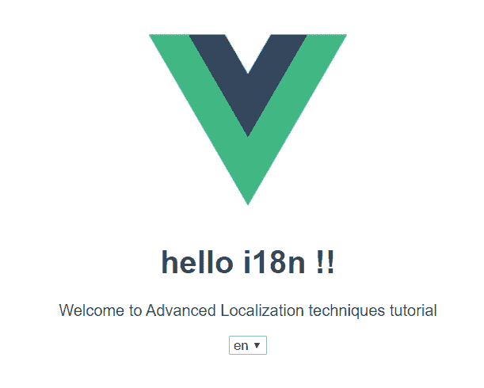
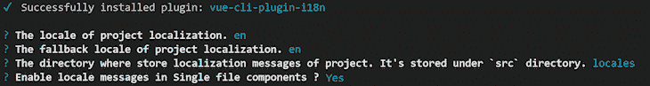

# Vue.js 中的本地化与 vue-i18n 

> 原文：<https://blog.logrocket.com/advanced-localization-techniques-vue-js/>

国际化和本地化是让您的 web 应用程序更容易被更广泛的受众访问并提供更好的用户体验的好方法。特别是对企业来说，本地化有助于加强全球影响力，从而创造更大的收入潜力。

在本教程中，我们将向您展示如何使用 [Vue I18n](https://kazupon.github.io/vue-i18n/) 在您的 Vue.js 应用中实现本地化、国际化和翻译。

## 正在设置

让我们使用 CLI 创建一个 Vue 应用程序。

```
vue create localization-app
```

选择`vue-router`和`vuex`，因为我们稍后会用到它们。

创建项目后，让我们添加我们的翻译库，`vue-i18n`。为此，我们还有一个 Vue CLI 包，因此我们可以简单地运行以下命令:

```
cd localization-app
vue add i18n
```



因为我们安装了`vue-i18n`包，它会自动完成所有需要的设置。它还创建了一个`locale`文件夹，将`en.json`作为我们的默认语言文件。

```
//en.json
{
  "hello": "hello i18n !!",
  "welcomeMessage": "Welcome to Advanced Localization techniques tutorial"
}
```

让我们在法语翻译目录中再创建一个文件`fr.json`，并添加以下代码:

```
//fr.json
{
  "hello": "Bonjour i18n !!",
  "welcomeMessage": "Bienvenue dans le didacticiel sur les techniques de localisation avancées"
}
```

要在我们的组件中使用它，请打开`App.vue`。这里有一些默认代码，其中的`msg`被传递给了`<hello-world>`组件。让我们编辑如下:

```
<template>
  <div id="app">
    
    <HelloWorld :msg="$t('hello')" />
  </div>
</template>
```

在`HelloWorld.vue`文件中，让我们删除一些代码，保留最少的学习代码:

```
<template>
  <div class="hello">
    <h1>{{ msg }}</h1>
    <p>
      {{ $t('welcomeMessage') }}
    </p>
    <div class="lang-dropdown">
      <select v-model="$i18n.locale">
        <option
          v-for="(lang, i) in languageArray"
          :key="`lang${i}`"
          :value="lang"
        >
          {{ lang }}
        </option>
      </select>
    </div>
  </div>
</template>
<script>
export default {
  data() {
    languageArray: ['en', 'fr']
  }
}
</script>
```

最后，将根目录中的`i18n.js`文件移到插件目录中，以获得更好的结构。当您运行该应用程序时，您会看到英文版的`Hello i18n`。由于我们没有设置任何首选项，它采用了回退语言。



## 目录结构

我们可以在`locales`文件夹中有不同语言的单独的`json`文件。

```
src
|--plugins
|  |--i18n.js
|--locales
|  |--formats
|  |--en.json
|  |--fr.json
|  |--zh.json
|  |--de.json
      .
      .
```

## 直接在 Vue 组件文件中翻译

```
<i18n>
  {
    "en": {
      "welcome": "Welcome!"
    },
    "fr": {
      "welcome": "Bienvenue"
    }
  }
</i18n>
```

我们可以在自己的组件中进行特定于组件的翻译。虽然这看起来很好地隔离了其他地区，但是弊大于利。它适用于翻译较少的小应用程序，但随着应用程序开始变大，我们很快就会遇到问题，比如:

1.  你最终会重复努力。例如，文本`Welcome`可能会在多个地方使用(登录屏幕、商店页面等。)，并且您必须为每个组件编写相同的翻译
2.  随着翻译和语言数量的增加，组件开始变得又大又丑。
3.  一般开发人员不管理翻译；可能有一个语言翻译团队，只有很少的编码经验。他们几乎不可能弄清楚更新翻译的组件和语法。
4.  您不能在不同的组件之间共享语言环境。

我个人更喜欢对小型和大型应用程序使用`.json`文件，因为它更容易维护。

## 使用浏览器的默认语言

我们现在使用英语作为默认语言。如果有人的浏览器语言设置为法语，也看到英文网站，他们必须使用下拉菜单手动更改语言。为了更好的用户体验，应用程序应该根据浏览器的默认语言自动改变它的语言。让我们看看这是如何做到的。

在`i18n.js`文件中，让我们将`navigator.language`(浏览器的默认语言)赋给`locale`。浏览器通常会在默认语言前加上前缀，如`en-US`或`en-GB`。我们的设置只需要第一部分，因此我们使用`navigator.language.split('-')[0]`:

```
// plugins/i18n.js
export default new VueI18n({
  locale:
    navigator.language.split('-')[0] || process.env.VUE_APP_I18N_LOCALE || 'en',
  fallbackLocale: process.env.VUE_APP_I18N_FALLBACK_LOCALE || 'en',
  messages: loadLocaleMessages()
})
```

但是假设我们在同一种语言中有特定于地区的修改。我们通常遵循命名惯例，在语言后面加上地区后缀(例如，`en-US.json`、`en-GB.json`)。为了获得该地区的正确语言，我们需要比以前多做一些操作:

```
function checkDefaultLanguage() {
  let matched = null
  let languages = Object.getOwnPropertyNames(loadLocaleMessages())
  languages.forEach(lang => {
    if (lang === navigator.language) {
      matched = lang
    }
  })
  if (!matched) {
    languages.forEach(lang => {
      let languagePartials = navigator.language.split('-')[0]
      if (lang === languagePartials) {
        matched = lang
      }
    })
  }
  return matched
}
export default new VueI18n({
  locale: checkDefaultLanguage() || process.env.VUE_APP_I18N_LOCALE || 'en',
  fallbackLocale: process.env.VUE_APP_I18N_FALLBACK_LOCALE || 'en',
  messages: loadLocaleMessages()
})
```

默认情况下，`loadLocaleMessages()`方法已经可用；我们使用相同的方法提取我们的`json`文件的文件名。在这里，我们得到`['en-GB', en-US', 'fr']`。然后我们编写一个名为`checkDefaultlanguage()`的方法，首先尝试匹配全名。如果不可用，那么我们只匹配前两个字母。太好了，这个管用！

让我们考虑另一种情况。说我们默认语言是`fr`，浏览器语言是`en-IN`。`en-IN`不在我们的语言列表中，但是显示法语(默认语言)没有多大意义，因为我们有来自其他地区的英语。虽然不完全一样，但这仍然比展示一种完全不同的语言要好。我们需要再一次修改我们的代码来适应这个场景。

```
function checkDefaultLanguage() {
  let matched = null
  let languages = Object.getOwnPropertyNames(loadLocaleMessages())
  languages.forEach(lang => {
    if (lang === navigator.language) {
      matched = lang
    }
  })
  if (!matched) {
    languages.forEach(lang => {
      let languagePartials = navigator.language.split('-')[0]
      if (lang === languagePartials) {
        matched = lang
      }
    })
  }
  if (!matched) {
    languages.forEach(lang => {
      let languagePartials = navigator.language.split('-')[0]
      if (lang.split('-')[0] === languagePartials) {
        matched = lang
      }
    })
  }
  return matched
}
export const selectedLocale =
  checkDefaultLanguage() || process.env.VUE_APP_I18N_LOCALE || 'en'
export const languages = Object.getOwnPropertyNames(loadLocaleMessages())
export default new VueI18n({
  locale: selectedLocale,
  fallbackLocale: process.env.VUE_APP_I18N_FALLBACK_LOCALE || 'en',
  messages: loadLocaleMessages()
})
```

这里我们将两个字符串(即浏览器默认文件名和 JSON 文件名)分开，最后将`en-IN`与`en-GB`匹配，这比显示法语好得多。我还导出了一些常量，我们稍后会用到。

## 持续的语言偏好

现在，让我们使用我们创建的下拉菜单手动将语言更改为法语。这些文本被翻译成法语。现在刷新页面或关闭选项卡并重新打开它。语言再次重置为英语！

这不利于良好的用户体验。我们需要存储用户的偏好，并在每次使用应用程序时使用它。我们可以使用`localStorage`，每次都保存和获取，或者我们可以使用 Vuex 和`vuex-persistedstate`插件来完成。

让我们用 Vuex 的方式。首先我们需要安装插件:

```
npm install --save vuex-persistedstate

//store/index.js
import Vue from 'vue'
import Vuex from 'vuex'
import createPersistedState from 'vuex-persistedstate'
import i18n, { selectedLocale } from '@/plugins/i18n'
Vue.use(Vuex)
export default new Vuex.Store({
  state: {
    locale: selectedLocale
  },
  mutations: {
    updateLocale(state, newLocale) {
      state.locale = newLocale
    }
  },
  actions: {
    changeLocale({ commit }, newLocale) {
      i18n.locale = newLocale // important!
      commit('updateLocale', newLocale)
    }
  },
  plugins: [createPersistedState()]
})
```

不使用组件状态，让我们使用`Vuex`来存储和变异语言中的变化。`vuex-persistedstate`插件将把`locale`变量存储在`localStorage`中。当它被设置时，每次页面重新加载时，它都从`localStorage`获取这些数据。

现在我们需要将这些数据链接到我们的语言选择下拉列表。

```
<template>
  <div class="lang-dropdown">
    <select v-model="lang">
      <option
        v-for="(lang, i) in languageArray"
        :key="`lang${i}`"
        :value="lang"
      >
        {{ lang }}
      </option>
    </select>
  </div>
</template>
<script>
import { languages } from '@/plugins/i18n'
export default {
  data() {
    return {
      languageArray: languages
    }
  },
  computed: {
    lang: {
      get: function() {
        return this.$store.state.locale
      },
      set: function(newVal) {
        this.$store.dispatch('changeLocale', newVal)
      }
    }
  }
}
</script>
```

我们现在从`i18n.js`文件导入语言列表，而不是硬编码语言列表(我们之前已经导出了这个列表)。更改语言并重新加载页面——我们可以看到站点加载了首选语言。太好了！

## 日期/时间本地化

不同的国家和地区有不同的时间格式，当然，日期和月份的名称是用他们的母语书写的。为了本地化日期和时间，我们需要在初始化`vue-i18n`时传递另一个参数`dateTimeFormats`。

* * *

### 更多来自 LogRocket 的精彩文章:

* * *

在内部，图书馆使用 [ECMA-402 国际机场。DateTimeFormat](http://www.ecma-international.org/ecma-402/2.0/#sec-intl-datetimeformat-constructor) ，因此我们需要以相同的标准编写我们的格式才能工作。在`src/locales/formats`中创建一个文件`dateTimeFormats.js`:

```
//locales/formats/dateTimeFormats.js
export const dateTimeFormats = {
  fr: {
    short: {
      day: 'numeric',
      month: 'short',
      year: 'numeric'
    },
    long: {
      weekday: 'short',
      day: 'numeric',
      month: 'short',
      year: 'numeric',
      hour: 'numeric',
      minute: 'numeric',
      hour12: true
    }
  },
  'en-US': {
    short: {
      year: 'numeric',
      month: 'short',
      day: 'numeric'
    },
    long: {
      year: 'numeric',
      month: 'short',
      day: 'numeric',
      weekday: 'short',
      hour: 'numeric',
      minute: 'numeric'
    }
  }
}
```

如上图，我们只需要提一下`day`、`month`等项目就可以了。，库会根据所选的语言环境为我们完成所有的格式化和翻译工作。

## 重用翻译

随着应用程序开始增长，我们的本地化文件内容也开始增长。为了获得更好的可读性，我们需要根据应用程序基于`categories`或`components`在 JSON 文件中嵌套翻译。很快我们就会看到很多重复的消息，或者常见的词，比如*用户名*、*你好*，或者*点击这里*出现在很多组件中。

```
//en.json
{
 "homepage": {
    "hello": "hello i18n !!",
    "welcomeMessage": "Welcome to Advanced Localization techniques tutorial",
    "userName": "Username",
    "login": "Login"
  },
  "login": {
    "userName": "Enter Username",
    "password": "Enter Password",
    "login": "Login"
  },
  "forgotPassword": {
    "email": "Email",
    "continue": "Click to get recovery email",
    "submit": "Click to get Login"
  }
}
```

我们可以看到像`userName`和`login`这样的翻译已经开始重复了。如果我们需要更新一个文本，我们必须在所有地方更新它，这样它就可以在任何地方反映。在大中型应用程序中，我们在每个`JSON`文件中会有数千行翻译。如果我们在一个组件中使用不同嵌套对象的翻译，跟踪和调试就会变得困难。

我们应该根据`Category`来分组。即使这样，我们还是会遇到一些重复的。我们可以通过使用链接来重用一些翻译，如下所示:

```
//en.json
{
 "homepage": {
    "hello": "hello i18n !!",
    "welcomeMessage": "Welcome to Advanced Localization techniques tutorial",
    "userName": "Username",
    "login": "Login"
  },
  "login": {
    "userName": "Enter @:homepage.userName",
    "password": "Enter Password",
    "login": "@:homepage.login"
  },
  "forgotPassword": {
    "email": "Email",
    "continue": "Click to get recovery @:forgotPassword.email",
    "submit": "Click to get @:login.login"
  }
}
```

## 通过`vue-router`使用翻译

现在，我们不能仅仅通过看到 URL `localhost:8080`就知道网站是用哪种语言显示的。我们需要它显示类似于`localhost:8080/fr`的东西，即当用户打开根 URL `localhost:8080`时，我们需要将他们重定向到`localhost:8080/fr`。

此外，当用户使用下拉菜单将语言更改为英语时，我们需要将 URL 更新为`localhost:8080/en`。有多种方法可以做到这一点，但是因为我们已经使用 Vuex 来维护我们的 locale 状态，所以让我们使用它来实现这个特性。

让我们再创建一个名为`About.vue`的页面，并在那里添加一些内容。`/router/index.js`文件应该是这样的:

```
import Vue from 'vue'
import VueRouter from 'vue-router'
import Home from '@/views/Home.vue'
import App from '@/App.vue'
import { languages } from '@/plugins/i18n'
import store from '@/store'
import About from '@/views/About.vue'
Vue.use(VueRouter)
const routes = [
  {
    path: '/',
    name: 'root',
    beforeEnter(to, from, next) {
      next(store.state.locale)
    }
  },
  {
    path: '/:lang',
    component: App,
    beforeEnter(to, from, next) {
      let lang = to.params.lang
      if (languages.includes(lang)) {
        if (store.state.locale !== lang) {
          store.dispatch('changeLocale', lang)
        }
        return next()
      }
      return next({ path: store.state.locale })
    },
    children: [
      {
        path: '',
        name: 'home',
        component: Home
      },
      {
        path: 'about',
        name: 'about',
        component: About
      }
    ]
  }
]
const router = new VueRouter({
  mode: 'history',
  routes
})

export default router
```

我们首先通过传递当前的区域设置`next(store.state.locale)`，将我们收到的对根 URL ( `/`)的请求重定向到`/:lang`。

**案例 1** :手动将网址改为`localhost:8080/en-US`。由于我们的网站支持`en-US`，这将调用我们的商店操作，也将语言更改为英语。

**案例 2** :我们使用下拉菜单改变语言。这也应该更新网址。为此，我们需要在`App.vue`中观察我们的区域设置状态的变化。

```
export default {
  name: 'app',
  computed: mapState(['locale']),
  watch: {
    locale() {
      this.$router.replace({ params: { lang: this.locale } }).catch(() => {})
    }
  }
}
```

你可以在这里找到该项目的 [GitHub repo。](https://github.com/preetishhs/vue-localization-techniques)

## 我们做到了！

我们学习了一些在应用程序中设计本地化的高级方法。vue-i18n 文档也得到很好的维护，是学习 vue 中本地化所使用的特性和概念的重要资源。结合这两种技术，我们可以在我们的应用程序中构建可靠而有效的本地化，这样它就可以迎合更广泛的受众。

## 像用户一样体验您的 Vue 应用

调试 Vue.js 应用程序可能会很困难，尤其是当用户会话期间有几十个(如果不是几百个)突变时。如果您对监视和跟踪生产中所有用户的 Vue 突变感兴趣，

[try LogRocket](https://lp.logrocket.com/blg/vue-signup)

.

[](https://lp.logrocket.com/blg/vue-signup)[https://logrocket.com/signup/](https://lp.logrocket.com/blg/vue-signup)

LogRocket 就像是网络和移动应用程序的 DVR，记录你的 Vue 应用程序中发生的一切，包括网络请求、JavaScript 错误、性能问题等等。您可以汇总并报告问题发生时应用程序的状态，而不是猜测问题发生的原因。

LogRocket Vuex 插件将 Vuex 突变记录到 LogRocket 控制台，为您提供导致错误的环境，以及出现问题时应用程序的状态。

现代化您调试 Vue 应用的方式- [开始免费监控](https://lp.logrocket.com/blg/vue-signup)。