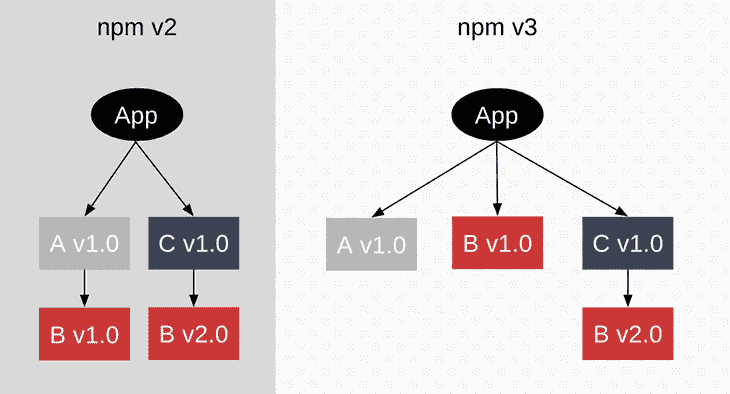
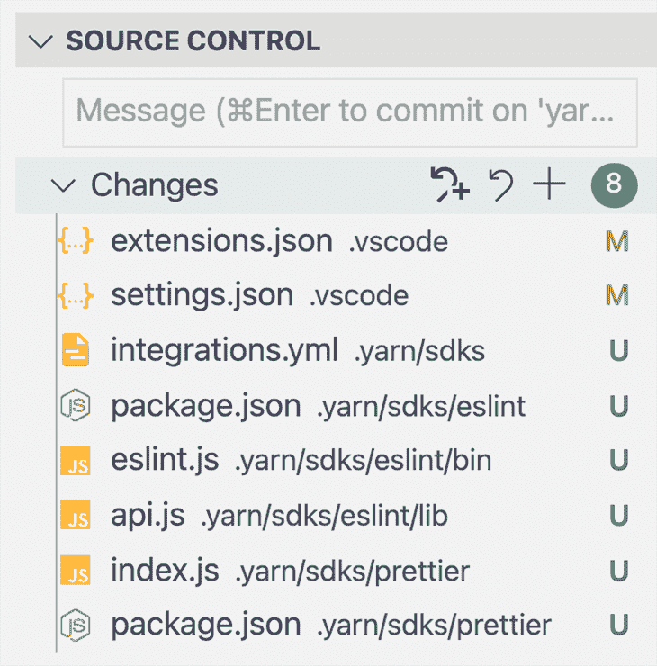
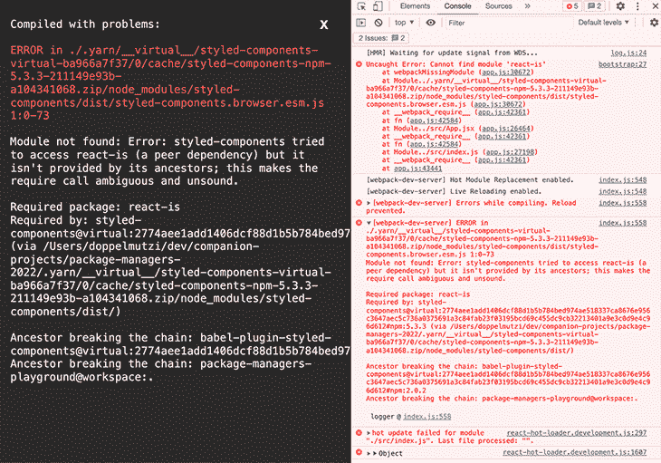
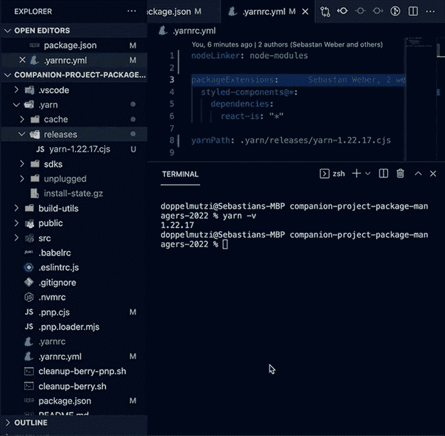
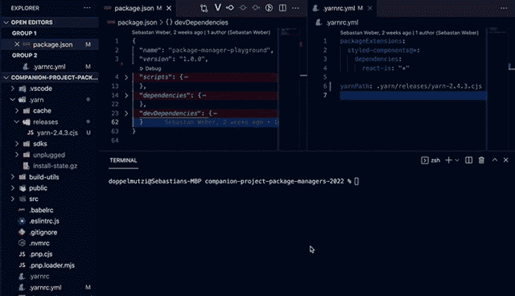
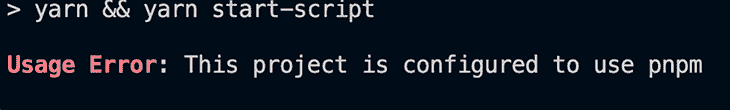
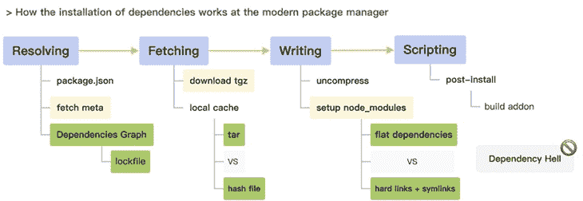

# npm、Yarn 和 pnpm 的高级包管理器特性

> 原文：<https://blog.logrocket.com/advanced-package-manager-features-npm-yarn-pnpm/>

本文旨在让您对包管理器在未来支持开发人员需求的方向有一个印象——比如让开发人员能够管理具有足够性能和良好 DX 的大型 monorepo 项目。

我在[的上一篇文章](https://blog.logrocket.com/javascript-package-managers-compared)中写过关于 npm、Yarn 和 pnpm 之间的依赖性解决策略的主题。虽然上一篇文章的重点是比较核心概念和结构，但本文将通过工作区介绍现代包管理器的高级特性，包括 monorepos。

本文的目标是传达 Yarn 和 pnpm 如何更紧密地致力于使开发人员能够通过工作区构建 monorepos，并提供更高级的方法来提高安全性和性能。我们将讨论以下内容，并在适用的情况下比较实施选项:

### 配套项目

本文涵盖了几个包管理器特性。因此，我在 GitHub 上创建了两个配套项目来提供示例:

1.  演示工作区功能的 [monorepo 项目](https://github.com/doppelmutzi/companion-project-mono-repo-2022)
2.  一个[单独的项目](https://github.com/doppelmutzi/companion-project-package-managers-2022)来演示不同的依赖解决策略

## 替代依赖性解决策略

当使用默认配置时，pnpm 和 Yarn Berry 不使用与 npm 和 Yarn Classic 相同的依赖关系解析算法，这涉及到展平`node_modules`文件夹。这些现代的包管理器试图与处理和存储依赖关系的传统方法分道扬镳。

其原因是需要创新的解决方法来应对现代软件项目的需求，现代软件项目越来越多地利用大量的依赖关系。传统策略在性能和磁盘空间效率方面已经达到了极限。

### 传统`node_modules`方法的问题

展平`node_modules`文件夹的传统依赖性解决策略导致[几个](https://medium.com/pnpm/why-should-we-use-pnpm-75ca4bfe7d93)不同的[问题](https://yarnpkg.com/features/pnp#the-node_modules-problem):

*   模块可能(意外地)访问它们不依赖的包，这可能导致错误
*   展平算法是一个耗时的 I/O 过程


这种扁平化`node_modules`布局的根本问题是一个叫做[吊装](https://yarnpkg.com/advanced/lexicon#hoisting)的概念，是 npm 在 v3 中引入的[。Yarn Classic 一开始也使用了相同的依赖关系解析算法。](https://npm.github.io/how-npm-works-docs/npm3/how-npm3-works.html)

简单地说，提升以这样一种方式展平了`node_modules`文件夹，即每个依赖项，甚至是依赖项的依赖项，都以`node_modules`的根级别结束。将所有内容提升到一个文件夹级别的原因是为了减少嵌套导致的冗余。下图显示了其工作原理:



The differences between npm v2 and npm v3’s node_module algorithms

吊装会导致严重且难以察觉的错误，尤其是在大型项目中。 [Jonathan Creamer](https://www.jonathancreamer.com/inside-the-pain-of-monorepos-and-hoisting/) 详细介绍了 monorepo 项目中可能出现的问题，即提升算法失败并导致生产错误。在这种情况下，提升会导致[幻影依赖](https://rushjs.io/pages/advanced/phantom_deps/)和[分身](https://rushjs.io/pages/advanced/npm_doppelgangers/)。

### 纱贝里的即插即用方法

纱贝里试图完全抛弃`node_modules`，使用[即插即用的方法](https://yarnpkg.com/features/pnp)。你可以[读到纱贝里的动机](https://yarnpkg.com/features/pnp/#the-node_modules-problem)去除掉`node_modules`，但理由和 pnpm 差不多。

PnP 是一种新的、创新的 Node 安装策略，与解决许多低效问题的已建立的(也是唯一的)通用 js `require`工作流形成对比。与传统方式相反，纱线浆果将责任转移到谁发现包裹上。

以前，Node 必须在`node_modules`文件夹中找到您的包。PnP 模式下的 Yarn Berry 手边已经有了它需要的所有信息，而是告诉 Node 在哪里可以找到它们。这大大减少了包的安装时间。

Yarn Berry 通过生成一个`.pnp.cjs`文件而不是嵌套的`node_modules`文件夹来实现这一点。它包含查找表来通知节点关于依赖位置的信息。其中一个好处是，Yarn Berry 可以确保它只共享您在某个`package.json`文件中定义的包的位置，这提高了安全性并减少了错误——您不再需要担心二重身、幽灵依赖或其他类型的非法访问。

然而，主要的好处是更快的安装速度；我们只处理一个文件，我们的`.pnp.cjs`文件，所以我们有更少的 I/O 操作。启动时间也可以得到改善，因为节点解析算法需要做的工作更少。

但是如果没有`node_modules`文件夹，包存放在哪里呢？每个包都以压缩文件的形式[存储在`.yarn/cache/`文件夹中。这是因为 Yarn Berry monkey-patches 节点的](https://yarnpkg.com/features/pnp/#packages-are-stored-inside-zip-archives-how-can-i-access-their-files)[文件系统 API](https://nodejs.org/api/fs.html) 的方式使得对`node_modules`内部依赖关系的请求需要从缓存内部的 zip 存档内容中解决。这些 zip 存档比`node_modules`文件夹占用更少的磁盘空间。

PnP 是 Yarn Berry 的默认模式，不过你也可以在`.yarnrc.yml`内显式启用。

```
# .yarnrc.yml
# alternatively, remove the next two lines, PnP strict is the default
nodeLinker: "pnp"
pnpMode: "strict"

```

典型的 PnP 项目结构如下所示。没有`node_modules`文件夹；依赖项存储在`.yarn/cache/`的 zip 文件中。

```
.
├── .yarn/
│   ├── cache/
│   ├── releases/
│   │   └── yarn-3.1.1.cjs
│   ├── sdk/
│   └── unplugged/
├── .pnp.cjs
├── .pnp.loader.mjs
├── .yarnrc.yml
├── package.json
└── yarn.lock

```

#### 纱线浆果 PnP 中依赖关系的调试问题

为了调试依赖关系的问题，您需要额外的工具支持(例如， [VS 代码扩展](https://yarnpkg.com/getting-started/editor-sdks/#vscode))，因为您必须“查看”zip 文件的内部。在撰写本文时，您必须通过添加[编辑器 SDK 支持](https://yarnpkg.com/getting-started/editor-sdks)来执行手动步骤，因为这种功能不是内置的。以下命令增加了对 [VS 代码](https://code.visualstudio.com/)的支持:

```
$ yarn dlx @yarnpkg/sdks vscode

```

[SDK CLI](https://yarnpkg.com/sdks/cli/default) 为[支持的技术](https://github.com/yarnpkg/berry/blob/master/packages/yarnpkg-sdks/sources/generateSdk.ts#L177)分析你的根`package.json`，并生成存储在`.yarn/sdk/`中的配置文件。



File changes of the SDK CLI

在我们的演示项目中，它检测到了 [ESLint](https://eslint.org/) 和[beautiful](https://prettier.io/)。查看 Git 分支 [`yarn-berry-pnp`以查看 PnP 和 SDK 支持的示例](https://github.com/doppelmutzi/companion-project-mono-repo-2022)。

#### 纱线浆果零安装策略

PnP 的一个好处是，您可以将`.pnp.cjs`文件和`.yarn/cache/`文件夹置于版本控制之下，因为它们的文件大小是合理的。你由此得到的是一个[零安装策略](https://yarnpkg.com/features/zero-installs)。如果您的团队从 Git 中提取您的代码，使用这种策略可能会花费更长的时间，那么所有的包和查找表都在手边，并且在您启动应用程序之前不需要任何安装步骤。请看一个简短的[演示视频](https://youtu.be/ZNWFFQqyKHI)，展示了零安装的实际应用。

[https://www.youtube.com/embed/ZNWFFQqyKHI](https://www.youtube.com/embed/ZNWFFQqyKHI)

视频

你可以看到 [`.gitignore`文件](https://github.com/doppelmutzi/companion-project-package-managers-2022/blob/b7967ead09c3e1c0a3e932f42fed2d4165448098/.gitignore#L10)看起来有点像 Yarn Berry [PnP 零安装分支](https://github.com/doppelmutzi/companion-project-package-managers-2022/tree/yarn-berry-pnp-strict)。如果您添加、更新或删除依赖项，您必须运行`yarn install`，当然，要更新`yarn.lock`、`.pnp.cjs`和`.yarn/cache/`文件夹。

#### 退出 PnP:松散模式

PnP 是限制性的，可能无法与一些[不兼容的包](https://yarnpkg.com/features/pnp/#incompatible)(例如，React Native)一起工作。此外，迁移到 PnP 可能不是一条平坦的道路；因此，纱贝里提供了一个[松散模式](https://yarnpkg.com/features/pnp/#pnp-loose-mode)。您可以通过设置 [`nodeLinker`属性](https://yarnpkg.com/configuration/yarnrc/#nodeLinker)在`.yarnrc.yml`中激活它。

```
# .yarnrc.yml
nodeLinker: "pnp"
pnpMode: "loose"

```

松散模式是 PnP 严格模式和传统的`node_modules`依赖解析机制之间的折衷。不同的是，Yarn Berry 只警告不安全的依赖项访问，而不是因错误而中止。

在引擎盖下，Yarn Berry 执行传统的提升算法，并将其用作每个未指定依赖项的后备。根据 Yarn Berry 的标准，这仍然被认为是不安全的，但可能会节省一些时间——您将能够更好地分析您收到的警告，修复它们的根本问题，并在需要时快速返回到 PnP strict。

你可能想要切换到 Yarn Berry，因为 Yarn Classic 被认为是传统的，尽管它受益于一些改进，但它坚持传统的`node_modules`安装模式和`node-modules nodeLinker`。

```
# .yarnrc.yml
nodeLinker: "node-modules"

```

这样，好的 ol' `node_modules`文件夹再次生成。

Yarn Berry 团队还受到了 pnpm 的内容寻址存储策略的启发，我们将在下面讨论该策略，并添加了一个同名的模式。它类似于它的原型，目的是在你的硬盘上只存储一次依赖关系。

```
# .yarnrc.yml
nodeLinker: "pnpm"

```

通过检查我的演示项目的相应 Git 分支，您可以随意测试不同的模式:

### pnpm 的优化`node_modules`策略

pnpm 将依赖关系存储在嵌套的`node_modules`文件夹中，就像 npm 一样，但是提供了[更好的性能和磁盘空间效率](https://divriots.com/blog/switching-to-pnpm)，因为它实现了[内容寻址存储](https://pnpm.io/next/symlinked-node-modules-structure)。你可以在我之前关于包管理器的文章中读到更多。

#### pnpm 的即插即用战略

从 2020 年底开始， [pnpm v5.9](https://github.com/pnpm/pnpm/releases/tag/v5.9.0) 也[支持 PnP](https://twitter.com/pnpmjs/status/1315586031266258946) 甚至将其称为 [Yarn's Plug'n'Play](https://pnpm.io/blog/2020/10/17/node-modules-configuration-options-with-pnpm#plugnplay-the-strictest-configuration) 。关于此功能的文档很少；pnpm 的[主开发者参考 Yarn Berry 的文档](https://github.com/pnpm/pnpm/issues/2902#issuecomment-767944927)。

[pnpm PnP 分支](https://github.com/doppelmutzi/companion-project-package-managers-2022/tree/pnpm-pnp)展示了如何使用该模式。您必须在`.npmrc`中激活 PnP 模式。

```
# .npmrc
node-linker=pnp
symlink=false

```

运行`pnpm i`后，项目结构看起来是这样的。

```
.
├── node_modules/
│   ├── .bin/
│   └── .pnpm/
├── .npmrc
├── .pnp.cjs
├── package.json
└── pnpm-lock.yaml

```

## 禁止吊装方法的后果

pnpm 和 Yarn Berry 认为吊装是一种不好的做法。如前所述，JavaScript 生态系统中的许多项目都基于 npm 和早期版本 Yarn 使用的提升实现。本节强调了无提升方法带来的一些问题。

使用 [pnpm 演示分支](https://github.com/doppelmutzi/companion-project-package-managers-2022/tree/pnpm)，我在运行二进制、 [`ntl`](https://github.com/ruyadorno/ntl) 时遇到了问题。由于 pnpm 的非平面`node_modules`布局，它没有工作，这使我与 pnpm 的主要开发者讨论了一个[类似的问题](https://github.com/pnpm/pnpm/issues/899#issuecomment-334548475)，并向我指出了[提升`ntl`T10 的解决方案。](https://pnpm.io/5.x/npmrc#hoist-pattern)

```
# .npmrc
hoist-pattern[]=*ntl*

```

使用 Yarn Berry PnP 方法，您很可能会遇到类似的情况。在开发 [PnP 演示分支](https://github.com/doppelmutzi/companion-project-package-managers-2022)的过程中，我在启动时遇到了这个错误。



PnP strict’s error on startup

在堆栈跟踪中，我发现运行时没有找到一个名为`react-is`的包。上面截图左侧的错误信息表明这与我在我的`package.json`中指定的 [`styled-components`包](https://github.com/styled-components/styled-components)有关。看来`styled-components`并没有在*的* `package.json`中列出它所有的依赖项。

这种 PnP 问题有一个典型的解决方案: [`packageExtensions`属性](https://yarnpkg.com/configuration/yarnrc/#packageExtensions)。更新`.yarnrc.yml`并运行额外的`yarn install`来安装缺失的依赖项可以解决问题:

```
# .yarnrc.yml
packageExtensions:
  "[email protected]*":
    dependencies:
      react-is: "*"

```

如上所述，如果可以在项目中放弃 PnP 的安全优势，您也可以切换到限制较少的 Yarn Berry 方法。

pnpm PnP 的工作方式与 Yarn Berry 的变种类似，因此，你也必须应对它更严格的本质。您必须在`package.json`中指定缺失的依赖项，正如您在 [pnpm PnP 分支](https://github.com/doppelmutzi/companion-project-package-managers-2022/tree/pnpm-pnp)中看到的。

```
// package.json
{
  "name": "package-manager-playground",
  "version": "1.0.0",
  "packageManager": "[email protected]",
  "pnpm": {
    "packageExtensions": {
      "styled-components": {
        "dependencies": {
          "react-is": "*"
        }
      },
      "autoprefixer": {
        "dependencies": {
          "postcss": "*"
        }
      }
    }
  },
  // ...
}

```

## 改进的版本管理

处理多个项目可能需要不同版本的 Node 或您的包管理器。例如，我的 React 原生项目使用 Yarn Classic，但是对于我的 React 项目，我想使用 Yarn Berry 的更新版本。

包管理器应该使版本之间的切换变得容易。您还应该有适当的机制，允许您强制执行某个版本的包管理器——最好是自动执行。这减少了由于使用不同的软件包管理器版本而导致的错误。你马上就会看到，Yarn Berry 是目前唯一一个提供自动切换到特定版本功能的软件包管理器。

### npm

切换 npm 捆绑版本附带的节点版本的最简单方法是使用 [nvm](https://github.com/nvm-sh/nvm) 。然后，您还可以将 npm 本身更新到最新版本。这里有一些例子。

```
    $ nvm use 17.40
    $ npm -v # 8.1.2
    $ nvm install-latest-npm
    $ npm -v # 8.3.2

```

### pnpm

pnpm 提供了自己的管理节点版本的工具:最近增加的 [`pnpm env`命令](https://pnpm.io/cli/env)。它可以作为工具的替代品，比如 Volta(T4)或者前面提到的 nvm。您可以切换节点版本，然后在 npm 或 [Corepack](https://nodejs.org/api/corepack.html) 的帮助下安装特定的 pnpm 版本。下面是一个利用 Corepack 的示例:

```
$ pnpm env use --global lts
$ node -v # 16.13.2
$ pnpm -v # 6.24.2
$ corepack prepare [email protected] --activate
$ pnpm -v # 6.25.1

```

### 纱线浆果

一个强大的 Yarn Berry 功能，尤其是对于专业团队，是将特定的 Yarn Berry 版本与您的项目捆绑在一起。当在您的项目的根目录中执行时，命令 [`yarn set version`](https://yarnpkg.com/cli/set/version) 将下载的版本添加到`.yarn/releases/`中，并使用 [`yarnPath`属性](https://yarnpkg.com/configuration/yarnrc#yarnPath)更新`.yarnrc.yml`以设置当前版本。

```
# .yarnrc.yml
yarnPath: .yarn/releases/yarn-3.1.1.cjs

```

通过这种设置，本地安装的`yarn`二进制文件将执行推迟到位于`yarnPath`的二进制版本。如果你提交这个配置，连同`.yarn/releases`文件夹，所有队友将自动使用相同版本的`yarn`二进制文件。这导致确定性依赖安装在所有系统上运行——不再有“在我的机器上运行”的问题。

下面的演示展示了如何在从 Git 签出代码后自动使用这个版本。



`yarn set version` in action

如果您使用 Corepack，该命令还会将安装的`yarn`二进制版本添加到您的`package.json`文件中的 [`packageManager`属性](https://nodejs.org/api/packages.html#packagemanager)中。



The `packageManager` property is added to our `package.json` file

这可以作为`yarnPath`配置之上的附加“层”,以确保你的开发伙伴使用正确的包管理器。



The Corepack usage error that triggers with a different package manager version

Corepack 仍然是一项全新的技术，每个开发人员都必须选择使用它。因此，不能可靠地确保所有开发人员使用相同版本的相同包管理器。

总的来说，Yarn Berry 的`yarn set version`是一种在你的团队中强制执行正确的`yarn`二进制版本的健壮方法。这种机制优于其他包管理器的机制。

## 高级 CI/CD 安装策略

本节重点介绍在 CI/CD 环境中特别有用的安装工作流的附加功能。许多开发项目需要有效的策略来减少管道运行的处理时间，例如缓存策略。

### npm

[`npm ci`](https://docs.npmjs.com/cli/v8/commands/npm-ci) 是一个类似于`npm install`的命令，但是必须存在一个`package-lock.json`文件。它的工作原理是扔掉你的`node_modules`，从头开始重新创建。

`ci`代表“持续集成”,意在 CI/CD 环境中使用。通过运行`$ npm ci`，先前存在的`package-lock.json`不会被更新，但是`node_modules`文件夹将被删除并重新创建。与`npm install`相反，这种方法通常导致速度提高和更可靠的流水线运行，因为`package-lock.json`中定义的完全相同的依赖版本被开发人员推到版本控制中。

此外，npm 会将软件包安装到本地缓存中，以提高重新安装它们的速度。这允许离线安装，因为[离线包解析](https://docs.npmjs.com/cli/v8/commands/npm-search#prefer-offline)，例如，如果您没有互联网连接或连接不稳定，可以使用类似`$ npm i --prefer-offline`的命令。如果要清理缓存，可以使用`$ npm cache clean`。

### 纱线浆果

没有与`npm ci`相对应的 Yarn Berry 来在 CI/CD 上下文中安装依赖项，但是您可以用`yarn install --frozen-lockfile`做[类似的事情](https://stackoverflow.com/q/58482655)。

纱贝里有一个先进的[离线缓存](https://yarnpkg.com/features/offline-cache)功能。它将每个包作为一个单独的 zip 文件缓存在您的`.yarn/cache/`文件夹中。默认缓存文件夹的位置可以通过 [`cacheFolder`属性](https://yarnpkg.com/configuration/yarnrc#cacheFolder)改变。

```
# .yarnrc.yml
cacheFolder: "./berry-cache"

```

您可以使用以下命令[清理缓存](https://yarnpkg.com/features/offline-cache/#cleaning-the-cache)。

```
# manual clean is optional
$ yarn cache clean
# global mirror needs to be cleaned manually
$ yarn cache clean --mirror

```

默认情况下，Yarn Berry 会为每个项目创建一个缓存文件夹。如果您想与多个项目共享缓存，您可以通过使用 [`enableGlobalCache`属性](https://yarnpkg.com/configuration/yarnrc#enableGlobalCache)来使用全局缓存。具有相同设置的每个项目共享全局缓存。

```
# .yarnrc.yml
enableGlobalCache: true

```

### pnpm

如果没有互联网连接，软件包将从商店安装。您还可以使用`$ pnpm i --offline`显式地告诉 pnpm 从存储中检索所有包。如果一个或多个包不是存储的一部分，就会出现错误。

没有类似于`npm ci`的命令，但是根据它的维护者所说，pnpm [在 CI/CD 上下文](https://pnpm.io/continuous-integration)中运行良好。

## 访问私有注册表

每个包管理器都与[公共 npm 注册表](https://docs.npmjs.com/cli/v8/using-npm/registry)一起开箱即用。在有共享库的公司环境中，您很可能想要重用包而不公开发布它们。这就是私人注册发挥作用的地方。

### npm

以下配置是位于项目根文件夹中的`.npmrc`文件的一部分。它说明了如何访问一个私有的 GitLab 注册表。

```
# .npmrc
@doppelmutzi:registry=https://gitlab.doppelmutzi.com/api/v4/projects/<project-id>/packages/npm/

```

敏感数据进入项目外的`.npmrc`文件。

```
# ~/.npmrc
//gitlab.doppelmutzi.com/api/v4/projects/123/packages/npm/:
    npmAlwaysAuth: true
    npmAuthToken: "<my-token>"

```

### pnpm

pnpm 使用与 npm 相同的[配置机制，因此您可以将您的配置存储在一个`.npmrc`文件中。配置私有注册表的工作方式与 npm 相同。](https://pnpm.io/configuring)

### 纱线浆果

配置私有注册表类似于 npm，但是语法不同，因为设置存储在 YAML 文件中。

```
# .yarnrc.yml
npmScopes:
  doppelmutzi:
    npmRegistryServer: 'https://gitlab.doppelmutzi.com/api/v4/projects/123/packages/npm/'

```

同样，您的 auth 令牌应该存储在项目之外。

```
# ~/.yarnrc.yml
npmRegistries:
  //gitlab.doppelmutzi.com/api/v4/projects/123/packages/npm/:
    npmAlwaysAuth: true
    npmAuthToken: "<my-token>"

```

## 为工作区添加 monorepo 支持

monorepo 是一个包含多个项目的 Git 存储库。很长一段时间以来，谷歌一直以单一回购方式管理其大部分项目。一些好处包括:

*   大规模重构
*   代码重用
*   简化的依赖性管理

现代的包管理器通过一个叫做工作空间的特性来支持 monorepos。在这样的项目中，每个工作空间构成一个子项目，并且包含一个定义它自己的依赖树的`package.json`。每个实现背后的概念对于所有代表都非常相似:CLI 简化了 monorepo 的依赖关系管理，包管理器甚至可以处理工作区之间的共享依赖关系，以提高其文件系统存储的效率。

但是在细节上有所不同，因此我们将看看每个包管理器的工作区特性。

### npm 工作区

npm 在 2020 年 10 月发布的 v7 中增加了一个[工作空间](https://docs.npmjs.com/cli/v8/using-npm/workspaces)特性。设置一个工作区项目只需要几个步骤和根文件夹中的一个`package.json`,根文件夹包含一个[工作区](https://docs.npmjs.com/cli/v8/using-npm/config#workspace)属性，告诉 npm 在哪里可以找到您的工作区。

```
// root package.json  
// ...
"workspaces": [
  "workspaces/a",
  "workspaces/b",
  "packages/*"
],
// ...

```

这个例子显示了您可以明确地列出所有的包(`workspaces/a`，`workspaces/b`)或者您可以使用一个 glob ( `packages/*`)。每个包或工作区分别需要自己的`package.json`。

您也可以自动化这些步骤。在根文件夹中，只需运行以下命令来创建一个工作区以及所需的配置:

```
$ npm init -w ./packages/a-workspace

```

这将在`packages`文件夹中创建文件夹`a-workspace`。此外，根文件夹的`package.json`中的`workspaces`属性被创建或更新以包含`a-workspace`。

当您在根文件夹中运行`npm i`时，所有包的所有依赖项都会被安装。这是运行 install 后的 [npm 演示分支](https://github.com/doppelmutzi/companion-project-mono-repo-2022/tree/npm)的文件夹结构。在这个例子中，有三个工作空间位于`packages`文件夹中。`src`文件夹保存了 React 应用程序的源代码，该应用程序通过在根目录`package.json`中引用工作区来使用它们。

```
.
├── node_modules/
│   ├── @doppelmutzi/
│   │   └── eslint-config/ # sym-link to packages/eslint-config
│   │   └── hooks/ # sym-link to packages/hooks
│   │   └── server/ # sym-link to packages/server
│   ├── # other (shared) dependencies
├── packages/
│   ├── eslint-config/
│   │   └── package.json
│   ├── hooks/
│   │   └── package.json
│   ├── server/
│   │   └── package.json
├── src/
├── package-lock.json
└── package.json

```

如上所述，npm 将所有依赖项提升到一个平面的`node_modules`文件夹中。在 workspaces 项目中，这个`node_modules`文件夹将位于根文件夹中。

但是在这个例子中，所有的工作区(`@doppelmutzi/eslint-config`、`@doppelmutzi/hooks`、`@doppelmutzi/server`)都存储在`node_modules/@doppelmutzi/`中，作为到源文件夹(`packages/`)的符号链接。

共享的第三方库会怎么样？让我们考虑一下`package.json`和`hooks/package.json`指定了相同的 React 依赖关系(17.0.2)。结果看起来像这样:

```
.
├── node_modules/
│   ├── # other (shared) dependencies
│   ├── react/ # 17.0.2 
├── packages/
│   ├── eslint-config/
│   │   └── package.json
│   ├── hooks/
│   │   └── package.json
│   ├── server/
│   │   └── package.json
├── package-lock.json
└── package.json

```

如果我们将`[[email protected]](/cdn-cgi/l/email-protection)`添加到`server`包中会发生什么？

```
.
├── node_modules/
│   ├── # other (shared) dependencies
│   ├── react/ # 17.0.2 
├── packages/
│   ├── eslint-config/
│   │   └── package.json
│   ├── hooks/
│   │   └── package.json
│   ├── server/
│   │   ├── node_modules/
│   │   │   └── react/ # 17.0.1
│   │   └── package.json
├── package-lock.json
└── package.json

```

这演示了不同的依赖版本是如何存储的。根文件夹中仍然只有一个`package-lock.json`文件。

npm v7 还引入了可以用于许多 CLI 命令的标志`--workspaces`(别名`-ws`)和`--workspace`(别名`-w`)。让我们来看一些例子。

```
// package.json of root folder
"scripts": {
  // ...
  "start-server": "npm run serve -w @doppelmutzi/server",
  "publish-eslint-config": "npm publish --workspace @doppelmutzi/eslint-config",
  "lint-packages": "npm run lint -ws --if-present",
  "lint-packages:parallel": "npm run lint -w @doppelmutzi/hooks & npm run lint -w @doppelmutzi/server"
}

```

`start-server`脚本显示了如何从工作区根文件夹运行包中的脚本:

```
npm run <script> -w <package-name>

```

`package-name`是指包的`package.json`文件的`name`属性。脚本`publish-eslint-config`演示了如何在另一个包中运行未在包的`package.json`文件中明确定义的 npm 命令(即内置命令)。`lint-packages`是一个如何在所有包中运行脚本的例子。请注意`--is-present`标志，如果一个包没有指定`lint`脚本，它会防止出现错误。

与 Yarn Berry 相反，npm 不支持带有`-ws`标志的并行脚本执行。`lint-packages:parallel`展示了通过指定每个单独的包来实现这一点的解决方法。

您还可以为带有`-w`标志的包或所有带有`-ws`标志的包安装依赖项:

```
$ npm i http-server -w @doppelmutzi/server
$ npm i ntl -ws

```

monorepos 的一个主要优点是使用共享库。例如，React 演示应用程序通过在其`package.json`中指定依赖项来使用所有工作区。

```
// package.json
"dependencies": {
    "@doppelmutzi/eslint-config": "file:./packages/eslint-config",
    "@doppelmutzi/hooks": "file:./packages/hooks",
    "@doppelmutzi/server": "file:./packages/server",
    // ...
}

```

### 纱线浆果工作区

一个 [Yarn Berry 工作空间](https://yarnpkg.com/features/workspaces)项目可以用`yarn init -w`初始化。它创建了一个`packages`文件夹、一个`.gitignore`和一个`package.json`。`package.json`包含指向创建的`packages`文件夹的工作区配置。作为一个例子，用`mkdir yarn-demo; cd yarn-demo; yarn init -w;`产生下面的`package.json`。

```
{
  "name": "yarn-demo",
  "packageManager": "[email protected]",
  "private": true,
  "workspaces": [
    "packages/*"
  ]
}

```

这个根级`package.json`必须是私有的，并且有一个`workspaces`数组指定工作区的位置。您可以使用 globs(例如，`packages/*`)或显式(例如，`packages/hooks`)来指定工作区。

让我们来看看在您运行演示项目分支的[根文件夹中的`yarn`命令后，一个典型的项目结构是什么样子的。每个工作区都位于`packages`文件夹中，并包含一个`package.json`。](https://github.com/doppelmutzi/companion-project-mono-repo-2022)

```
.
├── .yarn/
│   ├── cache/
│   ├── plugins/
│   ├── releases/
│   ├── sdk/
│   └── unplugged/
├── packages/
│   ├── eslint-config/
│   │   └── package.json
│   ├── hooks/
│   │   └── package.json
│   ├── server/
│   │   └── package.json
├── .pnp.cjs
├── .pnp.loader.mjs
├── .yarnrc.yml
├── package.json
└── yarn.lock

```

有趣的是，根级别上只有一个`yarn.lock`文件。此外，所有的依赖项，包括工作区的依赖项，都存储在一个`.pnp.cjs`文件和一个`.yarn/cache/`文件夹中，也位于根级别。

工作区是一个包含没有特殊要求的`package.json`的文件夹。正如您接下来将看到的，改进工作区工作流的插件存储在`.yarn/plugins/`中。

纱贝里提供了一个 CLI 命令， [`yarn workspace`](https://yarnpkg.com/cli/workspace) ，在工作区的上下文中运行命令。例如，从根级别，您可以向 Hooks 工作区添加一个 dev 依赖项:

```
$ yarn workspace @doppelmutzi/hooks add -D @babel/runtime

```

在你安装了 [`workspace-tools`插件](https://yarnpkg.com/cli/workspace-tools)之后，你可以使用 [`yarn workspace foreach`命令](https://yarnpkg.com/cli/workspaces/foreach)在多个工作区运行一个脚本。

```
$ yarn plugin import workspace-tools
$ yarn workspaces foreach -p run lint

```

上面的`foreach`命令在每个带有同名脚本的工作空间上运行`lint`脚本。`-p`标志是`--parallel`的缩写，它并行运行所有脚本。

[`yarn run`命令](https://yarnpkg.com/cli/run#details)的一个有用特性是，您可以从您的 workspaces 项目的每个文件夹中执行包含冒号(`:`)的脚本。考虑一个在根目录`package.json`中名为`root:name`的脚本，它打印出包名。

```
// root package.json
{
  // ...
  "scripts": {
    "root:name": "cat package.json | grep name"
  }
} 

```

无论执行哪个文件夹`yarn root:name`，都执行与根文件夹同名的脚本。这个特性可以用来定义一些“全局”脚本。

如果你想阻止一个包从你的一个工作区的远程注册表解析，你必须使用[工作区解析协议](https://yarnpkg.com/features/protocols/#workspace)。除了在您的开发依赖项或依赖项`package.json`文件的属性中使用 semver 值，您还必须使用以下内容:

```
"dependencies": {
    "@doppelmutzi/eslint-config": "workspace:*"
}

```

这告诉 Yarn Berry 应该从位于`packages`文件夹中的本地工作空间中解析包`@doppelmutzi/eslint-config`。纱贝瑞扫描所有的`package.json`文件，寻找值为`@doppelmutzi/eslint-config`的`name`属性。

Yarn Berry 还支持通过 Git 协议从任何项目克隆工作区。

```
"dependencies": {
    "@doppelmutzi/eslint-config": "[email protected]:doppelmutzi/companion-project-mono-repo-2022.git#[email protected]/eslint-config"
}    

```

在这个例子中，我直接从指定的 Git 存储库中检索工作空间`@doppelmutzi/eslint-config`,这个存储库构成了一个 Yarn Berry 工作空间项目。

[约束](https://yarnpkg.com/features/constraint)是编写必须满足的工作空间规则的底层机制。这有点像 ESLint 的`package.json`；例如，每个工作空间必须在其`package.json`中包含一个许可证字段。

对于 JavaScript 开发人员来说，定义这些约束可能不太常见，因为您是用逻辑编程语言 [Prolog](https://en.wikipedia.org/wiki/Prolog) 编写的。您必须在项目的根文件夹中提供一个`constraints.pro`文件。

```
% Ensure all workspaces are using packageManager field with version 3.2.0
gen_enforced_field(WorkspaceCwd, 'packageManager', '[email protected]').

```

这个简单的例子确保所有的工作区都有一个`packageManager`字段，强制 Yarn Berry v3.2.0 作为包管理器。作为 CI/CD 工作流的一部分，您可以运行`$ yarn constraints`并在不满足约束的情况下中断管道。


### pnpm 工作区

pnpm 从一开始就为[工作区](https://pnpm.io/workspaces)提供支持。您需要在项目的根文件夹中有一个强制的`pnpm-workspace.yaml`文件来使用这个特性。

```
# pnpm-workspace.yaml
packages:
  - 'packages/**'

```

这个示例配置告诉 pnpm 所有的工作区都位于`packages`文件夹中。在根文件夹中运行`pnpm i`会安装在根`package.json`中定义的依赖项，以及工作区的`package.json`文件中所有指定的依赖项。下面演示项目的 [pnpm Git 分支](https://github.com/doppelmutzi/companion-project-mono-repo-2022/tree/pnpm)的文件夹结构是安装过程的结果。

```
.
├── node_modules/
│   ├── # dependencies defined in package.json
├── packages/
│   ├── eslint-config/
│   │   └── package.json # no dependencies defined
│   ├── hooks/
│   │   ├── node_modules/ # dependencies defined in hooks/package.json
│   │   └── package.json
│   ├── server/
│   │   ├── node_modules/ # dependencies defined in server/package.json
│   │   └── package.json
├── package.json
├── pnpm-lock.yaml
└── pnpm-workspace.yaml

```

如你所见，只有一个锁文件(`pnpm-lock.yaml`)却有多个`node_modules`文件夹。与 npm 工作区不同，每当工作区的`package.json`中指定了依赖项时，pnpm 就会在每个工作区中创建一个`node_modules`文件夹。

为了比较与 npm 工作区的 React 依赖关系的情况—如前一节所述— `[[email protected]](/cdn-cgi/l/email-protection)`安装在根文件夹的`node_modules`和`hooks`工作区中，因为这种依赖关系在两个`package.json`文件中都有指定。

与 npm 相反，`node_modules`文件夹不是平面的。如上所述，由于采用了内容寻址存储方法，这些依赖项在中央存储区的硬盘上只安装一次。

根`package.json`揭示了存在多个有用的标志，并且可以在工作区的上下文中使用。

```
{
  // ...  
  "start-server": "pnpm serve --filter @doppelmutzi/server",
  "publish-eslint-config": "pnpm publish -F @doppelmutzi/eslint*",
  "lint-packages": "pnpm lint -r --parallel",
}

```

[过滤标志](https://pnpm.io/filtering) ( `--filter`或`-F`)将命令限制在一个或多个工作区。`start-server`脚本演示了如何在一个特定的工作空间上运行脚本(`@doppelmutzi/server`)。您还可以使用一个模式(`*`)来匹配工作区，如`publish-eslint-config`脚本所示。

使用[递归标志](https://pnpm.io/cli/recursive) ( `--recursive`或`-r`)，您可以在所有工作空间上递归运行一个命令。`lint-packages`脚本展示了一个带有[运行命令](https://pnpm.io/cli/run)的例子，该命令在所有工作区上运行`lint`脚本。

与 npm 相反，pnpm 会忽略每一个没有提供这种脚本的工作区。使用[并行标志](https://pnpm.io/cli/run#--parallel)，脚本被并发执行。

pnpm 支持一个类似于 Yarn Berry 的[工作区协议](https://pnpm.io/workspaces#workspace-protocol-workspace) ( `workspace:`)来使用工作区作为 monorepo 中的依赖项。使用这个协议可以防止 pnpm 从远程注册表解析本地工作区依赖关系。根`package.json`的摘录演示了如何使用这个协议。

```
// package.json
{
  // ...
  dependencies: {
    "@doppelmutzi/eslint-config": "workspace:1.0.2",
    "@doppelmutzi/hooks": "workspace:*",
    "@doppelmutzi/server": "workspace:./packages/server",
  // ...
  }
}

```

使用`workspace:`告诉 pnpm 您想要安装构成本地工作空间的依赖项。`"@doppelmutzi/eslint-config": "workspace:1.0.2"`安装本地工作区`@doppelmutzi/eslint-config`，因为它的`package.json`版本是 1.0.2。* *如果您尝试安装另一个版本，安装过程将会失败。


The version in the workspace does not match

最有可能的情况是，您会希望使用工作空间的当前状态，因为它存在于您的工作空间项目中。因此，您可以使用依赖关系`@doppelmutzi/hooks`演示的`workspace:*`。`@doppelmutzi/server`表明你也可以用相对路径引用一个工作区。和`workspace:*`有异曲同工之妙。

与 Yarn Berry 类似，也可以使用 [`pnpm add`](https://pnpm.io/cli/add) 从远程 monorepo 引用工作区。

下表比较了 npm、Yarn Berry 和 pnpm 在工作区环境中提供的一组不同 CLI 命令。这绝不是一个完整的列表，而是一个备忘单。下面的表格是我上一篇文章中[的命令的补充，并附有与工作空间相关的例子。](https://blog.logrocket.com/javascript-package-managers-compared/)

### 依赖性管理

该表涵盖了安装或更新`package.json`中指定的所有依赖关系的依赖关系管理命令，或通过在命令中指定多个依赖关系。所有命令都可以在一个或多个工作空间的上下文中执行。所有命令都是从 workspaces 项目的根文件夹中执行的。

| 行动 | [npm](https://docs.npmjs.com/cli/v8/commands) | [纱莓](https://yarnpkg.com/cli/) | [pnpm](https://pnpm.io/cli/add) |
| --- | --- | --- | --- |
| 安装所有工作区的 dep |  |  |  |
| 安装单个工作空间的 dep | 

*   `npm i --workspace server`
*   别名:`-w`

 | `yarn workspaces focus`(通过[插件](https://yarnpkg.com/cli/workspaces/focus) | `pnpm i --filter server`

*   别名:`-F`
*   添加根级依赖项

 |
|  |  | 向工作区添加依赖关系 |  |
|  | `yarn workspace hooks add -D react` | 

*   `pnpm i -D -F hooks react`

 | `pnpm add -D -F hooks react`

*   向工作区添加工作区相关性

 |
|  |  | 更新工作区的所有依赖项 |  |
|  |  | `pnpm up -F hooks` | `pnpm up --latest -F hooks`

*   别名:`-L`
*   更新工作区的相关性

 |
| `npm update react -w hooks` | 

*   `yarn workspace hooks up react`

 | 

*   `pnpm up -F hooks react`

 | `pnpm up -L -F hooks react`

*   从工作区中删除相关性

 |
| `npm uninstall react -w hooks` | 

*   `yarn workspace hooks remove react`

 | 

*   `pnpm remove --filter hooks react`

 | 脚本执行

*   此表显示了在一个或多个工作区中运行脚本的命令。

 |

### 行动

npm

| 纱线浆果 | pnpm | 在工作空间上运行脚本 | `yarn workspace hooks build` |
| --- | --- | --- | --- |
|  | `pnpm run build -F hooks` | `pnpm build -F hooks`

*   在多个工作空间中运行脚本

 | 

*   `npm run lint -w server -w hooks`
*   不适用的

 |
| 解决方法:`yarn workspace hooks lint && yarn workspace server lint` | 

*   `pnpm -F server -F hooks lint`

 | 按顺序在所有工作区中运行脚本

*   `npm run lint --workspaces`

 | 别名:`-ws`

*   `yarn workspaces foreach run lint`(通过[插件](https://yarnpkg.com/cli/workspaces/foreach)

 |
|  | `pnpm run --recursive lint`

*   别名:`-r`
*   如果可用，在所有工作区中按顺序运行脚本

 | 

*   `npm run lint -ws --if-present`

 | 

*   `yarn workspaces foreach run lint`

 |
| 在所有工作区中并行运行脚本 | 不适用的

*   解决方法:`npm run lint -w p1 & npm run lint -w p2`

 | 

*   `yarn workspaces foreach --parallel run lint`

 | 别名:`-p` |
| `pnpm run -r lint --parallel` | 混杂的

*   此表涵盖了有用的内置命令。如果没有官方命令，通常可以通过 npm 包或 Yarn Berry 插件使用第三方命令来实现类似的事情。
*   npm

 | 纱线浆果

*   pnpm
*   初始化工作区项目

 | `npm init -w ./packages/server`(创建配置以及指定的工作空间)

*   `yarn init --workspace`

 |

### 别名:

`-w`

| 初始化工作区 | `npm init -w ./packages/server` | 列出工作区 | `yarn workspaces list` |
| --- | --- | --- | --- |
| `yarn workspaces list --json` | 检查工作空间约束 | 

*   `yarn constraints`(通过[插件](https://yarnpkg.com/features/constraints)

`yarn constraints --fix` |  |
| 所有这些创新对未来意味着什么 | 前端项目变得越来越复杂；构建它们需要越来越多的依赖项。安装过程，尤其是 monorepos，非常耗时，而且部分容易出错。包管理器的当前状态已经解决了许多问题，但是仍然有改进的空间。

*   例如，tnpm 是阿里巴巴的一项企业服务，似乎提高了封闭企业环境中包装经理的门槛。与上面描述的包管理器相比，它们的依赖关系解析策略减少了 HTTP 请求。

 | 此外，tnpm 的依赖图是在服务器上生成的，与多级缓存策略有关。目前，这对于 npm、pnpm 或 Yarn 等非企业解决方案来说很难实现，但它无疑为可能实现的目标设立了标杆。 | 公共包管理器仍然在独立地研究提高性能和解决已知痛点(例如，我们在这里讨论的低效依赖存储)的方法。受 pnpm 的启发，甚至 npm 也在研究一种[“隔离模式”](https://github.com/npm/rfcs/blob/main/accepted/0042-isolated-mode.md)，它将创建符号链接`node_modules`。随着这一变化，国家预防机制将其目前的长期解决战略称为“提升模式”。 |
| pnpm[也在用](https://github.com/pnpm/pnpm/tree/main/packages/mount-modules) [FUSE](https://en.wikipedia.org/wiki/Filesystem_in_Userspace) 进行研究，为 Yarn Berry 的 PnP 模式提供一种替代方案，这似乎很有前景(可能也解释了为什么你现在几乎找不到关于 pnpm PnP 的在线信息)。 | 最终，你不能给包装经理们在互相激励和分享知识方面的合作带来更高的评价。你可以在很多地方看到这一点，比如 tnpm 上这篇文章的[评论部分。](https://dev.to/zkochan/comment/1lh32) | 结论

*   看来以后会有多个包经理在身边。他们可能不希望拥有相同的功能集和概念来更好地解决不同用户面临的无数问题。
*   一方面，这很好，因为这意味着将有选项来选择项目的最佳工作流程。也没有什么阻止我们在一个团队环境中为不同的项目使用不同的包管理器，因为它们是基于相似的概念。

 | 另一方面，对于库供应商来说，支持所有这些包管理器和它们各自的差异变得越来越困难。例如，在我当前的项目中，我不能使用 Yarn Berry，因为 set 工具不支持其锁定文件格式。对这些分歧的支持是否会被克服还有待观察。 |
| 使用 [LogRocket](https://lp.logrocket.com/blg/signup) 消除传统错误报告的干扰 | [LogRocket](https://lp.logrocket.com/blg/signup) 是一个数字体验分析解决方案，它可以保护您免受数百个假阳性错误警报的影响，只针对几个真正重要的项目。LogRocket 会告诉您应用程序中实际影响用户的最具影响力的 bug 和 UX 问题。 | 然后，使用具有深层技术遥测的会话重放来确切地查看用户看到了什么以及是什么导致了问题，就像你在他们身后看一样。

*   LogRocket 自动聚合客户端错误、JS 异常、前端性能指标和用户交互。然后 LogRocket 使用机器学习来告诉你哪些问题正在影响大多数用户，并提供你需要修复它的上下文。
*   关注重要的 bug—[今天就试试 LogRocket】。](https://lp.logrocket.com/blg/signup-issue-free)

 |  |

## What all these innovations mean for the future

Frontend projects are getting more complex; more and more dependencies are required to build them. The installation process, especially for monorepos, is time-intensive and partly error-prone. The current state of package managers has addressed many problems, but there is still space for improvements.

[tnpm](https://www.npmjs.com/package/tnpm), for example, is an enterprise service from Alibaba that seems to have raised the bar for package managers in the closed enterprise environment. Their dependency resolution strategy reduces HTTP requests, in comparison to the above described package managers.

In addition, tnpm’s dependency graph is generated on the server, in connection with a multi-level caching strategy. Currently, this is hard to achieve with a non-enterprise solution like npm, pnpm, or Yarn, but it certainly sets the bar for what is possible.



tnpm demonstrates that there is still potential for improvement in the package manager space. Source: [tnpm on Dev.to](https://dev.to/atian25/in-depth-of-tnpm-rapid-mode-how-could-we-fast-10s-than-pnpm-3bpp)

The public package managers are still independently researching ways to improve performance and address known pain points (e.g., inefficient dependency storage, which we discussed here). Even npm is working on an [“isolated mode”](https://github.com/npm/rfcs/blob/main/accepted/0042-isolated-mode.md) that will create symlinked `node_modules`, inspired by pnpm. With this change, npm has referred to its current, long-time resolution strategy as “hoisted mode”.

pnpm is [also conducting research](https://github.com/pnpm/pnpm/tree/main/packages/mount-modules) with [FUSE](https://en.wikipedia.org/wiki/Filesystem_in_Userspace) to provide an alternative to Yarn Berry’s PnP mode, which seems promising (and probably also explains why you can find almost no information about pnpm PnP online at this time).

Ultimately, you can’t give higher praise for how well the package managers work together in terms of inspiring each other and sharing knowledge. You can see this in many places, such as the [comments section of this article on tnpm](https://dev.to/zkochan/comment/1lh32).

## Conclusion

It seems that there will be multiple package managers around in the future. They may [not want to have equal feature sets](https://dev.to/ruyadorno/comment/1lheb) and concepts to better address the myriad problems different users face.

On the one hand, this is wonderful because it means there will be options from which to choose the optimal workflow for a project. There is also nothing preventing us from using different package managers in a team setting for different projects, since they are based on similar concepts.

On the other hand, it is getting more and more difficult for library vendors to support all of these package managers and their respective differences. As an example, in my current project I cannot use Yarn Berry because a set tool does not support its lock file format. Whether or not support for these differences will be overcome remains to be seen.

## Cut through the noise of traditional error reporting with [LogRocket](https://lp.logrocket.com/blg/signup)

[](https://lp.logrocket.com/blg/signup)

[LogRocket](https://lp.logrocket.com/blg/signup) is a digital experience analytics solution that shields you from the hundreds of false-positive errors alerts to just a few truly important items. LogRocket tells you the most impactful bugs and UX issues actually impacting users in your applications.

Then, use session replay with deep technical telemetry to see exactly what the user saw and what caused the problem, as if you were looking over their shoulder.

LogRocket automatically aggregates client side errors, JS exceptions, frontend performance metrics, and user interactions. Then LogRocket uses machine learning to tell you which problems are affecting the most users and provides the context you need to fix it.

Focus on the bugs that matter — [try LogRocket today](https://lp.logrocket.com/blg/signup-issue-free).