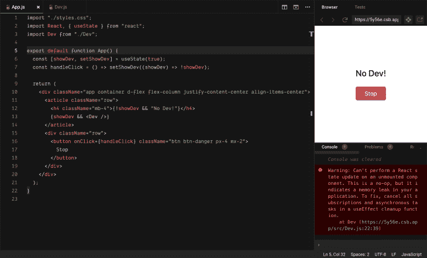

# 高级 React 钩子:创建定制的可重用钩子

> 原文：<https://blog.logrocket.com/advanced-react-hooks-creating-custom-reusable-hooks/>

React 钩子在 React 16.8.0 版本中首次引入，是允许开发人员增强功能组件的新 API。使我们有可能用功能组件做以前只能用类做的事情。

因此，我们可以在不编写类的情况下使用状态和其他 React 特性。

自从它们被引进以来，`Hooks`已经对 React 生态系统产生了巨大的影响。它们永远改变了 React 应用的构建方式。

在本文中，我们将看看可重用的`Hook`模式的实际应用。当我们考虑这些时，重要的是要提到`Hooks`是可组合的，这意味着您可以在您的自定义`Hook`中调用另一个`Hook`。

## 可重用`Hook`模式的用例

下面让我们考虑一些可重用的`Hook`模式:

### 使用`useIsMounted`挂钩

在 React 中，一旦一个组件是`unmounted`，它就不会再是`mounted`，这就是为什么我们不在一个`[unmounted](https://reactjs.org/docs/react-component.html#componentwillunmount)` [组件](https://reactjs.org/docs/react-component.html#componentwillunmount)中设置状态。这是因为它永远不会被重新渲染。



上图展示了这个问题的一个小的人为的[示例应用](https://codesandbox.io/s/jovial-cache-5y56e?fontsize=14&hidenavigation=1&theme=dark)。

在上面的应用中，`Dev component`只有在`showDev state`为真时才会被渲染。点击`stop button`切换`showDev state`的值。因此，当`showDev`为假时`unmounting`发生`Dev component`。

下面是`Dev component`的实现。

```
function Dev() {
  const [devProfile, setDevProfile] = useState("Fetching Dev...");
  const getDevProfile = () => {
    setTimeout(() => setDevProfile("Lawrence Eagles"), 4000);
  };
  useEffect(() => {
    getDevProfile();
  });
  return (
    <div className="mb-4 text-center">
      <p>{devProfile}</p>
    </div>
  );
}

```

从上面的代码我们可以看到，一旦组件`mounts`，就调用了`getDevProfile`函数。这需要`4000 milliseconds`运行，然后用`Lawrence Eagles`更新`devProfile state`。

如果我们在`4000 milliseconds`之前`unmount``Dev component`(通过点击`stop button`)，React 会显示上图所示的警告错误。

虽然此错误不会破坏用户界面，但它会导致内存泄漏，从而影响性能。

为了避免这个问题，一些开发人员这样做:

```
if (this.isMounted()) { // This is bad.
  this.setState({...});
}

```

但是 React 团队考虑使用`[isMounted function](https://reactjs.org/blog/2015/12/16/ismounted-antipattern.html)`作为反模式，所以他们建议您自己跟踪`mounted status`。

```
  useEffect(() => {
    let isMounted = true; // sets mounted flag true
    return () => {
      // simulate an api call and update state here
      isMounted = false;
    }; // use effect cleanup to set flag false, if unmounted
  }, []);
  return isMounted;
};
```

我们的目标是将上述逻辑抽象成一个自定义的`Hook`，我们可以在代码中重用它；因此，我们保留我们的代码`DRY`。

为此，将上面的所有样板代码封装到一个自定义的`Hook` ( `useIsMounted Hook`)中，如下所示:

```
import { useEffect, useState } from "react";
const useIsMounted = () => {
  const [isMounted, setIsMouted] = useState(false);
  useEffect(() => {
    setIsMouted(true);
    return () => setIsMouted(false);
  }, []);
  return isMounted;
};
export default useIsMounted;

```

现在我们可以像这样在我们的应用程序中使用它:

```
function Dev() {
  const isMounted = useIsMounted();
  const [devProfile, setDevProfile] = useState("Fetching Dev...");
  useEffect(() => {
    function getDevProfile() {
      setTimeout(() => {
        if (isMounted) setDevProfile("Lawrence Eagles");
      }, 4000);
    }
    getDevProfile();
  });
  return (
    <div className="mb-4 text-center">
      <p>{devProfile}</p>
    </div>
  );
}

```

上面的[代码](https://codesandbox.io/s/sad-fog-32lz3?fontsize=14&hidenavigation=1&theme=dark)保证了只有当组件仍然是`mounted`的时候状态才会被更新。

### `useLoading Hook`

这是一个经过深思熟虑的可重用的`Hook`，在有许多链接到资源的按钮的场景中，一旦组件`mounts`被加载，它就可以节省时间。

通常，当`async call`运行以获取资源时，会有某种类型的`Loading..`微调器。

挑战在于这些按钮的数量会随着资源的增加而增加，这会使我们的组件因不同的`loading states`而变得混乱。

考虑这个[代码](https://codesandbox.io/s/summer-bash-hqf9h?file=/src/App.js):

```
import "./styles.css";
import React, { useState, useEffect } from "react";
export default function App() {
  const delay = (ms) => new Promise((resolve) => setTimeout(resolve, ms));
  const [isLoadingDev, setIsLoadingDev] = useState(true);
  const [isLoadingStack, setIsLoadingStack] = useState(true);
  const fetchDevs = async () => {
    console.log("this might take some time....");
    await delay(4000);
    setIsLoadingDev(false);
    console.log("Done!");
  };
  const fetchStacks = async () => {
    console.log("this might take some time....");
    await delay(5000);
    setIsLoadingStack(false);
    console.log("Done!");
  };
  useEffect(() => {
    fetchDevs();
    fetchStacks();
  }, []);

  return (
    <div className="app 
     container 
     d-flex 
     flex-column 
     justify-content-center 
     align-items-center"
    >
      <article className="d-flex flex-column my-2">
        <p className="text-center">Welcome to Dev Hub</p>
      </article>
      <article className="d-flex flex-column">
        <button className="m-2 p-3 btn btn-success btn-sm">
          {isLoadingDev ? "Loading Devs..." : "View Devs"}
        </button>
        <button className="m-2 p-3 btn btn-success btn-sm">
          {isLoadingStack ? "Loading Stacks..." : "View Stacks"}
        </button>
      </article>
    </div>
  )
}

```

在上面的代码中，`fetchDev`和`fetchStacks`函数被设计成模拟一个`async request`。一旦组件`mounts`被调用，当这些功能完成时，按钮中的消息改变。

每个按钮的`loading status`由一个`useState`初始化处理，随着我们加载更多的资源，它的数量会增加。

这段代码不是`DRY`，重复是产生错误的原因。

我们可以通过创建一个可重用的`useLoading Hook`来重构上面的代码，如下所示:

```
import { useState } from "react";
const useLoading = (action) => {
  const [loading, setLoading] = useState(false);
  const doAction = (...args) => {
    setLoading(true);
    return action(...args).finally(() => setLoading(false));
  };
  return [doAction, loading];
};
export default useLoading;

```

这个钩子接受一个`async function`并返回一个包含该函数和`loading status`的数组。

* * *

### 更多来自 LogRocket 的精彩文章:

* * *

我们还能够将我们的`useState`逻辑抽象到这个组件，我们只需要一次初始化。

我们可以在代码中使用它，就像这样:

```
import "./styles.css";
import React, { useEffect } from "react";
import useLoading from "./useLoading";
export default function App() {
  const delay = (ms) => new Promise((resolve) => setTimeout(resolve, ms));
  const fetchDevs = async () => {
    console.log("this might take some time....");
    await delay(4000);
    console.log("Done!");
  };
  const fetchStacks = async () => {
    console.log("this might take some time....");
    await delay(5000);
    console.log("Done!");
  };
  const [getDev, isLoadingDev] = useLoading(fetchDevs);
  const [getStacks, isLoadingStack] = useLoading(fetchStacks);
  useEffect(() => {
    getDev();
    getStacks();
  }, []);
  return (
    <div className="app 
         container 
         d-flex 
         flex-column 
         justify-content-center 
         align-items-center"
    >
      <article className="d-flex flex-column my-2">
        <p className="text-center">Welcome to Dev Hub</p>
      </article>
      <article className="d-flex flex-column">
        <button className="m-2 p-3 btn btn-success btn-sm">
          {isLoadingDev ? "Loading Devs..." : `View Devs`}
        </button>
        <button className="m-2 p-3 btn btn-success btn-sm">
          {isLoadingStack ? "Loading Stacks..." : "View Stacks"}
        </button>
      </article>
    </div>
  );
}

```

这里，我们用`array destructuring`来得到`async action function`和`loading status`。

```
  const [getDev, isLoadingDev] = useLoading(fetchDevs);
  const [getStacks, isLoadingStack] = useLoading(fetchStacks);

```

然后在`useEffect Hook`和视图中使用。结果是一个干净的代码，更容易维护。

同样，在所有的`loading status`完成之后，我们现在可以轻松地做一些事情，比如渲染一个组件，更新状态等等。

```
if(isLoadingDev && isLoadingStack) {
  // do somthing
}

return {
  // normal component view
}

```

## 结论

我希望在这次演讲之后，你能理解保留你的代码的必要性，并准备好开始编写定制的可重用代码。

这只是创建可重用定制`Hooks`的高级模式的两个例子，现在希望你可以创建自己的高级模式。

你可以在这里阅读更多关于打造自己的`Hooks` [的内容。](https://reactjs.org/docs/hooks-custom.html)

## [LogRocket](https://lp.logrocket.com/blg/react-signup-general) :全面了解您的生产 React 应用

调试 React 应用程序可能很困难，尤其是当用户遇到难以重现的问题时。如果您对监视和跟踪 Redux 状态、自动显示 JavaScript 错误以及跟踪缓慢的网络请求和组件加载时间感兴趣，

[try LogRocket](https://lp.logrocket.com/blg/react-signup-general)

.

[ ](https://lp.logrocket.com/blg/react-signup-general) [](https://lp.logrocket.com/blg/react-signup-general) 

LogRocket 结合了会话回放、产品分析和错误跟踪，使软件团队能够创建理想的 web 和移动产品体验。这对你来说意味着什么？

LogRocket 不是猜测错误发生的原因，也不是要求用户提供截图和日志转储，而是让您回放问题，就像它们发生在您自己的浏览器中一样，以快速了解哪里出错了。

不再有嘈杂的警报。智能错误跟踪允许您对问题进行分类，然后从中学习。获得有影响的用户问题的通知，而不是误报。警报越少，有用的信号越多。

LogRocket Redux 中间件包为您的用户会话增加了一层额外的可见性。LogRocket 记录 Redux 存储中的所有操作和状态。

现代化您调试 React 应用的方式— [开始免费监控](https://lp.logrocket.com/blg/react-signup-general)。