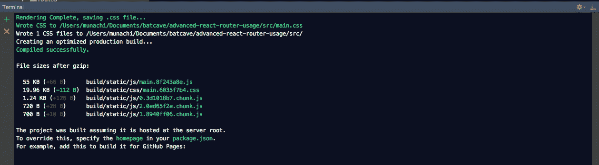
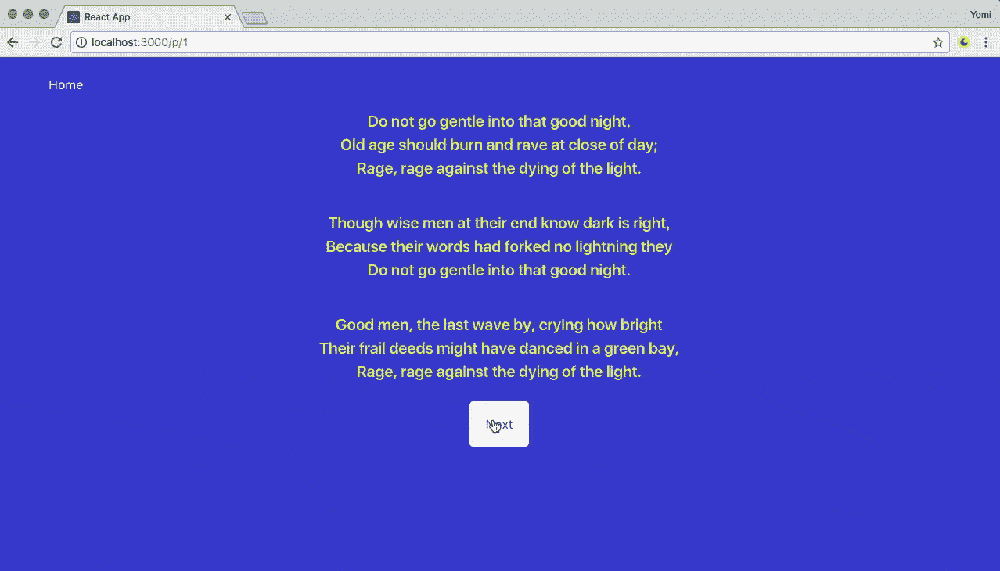
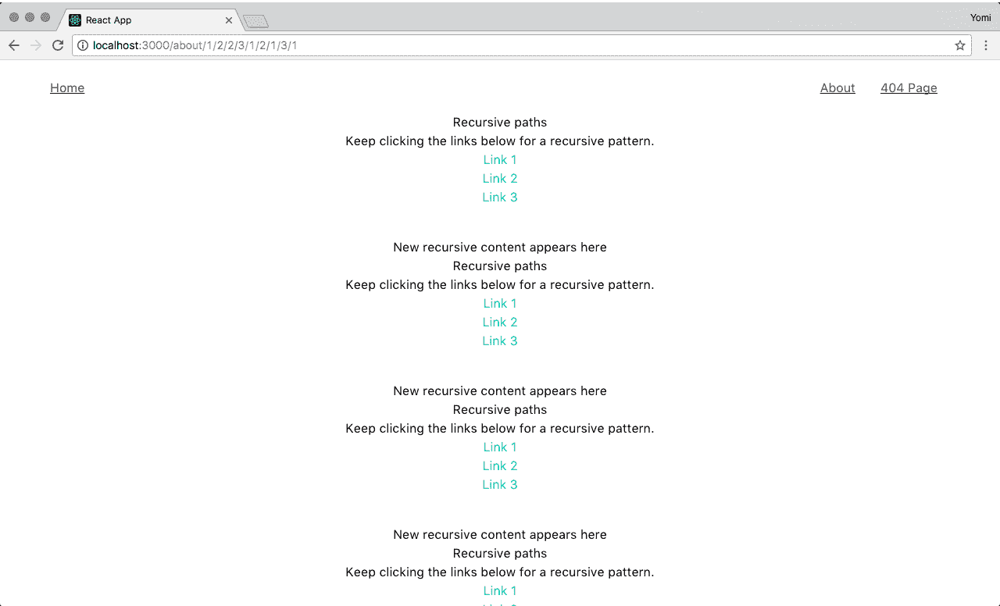
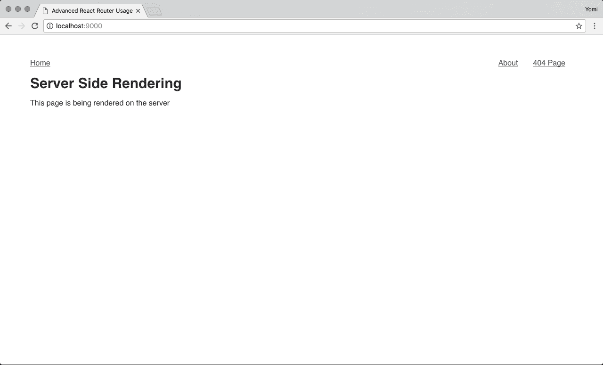
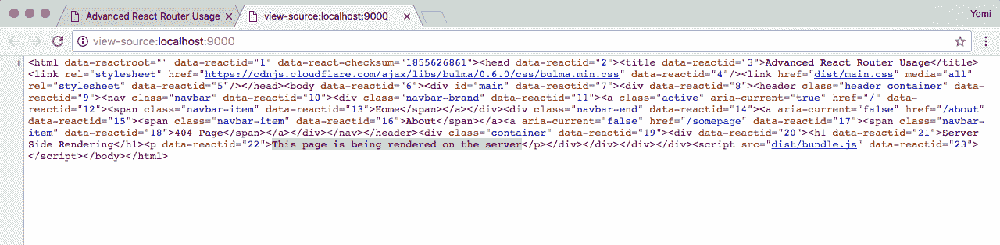

# 高级 React 路由器概念:递归路径、代码分割和更多

> 原文：<https://blog.logrocket.com/advanced-react-router-concepts-code-splitting-animated-transitions-scroll-restoration-recursive-17096c0cf9db/>

在设定高级概念的路径之前，首先让我们在基础上达成一致。React 路由器提供:

*   React 内置的单页应用程序路由功能
*   React 应用程序的声明性路由

在本教程中，我将重点介绍一些高级的 React 路由器概念，如代码分割、动画过渡、滚动恢复、递归路径和服务器端渲染。

最后，我将演示如何在 React 应用程序中使用这些概念。

## 代码拆分

代码分割实际上是为用户逐步下载应用程序的过程。通过这种方式，一个大的捆绑 JavaScript 文件可以被分成更小的块，只在需要的时候使用。代码拆分让您可以向您的用户发送较小的应用捆绑包，并且只在他们访问您的 SPA 的特定“页面”时下载额外的 JS 代码。

在 React 应用中，可以通过使用`import()`语法和 webpack 来实现代码拆分。

更好的是，您可以使用 [react-loadable](https://github.com/thejameskyle/react-loadable) ，这是一个更高阶的组件，用于加载具有动态导入的组件。React Loadable 是一个小库，它使得 React 中以组件为中心的代码拆分变得非常容易。

让我们看看代码拆分是如何在上面创建的 React 应用程序中实现的。

检查`code-splitting`分支并导航到 routes 文件夹(`/src/routes/index.js`)中的`index.js`文件。或者，你可以在线查看文件[这里](https://github.com/yomete/advanced-react-router-usage/blob/code-splitting/src/routes/index.js)。

在文件的开头，您会看到一些 imports 语句。它们基本上是被导入到代码中使用的模块。

```
import React, { Component } from 'react'
import {
  BrowserRouter as Router,
  Route,
  Switch,
  Link
} from 'react-router-dom'
import Loadable from 'react-loadable'
import LoadingPage from '../components/LoadingPage/LoadingPage'
```

上面可以看到，Loadable 是从`react-loadable`导入的，它会被用来进行代码拆分。`LoadingPage`组件呈现一个将被用作加载器的视图。

Loadable 是一个高阶组件(一个创建组件的函数),它允许你在将任何模块渲染到你的应用程序之前动态地加载它。在下面的代码块中，`loader`使用导入函数来动态地`import`加载一个特定的组件，`LoadingPage`组件用于加载状态。`delay`是在将`props.pastDelay`传递给加载组件之前等待的时间(以毫秒为单位)。这默认为`200`。

```
const AsyncHome = Loadable({
  loader: () => import('../components/Home/Home'),
  loading: LoadingPage
})
const AsyncAbout = Loadable({
  loader: () => import('../components/About/About'),
  loading: LoadingPage,
  delay: 300
})
const AsyncNotFound = Loadable({
  loader: () => import('../components/NotFound/NotFound'),
  loading: LoadingPage
})
```

您可以通过构建用于生产的应用程序并观察 JavaScript 代码是如何捆绑的来检查代码拆分是否真的发生了。运行`npm run build`命令为生产构建应用程序。



如您所见，由于代码分割，包括组件在内的 JavaScript 代码现在被分成不同的块。

## 动画过渡

动画过渡有助于提供一个简单的网站导航流程。React 中有许多 React 插件可以帮助解决这一问题，但我们将考虑为该应用程序提供 [react-router-transition](https://github.com/maisano/react-router-transition) 插件。

这是我们将要构建的预览:



检查到动画过渡分支，并导航到路径文件夹(`/src/routes/index.js`)中的`index.js`文件，或者您可以在这里在线查看文件[。如上所述，我将只强调代码中有助于动画过渡的重要部分。](https://github.com/yomete/advanced-react-router-usage/tree/animated-transitions)

```
import { AnimatedSwitch, spring } from 'react-router-transition';
```

`AnimatedSwitch`模块从`react-router-transition`导入，React Motion 的弹簧辅助函数也被导入，用于指定动画的弹簧配置。`AnimatedSwitch`基本上是一个`<Switch />`，但是当子路线改变时会有过渡。

```
function mapStyles(styles) {
  return {
    opacity: styles.opacity,
    transform: `scale(${styles.scale})`,
  };
}
// wrap the `spring` helper to use a bouncy config
function bounce(val) {
  return spring(val, {
    stiffness: 330,
    damping: 22,
  });
}
// child matches will...
const bounceTransition = {
  // start in a transparent, upscaled state
  atEnter: {
    opacity: 0,
    scale: 1.2,
  },
  // leave in a transparent, downscaled state
  atLeave: {
    opacity: bounce(0),
    scale: bounce(0.8),
  },
  // and rest at an opaque, normally-scaled state
  atActive: {
    opacity: bounce(1),
    scale: bounce(1),
  },
};
```

`mapStyles()`函数使用样式的参数来返回不透明度和变换的值。这将在稍后配置转换时使用。

`bounce()`函数包装来自 React motion 的弹簧辅助对象以给出弹性配置，而`bounceTransition`对象定义子匹配将如何在不同位置过渡，如`atEnter`、`atLeave`和`atActive`。

上面提到过`AnimatedSwitch`取代了路由中的交换机，所以让我们看看是如何做到的。

```
class Routes extends Component {
  render () {
    return (
      <Router history={history}>
        <div>
          <header className="header container">
            <nav className="navbar">
              <div className="navbar-brand">
                <Link to="/">
                  <span className="navbar-item">Home</span>
                </Link>
              </div>
            </nav>
          </header>
          <AnimatedSwitch
            atEnter={bounceTransition.atEnter}
            atLeave={bounceTransition.atLeave}
            atActive={bounceTransition.atActive}
            mapStyles={mapStyles}
            className="route-wrapper"
          >
            <Route exact path="/" component={Home} />
            <Route path="/p/1" component={One} />
            <Route path="/p/2" component={Two} />
            <Route path="*" component={NotFound} />
          </AnimatedSwitch>
        </div>
      </Router>
    )
  }
}
```

它的工作方式与开关的使用方式相同，只是增加了一些额外的道具，如`atEnter`、`atLeave`、`atActive`和`mapStyles`。

要查看运行中的动画转换，请在终端中运行 npm start 命令，以开发模式运行应用程序。应用程序启动并运行后，导航应用程序的路线。

### 卷轴修复

当您试图确保用户在切换路线或导航到另一个页面时返回到页面顶部时，滚动恢复会很有用。这有助于向上滚动导航，这样你就不会滚动到底部开始一个新的屏幕。

* * *

### 更多来自 LogRocket 的精彩文章:

* * *

另一个重要的用例是，当用户在导航到其他地方后返回到你的应用程序中的一个长页面时，你可以将他们放回到相同的滚动位置，以便他们可以从他们离开的地方继续。

这里有一个[链接](https://3r37589op6.codesandbox.io/)来看看滚动恢复的效果。

让我们看看滚动恢复是如何在上面创建的 React 应用程序中实现的。

检查到`scroll-restoration`分支，并导航到 routes 文件夹(`/src/routes/index.js`)中的`index.js`文件，或者您可以在这里在线查看文件[。](https://github.com/yomete/advanced-react-router-usage/blob/scroll-restoration/src/routes/index.js)

```
import ScrollToTop from '../components/ScrollToTop/ScrollToTop'

class Routes extends Component {
  render () {
    return (
      <Router history={history}>
        <ScrollToTop>
          <div>
            <header className="header container">
              <nav className="navbar">
                <div className="navbar-brand">
                  <Link to="/">
                    <span className="navbar-item">Home</span>
                  </Link>
                </div>
                <div className="navbar-end">
                  <Link to="/about">
                    <span className="navbar-item">About</span>
                  </Link>
                  <Link to="/somepage">
                    <span className="navbar-item">404 page</span>
                  </Link>
                </div>
              </nav>
            </header>
            <Switch>
              <Route exact path="/" component={Home} />
              <Route path="/about" component={About} />
              <Route path="*" component={NotFound} />
            </Switch>
          </div>
        </ScrollToTop>
      </Router>
    )
  }
}
```

该文件的重要部分显示在上面的代码块中。在实现滚动恢复时，`ScrollToTop`组件完成了所有繁重的工作，在`render()`函数中，它被用在 Router 下来包含路由。

让我们打开`ScrollToTop`组件来看看滚动恢复的代码。导航到`src/components/ScrollToTop`并打开`ScrollToTop.js`或在线查看文件[此处](https://github.com/yomete/advanced-react-router-usage/blob/scroll-restoration/src/components/ScrollToTop/ScrollToTop.js)。

```
import { Component } from 'react'
import { withRouter } from 'react-router-dom'

class ScrollToTop extends Component {
    componentDidUpdate(prevProps) {
        if (this.props.location !== prevProps.location) {
            window.scrollTo(0, 0)
        }
    }

    render() {
        return this.props.children
    }
}

export default withRouter(ScrollToTop)
```

在上面的代码块中，组件模块是从`react`导入的，`withRouter`是从 react-router-dom 导入的。

接下来是名为`ScrollToTop`的 ES6 类，它从 react 扩展了组件模块。`componentDidUpdate`生命周期检查它是否是一个新页面，并使用`window.scroll`函数返回页面顶部。

然后，`ScrollToTop`组件被包装在导出的`withRouter`中，以便访问路由器的 props。

要查看滚动恢复的效果，请在您的终端中运行命令`npm start`,以开发模式运行应用程序。应用程序启动并运行后，导航到“关于”页面并向下滚动，直到到达页面底部，然后单击**主页**链接，查看滚动恢复的效果。

## 递归路径

递归路径是通过在同一组件上调用，使用嵌套路线来显示嵌套视图的路径。递归路径的一个例子是在网站上经常使用面包屑。“面包屑”是一种二级导航方案，它揭示了用户在网站或 Web 应用程序中的位置。

Breadcrumbs 为用户提供了一种方法，即使在经过多条路线之后，也可以将路径追溯到其原始登陆点，这可以使用 React Router 的功能来实现，具体来说就是`match`对象，它提供了为嵌套的子组件编写递归路线的能力。

检查到`recursive-paths`分支，并导航到“关于”文件夹(`/src/components/About/About.js`)中的`About.js`文件，或者您可以在这里在线查看文件[。](https://github.com/yomete/advanced-react-router-usage/blob/recursive-paths/src/components/About/About.js)

```
import React, { Component } from 'react'
import './About.css'
import { Link, Route } from 'react-router-dom'

class About extends Component {

    componentDidMount () {
        console.log(this.props.match.url)
    }

    render () {
        return (
            <div className="container">
                <h1>Recursive paths</h1>
                <p>Keep clicking the links below for a recursive pattern.</p>
                <div>
                    <ul>
                        <li><Link className="active" to={this.props.match.url + "/1"}>Link 1</Link></li>
                        <li><Link className="active" to={this.props.match.url + "/2"}>Link 2</Link></li>
                        <li><Link className="active" to={this.props.match.url + "/3"}>Link 3</Link></li>
                    </ul>
                </div>
                <div>
                    <p className="recursive-links">New recursive content appears here</p>
                    <Route path={`${this.props.match.url}/:level`} component={About} />
                </div>
            </div>
        )
    }
}

export default About
```

在上面的代码块中，`Link`使用`this.props.match.url`指向当前 URL，然后在该 URL 后面追加一个`/1`、`/2`或`/3`。递归实际上发生在路径内部，路径被设置为当前的`this.props.match.url`，并添加了参数`/:level`，用于路径的组件是`About`组件。

要查看递归路径的运行情况，请在终端中运行命令`npm start`,在开发模式下运行应用程序。一旦应用程序启动并运行，导航到 about 页面并持续点击那里的任何链接以查看递归模式。



## 服务器端渲染

使用 React、Angular 或 Vue 等 JavaScript 框架的一个缺点是，在浏览器执行应用程序的 JavaScript 捆绑包之前，页面基本上是空的。这个过程称为客户端渲染。如果用户的互联网连接不好，这可能会导致更长的等待时间。

客户端呈现的另一个缺点是，网络爬虫并不关心您的页面是否仍在加载或等待 JavaScript 请求。如果爬虫什么也没看见，显然那对 SEO 是坏的。

服务器端呈现(SSR)通过在初始请求中加载所有的 HTML、CSS 和 JavaScript 来帮助解决这个问题。这意味着所有的内容都被加载并转储到网络爬虫可以爬行的最终 HTML 中。

React 应用程序可以使用 Node.js 在服务器上呈现，React 路由器库可以用于应用程序中的导航。让我们看看如何实现它。

SSR React 应用在 GitHub repo 上，你可以查看 SSR 分支或者你可以在这里查看 repo。我将只强调应用程序中涉及 SSR 的最重要的部分。

`webpack.development.config.js`文件包含 React 应用程序所需的 webpack 配置，文件的内容可以在下面或者在 [GitHub](https://github.com/yomete/advanced-react-router-usage/blob/server-side-rendering/webpack.development.config.js) 上看到。

```
var path = require('path')
var webpack = require('webpack')
var ExtractTextPlugin = require("extract-text-webpack-plugin")

var config = {

  devtool: 'eval',

  entry: [
    './src/App',
    'webpack-hot-middleware/client'
  ],

  output: {
    filename: 'bundle.js',
    path: path.join(__dirname, 'dist'),
    publicPath: '/dist/'
  },

  resolve: {
    extensions: ['*', '.js']
  },

  plugins: [
    new webpack.HotModuleReplacementPlugin(),
    new webpack.NoEmitOnErrorsPlugin(),
    new webpack.DefinePlugin({
      "process.env": {
        BROWSER: JSON.stringify(true)
      }
    }),
    new ExtractTextPlugin("[name].css")
  ],

  module: {
    loaders: [
      {
        test: /\.js$/,
        loaders: ['react-hot-loader', 'babel-loader'],
        include: [path.join(__dirname, 'src')]
      },
      {
        test: /\.css$/,
        loader: ExtractTextPlugin.extract('style-loader','css-loader')
      }
    ]
  }
}

module.exports = config
```

该应用程序的入口点是`server.js`，它是在服务器上运行该应用程序所需的 Node.js 后端。文件的内容可以在下面或者在 [GitHub](https://github.com/yomete/advanced-react-router-usage/blob/server-side-rendering/server.js) 上看到。

```
require('babel-core/register')({});

//Adding a Development Server
let webpack = require('webpack')
let webpackDevMiddleware = require('webpack-dev-middleware')
let webpackHotMiddleware = require('webpack-hot-middleware')
let config = require('./webpack.development.config')
let path = require('path')
let Express = require('express')
let requestHandler = require('./requestHandler')

let app = new Express()
let port = 9000

let compiler = webpack(config)

app.use(webpackDevMiddleware(compiler, {
  noInfo: true,
  publicPath: config.output.publicPath,
  historyApiFallback: true
}))

app.use(webpackHotMiddleware(compiler))

delete process.env.BROWSER;

app.get('/dist/main.css', (req, res) => {
  res.sendFile(path.join(__dirname, '/public/main.css'))
});

app.use(requestHandler);

app.listen(port, (error) => {
  if (error) {
    console.error(error)
  } else {
    console.info('==> Listening on port %s. Open up http://localhost:%s/ in your browser.', port, port)
  }
})
```

在上面的代码块中，我们基本上设置了一个运行应用程序的 Express web 服务器，还设置了一个带有`webpackDevMiddleware`和`webpackHotMiddleware`的开发服务器。在文件的顶部，`requestHandler.js`被导入，这用于稍后用`app.use(requestHandler)`构建应用程序的视图。让我们看看 JavaScript 文件的内容。你也可以在这里查看。

```
import React from 'react'
import { renderToString } from 'react-dom/server'
import { StaticRouter } from 'react-router'
import { App } from './src/Components'

function handleRender(req,res) {
    // first create a context for <StaticRouter>, it's where we keep the
  // results of rendering for the second pass if necessary
  const context = {}
  // render the first time
  let markup = renderToString(
    <StaticRouter
      location={req.url}
      context={context}
    >
      <html>
        <head>
          <title>Advanced React Router Usage</title>
          <link rel="stylesheet" href="https://cdnjs.cloudflare.com/ajax/libs/bulma/0.6.0/css/bulma.min.css" />
          <link href="dist/main.css" media="all" rel="stylesheet" />
        </head>
        <body>
          <div id="main">
            <App/>
          </div>
          <script src="dist/bundle.js"></script>
        </body>
      </html>
    </StaticRouter>
  )

  // the result will tell you if it redirected, if so, we ignore
  // the markup and send a proper redirect.
  if (context.url) {
    res.writeHead(301, {
      Location: context.url
    })
    res.end()
  } else {
    res.write(markup)
    res.end()
  }
}
module.exports = handleRender
```

在服务器上渲染 React 应用程序需要将组件渲染为静态标记，这就是为什么从文件顶部的`react-dom/server`导入`renderToString`。还有其他的导入要强调，使用`StaticRouter`导入是因为服务器上的渲染有点不同，因为它是无状态的。

基本思想是，我们将应用程序包装在无状态的`[<StaticRouter>](https://reacttraining.com/web/api/StaticRouter)`中，而不是一个`[<BrowserRouter>](https://reacttraining.com/web/api/BrowserRouter)`中。然后，我们从服务器传入请求的 URL，这样路由就可以匹配，我们接下来将讨论一个上下文属性。

每当客户端出现重定向，浏览器历史就会改变状态，我们就会看到新的屏幕。在静态服务器环境中，我们不能改变应用程序的状态。相反，我们使用`context`道具来找出渲染的结果。如果我们找到一个`context.url`，那么我们知道应用程序被重定向了。

那么，我们如何在服务器渲染的应用程序中定义路由和匹配的组件呢？那就是发生在`src/router-config.js` [档](https://github.com/yomete/advanced-react-router-usage/blob/server-side-rendering/src/router-config.js)和`src/components/App.js` [档](https://github.com/yomete/advanced-react-router-usage/blob/server-side-rendering/src/Components/App.js)的事情。

```
import React from 'react'
import { Home, About, NotFound } from './Components'

export const routes = [
   {
      'path':'/',
      'component': Home,
      'exact': true
   },
   {
      'path':'/about',
      'component': About
   },
   {
      'path':'*',
      'component': NotFound
   }
]
```

在上面的代码块中，导出的`routes`数组包含不同的对象，这些对象包含不同的路线及其伴随的组件。这将在下面的`src/components/App.js`文件中使用。

```
import React, { Component } from 'react'
import { Switch, Route, NavLink } from 'react-router-dom'
// The exported routes array from the router-config.js file is imported here to be used for the routes below
import { routes } from '../router-config'
import { NotFound } from '../Components'

export default class App extends Component {
  render() {
    return (
      <div>
          <header className="header container">
            <nav className="navbar">
                <div className="navbar-brand">
                    <NavLink to="/" activeClassName="active">
                        <span className="navbar-item">Home</span>
                    </NavLink>
                </div>

                <div className="navbar-end">
                    <NavLink to="/about" activeClassName="active">
                        <span className="navbar-item">About</span>
                    </NavLink>
                    <NavLink to="/somepage" activeClassName="active">
                        <span className="navbar-item">404 Page</span>
                    </NavLink>
                </div>

            </nav>
          </header>

          <div className="container">
              <Switch>
                  {/*The routes array is used here and is iterated through to build the different routes needed for the app*/}
                  {routes.map((route,index) => (
                      <Route key={index} path={route.path} component={route.component} exact={route.exact} />
                  ))}
                  <Route component={NotFound}/>
              </Switch>
          </div>
      </div>
    )
  }
}
```

在上面的代码块中，从前面的文件导出的`routes`数组被导入使用，在`Switch`组件中，`routes`数组被迭代以构建应用程序所需的不同路线。

要查看运行中的服务器端渲染，请在您的终端中运行命令节点`server.js`，以开发模式运行应用程序。一旦应用程序启动并运行，导航到`[http://localhost:9000](http://localhost:9000)`或应用程序正在运行的任何端口，应用程序应该可以正常加载，类似于下面的截图。



要检查应用程序是否真正在服务器端呈现，右键单击页面并单击**查看页面源**，您将看到页面内容被完整呈现，而不是从 JavaScript 文件呈现。



## 暂时就这样吧！

本教程的代码库可以在这个 GitHub [repo](https://github.com/yomete/advanced-react-router-usage) 上看到。每个高级概念都有不同的分支。请随意浏览，并告诉我你的想法。

## 使用 LogRocket 消除传统反应错误报告的噪音

[LogRocket](https://lp.logrocket.com/blg/react-signup-issue-free)

是一款 React analytics 解决方案，可保护您免受数百个误报错误警报的影响，只针对少数真正重要的项目。LogRocket 告诉您 React 应用程序中实际影响用户的最具影响力的 bug 和 UX 问题。

[ ](https://lp.logrocket.com/blg/react-signup-general) [  ](https://lp.logrocket.com/blg/react-signup-general) [LogRocket](https://lp.logrocket.com/blg/react-signup-issue-free)

自动聚合客户端错误、反应错误边界、还原状态、缓慢的组件加载时间、JS 异常、前端性能指标和用户交互。然后，LogRocket 使用机器学习来通知您影响大多数用户的最具影响力的问题，并提供您修复它所需的上下文。

关注重要的 React bug—[今天就试试 LogRocket】。](https://lp.logrocket.com/blg/react-signup-issue-free)