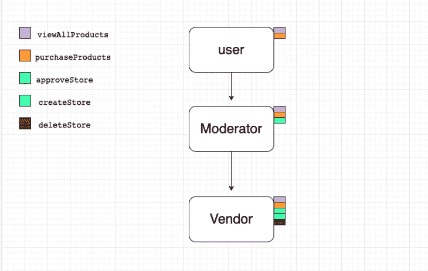

# Dart 混合的高级用途:避免重复方法

> 原文：<https://blog.logrocket.com/advanced-uses-dart-mixins-avoiding-duplicate-methods/>

我在 Dart 中遇到的一个困难是一次只能继承或扩展一个类的限制。您可以通过使用 Dart mixins 来改进类继承和代码可重用性，从而绕过这个约束，尤其是在更复杂的架构中。

说到类的可重用性，Dart 提供了很多，尤其是自从 Dart 2.1 引入 mixin 关键字以来。通过 Dart 混合，跨多个类层次重用任何类的代码都变得很容易。

在本教程中，我们将学习更多关于混合的一般知识，看看 Dart 混合，并学习如何在 Dart 类中避免重复的方法。

以下是我们将要介绍的内容:

要阅读本文，您应该对 Dart 有一个基本的了解。我已经使用 [dartpad.dev](https://dartpad.dev/?) 编写了本教程中的示例程序。

## 什么是 Dart mixins？

Dart mixins 是以关键字`mixin`开头的特殊类，包含其他类可以使用的方法集合。Dart mixins 鼓励代码重用，并帮助您避免多重继承带来的限制。它允许您以标准类继承不允许的方式向类添加额外的特性。

让我们考虑一个典型的电子商务应用程序中的角色分配:

```
void main() {
  Moderator().viewAllProducts();
}

class User {
  void viewAllProducts() {
    print('Viewed all products');
  }

  void purchaseProduct() {
    print('Purchased a designer bag');
  }
}

class Vendor {
  void createStore() {
    print('Created EA sports stores');
  }

  void deleteStore() {
    print('Delete EA sports stores');
  }
}

class Moderator {
  void approveStore() {
    print('Approved EA sports stores');
  }

  void viewAllProducts() {
    print('Viewed all products');
  }
}

```

每个类中的方法都是不言自明的。仔细观察代码片段，您会注意到在`User`和`Moderator`类中都有一个方法重复(`viewAllProducts`)。尽管这很有效，但不是一个好的实践。

## 省道混合线的缺点

虽然 Flutter mixins 减少了继承遇到的缺点，但它不能取代继承，因为它有自己的缺点。

过度使用`class Vendor`与`CanViewAllProducts,CanRemoveProduct,...`等 mixins，违背了单一责任原则，难以理解类目的。此外，在运行时，代码执行往往会在不同的 mixins 中跳转，这使得调试和遵循执行顺序变得困难。

此外，使用 mixins 会导致很长的编译时间。在使用 mixins 之前要小心风险，你将更有可能享受它们的好处。

## 避免 Dart 类中的重复方法

为了避免代码重复，我们将利用 Dart 类继承。

在 Dart 中，继承是一个类从另一个类派生其属性和方法的过程。

让我们删除重复的`viewAllProducts`方法，并允许`Moderator`类从`User`类派生出`viewAllProducts`方法:

```
void main() {
  Moderator().viewAllProducts();
}

class User {
  void viewAllProducts() {
    print('Viewed all products');
  }

  void purchaseProduct() {
    print('Purchased a designer bag');
  }
}

class Moderator extends User {
  void approveStore() {
    print('Approved EA sports stores');
  }
}

```

在 [dartpad.dev](https://dartpad.dev/?) 上执行上面的代码片段，您应该会得到与前面代码片段相同的结果。

这很好，但是接下来还有一个关于继承的问题，我们将继续讨论。你有没有注意到我们的`Moderator`类也从`User`类派生了`purchaseProduct`方法，这是完全不必要的，因为我们希望`Moderator`从`User`类只派生`viewAllProducts`？这就是 Dart mixins 派上用场的地方。

### Dart 中的多级继承

当一个类继承另一个子类时，就会发生多级继承。Dart 允许一个类从另一个子类继承方法和属性。

让我们考虑下面的片段:

```
void main() {
  Vendor().viewAllProducts();
  Vendor().purchaseProducts();
  Vendor().approveStore();
  Vendor().createStore();
  Vendor().deleteStore();
}

class User {
  void viewAllProducts() {
    print('Viewed all products');
  }

  void purchaseProducts() {
    print('Purchased 2 designer bags');
  }
}

class Moderator extends User {
  void approveStore() {
    print('Approved EA sports stores');
  }
}

class Vendor extends Moderator {
  void createStore() {
    print('Created EA sports stores');
  }

  void deleteStore() {
    print('Delete EA sports stores');
  }
}

```



这里，`Vendor`类从`Moderator`类继承了`approveStore`方法。因为`Moderator`类是`User`类的子类，所以从其父类`User`继承的`viewAllProducts`和`purchaseProducts`方法被传递给`Vendor`类(其子类)。

### Dart 中的多重继承

当一个类从多个父类继承时，这就是所谓的多重继承。

让我们用以下方法考虑第四种类型的用户`Admin`:

*   `approveStore`
*   `deleteStore`
*   `viewAllProducts`

您可能会想到通过允许`Admin`类从`Moderator`和`Vendor`类继承上述方法来避免代码重复。不幸的是，Dart 不支持多重继承，这意味着一个类不能扩展多个类。所以，我们转向 Dart mixins。

## 使用 Dart 创建 mixins

为了创建一个 mixin，我们将利用`mixin`关键字:

```
mixin MixinName {
  //Define reusable methods
}

```

让我们解决前面提到的继承问题，我们的`Moderator`类也从`User`类派生了`purchaseProduct`方法，但是我们希望`Moderator`只从`User`类派生`viewAllProducts`:

```
mixin CanViewAllProducts {
  void viewAllProducts() {
    print('Viewed all products');
  }
}

```

为了使用`CanViewAllProducts` mixins，我们将如下利用`with`关键字:

```
class Moderator with CanViewAllProducts {
  void approveStore() {
    print('Approved EA sports stores');
  }
}

```

现在，我们的`Moderator`类可以通过`canViewAllProducts` mixin 访问`viewAllProducts`方法，而无需继承不必要的方法。`CanViewAllProducts`mixin 可以在需要其方法的多个类中重用。

Dart 允许我们将继承与混合结合起来，如下所示:

```
mixin CanViewAllProducts {
  void viewAllProducts() {
    print('Viewed all products');
  }
}

class User {
  void purchaseProducts() {
    print('Purchased 2 designer bags');
  }
}

class Vendor extends User with CanViewAllProducts {
  void createStore() {
    print('Created EA sports stores');
  }
}

```

Dart 还允许一个类使用多个 mixin，用逗号分隔每个 mixin。

让我们看一个例子:

```
mixin CanRemoveProduct {
  void removeProduct() {
    print('Remove product');
  }
}
class Vendor extends User with CanViewAllProducts,CanRemoveProduct {
  void createStore() {
    print('Created EA sports stores');
  }
}

```

## 结论

Dart 混合在开发复杂程度可能会增加的应用程序时非常有用。在开发复杂的 Dart 应用程序时，您可能会发现需要同时扩展多个类，而这在 Dart 中是不支持的。

Dart mixins 可以帮助您克服一次只能从一个类继承或扩展的限制，并改进类继承和代码可重用性。更多开发者内容，可以在 Twitter 上关注我[@ 5x _ dev](https://mobile.twitter.com/5x_dev)。

## 使用 [LogRocket](https://lp.logrocket.com/blg/signup) 消除传统错误报告的干扰

[](https://lp.logrocket.com/blg/signup)

[LogRocket](https://lp.logrocket.com/blg/signup) 是一个数字体验分析解决方案，它可以保护您免受数百个假阳性错误警报的影响，只针对几个真正重要的项目。LogRocket 会告诉您应用程序中实际影响用户的最具影响力的 bug 和 UX 问题。

然后，使用具有深层技术遥测的会话重放来确切地查看用户看到了什么以及是什么导致了问题，就像你在他们身后看一样。

LogRocket 自动聚合客户端错误、JS 异常、前端性能指标和用户交互。然后 LogRocket 使用机器学习来告诉你哪些问题正在影响大多数用户，并提供你需要修复它的上下文。

关注重要的 bug—[今天就试试 LogRocket】。](https://lp.logrocket.com/blg/signup-issue-free)