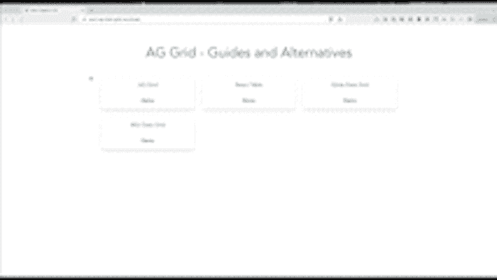
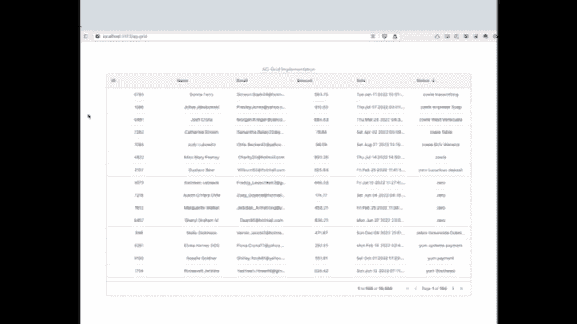
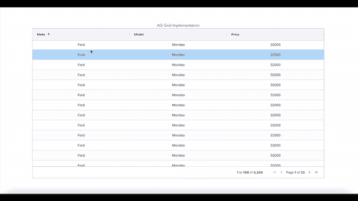
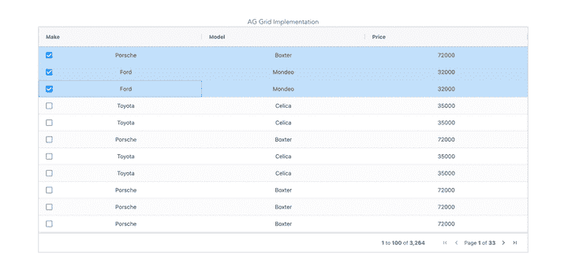
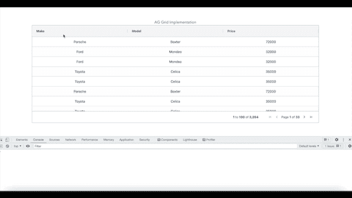
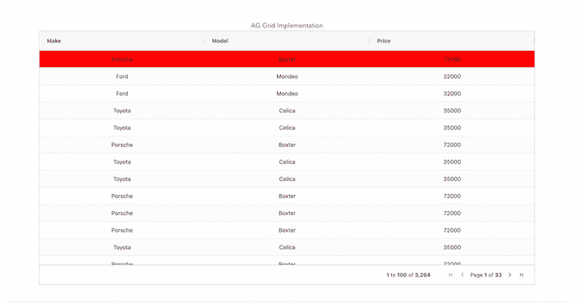
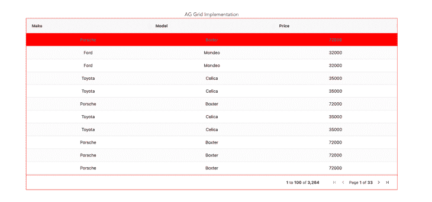
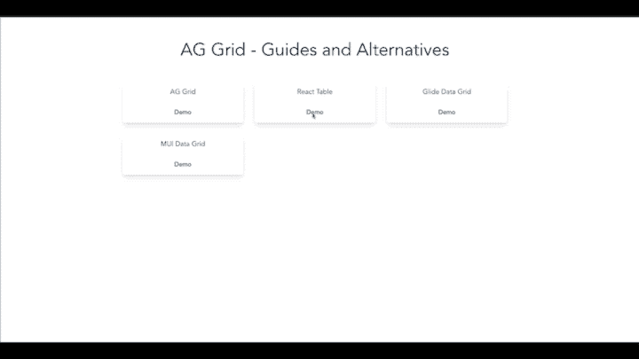
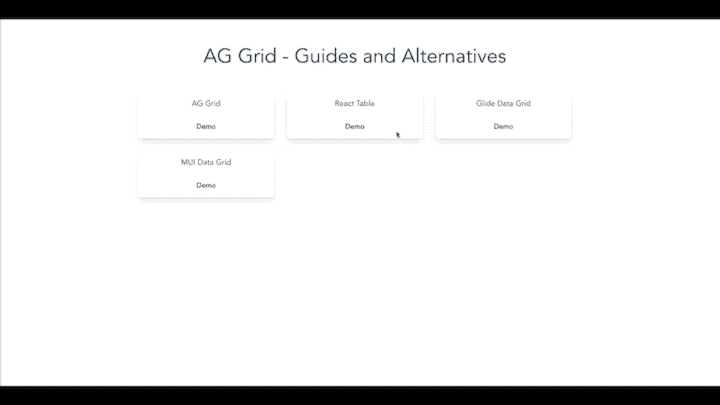
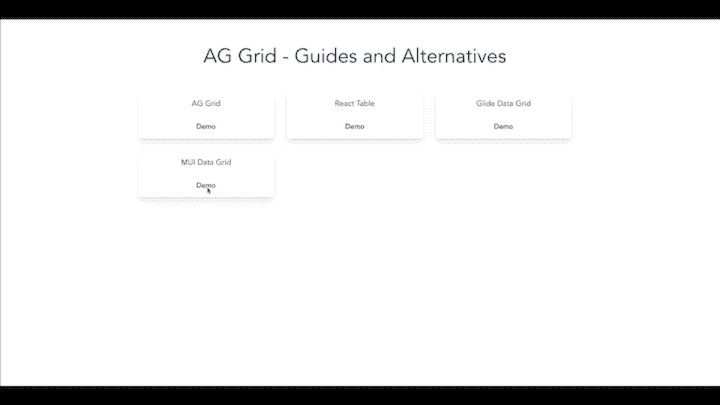

# 在 React 中使用 AG 网格:指南和替代方案

> 原文：<https://blog.logrocket.com/ag-grid-react-guide-alternatives/>

数据网格有助于有效地组织大量 web 应用程序数据，使用户更容易可视化数据。许多库可以帮助开发人员通过简单优雅的数据表和数据网格将数据合并到他们的应用程序中。

在本文中，我们将研究这样一个库，`ag-grid-react`。我们将演示如何使用 AG Grid 在 React 中构建数据网格，我们还将考虑其他替代方案。

在我们开始之前，您可以使用[这个数据网格演示](https://react-ag-data-grid.vercel.app/)来了解我们将在本指南中构建什么:



*向前跳转:*

## 数据网格和数据表有什么区别？

很容易混淆数据网格和数据表。两者在呈现数据的行和列方面都有相似的用例，但相似之处仅此而已。数据网格和数据表有不同的实现。

数据表使用`<table>`元素作为底层 DOM 来呈现表格。数据网格使用嵌套的`<div>`来呈现一个表格，允许它有效地实现分组、过滤和排序等功能。

数据表通常更适合呈现只需以表格格式显示的静态数据。数据网格更适合呈现具有较高用户交互的数据。在本文中，我们将重点关注构建交互式数据网格。

## 开始使用`ag-grid-react`

AG Grid 入门很简单。我们将从安装`ag-grid-react`和`ag-grid-community`包开始，如下所示:

```
npm install ag-grid-react ag-grid-community

```

现在，我们可以通过导入`AgGridReact`组件来使用`ag-grid-react`库:

```
import { AgGridReact } from "ag-grid-react";

 <AgGridReact
   rowData={mockTransactionData()}
   columnDefs={mockTransactionDataColumns()}
 />

```

`AgGridReact`需要两个道具，`rowData`和`columnDefs`。`rowData`代表数据本身；`columnDefs`代表列名和属性。

为了填充数据表，我们将使用`@faker-js/faker`来获取模拟数据。创建一个`utils/data.ts`文件，并添加以下代码来生成模拟数据:

```
import { faker } from "@faker-js/faker";
export const mockTransactionData = () => {
  return Array.from({ length: 10000 }, (_, i) => ({
    id: i,
    name: faker.name.fullName(),
    email: faker.internet.email(),
    amount: faker.finance.amount(),
    date: faker.date.past(),
    status: faker.random.words()
  }));
};
export const mockTransactionDataColumns = () => {
  return [
    { field: "id", headerName: "ID", width: 100 },
    {
      field: "name",
      headerName: "Name",
      width: 200,
      sortable: true,
      filter: "agSetColumnFilter",
      filterParams: {
        caseSensitive: true
      }
    },
    { field: "email", headerName: "Email", width: 200 },
    { field: "amount", headerName: "Amount", width: 200 },
    { field: "date", headerName: "Date", width: 200 },
    { field: "status", headerName: "Status", width: 200 }
  ];
};

```

这里，我们按照`AgGridReact`组件生成数据。我们有以下栏目:

*   `field`:表示列名；当我们将`rowData`传递给组件时，它应该匹配列名
*   `headerName`:表示在 UI 中显示的别名；我们可以向该字段传递不同的名称，以便在 UI 中显示它
*   `width`:我们可以单独指定每一列的宽度

一旦我们创建了生成模拟数据的函数，我们就可以用它来填充数据网格:

```
import { FunctionComponent } from "react";
import { AgGridReact } from "ag-grid-react";
import { mockTransactionData, mockTransactionDataColumns } from "./utils/data";
import "ag-grid-community/styles/ag-grid.css";
import "ag-grid-community/styles/ag-theme-alpine.css";
interface TableProps {}
const Table: FunctionComponent<TableProps> = () => {
  return (
    <>
      <h2>AG Grid Implementation</h2>
      <div
        className="ag-theme-alpine"
        style={{
          height: "90vh",
          width: "100%"
        }}
      >
        <AgGridReact
          rowData={mockTransactionData()}
          columnDefs={mockTransactionDataColumns()}
        ></AgGridReact>
      </div>
    </>
  );
};
export default Table;

```

你可以在这里访问 AgGridReact 组件[的基本版本。](https://codesandbox.io/s/getting-started-ag-grid-react-5cr636)

`ag-grid-react`提供了许多配置选项；在本文的教程部分，我们将更详细地讨论这个问题。

## 用 AG Grid 构建数据网格

现在我们知道了如何用`ag-grid-react`构建数据网格组件，让我们使用这个库来构建一个功能完整的数据网格。

一些常见的数据网格功能是分页、过滤、排序和搜索。为了实现这些功能，我们需要在列配置中启用它们。

首先创建一个默认的列配置，启用数据网格中的所有功能:

```
 const defaultColDef = useMemo<ColDef>(() => {
    return {
      editable: true,
      enableRowGroup: true,
      enablePivot: true,
      enableValue: true,
      sortable: true,
      resizable: true,
      filter: true,
      flex: 1,
      minWidth: 100,
    };
  }, []);

```

这里，我们使用了`editable`属性，该属性使列可编辑。我们还可以通过添加`sortable`布尔属性来集成排序。以下是列属性的摘要:

*   `editable`:使该列默认可编辑
*   `sortable`:为每一列提供排序功能
*   `filter`:如果通过了`true/false`过滤器，则提供过滤功能
*   `resizable`:使列能够调整大小

下面，我们可以看到这些属性的作用:



我们可以用不同的属性配置每一列，也可以用默认配置配置所有列。这里，我们传递了`defaultColDef`属性，该属性将配置应用于所有列。

一旦我们创建了`defaultColDef`属性，我们就可以在`AgGridReact`组件中配置它:

```
<AgGridReact
          rowData={mockTransactionData()}
          columnDefs={mockTransactionDataColumns()}
          defaultColDef={defaultColDef}
          pagination={true}
></AgGridReact>

```

我们还可以通过将`pagination`添加到组件中来启用它。值得注意的是，它支持客户端分页，但不支持服务器端分页。

一些有趣且有用的数据网格选项是`rowSelection`和`animateRows`。这些属性在用户筛选和排序时设置多行选择和动画:



当我们设置多行选择时，建议使用复选框以获得更好的用户体验。启用复选框既简单又容易。我们需要做的就是将`checkboxSelection`添加到列中:

```
 const [columnDefs, setColumnDefs] = useState<any>([
    {
      field: "make",
      headerName: "Make",
      checkboxSelection: true,
      width: 150,
    },
    {
      field: "model",
      headerName: "Model",
      width: 150,
    },
    {
      field: "price",
      headerName: "Price",
      width: 150,
    },
  ]);

```



## 用钩子将 AG 网格添加到 React 应用程序

在向 React 应用程序添加 AG Grid 时，有一些最佳实践可以遵循，以避免意外行为并确保高效的性能。

我们可以使用`useState`、`useMemo`、`useCallback`或`useEffect`钩子来实现 AG 网格。我们来看看吧！

### `useState`

总是用`useState`定义行和列，以避免每次父组件渲染时都必须重新定义行和列:

```
 const [rowData, setRowData] = useState([]);
 const [columnDefs, setColumnDefs] = useState<any>([
  {
    field: "make",
    headerName: "Make",
    width: 150,
  },
  {
    field: "model",
    headerName: "Model",
    width: 150,
  },
  {
    field: "price",
    headerName: "Price",
    width: 150,
  },
]);

return(
 <AgGridReact
    rowData={rowData}
    columnDefs={columnDefs}
    defaultColDef={defaultColDef}
    pagination={true}
  ></AgGridReact>
);

```

### `useMemo`

当我们定义默认的列配置时，总是推荐使用`useMemo`，因为[这个钩子的](https://blog.logrocket.com/rethinking-hooks-memoization/) [默认配置一旦初始化](https://blog.logrocket.com/rethinking-hooks-memoization/)就不会改变:

```
const defaultColDef = useMemo<ColDef>(() => {
    return {
      editable: true,
      enableRowGroup: true,
      enablePivot: true,
      enableValue: true,
      sortable: true,
      resizable: true,
      filter: true,
      flex: 1,
      minWidth: 100,
    };
  }, []);

```

在定义了默认列的配置之后，我们可以将它集成到`AgGrid`组件中:

```
<AgGridReact
    rowData={rowData}
    columnDefs={columnDefs}
    defaultColDef={defaultColDef}
    pagination={true}
  ></AgGridReact>

```

### `useCallback`

`AgGrid`组件提供了`props`来监听单元格和行的点击。`onCellClicked`接受一个回调函数，每当用户单击网格中的单元格时，这个函数就会被调用。

每当用`AgGrid`定义回调时(无论是用事件监听器还是用网格选项)，我们都应该用`useCallback`包装回调函数，以避免不必要的重新呈现和重新设置列和行定义:

```
const cellClickedListener = useCallback(
  (e: CellClickedEvent<HTMLButtonElement>) => {
    console.log("cellClickedListener", e);
  },
  []
);

return (
 <AgGridReact
    rowData={rowData}
    columnDefs={columnDefs}
    defaultColDef={defaultColDef}
    pagination={true}
    rowSelection="multiple"
    animateRows={true}
    onCellClicked={cellClickedListener}
  ></AgGridReact>
)

```



### `useEffect`

我们还可以使用`useEffect`钩子从服务器获取数据，并在组件状态中设置它，就像这样:

```
useEffect(() => {
    fetch("https://www.ag-grid.com/example-assets/row-data.json")
      .then((result) => result.json())
      .then((rowData) => setRowData(rowData));
  }, []);

```

## 设计 AG Grid 数据网格的样式

AG Grid 提供了一组预定义的[主题](https://www.ag-grid.com/react-data-grid/themes/)。一旦我们选择了要配置的主题，我们就可以通过覆盖 CSS 变量来定制它。

这里，我们将在组件中使用`ag-theme-alpine`:

```
import "ag-grid-community/styles/ag-grid.css";
import "ag-grid-community/styles/ag-theme-alpine.css";

```

为了定制它，我们可以覆盖`App.css`文件中的 CSS 变量。例如，为了改变所选行的背景颜色，我们覆盖了`App.css`文件中的主题 CSS 变量:

```
 .ag-row-selected::before {
  background-color: #646cff !important;
}

```



我们还可以通过覆盖 CSS 变量来改变数据网格的边框颜色。下面，我们将边框从灰色改为红色:

```
.ag-theme-alpine {
  --ag-border-color: #ff0000 !important;
}

```



下面是我们的`ag-grid-react`数据网格的最终版本:


在将库集成到您的应用程序之前，了解它的优点和缺点是很重要的。让我们来看看:

## AG 网格的优势

`ag-grid-react`库提供了几个优势:

*   **容易实现**:要在应用程序中实现`ag-grid-react`，我们只需要导入它的组件和样式，并在应用程序中使用它们；与其他数据网格库相比，定义行和列很简单
*   **内置功能**:`AgGrid`组件自带分页、排序、过滤和搜索等内置功能。我们需要做的就是在列中启用它们，然后根据需求对它们进行配置
*   **支持大部分框架** : AG Grid 支持 Angular、React、Vue.js、vanilla JavaScript 等主流框架和库。因为它提供了内置的支持，所以它有助于处理每个框架的所有功能和配置

## AG 网格的缺点

在考虑`ag-grid-react`库时，需要记住以下几个限制:

*   **对样式框架的支持有限** : AG Grid 缺乏关于样式框架的文档。为了定制行、列甚至分页的样式，我们必须覆盖由`ag-grid-react`库提供的现有样式。集成像顺风 CSS 或布尔玛这样的样式框架也很困难
*   **有限定制**:AG Grid 的定制极具挑战性，因为它的所有特性都是预先配置好的。因此，我们必须覆盖现有的样式，然后用我们自己的定制替换它，而不是简单地将样式应用于功能

## 农业电网的替代方案

决定使用哪个数据网格库很大程度上取决于您的特定用例。让我们来看看 AG Grid 的一些流行替代方案。我们将为每个库构建一个数据网格，并考虑每个库的内置特性，以便您可以更好地比较每个库。

### 转换表(以前称为反应表)

以前叫做 React Table， [TanStack Table](https://tanstack.com/table/v8) 是一个用于构建数据表和数据网格的无头 UI。

为了[使用 TanStack 表](https://blog.logrocket.com/react-table-complete-guide/)构建数据网格，我们将通过运行以下命令在应用程序中安装`react-table`依赖项:

```
npm install react-table

```

由于`react-table`是无头的，我们可以通过集成`react-table`钩子来实现该功能，如下所示:

```
const {
    getTableProps,
    getTableBodyProps,
    headerGroups,
    prepareRow
    state: { pageIndex, pageSize },
  } = useTable(
    {
      columns,
      data,
      defaultColumn
    }
  );

```

这里有一个简单的带有`columns`和`data`的`useTable`钩子，我们可以通过它来呈现数据。它提供了可以集成到 DOM 元素中的属性。例如，我们需要做的就是将`getTableProps`集成到`<table>` DOM 中，使其像数据网格一样工作:

```
<table className="min-w-full divide-y divide-gray-200" {...getTableProps()}>
  <thead>
    {headerGroups.map((headerGroup) => (
      <tr {...headerGroup.getHeaderGroupProps()}>
        {headerGroup.headers.map((column) => (
          <th
            className="px-6 py-3 bg-gray-50 text-left text-xs leading-4 font-medium text-gray-500 uppercase tracking-wider"
            {...column.getHeaderProps()}
          >
            {column.render("Header")}
          </th>
        ))}
      </tr>
    ))}
  </thead>

  <tbody className="bg-white divide-y divide-gray-200" {...getTableBodyProps()}>
    {page.map((row, i) => {
      prepareRow(row);
      return (
        <tr {...row.getRowProps()}>
          {row.cells.map((cell) => {
            return (
              <td
                className="px-6 py-4 whitespace-no-wrap text-sm leading-5 font-medium text-gray-900"
                {...cell.getCellProps()}
              >
                {cell.render("Cell")}
              </td>
            );
          })}
        </tr>
      );
    })}
  </tbody>
</table>;

```

`headerGroups`包含关于标题及其属性的信息。它包含一个带有所需头部信息的`headers`数组，我们将这些信息传递到`columns`的`useTable`钩子中。

让我们看一个例子。这里有一个我们传递给`useTable`钩子的列数组:

```
 const columns = useMemo(
    () => [
      { Header: "Price", accessor: "price", show: true },
      { Header: "Shares", accessor: "shares", show: true },
      { Header: "Ticker", accessor: "ticker", show: true },
      { Header: "Ticket", accessor: "ticket", show: true },
      {
        Header: "Time",
        accessor: "time",
        Cell: (cellInfo: any) => {
          return (
            <Fragment>
              {moment(cellInfo.row.original.time).format("Do MMM YYYY")}
            </Fragment>
          );
        },
        show: true,
      },
    ],
    []
  );

```

在这里，我们可以根据需要配置列。TanStack Table 使用我们指定的名称呈现列。我们还可以根据自己的喜好格式化数据:

```
<th
  className="px-6 py-3 bg-gray-50 text-left text-xs leading-4 font-medium text-gray-500 uppercase tracking-wider"
  {...column.getHeaderProps()}
>
  {column.render("Header")}
</th>;

```

`column.render`主要渲染`<th>` DOM 元素内部的列。

现在我们有了一个基本的数据表，我们需要添加排序和分页功能。要向 TanStack 表添加排序，我们只需从`react-table`导入`useSortBy`:

```
import { useTable, useSortBy } from "react-table";

```

接下来，我们将它集成到`useTable`钩子中。一旦我们这样做了，排序将在所有需要该功能的列中启用。

```
 const {
    getTableProps,
    getTableBodyProps,
    headerGroups,
    prepareRow,
    state: { pageIndex, pageSize },
  } = useTable(
    {
      columns,
      data,
      defaultColumn,
      manualSortBy: true,
    },
    useSortBy
  );

```

实现分页可能有点棘手。但是 TanStack Table 的好处之一是我们可以完全控制功能。让我们用 TanStack 表实现服务器端分页，看看它是如何工作的。

首先，我们将从`react-table`导入分页挂钩，并将它们集成到`useTable`挂钩中:

```
import { useTable, usePagination, useExpanded, useSortBy } from "react-table";

```

`usePagination`提供了我们可以用来实现所需分页功能的属性:

```
 const {
    getTableProps,
    getTableBodyProps,
    headerGroups,
    prepareRow,
    page,
    canPreviousPage,
    canNextPage,
    pageOptions,
    pageCount,
    gotoPage,
    nextPage,
    previousPage,
    setPageSize,
    setHiddenColumns,
    state: { pageIndex, pageSize },
  } = useTable(
    {
      columns,
      data,
      defaultColumn,
      initialState: {
        pageIndex: 0,
        pageSize: 15,
        hiddenColumns: columns
          .filter((column: any) => !column.show)
          .map((column: any) => column.id),
      },
      manualPagination: true,
      manualSortBy: true,
      autoResetPage: false,
      pageCount: controlledPageCount,
    },
    useSortBy,
    useExpanded,
    usePagination
  );

```

正如您所看到的，`usePagination`提供了几个属性来实现 TanStack 表数据网格中的分页:

*   `page`:包含当前页面的所有数据。它呈现当前页面的数据
*   `canPreviousPage`:表示用户是否可以进入上一页。如果用户在第一页，它将是假的
*   `canNextPage`:类似于`canPreviousPage`；如果用户位于表的最后一页，则该值为假
*   `gotoPage`:允许用户转到表格中的特定页面
*   `nextPage`:帮助导航到表格中的下一页
*   `previousPage`:允许用户导航到表格中的前几页
*   `setPageSize`:设置数据表中页面的大小

现在，让我们将分页集成到组件中:

```
{
  Boolean(isPaginated) && (
    <Pagination>
      <PaginationIndex>
        page {pageIndex + 1} of {pageOptions.length}
      </PaginationIndex>{" "}
      <PagincationButtonContainer>
        {canPreviousPage ? (
          <PaginationButton onClick={() => previousPage()}>
            <LeftIconSpan>
              <BackButtonIcon />
            </LeftIconSpan>
            Back
          </PaginationButton>
        ) : null}
        {canNextPage ? (
          <PaginationButton onClick={() => nextPage()}>
            Next{" "}
            <RightIconSpan>
              <NextButtonIcon />
            </RightIconSpan>
          </PaginationButton>
        ) : null}
      </PagincationButtonContainer>
    </Pagination>
  );
}

```

现在我们在表中有了分页，我们需要实现当用户根据当前页面信息导航到下一页或上一页时获取数据的功能。为此，每当`pageIndex`改变时，我们必须从服务器获取数据:

```
  React.useEffect(() => {
    fetchData && fetchData({ pageIndex, pageSize });
  }, [fetchData, pageIndex, pageSize]);

```

如您所见，当`pageIndex`改变时，我们从父组件调用`fetchData`:



您可以在这里找到这个[t stack 表示例的完整代码。](https://github.com/ganeshmani/react-ag-data-grid/tree/main/src/components/ReactTable)

### 滑动数据网格

A [G](https://grid.glideapps.com) [立德](https://grid.glideapps.com)[D](https://grid.glideapps.com)[ATA](https://grid.glideapps.com)[G](https://grid.glideapps.com)[rid](https://grid.glideapps.com)是一个 React 数据网格组件，用于构建数据表和数据网格。它提供了完整的类型脚本支持。

要使用 Glide 数据网格构建数据网格，我们将通过运行以下命令在应用程序中安装`@glideapps/glide-data-grid`依赖项:

```
npm install @glideapps/glide-data-grid

```

现在，我们将创建一个组件`GlideDataGrid/index.tsx`，并将包导入组件:

```
import {
  DataEditor,
  GridColumn,
  GridCellKind,
  Item,
  GridCell
} from "@glideapps/glide-data-grid";

```

`DataEditor`是在我们的应用程序中呈现数据网格的组件。`GridColumn`表示数据网格中的一列。`Item`和`GridCell` ``represent types for column cell and cell items. We’ll add` DataEditor `给我们的分量，像这样:

```
<DataEditor
  getCellContent={getData}
  columns={columns}
  rows={data.length}
  width={1000}
  getCellsForSelection={true}
  keybindings={{ search: true }}
/>;

```

`columns`表示列及其属性。为了创建列，我们使用了一个`id`、`title`和其他属性:

```
const columns: GridColumn[] = [
    { id: "price", title: "Price", width: 200 },
    { id: "shares", title: "Shares", width: 200 },
    { id: "ticker", title: "Ticker", width: 200 },
    { id: "ticket", title: "Ticket", width: 200 },
    { id: "time", title: "Time", width: 200 },
  ];

```

`getData`根据列类型呈现数据。`getCellContent`为`getData`函数提供列和行属性:

```
 function getData([col, row]: Item): GridCell {
    switch (col) {
      case 0:
        return {
          kind: GridCellKind.Text,
          data: data[row].price ? data[row].price.toString() : "",
          allowOverlay: false,
          displayData: data[row].price ? data[row].price.toString() : "",
        };
      case 1:
        return {
          kind: GridCellKind.Text,
          data: data[row].shares ? data[row].shares.toString() : "",
          allowOverlay: false,
          displayData: data[row].shares ? data[row].shares.toString() : "",
        };
      case 2:
        return {
          kind: GridCellKind.Text,
          data: data[row].ticker ? data[row].ticker.toString() : "",
          allowOverlay: false,
          displayData: data[row].ticker ? data[row].ticker.toString() : "",
        };
      case 3:
        return {
          kind: GridCellKind.Text,
          data: data[row].ticket ? data[row].ticket.toString() : "",
          allowOverlay: false,
          displayData: data[row].ticket ? data[row].ticket.toString() : "",
        };
      case 4:
        return {
          kind: GridCellKind.Text,
          data: data[row].time ? data[row].time.toString() : "",
          allowOverlay: false,
          displayData: data[row].time ? data[row].time.toString() : "",
        };
      default:
        return {
          kind: GridCellKind.Text,
          data: "",
          allowOverlay: false,
          displayData: "",
        };
    }
  }

```

`getData`返回如下属性:

*   `kind`:表示单元格的类型。比如`Text`或者`Number`等。
*   `data`:映射我们传入单元格的数据；将数据存储为值
*   `allowOverlay`:启用配置，允许覆盖特定单元格
*   `displayData`:类似于传入单元格的数据的标签；该属性根据我们配置的名称显示数据

我们可以管理组件状态中的数据。在这里，我们获取数据并将其存储在组件中:

```
 useEffect(() => {
    fetchAPIData({ limit: 200, skip: 0, search: "" });
  }, []);

```



你可以在这里找到我们[滑翔数据](https://github.com/ganeshmani/react-ag-data-grid/tree/main/src/components/GlideDataGrid) [G](https://github.com/ganeshmani/react-ag-data-grid/tree/main/src/components/GlideDataGrid) [rid](https://github.com/ganeshmani/react-ag-data-grid/tree/main/src/components/GlideDataGrid) [例子](https://github.com/ganeshmani/react-ag-data-grid/tree/main/src/components/GlideDataGrid) [的完整代码。](https://github.com/ganeshmani/react-ag-data-grid/tree/main/src/components/GlideDataGrid)

### MUI 数据网格

MUI 是一个组件库，用于更快更有效地构建用户界面。它还提供了在应用程序中构建数据表和数据网格的组件。

要使用 MUI 数据网格构建数据表，首先要在应用程序中安装依赖项，如下所示:

```
npm install @mui/x-data-grid

```

接下来，创建组件`MUIDataGrid/index.tsx`并添加以下代码:

```
import { DataGrid, GridColDef } from "@mui/x-data-grid";

```

现在，将`DataGrid`导入到组件中；它将在应用程序中呈现数据网格:

```
import { FunctionComponent, useState, useEffect, Fragment } from "react";
import { DataGrid, GridColDef } from "@mui/x-data-grid";
import moment from "moment";
interface MUIDataGridProps {}
const MUIDataGrid: FunctionComponent<MUIDataGridProps> = () => {
  const [pageCount, setPageCount] = useState(0);
  const [pageSize, setPageSize] = useState(100);
  const [pageIndex, setPageIndex] = useState(0);
  const [data, setData] = useState([]);
  const [loading, setLoading] = useState(false);

  const columns: GridColDef[] = [
    { field: "price", headerName: "Price", flex: 1 },
    { field: "shares", headerName: "Shares", flex: 1 },
    { field: "ticker", headerName: "Ticker", flex: 1 },
    { field: "ticket", headerName: "Ticket", flex: 1 },
    { field: "time", headerName: "Time", flex: 1 }
  ];
  return (
    <Fragment>
      <h2>MUI Data Grid</h2>
      <div className="container mx-auto flex flex-col h-full">
        <div className="flex justify-center mt-8 h-full">
          <DataGrid
            rows={data}
            columns={columns}
            keepNonExistentRowsSelected
          />
        </div>
      </div>
    </Fragment>
  );
};
export default MUIDataGrid;

```

这里，`DataGrid`以`rows`和`columns`为道具渲染 UI。`columns`是一个接受`field`、`headerName`和`flex`等属性的数组。我们通过调用 API 传递数据，并将数据存储在组件状态中:

```
const fetchAPIData = async ({ limit, skip, search }: any) => {
    try {
      setLoading(true);
      const response = await fetch(
        `${
          import.meta.env.VITE_API_URL
        }/companies?limit=${limit}&skip=${skip}&search=${search}`
      );
      const data = await response.json();
      console.log("data", data);
      const rows = data.data.map((item: any) => {
        return {
          id: item._id,
          price: item.price,
          shares: item.shares,
          ticker: item.ticker,
          ticket: item.ticket,
          time: moment(item.time).format("Do MMM YYYY"),
        };
      });
      setData(rows);
      setLoading(false);
    } catch (e) {
      console.log("Error while fetching", e);
      // setLoading(false)
    }
  };

//useEffect hooks to fetch data...
useEffect(() => {
  fetchAPIData({ limit: pageSize, skip: pageSize * pageIndex, search: "" });
}, []);

```

`data`应该返回我们在`columns`中定义的字段。例如，我们有一个名为`price`的`field`列，所以数据应该有一个带值的`price`。

在我们用数据填充表格并呈现数据之后，我们将向数据表添加分页。MUI 提供了对分页的内置支持。我们可以通过将`pagination`添加到`DataGrid`组件来在 MUI 数据网格中配置它:

```
<DataGrid
  rows={data}
  columns={columns}
  pagination
  paginationMode={"server"}
  rowCount={pageCount}
  page={pageIndex}
  onPageChange={onPageChange}
  keepNonExistentRowsSelected
/>;

```

`paginationMode`定义是服务器端分页还是客户端分页。`page`管理当前页面索引。在这里，我们在组件状态下管理`pageIndex`。`onPageChange`功能有助于在用户进入下一页或上一页时获取更多数据:

```
setPageIndex(newPage);
    fetchAPIData({ limit: pageSize, skip: pageSize * newPage, search: "" });
  };
```

```
如您所见，我们设置了`pageIndex`并根据页面索引和页面大小获取数据:

您可以在这里找到我们的 [MUI 数据网格](https://github.com/ganeshmani/react-ag-data-grid/tree/main/src/components/MUIDataGrid) [示例的完整代码。](https://github.com/ganeshmani/react-ag-data-grid/tree/main/src/components/MUIDataGrid)
结论
在本指南中，我们介绍了`ag-grid-react`库的基本功能，并演示了如何使用 AG Grid 在 React 应用程序中构建和设计数据网格。为了比较 AG 网格的替代方案，我们还在 TanStack 表、Glide 数据网格和 MUI 数据网格中构建了一个类似的数据网格。每个库都有一套独特的特性和权衡，因此为您的用例选择最佳选项非常重要。
本文中的所有代码都可以在 GitHub 上找到。

## 使用 LogRocket 消除传统反应错误报告的噪音

[LogRocket](https://lp.logrocket.com/blg/react-signup-issue-free) 

是一款 React analytics 解决方案，可保护您免受数百个误报错误警报的影响，只针对少数真正重要的项目。LogRocket 告诉您 React 应用程序中实际影响用户的最具影响力的 bug 和 UX 问题。

 [](https://lp.logrocket.com/blg/react-signup-general) 
 [](https://lp.logrocket.com/blg/react-signup-general) 
[LogRocket](https://lp.logrocket.com/blg/react-signup-issue-free) 

自动聚合客户端错误、反应错误边界、还原状态、缓慢的组件加载时间、JS 异常、前端性能指标和用户交互。然后，LogRocket 使用机器学习来通知您影响大多数用户的最具影响力的问题，并提供您修复它所需的上下文。

关注重要的 React bug—[今天就试试 LogRocket】。](https://lp.logrocket.com/blg/react-signup-issue-free)

```