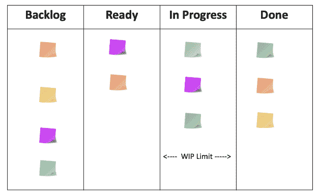
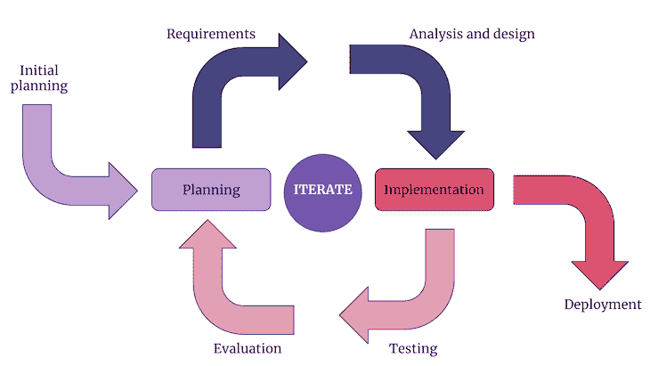
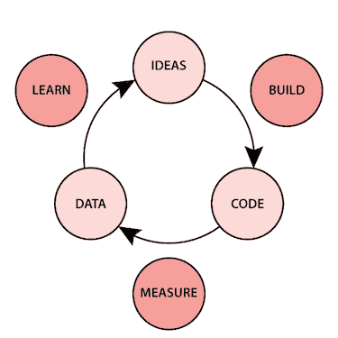

# 你需要知道的 3 个敏捷框架(除了 scrum)

> 原文：<https://blog.logrocket.com/product-management/agile-frameworks/>

[Shehab Beram Follow](https://blog.logrocket.com/author/shehabberam/) A purpose-driven technologist, product manager, and consultant. I write essays that help you get smarter at your product management game.

# 你需要知道的 3 个敏捷框架(除了 scrum)

## 

2023 年 3 月 2 日 4 分钟读完 1199 102

自从 2001 年发布以来，敏捷已经获得了极大的欢迎。敏捷是一套[原则和价值观](https://blog.logrocket.com/product-management/agile-manifesto-4-values-12-principles-explained/)，旨在帮助项目和产品团队交付更好的价值和更可靠的软件产品。

一个典型的误解是敏捷是一个过程，就像[瀑布](https://blog.logrocket.com/product-management/agile-vs-waterfall-comparing-project-management-cultures/)。然而，敏捷更多的是一种指导团队构建软件产品的思维模式和价值观。

在本指南中，我们将向你介绍最广泛使用的敏捷框架(除了 scrum 之外)。到本文结束时，您将理解在每个框架的上下文中您作为产品经理的角色。

* * *

## 目录

1.  [在 scrumban 中](#scrumban)
2.  [迭代开发](#iterativedevelopment)
3.  [精益软件开发](#leansoftwaredevelopment)

* * *

## 什么是敏捷框架？

根据 Zippia 的调查，超过 70%的科技公司使用某种敏捷方法。他们都有相似的思维模式，但是敏捷原则和价值观的实施因组织而异。

这就是我们使用框架的原因。框架是过程、工件、模板、仪式和工具的组合，使项目能够顺利运行。有几十种敏捷框架可供选择。

根据 Adeva 的最新报告，scrum 是科技公司中使用最多的框架。Scrumban 是下一个，接下来是内部创建的定制敏捷框架、迭代开发和精益开发。

拥有多种敏捷框架的背景将使您能够:

*   创建您自己的定制敏捷流程
*   迅速加入你加入的任何组织
*   修正和简化流程，加快执行速度

## 1.Scrumban

Scrumban 是一个结合了 scrum 和看板的轻量级框架。

Scrumban 最初是为了帮助产品交付团队从 scrum 过渡到看板而创建的。然而，它已经作为一个敏捷框架出现，并在全球范围内被采用。

Scrumban 信奉核心看板原则，例如关注流程、可视化工作流、限制正在进行的工作，以及持续调整和改进流程。它还利用了 scrum 仪式和工件，例如冲刺计划、每日 scrum、就绪定义(DoR)、冲刺评审和回顾。

Scrumban 允许产品团队遵循正常的 scrum 流程，同时通过使用看板中的在制品(WIP)限制而不是 sprint backlog 来最小化 sprint 期间的混乱。

Example of a scrumban board

一个典型的 scrumban 工作流程如下所示:

1.  产品经理准备一组任务(例如，特性、增强等。)，然后与工程师一起对其进行分析和培训
2.  产品团队(例如，开发人员、设计人员、产品经理)使用典型的评估方法执行冲刺计划，但是对于 scrumban
    1.  开发人员设置 WIP 限制来决定在 sprint 的任何阶段他们可以进行多少工作
    2.  产品经理与工程师一起确定工作的优先级，以了解市场和用户的优先级
3.  工程师和产品经理一起，开始将工作从待办事项清单中提取出来，放到看板上，并放在“待办事项”栏中
4.  工程师和工程经理就“做”什么以及谁将被分配什么达成一致
5.  工程师们执行这项工作。同时，在冲刺阶段，任务分解和当前正在进行的工作是可视化的

## 2.迭代开发

[迭代开发](https://blog.logrocket.com/product-management/what-is-iterative-incremental-development-process-examples/#what-is-iterative-development)是一个敏捷框架，帮助团队将产品开发过程分解成迭代。它是一个混合框架，将瀑布开发的原则(例如，前期策略、设计和分析)与[敏捷思维和价值观](https://blog.logrocket.com/product-management/agile-product-management-what-does-it-mean/)结合在一起。

迭代开发旨在帮助团队快速迭代遗留产品，避免花费太多时间规划公司投资组合中的低优先级产品。

迭代开发涉及两个主要的涉众:业务顾问(例如，产品经理/所有者)和解决方案团队(例如，开发团队)。

迭代开发项目的典型流程如下:

1.  商业顾问(产品经理)准备[产品策略](https://blog.logrocket.com/product-management/product-strategy-frameworks-examples/)，它包含了对问题的解释，将问题分解成小块的计划，高层次的需求，以及实现这些需求的最后期限
2.  在非正式讨论之后，业务顾问和解决方案团队一起开始开发周期。需要注意一些事情:
    1.  在与解决方案团队讨论之前，业务顾问应该准备好优先级
    2.  该周期应该持续 2-3 天，并在结束时交付一个工作产品
    3.  解决方案团队协商范围，并帮助业务顾问分解工作，以便在周期时间框架内交付
3.  在周期完成后，向所有利益相关方发送演示视频或测试链接。在迭代开发中，不需要正式的评审会议

## 3.精益软件开发

[精益开发](https://blog.logrocket.com/product-management/what-is-lean-product-management-how-to-apply/)是一个敏捷框架，由丰田创造的精益制造价值观、原则和实践发展而来。精益框架专注于优化团队的效率和减少产品开发流程中的浪费。

精益原则在科技公司中获得了广泛采用，因为它们:

*   消除不必要的活动和任务以降低成本
*   简化流程，在更短的时间内交付功能
*   授权开发人员决定什么可行，什么不可行

精益是灵活的。与 scrum 和 SAFe 等其他框架不同，没有围绕精益开发和产品管理的结构化过程；任何包含精益原则的项目都是精益项目。

精益启动方法建议开发一个[最小可行产品(MVP)](https://blog.logrocket.com/product-management/what-is-minimum-viable-product-mvp-how-to-define/) ，然后使用[构建-测量-学习反馈循环](https://medium.com/@dominic_11011/build-measure-learn-cycle-ace388a13b4d)，进一步改进产品:

Source: [Dominic Rogers](https://medium.com/@dominic_11011/build-measure-learn-cycle-ace388a13b4d)

采用精益方法意味着在你的团队中灌输以下精益原则:

*   **创造知识** —建立知识库，帮助您的团队保留知识。这些知识可以是关于用户(例如，用户角色)、市场(例如，[竞争格局分析](https://blog.logrocket.com/product-management/what-is-competitive-analysis-template-examples-tutorial/))或者任何可以加速未来工作的东西(例如，代码文档)
*   **推迟承诺** —尽可能保持敏捷。在没有充分分析市场和业务需求的情况下，不要承诺年度路线图。永远避免过度规划
*   **消除浪费** —通过避免镀金来帮助您的团队消除浪费，并通过建立明确的冲刺目标和主题来最大限度地减少任务转换
*   **在**中构建质量——通过考虑端到端的用户体验，并在分析阶段包括所有团队成员，您将覆盖大多数边缘案例，从而最小化质量差距
*   **快速交付** —通过不过度工程化产品需求，并有一个[持续发现过程](https://blog.logrocket.com/product-management/continuous-discovery-habits-product-team/)，你可以帮助你的团队在创纪录的时间内向你的用户交付价值
*   **优化整体** —不时地从整体上审视整个过程。这样做使您和您的团队成员能够通过价值流图来优化 it
*   尊重他人——这是一条适用于所有敏捷框架的清晰原则。总是优先考虑人而不是过程。尊重他人及其工作，通过有效的沟通鼓励健康的冲突

## 最后的想法

理解不同的敏捷框架将使你成为一个适应性很强的产品经理。这是因为敏捷，就其本质而言，不是一套工具和过程，而是一种思维模式和通用指南。

通过了解其他团队已经实施了什么，并评估什么有效，什么无效，您将能够更好地进行创新，并创建流程来更快地理解、执行和启动。

*精选图片来源:[icon scout](https://iconscout.com/icon/box-738)*

## [LogRocket](https://lp.logrocket.com/blg/pm-signup) 产生产品见解，从而导致有意义的行动

[LogRocket](https://lp.logrocket.com/blg/pm-signup) 确定用户体验中的摩擦点，以便您能够做出明智的产品和设计变更决策，从而实现您的目标。

使用 LogRocket，您可以[了解影响您产品的问题的范围](https://logrocket.com/for/analytics-for-web-applications)，并优先考虑需要做出的更改。LogRocket 简化了工作流程，允许工程和设计团队使用与您相同的[数据进行工作](https://logrocket.com/for/web-analytics-solutions)，消除了对需要做什么的困惑。

让你的团队步调一致——今天就试试 [LogRocket](https://lp.logrocket.com/blg/pm-signup) 。

[Shehab Beram Follow](https://blog.logrocket.com/author/shehabberam/) A purpose-driven technologist, product manager, and consultant. I write essays that help you get smarter at your product management game.