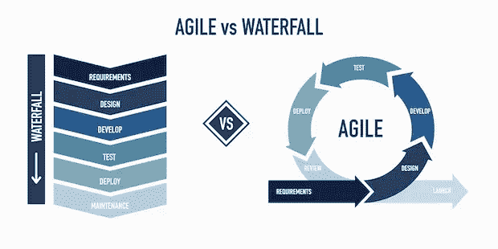
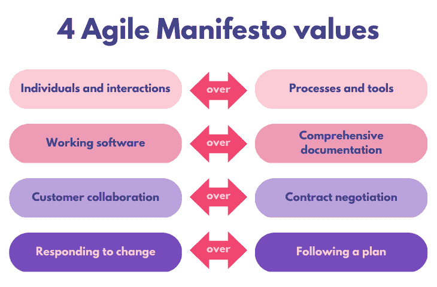
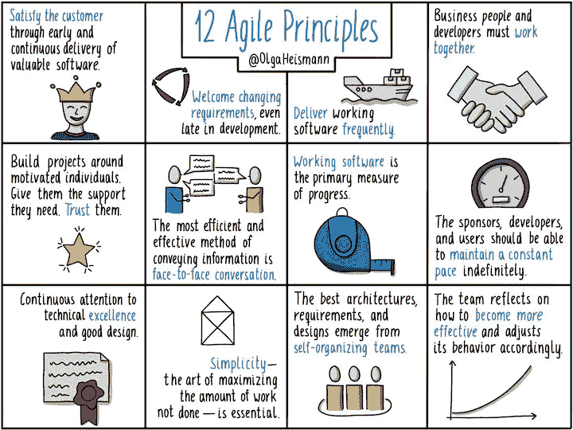

# 敏捷解释:4 个敏捷宣言价值观和 12 条原则

> 原文：<https://blog.logrocket.com/product-management/agile-manifesto-4-values-12-principles-explained/>

***编者按**:本文最后更新于 2022 年 12 月 29 日。*

敏捷宣言标志着敏捷的诞生，敏捷是一种专业的世界观，它以作者没有预料到的方式引发了创新，并远远超出了软件世界。

[敏捷宣言](https://agilemanifesto.org/)详细说明了指导高效软件产品开发的[四个价值观](#what-are-the-4-agile-manifesto-values)和 [12 条原则](#what-are-the-12-agile-manifesto-principles)。

在这本全面的指南中，我们将向您介绍[敏捷产品开发](https://blog.logrocket.com/product-management/12-agile-manifesto-principles-how-to-adopt-them/)的概念，然后分解敏捷宣言，重点关注其四个价值观和 12 条原则。

* * *

在我们进入敏捷宣言的[历史和其原则如何在实践中实现的](#a-brief-history)[详细分解](#breaking-down-the-agile-manifesto)之前，让我们快速回顾一下它的价值观和原则:

## 敏捷宣言的 4 个价值观是什么？

敏捷宣言的四个价值观是:

1.  [流程和工具上的个人和交互](#individuals-and-interactions-over-processes-and-tools)
2.  [综合文档之上的工作软件](#working-software-over-comprehensive-documentation)
3.  [合同谈判中的客户协作](#customer-collaboration-over-contract-negotiation)
4.  [按照计划响应变更](#responding-to-change-over-following-a-plan)

## 敏捷宣言的 12 条原则是什么？

敏捷宣言中概述的[作为](#what-are-the-12-agile-manifesto-principles)[的敏捷软件开发](https://agilemanifesto.org/principles.html)的 12 条原则如下:

1.  我们最优先考虑的是通过早期和持续交付有价值的软件来满足客户。
2.  *[欢迎不断变化的需求](#2-welcome-changing-requirements)，即使在开发后期。敏捷流程利用变化为客户带来竞争优势。*
3.  *[频繁地交付工作软件](#3-deliver-working-software-frequently)，从几个星期到几个月，偏好更短的时间尺度。*
4.  在整个项目中，业务人员和开发人员必须每天一起工作。
5.  *[围绕有积极性的个人建立项目](#5-build-projects-around-motivated-individuals)。给他们需要的环境和支持，相信他们能完成工作。*
6.  向开发团队传达信息以及在团队内部传达信息的最有效的方法是[面对面的交谈](#6-face-to-face-conversation)。
7.  工作软件是进度的主要衡量标准。
8.  敏捷流程促进可持续发展。赞助商、开发者和用户应该能够无限期地保持恒定的步调(T2)。
9.  *[持续关注技术优势](#9-pay-continuous-attention-to-technical-excellence)和良好的设计增强敏捷性。*
10.  简单性——最大化未完成工作量的艺术——至关重要。
11.  最好的架构、需求和设计来自于[自组织团队](#11-trust-your-team)。
12.  团队定期反思如何变得更有效率，然后[相应地调整自己的行为](#12-reflect-and-adapt)。

点击上面的跳转链接(或者继续滚动)来了解 12 条敏捷原则在实践中的含义以及如何在你的组织中应用。这些原则中有许多是相互交织的，所以预计会看到很多重叠。

* * *

## 目录

* * *

## 什么是敏捷？

[敏捷](https://blog.logrocket.com/product-management/agile-product-management-what-does-it-mean/)是一种围绕构建产品的思维模式和哲学，支持协作、以客户为中心，并期待和响应变化。

一个常见的误解是敏捷是关于开发速度或速率的；它不是。同样与流行观点相反的是，敏捷既不是方法论，也不是框架。这些标签是为更具体、更规范的敏捷模型保留的。

例如，scrum 是一个流行的敏捷“框架”的例子——一组将敏捷价值观和原则付诸实践的指令。思想领袖和咨询公司创造了许多敏捷模型。这些框架不应该与敏捷本身混淆。

* * *

## 什么是敏捷宣言？

[敏捷宣言](https://agilemanifesto.org/)是一个 68 个字的简短声明，为有意义、高效、持续的软件开发建立了一个广泛的目的和价值体系:

> 我们通过自己动手和帮助他人来发现开发软件的更好方法。通过这部作品我们得出了价值:
> 
>  **   *个人和交互超过流程和工具*
> *   *工作软件结束综合文档*
> *   *客户协作超过合同谈判*
> *   *响应计划变更*
> 
> 也就是说，当右边的项目有价值时，我们更重视左边的项目。*

 *不要让陈述的简洁欺骗了你；这些话很有力。敏捷宣言改变了技术世界，影响了所有行业的团队工作方式，不仅仅是软件。

### 简史

敏捷宣言确立了敏捷产品开发的概念。这份简短而大胆的声明是由 17 名经验丰富的软件工程师在 2001 年撰写和签署的，其中一些人从 20 世纪 60 年代和 70 年代就开始编写代码。当时可用的机器和编程语言和它们支持的业务一样慢。计算机服务于精英科学用例多于商业。

在整个 20 世纪 70 年代和 80 年代，[瀑布](https://blog.logrocket.com/product-management/agile-vs-waterfall-comparing-project-management-cultures/)或“重量级”实践主导了产品开发，重点放在前期规划和文档上。进入新千年，这些专家已经在当时被称为“轻量级”软件开发实践上进行合作。

Source: [Easy Agile](https://www.easyagile.com/blog/agile-software-development-life-cycle/)

20 世纪 90 年代流行的轻量级框架是 Crystal、Extreme Programming 和今天最流行的框架。这些主要框架的创建者和其他人都是敏捷宣言的签署者。

今天，敏捷是标准。这一切都始于敏捷宣言。

* * *

## 分解敏捷宣言

敏捷宣言由一个简单的序言、四个价值观和一个阐明句子组成。让我们深入研究每个元素，并更详细地解释它的含义。

### 前言:持续学习至关重要

敏捷宣言的第一句话是最被忽视和最低调的。虽然看起来无关紧要，但签名者说这个序言[实际上花了相当多的时间来编写](https://www.thoughtworks.com/en-us/insights/podcasts/technology-podcasts/20-years-agile#:~:text=Yeah%2C%20although%20interestingly,a%20fixed%20answer)。

人们经常在不考虑介绍的情况下提到这四个价值观，但是建立一个不断变化和改进以及慷慨大方的哲学是很重要的:

> 我们通过自己动手和帮助他人来发现开发软件的更好方法。

让我们变得更加细化，放大敏捷宣言的前五个词:*“我们正在发现更好的方法……”*

拥护敏捷宣言意味着致力于持续改进——换句话说，就是快乐地永远不满足。从那以后，我们应该记住别人的发现给了我们多大的帮助。分享学习成果；总是有新的知识需要学习。

我在 [sprint 回顾会](https://blog.logrocket.com/product-management/what-is-a-sprint-retrospective-templates-and-best-practices/)、事后分析、经理和/或同事反馈、演进过程和[完成定义(DoDs)](https://blog.logrocket.com/product-management/what-is-definition-of-done-agile-examples/) 中看到了这种情况——分享学习和倾听他人的理解对任何敏捷项目都至关重要。如果你环顾四周，看到许多过程已经有一段时间没有改变，你可能没有“发现更好的方法”

世界变了，生活也变了。敏捷意味着拥抱变化和[持续学习](https://blog.logrocket.com/product-management/what-is-continuous-improvement-process-methodologies/)。

### 结尾的转折

纵观这四种价值陈述，很容易忘记这些都不是坏事。均衡陈述的要点是一部分是好的，但另一部分更好。

在我们深入探讨这四个价值观之前，让我们跳到最后一点，敏捷宣言告诉我们如何正确解读这些价值观。这也很重要，但经常被遗忘:

> 也就是说，虽然右边的项目有价值，但我们更看重左边的项目。

当我们回顾敏捷宣言的四个价值观时，我们应该认识到右边是好的，但是左边更有价值。

* * *

### 4 个敏捷价值观

敏捷宣言中规定的 4 个价值观如下:

1.  [流程和工具上的个人和交互](#individuals-and-interactions-over-processes-and-tools)
2.  [综合文档之上的工作软件](#working-software-over-comprehensive-documentation)
3.  [合同谈判中的客户协作](#customer-collaboration-over-contract-negotiation)
4.  [按照计划响应变更](#responding-to-change-over-following-a-plan)

敏捷意味着全力以赴。敏捷宣言的第一个价值可能是最超前的。作者知道人很重要，合作是必不可少的。

通过查看 12 条敏捷原则，我们可以推断出更多的意图，这些原则是对基本价值观的阐述。

Source: [@OlgaHeismann](https://twitter.com/OlgaHeismann/status/1394911259913555974)

在 12 条敏捷原则中，至少有 6 条涉及人际关系:

*   原则 4 建立了一种新的关系，“业务人员和开发人员必须每天一起工作”
*   原则 5 说“围绕有动力的个人建立项目。给他们需要的环境和支持”
*   原则 6 宣称“面对面的交谈”是最好的交流方式
*   原则 8 介绍了“赞助商、开发者和用户”之间的共生关系
*   原则 11 声称最好的可交付成果来自“自我组织的团队”
*   原则 12 鼓励团队“思考如何变得更有效”并相应地调整

重要的是要记住应该如何解释这些 even over 语句。陈述的右边(过程和工具)是有价值的。然而，个体和互动更有价值。为了重新表述第一个敏捷宣言的价值，我们可能会说，“过程和工具是好的，但是个人和他们的交互更重要。”

在现实世界中，我已经在由[产品](https://blog.logrocket.com/product-management/what-does-a-product-manager-do-role-responsibilities/)、[工程](https://blog.logrocket.com/product-management/how-top-product-managers-work-engineers/)、[设计](https://blog.logrocket.com/product-management/product-designer-vs-product-manager/)、[质量保证](https://blog.logrocket.com/product-management/what-is-quality-assurance-qa-software-development/)、[数据分析](https://blog.logrocket.com/product-management/what-is-data-democratization-why-does-it-matter/)，甚至[营销利益相关方](https://blog.logrocket.com/product-management/product-marketing-manager-job-description-role-skills/)组成的[跨职能团队](https://blog.logrocket.com/product-management/what-cross-functional-team-how-build/)中看到了这种情况——在一个团队中日复一日地工作，解决客户问题。

#### 2.综合文档之上的工作软件

虽然敏捷宣言的第一个价值可能是四个价值中最基础的，但是第二个价值可能是今天最有争议的。对“工作软件”的强调经常给现代技术专业人士敲响警钟。只有“工作”的软件有什么了不起的？

我有一个朋友是一家大公司的产品经理。在开发产品的过程中，他们花了长达一年的时间深入研究用户，讨论[客户见解](https://blog.logrocket.com/product-management/consumer-insights-how-to-use-examples/)，却没有向客户交付任何东西。最终，他们产生了一个小的、无关紧要的功能，不能满足任何真正的客户需求。

因此，在这种情况下，每个人都想成为哲学家，与客户产生共鸣，但没有人能真正做到这一点。

现在推出一个[最小可行产品(MVP)](https://blog.logrocket.com/product-management/what-is-minimum-viable-product-mvp-how-to-define/) 比很久以后推出一个“完美”产品要好。当然,“工作的”产品不是最终目标，但它是向客户和企业交付价值所必需的。如果我们不发货，那么我们实际上完成了什么？

根据敏捷宣言，全面的文档是好的。这就是 even over 语句的工作方式。例如，第二个价值可以重新表述为，“文档是好的，但是交付工作软件更重要。”没有文档的产品比有文档但没有产品更好。

* * *

订阅我们的产品管理简讯
将此类文章发送到您的收件箱

* * *

#### 3.合同谈判中的客户协作

在第三个敏捷宣言的价值中，提到“合同协商”会让一些读者感到困惑。请记住，声明的右边仍然是有价值的，所以合同谈判是好的。但是我们谈论的合同谈判是什么？

合同谈判是指工作中涉及的任何协议，无论是内部的还是外部的。是的，这包括任何政治交易和供应商文件，但还不止这些。许多敏捷专业人士会将合同谈判解释为还包括[截止日期](https://blog.logrocket.com/product-management/how-to-meet-product-deadlines/)、预算协议，以及与内部利益相关者或客户的范围协议。

现代的解释可能是，“商业承诺是好的，但客户的声音应该放在第一位。”

我看到敏捷团队通过[在执行之前优先考虑研究和发现工作](https://blog.logrocket.com/product-management/product-discovery-vs-delivery/)来实现这一价值，以确保构建正确的解决方案。我见过粒度甘特图被季度和月度[甘特图](https://blog.logrocket.com/product-management/gantt-charts-step-by-step-guide-modern-teams/)或更高级别的[现在-下一个-以后路线图](https://medium.com/the-creative-strategist/why-now-next-later-is-one-of-the-best-frameworks-for-roadmapping-4d547a2f2692)所取代。

#### 4.响应变化而不是遵循计划

第四个也是最后一个敏捷宣言价值断言，遵循计划是好的，但是响应变化更有价值。

在 20 世纪 80 年代和 90 年代的轻量级框架之前，组织可能已经花了数年时间来规划解决方案，然后又花了数年时间来构建解决方案。当最初的解决方案准备就绪时，问题已经发展到足以使解决方案变得无用。这些类型的经验和观察引导工程师寻找开发软件的更好方法。

我想起了美国前总统德怀特·艾森豪威尔的一句名言:“计划什么都不是；规划就是一切。”关键是，制定计划是件好事，但他们应该始终考虑到围绕他们的不确定性。计划有多灵活就有多好。

* * *

### 12 条敏捷原则

作为回顾和快速参考，12 个敏捷宣言原则(简写)如下:

1.  [让顾客满意](#1-satisfy-the-customer)
2.  [欢迎变更需求](#2-welcome-changing-requirements)
3.  [频繁交付工作软件](#3-deliver-working-software-frequently)
4.  [每天一起工作](#4-work-together-daily)
5.  [围绕有积极性的个人建立项目](#5-build-projects-around-motivated-individuals)
6.  [面对面交流](#6-face-to-face-communication)
7.  [通过工作产品衡量进度](#7-measure-progress-by-working-products)
8.  [无限期保持恒定的配速(马拉松，而不是短跑)](#8-maintain-a-constant-pace-indefinitely)
9.  [持续关注技术优势](#9-pay-continuous-attention-to-technical-excellence)
10.  [保持简单](#10-keep-it-simple)
11.  [相信你的团队能够自我组织](#11-trust-your-team)
12.  [反映和适应](#12-reflect-and-adapt)

* * *

#### 1.让顾客满意

> 我们最优先考虑的是通过尽早和持续交付有价值的软件来满足客户。

##### 这是什么意思？

作为敏捷专家，我们相信通过快速和定期地交付有价值的产品和功能来减轻客户的痛苦。为什么？我们可以更快地获得反馈，以改善和增加对客户的价值，因为我们知道我们从来没有第一次就完全正确。

##### 如何应用敏捷原则 1

*   关注客户的问题
*   构建最低限度的可行产品
*   用最少的有价值的过程操作
*   在你的团队中培养学习和迭代的文化

* * *

#### 2.欢迎不断变化的需求

> 欢迎不断变化的需求，即使是在开发后期。敏捷流程利用变化为客户带来竞争优势。

##### 这是什么意思？

拥抱不确定性。环境在不断变化，而变化是我们可以利用的优势。为了具有竞争力，我们不仅应该预见变化，而且应该欢迎变化。

##### 如何应用敏捷原则 2

*   [更频繁地更新冲刺目标](https://blog.logrocket.com/what-is-sprint-planning-guide-meeting-agenda-cheat-sheet/#do-you-need-to-set-a-sprint-goal)中期冲刺
*   当需求改变时，不要惊讶，为他人定下基调
*   庆祝你的团队转向
*   利用[不断发现](https://blog.logrocket.com/product-management/dual-track-agile-continuous-discovery/)的习惯来跟上客户问题和市场

* * *

#### 3.经常交付工作软件

> 频繁地交付可工作的软件，从几周到几个月，优先考虑较短的时间尺度。

##### 这是什么意思？

一步一步来。更频繁地发布较小的产品更新有很多好处。定期运送较小的增量并能够快速部署可降低风险。此外，您可以通过更频繁地交付和更快地学习来增加业务价值。

##### 如何应用敏捷原则 3

*   通过做一些小的改变(例如，一些代码中的注释)来测试你的团队能多快得到一个变化。这将有助于你衡量自己所处的位置，并优化你应对变化的能力
*   把故事分成更小的片段。需要一些灵感吗？考虑一下只有一个点的故事或者只有可以在一天之内交付的故事会是什么样子

* * *

#### 4.每天一起工作

> 在整个项目过程中，业务人员和开发人员必须每天一起工作。

##### 这是什么意思？

“商务人士”包括哪些人？我将这个短语解释为指不在技术团队中的任何人，例如，产品、设计、营销利益相关者等。当然，这取决于你希望实现的组织、项目或结果。

无论涉及到谁，透明度和协作都应该成为日常常态。

##### 如何应用敏捷原则 4

*   考虑邀请其他风险承担者参加团队会议，同时根据需要管理对角色和职责的期望
*   使[计划](https://blog.logrocket.com/product-management/what-is-sprint-planning-guide-meeting-agenda-cheat-sheet/)和[路线图](https://blog.logrocket.com/product-management/how-to-build-product-roadmap-overview-examples/)工件更容易访问，这样其他人可以跟踪进度，提出问题或提供反馈
*   创建一个团队的视觉效果，但是根据官方的组织结构图，包括技术上可能不在同一个团队的同事
*   使用一个开放的空闲频道(或选择聊天工具),而不是保持私密

* * *

#### 5.围绕有积极性的个人构建项目

> 围绕有动力的个人建立项目。给他们需要的环境和支持，相信他们能完成工作。

##### 这是什么意思？

第五个敏捷原则中包含了很多词汇:动机、环境、支持、信任——而个人是所有这些的中心。

一个支持性的环境对不同的人有不同的意义。归根结底就是要了解你的团队，以及如何与团队中的个人沟通和支持他们。

##### 如何应用敏捷原则 5

您可能会发现这个原则最具挑战性，因为它不能被孤立到组织中的特定级别。例如，作为一个产品经理，你的手可能会在许多方面受到束缚。

也就是说，有些事情总是在你的掌控之中。要改善经理的工作环境，您可以:

* * *

#### 6.面对面交流

> 向开发团队传达信息的最有效的方法是面对面的交谈。

##### 这是什么意思？

视频会议工具让“面对面”的对话变得前所未有的轻松，但它们仍然不能完全取代面对面的交流。

与此同时，远程工作有许多优势，所以这并不意味着团队必须在同一地点。

##### 如何应用敏捷原则 6

*   [打开您的视频](https://blog.logrocket.com/product-management/10-ways-to-inspire-your-agile-team/#keep-cameras-on)
*   不时亲自见面
*   不要羞于接受快速呼叫来实时解决问题(例如，使用 Slack 的 huddle 功能)
*   使用文本时，加入表情符号反应，以避免对你的语气产生混淆

* * *

#### 7.通过工作产品衡量进展

> 工作软件是进度的主要衡量标准。

##### 这是什么意思？

基本上，它的意思是穿过 BS。第七条敏捷原则规定，工作软件是"*主要的*进度度量，"但是一些人感到惊慌，因为他们读到的是"*唯一的*进度度量"。

在一个我们重视[客户问题陈述](https://blog.logrocket.com/product-management/what-is-customer-centricity-how-to-achieve-it/)、[花哨的视觉框架](https://blog.logrocket.com/product-management/product-strategy-frameworks-examples/)、[用户研究](https://blog.logrocket.com/product-management/why-how-conduct-customer-interviews/)、[市场研究](https://blog.logrocket.com/product-management/what-is-market-share-definition-formula-how-to-grow/)、[分析](https://blog.logrocket.com/product-management/what-metrics-kpis-product-managers-track/)和人类学的世界里，这个原则可能会感觉有些脱节。

虽然这些因素很重要，但如果我们在现实生活中没有任何工具来帮助客户，它们又有什么用呢？

##### 如何应用敏捷原则 7

* * *

#### 8.无限期保持恒定的配速(马拉松，不是短跑)

> 敏捷流程促进可持续发展。发起人、开发人员和用户应该能够无限期地保持恒定的步调。

##### 这是什么意思？

敏捷意味着疲劳、熬夜和最后一分钟的紧急情况应该很少发生。跨职能团队应该计划以可持续的速度前进。这也可以通过采用其他敏捷原则来支持。

##### 如何应用敏捷原则 8

人们在阅读第八条原则时经常犯的一个错误是误解了“速度”这个词大多数情况下，“保持恒定的步调”意味着团队应该放慢速度，而不是加快速度。提前计划并建立系统，使其能够正常应对变化。

* * *

#### 9.持续关注技术优势

> 对卓越技术和优秀设计的持续关注增强了敏捷性。

##### 这是什么意思？

你应该为自己的手艺感到自豪。美国橄榄球联盟著名主教练文斯·隆巴迪曾说过:“完美是无法实现的，但如果我们追求完美，我们就能实现卓越。”超级碗就是以他的名字命名的

第九条敏捷原则不追求完美；我们应该承认，在科技领域，卓越是一个快速变化的目标，要实现它需要“持续的关注”。

##### 如何应用敏捷原则 9

*   举办午餐学习和“自带午餐”教育机会
*   及时将[技术债务](https://blog.logrocket.com/product-management/what-is-technical-debt-examples-prioritize-avoid/)纳入 sprints
*   培养一种文化，鼓励团队成员保持高质量和可持续的实现，以获得长期的敏捷性

* * *

#### 10.保持简单

> 简单——最大化未完成工作量的艺术——至关重要。

##### 这是什么意思？

乍一看，这个短语似乎违反直觉，经常给人奇怪或不必要的困惑，但它实际上相当深刻。基本上，它意味着少即是多。

最大化未完成的工作量需要从多做少做的思维转变。本质上，这意味着你花更多的时间去做必要的事情，而不是浪费更多的时间去复杂化你的过程。

##### 如何应用敏捷原则 10

*   理解你工作的原因和愿景
*   想想什么是真正需要的。考虑一个简单的框架，比如[莫斯科](https://en.wikipedia.org/wiki/MoSCoW_method)或者需求与美好拥有
*   确定问题的最简单解决方案，并考虑权衡

* * *

#### 11.相信你的团队能够自我组织

> 最好的架构、需求和设计来自自组织团队。

##### 这是什么意思？

最好的工作来自被允许在他们之间计划和执行的团队。

原则 11 不是关于无政府状态或某种进步的运作模式，在这种模式下，人们组成自己的部落，做他们想做的事情——记住，这句话写于 2001 年。

第 11 条敏捷原则的要点是，被激励和支持的个人是可信的，并被允许沉浸在问题空间中，并提出最佳解决方案。

当然，信任不会凭空出现，所以这个建议有时候说起来容易做起来难。

##### 如何应用敏捷原则 11

*   创建有动力和授权的团队组织。对这些团队进行框架问题以及发散和收敛思维的培训
*   创建跨职能团队，最大限度地减少依赖性
*   思考[如何衡量团队](https://blog.logrocket.com/product-management/what-are-okrs-how-to-write-templates-examples/)以及这鼓励了什么行为

* * *

#### 12.反思和适应

> 团队定期反思如何变得更有效率，然后相应地调整自己的行为。

##### 如何应用敏捷原则第 12 条

团队经常犯的第一个错误是[运行太可预测和太正式的冲刺回顾](https://blog.logrocket.com/product-management/how-to-run-effective-sprint-retrospectives-20-formats-ideas/)。注意这个敏捷原则没有提到时间框架；这个团队反思没有名称或结构。

第二个错误(通常源于第一个错误)是缺乏责任感；通常，没有对行动项目的跟进或跟踪。我不认为回顾式对话中的每一个观察都需要有行动项目。然而，当行动项目被定义时，您应该建立一些责任来确保取得进展。

##### 如何应用这一原则

*   定期向你的团队和同事汇报
*   必要时跟踪后续步骤
*   开心点，真诚点

* * *

### 12 条敏捷原则不是什么

既然你已经看到并理解了所有 12 个敏捷宣言原则是什么，让我们回顾一下它们是什么*不是*。

敏捷原则不是一种方法，也不是方法的一部分。这些原则也不是真正的框架。在敏捷世界中，框架是一组更规范的规则、系统和过程，帮助团队将敏捷原则付诸行动。

敏捷原则是为敏捷宣言的更高层次的价值增加更多色彩的陈述。这些是专业人士的具体立场，他们在一个越来越不可预测的世界中重视持续学习和改进。

* * *

## 敏捷宣言在今天仍然适用吗？

从各方面考虑，我认为敏捷宣言已经相当成熟了。它仍然是一套为科技和商业专业人士提供健康挑战的价值观。

不仅敏捷宣言仍然有用，软件开发之外的许多其他行业也采用了它。简单地调整几个“软件”的引用，对帮助营销团队、人力资源和许多其他人更有效地交付有价值的成果大有帮助。

尽管有几十个敏捷宣言的替代方案、扩展和 T2 呼吁完全替换，但普遍的共识是这个文档非常好地经受了时间的考验。批评者的观点经常被误导，没有说服力，或者只是没有增加足够的价值来获得广泛的关注。现在有如此多的内容，一个新的敏捷宣言将需要是革命性的，以获得牵引力。

* * *

## 敏捷宣言 TL；灾难恢复摘要

总结一下这个敏捷宣言指南的要点:

*   序言是宣言中最容易被忽视的部分，它鼓励人们在前进的道路上不断“发现更好的方法”和“帮助他人”
*   第一个价值是最超前的，它将人、协作、包容和关系置于敏捷的中心。用现代软件开发的这个价值来解释:过程和工具是有价值的，但是人和关系更重要
*   第二个价值是当今最有争议的，因为它支持“工作软件胜过全面的文档”。现代释义:健壮的文档很好，但是实际交付解决方案更好
*   由于“合同谈判”和“客户”的模糊性，第三个价值最容易被误解。现代释义:承诺是好的，但做正确的事情更好
*   第四个价值是敏捷的核心:“响应变化，而不是遵循计划”

*精选图片来源:[icon scout](https://iconscout.com/icon/agile-5804828)*

## [LogRocket](https://lp.logrocket.com/blg/pm-signup) 产生产品见解，从而导致有意义的行动

[LogRocket](https://lp.logrocket.com/blg/pm-signup) 确定用户体验中的摩擦点，以便您能够做出明智的产品和设计变更决策，从而实现您的目标。

使用 LogRocket，您可以[了解影响您产品的问题的范围](https://logrocket.com/for/analytics-for-web-applications)，并优先考虑需要做出的更改。LogRocket 简化了工作流程，允许工程和设计团队使用与您相同的[数据进行工作](https://logrocket.com/for/web-analytics-solutions)，消除了对需要做什么的困惑。

让你的团队步调一致——今天就试试 [LogRocket](https://lp.logrocket.com/blg/pm-signup) 。

[Jordan Lamborn Follow](https://blog.logrocket.com/author/jordanlamborn/) Product manager, passionate about understanding customers and helping people with problems that matter to them. Experienced in SQL, experimentation, data analysis, research, no-nonsense SEO. I also invented self-driving vehicles.*