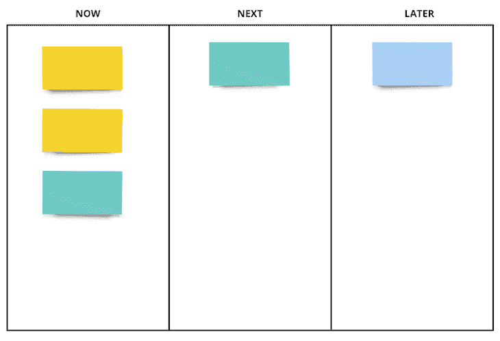
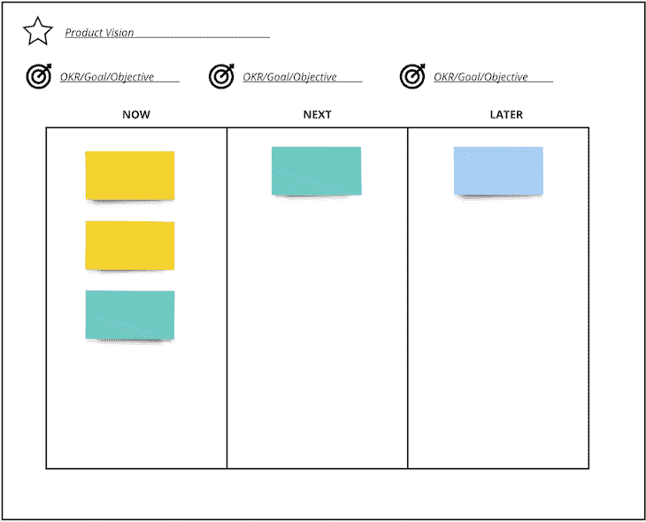
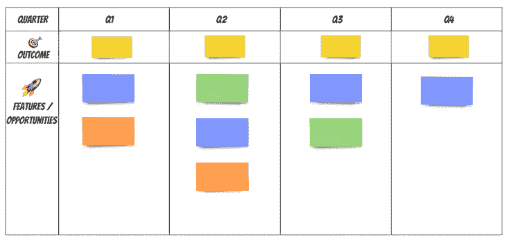
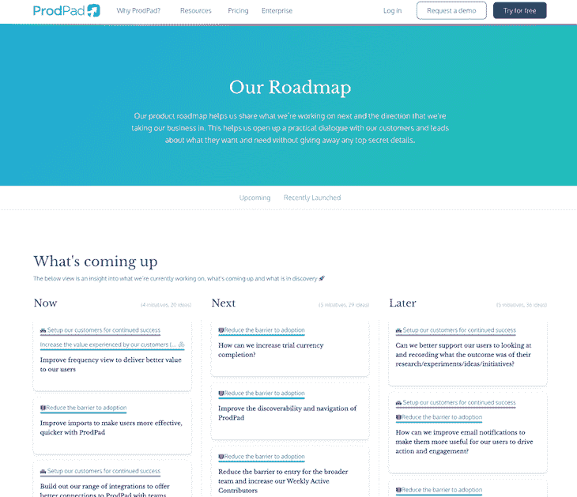
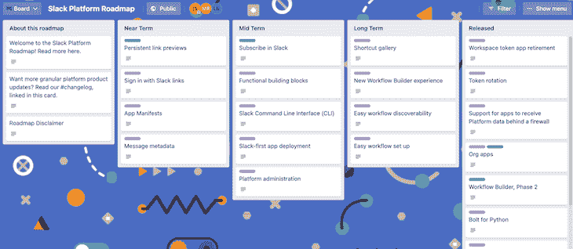
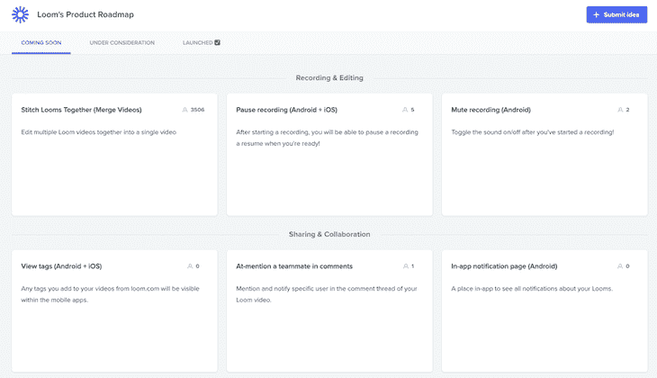
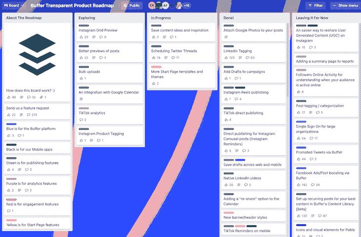
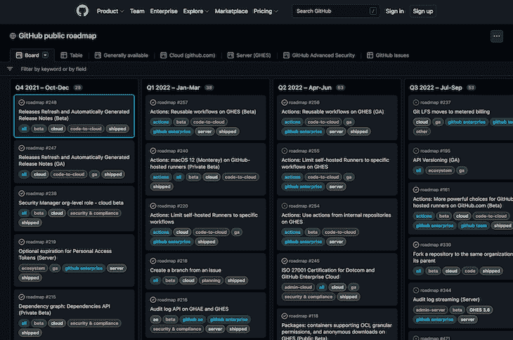
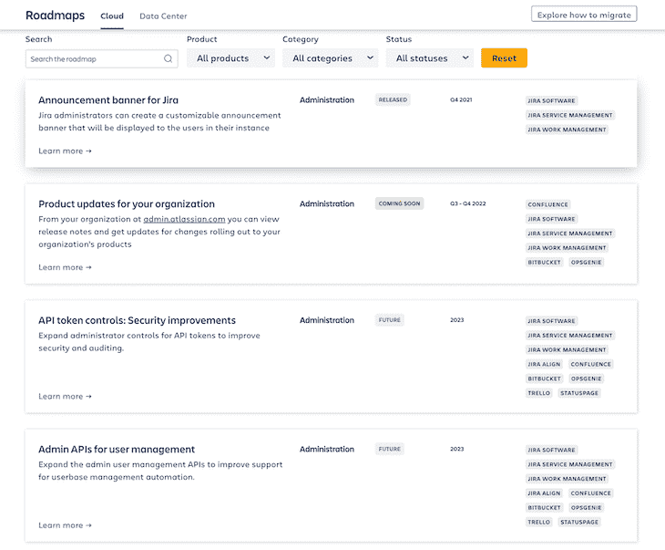

# 敏捷路线图:例子、框架和如何创建一个博客

> 原文：<https://blog.logrocket.com/product-management/agile-roadmaps-examples-how-to-create/>

## 目录

* * *

## 什么是敏捷路线图？

[产品负责人和产品经理](https://blog.logrocket.com/product-management/product-manager-vs-product-owner/)使用路线图来沟通产品的未来方向。重点通常是新的特性和功能，但不一定局限于这些项目。

尽管典型的[产品路线图](https://blog.logrocket.com/product-management/how-to-build-product-roadmap-overview-examples/)可能会显示这些增强的预期发布日期，但是在敏捷中，遵守截止日期的概念变得违反直觉。

Example of a typical product roadmap with dates

[敏捷开发](https://blog.logrocket.com/product-management/four-agile-manifesto-values-explained/)要求能够在任何特定时刻对变化做出反应，并解决不断发展的需求。敏捷团队也花更少的时间[估计和预测某件事要花多长时间](https://blog.logrocket.com/product-management/planning-poker-agile-estimation-scrum/)，并把这些时间放回实验和实际构建产品上。

因此，我们期望事情在敏捷中改变，日期很快成为一厢情愿的想法或空洞的承诺。

敏捷的另一个核心原则是固定容量。我们通过创建稳定、长期、跨职能团队来实现这一目标。这样做，我们固定了我们的能力，意味着范围和/或时间是变化的维度。因此，在 agile 中无法将功能锁定到日期。

当我们想在敏捷中确定日期时，范围是灵活的。在敏捷中，范围和时间都不能固定。

Agile paradigm shift from fixing scope and time and then estimating the cost and resources needed to fixing capacity and allowing scope and time to be flexible.

因此，敏捷路线图消除了[产品期限](https://blog.logrocket.com/product-management/how-to-meet-product-deadlines/)的概念。他们仍然保持时间的概念(即，特性 A 将在特性 B 之前出现)，但是没有任何东西被绑定到特定的日期。

## 是什么让产品路线图变得敏捷？

为了理解是什么让路线图变得敏捷，我们首先需要强调敏捷团队的几个[核心原则。](https://blog.logrocket.com/product-management/12-agile-manifesto-principles-how-to-adopt-them/)

首先，如前所述，敏捷团队寻求对变化做出反应。我们不是固定范围和/或时间，而是在敏捷中固定容量。

在此基础上，范围和/或时间必须灵活。这是因为，在敏捷中，我们重视我们对变化做出反应的能力，而不是在特定的时间框架内交付计划的工作范围。

敏捷的第二个核心概念是关注价值——更具体地说，是结果而不是产出。敏捷团队明白，交付一个新的功能或产品并不意味着人们会自动使用它，为它付费，并从中获得价值——而且，无论如何，这些东西不一定会转化为更好的业务成果(例如，[收入](https://blog.logrocket.com/product-management/product-managers-role-each-product-lifecycle-stage/#revenue)，[客户支持](https://blog.logrocket.com/product-management/what-is-product-experience-examples-how-to-improve-px/)，[保留](https://blog.logrocket.com/product-management/what-is-customer-retention-rate-how-to-calculate/)等)。

因此，在敏捷产品开发中，简单地按时交付并不是成功的核心衡量标准。花费太多的时间和金钱来交付对客户或业务没有影响的东西是有风险的。

敏捷路线图去掉了时间线。更高级的敏捷路线图也更关注结果，而不是将一系列功能或任务放入有时间限制的版本中。

## 敏捷路线图框架

让我们详细看看两个最流行的敏捷产品路线图框架:

### 现在-下一个-以后

最常见的敏捷路线图模型被称为 [Now-Next-Later 路线图](https://medium.com/the-creative-strategist/why-now-next-later-is-one-of-the-best-frameworks-for-roadmapping-4d547a2f2692):

将项目分为“现在”、“下一个”和“以后”这几个类别，这样可以更加灵活。下一篇和后续专栏文章中的内容可能会频繁变化，而不会影响对交付内容的确切时间的预期。这使得改变和调整你的路线图变得容易。

“现在-下一个-以后”还提供了一个时间的概念，但不允许作品从属于时间。我们知道“现在”组中的事物将很快到来，“下一个”组中的事物将在“现在”组中的事物之后到来，而“后一个”组中的事物将在未来的某个阶段到来。这允许有足够的信息来帮助设定期望值，而不损害灵活性。

如前所述，更高级的敏捷路线图将会传达团队当前努力的结果。它们也可能预示着未来可能的结果。

Example of a Now-Next-Later agile product roadmap with outcomes and product vision

### 四分之一

如果走向零时间线对你和你的公司来说是一个太大的飞跃，许多敏捷团队采用的一个快乐的中间地带是将工作分成几个部分。

与“现在-下一个-以后”类似，使用季度提供了灵活性，只要在该季度内某样东西将被交付。使用这种模型的一个不利之处是，当某些事情超出了季度，它可能会被解释为低于预期。

使用季度的敏捷路线图如下所示:

## 如何创建敏捷路线图

每个敏捷路线图看起来都不一样，并且取决于您的产品和公司的独特需求和愿景，但是下面列出的步骤是创建您自己的敏捷路线图的良好起点:

1.  [打造你的产品愿景](#craft-your-product-vision)
2.  [制定你的产品策略](#formulate-your-product-strategy)
3.  [设置结果(可选)](#set-outcomes-optional)
4.  [绘制您的路线图](#map-out-your-roadmap)
5.  [分享、回顾和改编](#share-review-and-adapt)

### 1.打造你的产品愿景

任何形式的[产品路线图](https://blog.logrocket.com/product-management/product-roadmap-tools-best-features-free-paid/)的第一步是确保你对产品有一个清晰的愿景。你的[产品愿景](https://blog.logrocket.com/product-management/what-is-a-product-vision-statement-examples/)应该告知路线图上的内容。

### 2.制定你的产品策略

策略是一组选择。在这种情况下，你需要就如何实现你的产品愿景做出一系列选择。这些选择包括你打算首先关注哪些市场，你打算解决哪些客户问题，你希望你的产品展示什么原则，你希望它具有什么品牌特征，你在市场中的[定位](https://blog.logrocket.com/product-management/what-is-product-positioning-examples-strategies-template/)等等。

一个[产品战略](https://blog.logrocket.com/product-management/product-strategy-frameworks-examples/)并不是一成不变的，但是这些选择是你路线图的关键。

### 3.设置结果(可选)

你策略过程中的最后一个问题应该是，“我如何知道我是否成功了？”

要回答这个问题，你需要[制定一套目标](https://blog.logrocket.com/product-management/what-are-okrs-how-to-write-templates-examples/)。这些应该是结果的形式，有明确的衡量标准，你打算用它来知道你是否达到了那个结果。

产品指标也特别重要，因为它们有助于表明我们是否在朝着正确的方向前进。例如，您可能希望看到更多的[月活跃用户(MAU)](https://blog.logrocket.com/product-management/what-product-management-metrics-matter-most-to-pms/#engagement-usage-metrics) ，更高的保留率，甚至更多的定制指标，如从特定竞争对手转移过来的新客户的百分比。

### 4.绘制您的路线图

一旦你有了自己的愿景、战略和目标/结果，是时候将它们转化为实际工作了。从这里开始，你需要将它们分解成[史诗、机会、用户故事](https://blog.logrocket.com/product-management/what-is-an-epic-in-agile-guide-examples/)等等。

使用你的策略和选择的目标，你应该能够立即开始[区分](https://blog.logrocket.com/product-management/sprint-backlog-how-to-prioritize-examples/) [z](https://blog.logrocket.com/product-management/sprint-backlog-how-to-prioritize-examples/) [e](https://blog.logrocket.com/product-management/sprint-backlog-how-to-prioritize-examples/) 的优先次序，并沿着现在-下一个-以后的时间表安排工作。

### 5.分享、回顾和适应

不言而喻，一旦你有了路线图，你需要[沟通和验证](https://blog.logrocket.com/product-management/how-to-communicate-product-strategy/)它。确保您的团队和利益相关者贯穿您的路线图。

这应该是一个持续的过程。随着您了解的越来越多，事情也在发生变化，请确保您定期回顾您的路线图，做出必要的调整，然后将这些变化传达出去。

## 敏捷产品路线图示例

敏捷路线图最适合于产品开发和需要频繁响应变化的敏捷团队。

敏捷路线图被全世界的产品团队所采用。公共敏捷路线图的一些很好的例子包括如下。

### prodad

ProdPad 是敏捷路线图的先驱。它的[公共产品路线图](https://www.prodpad.com/about-us/our-roadmap/)使用的是 Now-Next-Later 格式。

### 松弛的

Slack 的敏捷产品路线图是 Now-Next-Later 格式的变体。它将项目分组到标有“近期”、“中期”、“长期”和“已发布”的桶中。

### 织布机

Loom 的 roadmpas 也使用了 Now-Next-Later 敏捷路线图模型的变体，有三个标签，分别是即将推出、正在建设和已经推出。

### 缓冲器

Buffer 还使用了一个[敏捷路线图](https://trello.com/b/PDIV7XW3/buffer-transparent-product-roadmap)。它的模型将项目分为几类，分别标为探索中、进行中、完成和暂时搁置。

### 开源代码库

与上面描述的路线图不同， [Github 的敏捷路线图](https://github.com/orgs/github/projects/4247)被分成几个部分。

### 亚特兰蒂斯人

尽管没有采用[看板格式](https://blog.logrocket.com/product-management/what-is-scrumban-methodology-how-to-implement/)，Atlassian 在他们的路线图中使用了类似于“现在-下一个-以后”和“季度”的两种状态。

特性被标记为未来、即将推出和已发布。它们也有相应的日期，随着发布日期的临近，日期会越来越精确。

例如，未来的项目用一个指示性的年份标记，而即将到来的项目用一个大概的季度标记。

* * *

订阅我们的产品管理简讯
将此类文章发送到您的收件箱

* * *

## 关键要点

您可能会想，“这在我的组织中永远不会起作用。”但是，尽管看起来有些违反直觉，敏捷路线图可能是一股新鲜空气。

当我们沿着时间线精心绘制出特征时，我们实际上多久会遇到这些日期呢？敏捷路线图试图接受这样一个现实，即我们很少能满足我们最初设定的时间表。事实是，构建产品本质上是不确定的，事情是变化的。

此外，我们必须适应市场和用户的变化，以保持竞争力。当我们有与日期相关的特性时，我们经常发现自己每周都要花几个小时随着事情的变化不断更新路线图。然后，我们花费无数时间更新利益相关者和客户。

所有这些时间都被从更重要的事情上拿走了，例如[了解我们的客户](https://blog.logrocket.com/product-management/what-is-product-experience-examples-how-to-improve-px/)，制定产品策略，以及实际构建产品。

你是愿意花时间纠结于路线图上的日期，还是努力向客户交付价值？我知道我会选择哪一个。

*精选图片来源:[icon scout](https://iconscout.com/icon/location-pins-1640895)*

## [LogRocket](https://lp.logrocket.com/blg/pm-signup) 产生产品见解，从而导致有意义的行动

[LogRocket](https://lp.logrocket.com/blg/pm-signup) 确定用户体验中的摩擦点，以便您能够做出明智的产品和设计变更决策，从而实现您的目标。

使用 LogRocket，您可以[了解影响您产品的问题的范围](https://logrocket.com/for/analytics-for-web-applications)，并优先考虑需要做出的更改。LogRocket 简化了工作流程，允许工程和设计团队使用与您相同的[数据进行工作](https://logrocket.com/for/web-analytics-solutions)，消除了对需要做什么的困惑。

让你的团队步调一致——今天就试试 [LogRocket](https://lp.logrocket.com/blg/pm-signup) 。