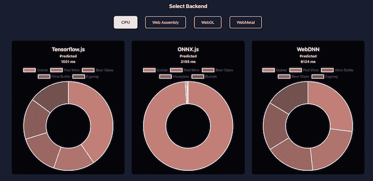
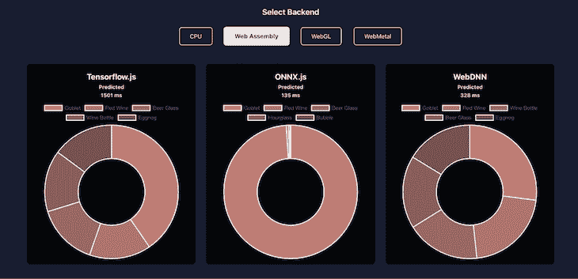
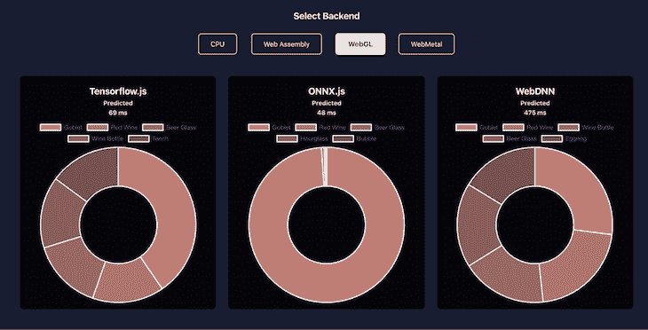
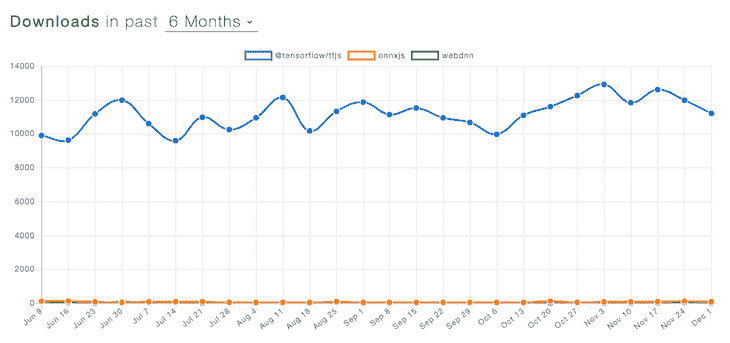

# 浏览器中的人工智能:比较 TensorFlow、ONNX 和 WebDNN 的图像分类

> 原文：<https://blog.logrocket.com/ai-in-browsers-comparing-tensorflow-onnx-and-webdnn-for-image-classification/>

[Zain Sajjad Follow](https://blog.logrocket.com/author/zainsajjad/) Head of Product Experience at Peekaboo Guru. In love with mobile machine learning, React, React Native, and UI designing.

# 浏览器中的人工智能:比较 TensorFlow、ONNX 和 WebDNN 用于图像分类

## 

2019 年 12 月 6 日 3 分钟阅读 1051 年

web 已经从世界上最广泛使用的文档平台转变为最广泛使用的应用程序平台。在过去的几年里，我们看到了人工智能领域的巨大发展。Web 作为一个平台正在取得巨大的进步，允许开发人员利用人工智能的进步来提供一些优秀的体验。今天，我们有了具有强大处理能力的设备和能够充分利用它们的浏览器。

科技巨头已经投入大量资金，让开发者更容易将人工智能功能与他们的网络应用一起发布。今天，我们有许多库在浏览器内部执行复杂的人工智能任务。在本文中，我们将比较允许我们在浏览器中执行图像识别的三个主要库。

## 三个主要的图像分类库

在我们开始之前，让我们回顾一下 TensorFlow.js、ONNX.js 和 WebDNN 的基础知识(如果您已经熟悉这些库，可以随意滚动到下一节)。

### TensorFlow

在谷歌的支持下， [TensorFlow.js](https://www.tensorflow.org/js) 允许用户用 JavaScript 开发机器学习模型，[直接在浏览器](https://blog.logrocket.com/tensorflow-js-an-intro-and-analysis-with-use-cases-8e1f9a973183/)或 Node.js 中使用 ML。它使开发人员能够在浏览器中训练和执行模型，并使用他们的数据通过迁移学习来重新训练现有模型。最近对 Keras.js 的收购已经为 TensorFlow 带来了一些重大改进，并准备进一步增强图书馆的能力。

### ONNX.js

开放神经网络交换(ONNX)是一种用于表示机器学习模型的开放标准。ONNX 由合作伙伴社区开发和支持，包括 AWS、脸书开源、微软、AMD、IBM 和英特尔 AI。 [ONNX.js](https://github.com/microsoft/onnxjs) 使用 web worker 和 web assembly 的组合来实现非凡的 CPU 性能。

### webdyn

当涉及到获得准确的结果时，深度神经网络显示出巨大的前景。与 TensorFlow 等库相反， [MIL WebDNN](https://mil-tokyo.github.io/webdnn/) 为深度学习应用提供了一种高效的架构，如使用卷积和递归神经网络的图像识别和语言建模。该框架优化了经过训练的 DNN 模型，以压缩模型数据并加速其执行。它使用新颖的 JavaScript APIs(如 WebAssembly 和 WebGPU)执行，以实现零开销执行。

## 比较性能

为了评估所有三个库的性能，我们开发了一个 react 应用程序，它使用 Squeezenet 模型进行图像分类。让我们来看看结果。

### CPU 上的推理

这三个库都支持多后端，但是使用 CPU 作为旧浏览器的后备。除了将 WebAssembly 和 WebWorker 作为后端，ONNX.js 和 WebDNN 还将原生 JavaScript 作为不同的后端。我们把我们的红酒给了所有三个图书馆，看看他们的评价。

Ahen 说到 CPU 推断，如下图，TensorFlow.js 以 1501ms 的华丽速度领先，ONNX.js 以 2195ms 紧随其后。WebDNN 和 ONNX.js 都有其他可以被视为 CPU 后端的 WASM 后端，因为它们不使用 GPU。

### WebAssembly 上的推理

WASM 已经成为 web 应用程序的最佳性能助推器之一，现在可以在所有主流浏览器上使用。WASM 使开发人员能够在没有 GPU 的设备上交付高性能体验。下图显示了图书馆如何用 WASM 来评判红酒。

ONNX.js 和 WebDNN 在这里都得了高分；135ms (ONNX.js)和 328ms (WebDNN)这样的数字离 GPU 性能并不太远。ONNX 的速度是因为它明智地使用了 web worker 来卸载主线程的许多计算。

### WebGL 上的推理

WebGL 基于 OpenGL。它为开发人员提供了一个很好的 API 来以优化的方式执行复杂的计算。所有这些库都使用 WebGL 作为后端来提供增强的结果。

如上所示，ONNX.js 以 48 毫秒领先于 TensorFlow 的 69 毫秒。WebDNN 并没有真正参与这场竞赛。他们可能正在为 WebGL2 做准备，或者可能更关注 WebMetal。

注意:这些结果是在 MacBook Pro (2018)，2.2GHz 6 核英特尔酷睿 i7，16GB 2400MHz DDR4，英特尔 UHD 显卡 630 1536MB 上使用 Safari 获得的。

## 支持后端

现代浏览器中有四个后端可用:

1.  WebMetal —通过 WebMetal API 在 GPU 上计算。这是四个后端中最快的，但目前只在 Safari 中支持。苹果最初在 2017 年提出这种 API 为 WebGPU，并在 2019 年更名为 WebMetal
2.  WebGL——今天，所有主流浏览器都支持 web GL。它比普通的 CPU 后端快 100 倍
3.  WebAssembly —基于堆栈的虚拟机的二进制指令格式，WebAssembly 旨在通过利用各种平台上可用的通用硬件功能，以本机速度执行
4.  PlainJS —通过 ECMAScript3 在 CPU 上计算。这个后端只是为了向后兼容，速度不是很快

这三个库都支持 CPU 和 WebGL 后端。WebDNN 处于领先地位，允许您利用 WebMetal 实验功能。与此同时，ONNX.js 巧妙地将 WASM 和 WebWorker 结合起来，使 CPU 推理更加高效。

| **图书馆/浏览器** | **CPU** | **网络组装** | **WebGL** | **金属网** |
| TensorFlow.js | ✔ |  | ✔ |  |
| ONNX.js | ✔ | ✔[+工人] | ✔ |  |
| WebDNN | ✔ | ✔ | ✔ | ✔ |

## 浏览器支持

在处理繁重的计算任务时，支持跨不同操作系统的所有主流浏览器是一项重大挑战。下表比较了浏览器对这些库的支持。

| **铬合金** | **火狐** | **狩猎之旅** | **边缘** | **iE** | TensorFlow.js |
| ✔ | ✔ | ✔ | ✔ | ✔ | ONNX.js |
| ✔ | ✔ | ✔ | ✔ | .. | WebDNN |
| ✔ | ✔ | ✔ + WebGPU | ✔ | ✔ | 受欢迎程度和采用率 |

## 受欢迎程度和采用率也是一个重要参数。下图显示了三个主要图书馆在六个月期间的下载趋势。

*(来源: [npm 趋势](https://www.npmtrends.com/@tensorflow/tfjs-vs-onnxjs-vs-webdnn) )*

如您所见，与目前可用的其他 ML 库相比，TensorFlow.js 在采用方面遥遥领先。然而，ONNX.js 和 WebDNN 在性能上领先，表明两者的未来都很有希望。

结论

## TensorFlow、ONNX、WebDNN 都各有优势，任何一个都可以作为你下一个基于 AI 的 web app 的[强基础。我们发现 ONNX.js 是性能方面最有前途的库，TensorFlow.js 的采用率最高。与此同时，WebDNN 专注于利用现代硬件，因此最近取得了重大进展。](https://blog.logrocket.com/advances-in-ai-for-better-faster-web-development/)

除了我们在本文中比较的三个主要库之外，您还可以查看以下库来执行浏览器中除图像识别之外的任务:

使用 [LogRocket](https://lp.logrocket.com/blg/signup) 消除传统错误报告的干扰

## [LogRocket](https://lp.logrocket.com/blg/signup) 是一个数字体验分析解决方案，它可以保护您免受数百个假阳性错误警报的影响，只针对几个真正重要的项目。LogRocket 会告诉您应用程序中实际影响用户的最具影响力的 bug 和 UX 问题。

然后，使用具有深层技术遥测的会话重放来确切地查看用户看到了什么以及是什么导致了问题，就像你在他们身后看一样。

LogRocket 自动聚合客户端错误、JS 异常、前端性能指标和用户交互。然后 LogRocket 使用机器学习来告诉你哪些问题正在影响大多数用户，并提供你需要修复它的上下文。

关注重要的 bug—[今天就试试 LogRocket】。](https://lp.logrocket.com/blg/signup-issue-free)

Focus on the bugs that matter — [try LogRocket today](https://lp.logrocket.com/blg/signup-issue-free).