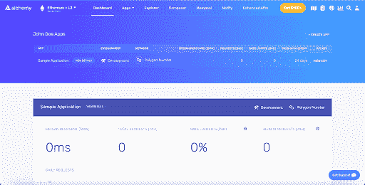
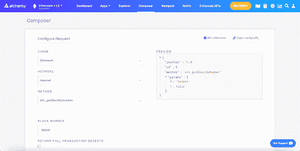
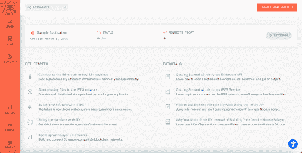

# Alchemy vs. Infura:哪个节点提供商最好？- LogRocket 博客

> 原文：<https://blog.logrocket.com/alchemy-vs-infura-which-node-provider-best/>

自然，托管智能合约需要您设置一个您想要托管它们的区块链的节点，但是这个过程不仅对于刚刚开始 Web3 之旅的人来说很复杂；这也很耗时，并且需要大量的处理能力来完成。

这是像 Infura 和 Alchemy 这样的平台旨在解决的问题。本质上，他们是节点提供者；即，它们提供对区块链服务的远程访问，因此您不必运行自己的节点。

在本文中，我们将比较 Infura 和 Alchemy 这两个最流行的节点提供者。我们的比较将基于每个平台支持的网络类型、它们的接口、API、文档、让团队成员加入这些平台的难易程度，以及它们都提供的任何杂项服务。

在文章的最后还提供了一个更简洁的表格，以便快速回顾。以下是我们将要介绍的内容:

如果您还不熟悉什么是区块链节点，下一节将提供一个快速概述。

## 什么是区块链节点？

区块链的一个重要组成部分是它的节点。它们是负责区块链上发生的数据传输的设备；他们处理和验证区块链交易，同时保留整个区块链分类账的副本。

从最基本的角度来说，区块链节点是相互连接的设备，就像计算机或服务器一样，它们保存着区块链数据的完整副本。他们的主要责任是实时交换这些数据，同时确保其合法性和可靠性。

而且，如前所述，自己运行一个区块链节点不仅成本高、技术难度大，而且耗时，还需要严格的安全程序。

这是像 Infura 和 Alchemy 这样的节点服务提供商试图解决的问题。它们提供对区块链服务的低成本远程访问，因此您不必经历运行自己的节点的困难。

## 什么是炼金术？

Alchemy 是一个区块链扩展平台，允许开发人员安全地创建、测试和监控他们的分散式应用程序(DApps)。该平台提供可靠的网络连接和节点管理端点。

它们简化了分散式开发，并不仅仅是为远程节点提供 Notify 等功能，Notify 允许开发人员根据区块链活动及其 NFT API 向用户发送关键事件的实时推送通知，它提供了一套服务，允许您即时查找、验证和显示跨多个区块链的任何 NFT。

### 支持的网络

Alchemy 平台支持以太坊第 1 层主网以及测试网(如 Rinkeby、Goerli、Kovan 和 Ropsten 网络)上的 DApp 开发。

此外，Alchemy 支持 Polygon、Arbitrum 网络和乐观网络，所有这些都是第 2 层网络。第 2 层网络是在以太坊(第 1 层)之上创建的独特链，作为智能合同，允许更快的交易速度和更便宜的天然气价格，同时还提高了合同的速度和可扩展性。

除了 Arbitrum 和乐观主网和测试网之外，Alchemy 还支持多边形主网及其测试网(Polygon Mumbai)。

最近，Alchemy 还宣布即将支持索拉纳区块链。这将使 Solana 开发者获得分布式和可扩展的基础设施，允许他们在 Solana 区块链上快速部署、优化和扩展 DApps。

### 炼金术界面

您可以从其控制面板即时访问所有应用程序，还可以快速访问每个应用程序的简明指标，如请求和响应总数、无效请求的数量等。

查看每个应用程序的其他详细信息，使您可以选择正确配置每个应用程序，以及更好的分析视图，使您可以按日期、类型甚至国家/地区过滤请求。

还值得注意的是，您可以访问 Alchemy 的 composer，这是一个允许您使用 web 表单直接配置和发送区块链请求的平台。

### API、文档和 DX

Alchemy 的所有服务和集成都以顶级 API 的形式提供，可以通过 HTTP 或 WebSockets 进行访问，它们为所有服务和网络连接提供了大量的文档和实践教程。此外，该团队围绕 Web3.js 开发了一个包装器，以便在开发 DApps 时更容易集成和改进对各种 API 的访问。

Alchemy 还为您的应用程序提供了安全功能。提供的预防措施包括将地址列入白名单，以便只有这些地址可以与您的合同进行交互。另一个安全解决方案是添加白名单域和 IP，以便只能使用这些介质中的 API 密钥发出请求。

最后，您可以轻松地让团队成员加入您的项目。您可以直接从**用户设置**页面邀请新成员加入您的项目，并为首选用户提供管理权限。

### 定价

Alchemy 提供了一个慷慨的免费计划，每月高达 3 亿个计算单元，没有每日请求限制。此外，通过免费订阅，您可以构建多达五个不同的应用程序，并将它们连接到平台的 mainnet 和 testnet。您还可以免费访问其他 alchemy 解决方案，包括 Supernode、Build、Monitor 和 Notify。

您可以将您的应用程序升级到增长计划，每月费用为 49 美元。这使得每月的计算量增加到 4 亿，应用数量增加到 15 个。如需了解更多信息，您可以点击查看他们的[定价页面。](https://www.alchemy.com/pricing)

## 什么是 Infura？

Infura 比炼金术存在的时间更长。Infura 最初成立于 2016 年，后来被 Metamask 的母公司 ConsenSys 收购。

像 Alchemy 一样，Infura 为您的以太坊项目提供了一个简单可靠的基础设施。但是他们还用他们的 IPFS API 更进一步，这是一个在区块链上存储和访问文件的分散协议。

### 支持的网络

Infura 还支持以太坊第 1 层主网和测试网，如 Rinkeby、Goerli、Kovan 和 Ropsten 网络。此外，infura 支持 Palm network，这是一个以太坊侧链，专门用于销售、购买和交易 NFT。

Polygon、Arbitrum 和 Optimism 等第 2 层网络也受支持，但它们是作为附加组件提供的，需要您输入信用卡信息才能激活它们的免费计划。

### 信息界面

Infura 也有一个直观的界面。从仪表板上，您可以看到您的所有应用程序、它们的状态以及它们当天收到的请求数。查看关于每个应用程序的更多详细信息将显示关于该应用程序的更多分析。

您还可以访问 Infura Explorer，它允许您管理您的所有 IPFS 项目，并分析上传的数据以及实时数据。

### API、文档和 DX

像 Alchemy 一样，Infura 服务作为顶级 API 提供，也可以通过 HTTP 和 WebSockets 访问，它们提供全面的文档，指导开发人员使用它们的 API。此外，与炼金术不同，Infura 有一个专门的[社区](https://community.infura.io/)用于讨论 Infura 的所有事情。

Infura 提供了更多选项来帮助您保护您的应用程序。其中之一是将 API 的使用限制在包含有效 JWT (JSON Web Token)的请求上。您还可以指定每秒或每天发送给应用程序的请求总数。

和 Alchemy 一样，您也可以配置白名单中的地址、域，甚至用户代理。

同样值得注意的是，Infura 目前不允许你邀请团队成员加入并管理你的应用程序。

### 定价

Infura 还提供了大量的免费计划，每天有多达 100，000 个请求，并且能够创建多达三个单独的应用程序。你也可以将你的应用升级到所提供的计划中的一个，每个月从 50 美元到 1000 美元不等。

对于其 IPFS API，您可以获得 5GB 的免费存储空间来存储和管理数据，这也可以作为一个附加组件，需要您的信用卡信息。因此，您可以使用 Infura Plus 计划将您的 IPFS 存储升级到无限制，该计划的存储上限为 0.08 美元/GB，数据传输上限为 0.12 美元/GB。

## 结论

Infura 和 Alchemy 都是很棒的产品，但是虽然它们都是节点提供商，但是它们独特地提供一些其他服务来使你的 DApp 成功。在本文中，我们仔细比较了这两个平台，以帮助您轻松决定为您的下一个项目选择哪一个。

没有一个放之四海而皆准的答案来选择炼金术和炼狱，因为两者都适用于不同的场景。然而，除了价格考虑和所有这一切，炼金术可能是一个更好的选择，当与队友合作时，加上你可以访问所有你需要的服务，而不必添加你的信用卡细节。Infura 可能被认为是单人项目的更好选择。

为了快速概括，下面还提供了一个更简明的表格:

| Alchemy | Infura | 支持的第 1 层网络 |
| 以太坊 Mainnet、Solana

tes net–Rinkeby、Goerli、Kovan 和 Ropsten 网络 | 以太坊主网

测试网——Rinkeby、Goerli、Kovan 和 Ropsten 网络 | 支持的第 2 层网络 |
| 多边形、任意网络和乐观主义 | 多边形、Arbitrum、乐观主义和手掌网络 | 杂项服务 |
| 炼金术通知，NFT API | IPFS API | 免费计划 |
| 每月 3 亿个计算单元，支持多达 5 个应用 | 每天 100，000 个请求，用于多达 3 个不同的应用程序

免费 5GB IPFS 存储 | 付费计划 |
| 增长计划每月 49 美元 | 每月从 50 美元到 1000 美元不等 |   |

加入像 Bitso 和 Coinsquare 这样的组织，他们使用 LogRocket 主动监控他们的 Web3 应用

## 影响用户在您的应用中激活和交易的能力的客户端问题会极大地影响您的底线。如果您对监控 UX 问题、自动显示 JavaScript 错误、跟踪缓慢的网络请求和组件加载时间感兴趣，

.

[try LogRocket](https://lp.logrocket.com/blg/web3-signup)

LogRocket 就像是网络和移动应用的 DVR，记录你的网络应用或网站上发生的一切。您可以汇总和报告关键的前端性能指标，重放用户会话和应用程序状态，记录网络请求，并自动显示所有错误，而不是猜测问题发生的原因。

[https://logrocket.com/signup/](https://lp.logrocket.com/blg/web3-signup)

现代化您调试 web 和移动应用的方式— [开始免费监控](https://lp.logrocket.com/blg/web3-signup)。

Modernize how you debug web and mobile apps — [Start monitoring for free](https://lp.logrocket.com/blg/web3-signup).