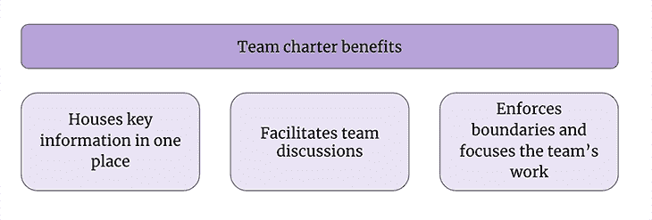

# 如何使用团队章程(带模板)调整您的团队

> 原文：<https://blog.logrocket.com/product-management/align-your-team-using-a-team-charter-with-template/>

团队合作和有目的的工作是任何成功的科技公司的关键因素。帮助团队协同工作的一部分是创造一种统一的目的和使命感——一个整个团队都理解并可以相互合作的单一目标。

如果不理解和支持一个单一的目的或使命，团队可能会分裂或偏离使命。

作为产品经理，你有责任塑造团队的关键使命和目标。你的角色也是解释和团结团队成员背后的“为什么”，也就是关键任务和目标首先存在的原因。清楚、简洁地说明你希望团队实现的目标，以及你希望实现目标的原因，有助于推动团队完成与你的产品和公司使命相一致的计划。

在团队中推动协作和统一目标的有效方法是使用团队章程。在本文中，我们将探索什么是团队章程，它的主要好处，以及一个成功的团队章程的组成部分。我还会给你一个免费的团队章程模板，供你根据需要使用和定制。我们开始吧！

* * *

## 目录

* * *

## 什么是团队章程？

团队章程是公司内任何团队形成和持续存在的基础。章程是一份帮助团队成员协调不同个性、技能和期望的文件。它还为团队提供了方向，不仅包括团队在某些计划上“做什么”和“为什么”工作，还包括团队的价值观和习惯。

通过团队章程，团队可以有更多的焦点和方向。该文件清楚地说明了团队在短期和长期内将会做什么和不会做什么。此外，大多数团队章程是团队成员和领导者之间的合作成果，使其成为每个人都同意的文件。这有助于培养团队章程中的真实性和真诚感——团队成员和公司其他内部成员都可以信赖的东西。

把团队章程想象成一个说明书或手册。它帮助团队理解他们的角色和职责，以及他们每个人如何帮助实现产品和公司的更广泛的目标。

## 拥有团队章程的主要好处是什么？

以下是团队章程的主要好处:

### 将关键信息存放在一个地方

如上所述，拥有一个团队章程不仅有助于详细说明任务的“是什么”和“为什么”,还可以将所有内容保存在一个单一、透明且易于访问的位置，公司中的每个人都可以访问。

### 促进团队讨论

因为团队章程是团队中每个人都可以协作的文档，所以它成为同步或异步讨论的理想场所。示例包括团队成员之间关于彼此的角色和职责、团队的价值观以及对团队任务/目标的范围和深度的理解的讨论。

### 加强界限，关注团队工作

通过围绕团队的任务和目标进行讨论，团队章程有助于围绕团队将承担的潜在工作设置“围栏”。它确保每个人都将注意力集中在最相关、高价值的工作上，帮助团队[实现其使命](https://blog.logrocket.com/product-management/mission-vs-vision-statements-key-differences-and-importance/)和目标。

团队章程有助于提供一种单一的思维模式，而不是让成员走上不同的道路，偏离共同的使命或目标。

## 团队章程的组成部分

以下是团队章程的一些关键组成部分:

### 团队使命和目标

通过列出团队想要实现的确切任务或目标来开始你的团队章程。这应该是一个 1-2 行的陈述，清楚简洁地解释你的团队存在的原因。

例如，这可以是衡量关键结果的目标([例如，OKRs](https://blog.logrocket.com/product-management/what-are-okrs-how-to-write-templates-examples/) )，也可以是更具哲理性的陈述，更广泛地包含您希望共同为产品和公司实现的目标。

### 团队背景或“我们是谁”

这一部分应该包括团队成员的简介，包括他们的姓名、角色、职责，以及他们是否属于领导团队(例如，产品三人组)。

列出你的团队成员和他们所扮演的角色有助于告知公司内部的利益相关者他们可以向谁询问某些问题。

例如，如果有人对团队正在做的工作有疑问，他们可以通过查看团队章程找到领导团队成员。

从上述观点出发，团队章程指定团队的哪些成员组成团队的领导小组(或产品三人组)是很重要的。这有助于确定沟通渠道和成败的重担落在谁的身上。

除了确定领导团队之外，这一部分还应该详细说明访问团队的不同类型的沟通方法，如电子邮件、Slack、文本等。

### 团队目标

这是团队章程中最重要的部分之一，也是衡量成功的标准。团队必须就他们要实现的确切目标以及他们这样做的原因达成一致。

在这里，目标不同于使命和目标。目标是需要团队一起成功完成的实际工作，以充分实现短期和长期任务的全部价值。

* * *

订阅我们的产品管理简讯
将此类文章发送到您的收件箱

* * *

然而，更常见的是，这一部分更直接地描述了与目标相关的实际计划。你不希望过于宽泛，听起来与文档开头的使命宣言非常相似。

### 工作方式

在这一部分，你希望与你的团队成员就确切的[方法、框架和工作结构](https://blog.logrocket.com/product-management/6-product-management-frameworks-you-should-know/)进行合作、讨论并达成一致。这些可以是已经存在的，也可以是你想用来帮助团队最大化生产力的。

这些讨论将涵盖工作流结构(如完全敏捷冲刺或简单看板流程)、几种团队惯例(如站立、追溯等)的发生和规律性，以及事件升级和风险管理流程。

通过与你的团队成员合作并就前进的确切方法、框架和惯例达成一致，你将帮助团队凝聚在一起并获得更多默契的支持。

### 工作组合或范围内的内容

团队章程的这一部分详细描述了团队的所有权图——您的团队将拥有的产品的特性、功能、工作流或基础设施。

例如，如果您的团队负责产品用户的入职流程，那么您的团队拥有产品的注册过程或登录页面可能是有意义的。

### 什么超出范围

就像你的团队承诺要做的任何工作一样，也有一部分工作是他们承诺*而不是*首先要做的。

通过让团队协作讨论哪些是他们擅长的工作，哪些不是，你会对团队的所有成员有一个更清晰的了解。这也有助于将焦点集中在对完成任务最相关和最重要的事情上。

### 团队价值观

最后但并非最不重要的一点是，围绕团队前进过程中每个成员期望从团队中获得的属性进行讨论是有益的，无论是开放的沟通文化、问题的透明度、快速解决问题的期望，还是团队成员陷入困境时的坦诚相待。

通过突出和强调团队期望的关键核心价值和不可协商性，成员们将更好地相互理解，并确保他们都理解良好团队运作的基本规则。

## 团队章程模板

你可以把团队章程放入许多格式中，但是我发现保持它的简单更容易。为了帮助你开始，请从 Google Docs 下载下面的[免费团队章程模板](https://docs.google.com/document/d/13kqlL5vM555BeNuT7XaKmNmYva0B7RhKr-Fvyv5x2Uc/edit)！您可以复制您的 Google 帐户，并根据需要进行自定义。

## 结论

遵循上面的提示，你将很快创建自己的团队章程！如果你想看我为产品经理创建的其他模板，请随时[访问我网站的链接](https://khornerstone.gumroad.com)。

*精选图片来源:[icon scout](https://iconscout.com/icon/file-3250251)*

## [LogRocket](https://lp.logrocket.com/blg/pm-signup) 产生产品见解，从而导致有意义的行动

[LogRocket](https://lp.logrocket.com/blg/pm-signup) 确定用户体验中的摩擦点，以便您能够做出明智的产品和设计变更决策，从而实现您的目标。

使用 LogRocket，您可以[了解影响您产品的问题的范围](https://logrocket.com/for/analytics-for-web-applications)，并优先考虑需要做出的更改。LogRocket 简化了工作流程，允许工程和设计团队使用与您相同的[数据进行工作](https://logrocket.com/for/web-analytics-solutions)，消除了对需要做什么的困惑。

让你的团队步调一致——今天就试试 [LogRocket](https://lp.logrocket.com/blg/pm-signup) 。

[Ian Khor Follow](https://blog.logrocket.com/author/iankhor/) Product Manager @ Octopus Deploy | Ex-lawyer | Enthusiast of all things Agile, LEAN, JTBD, and RICE