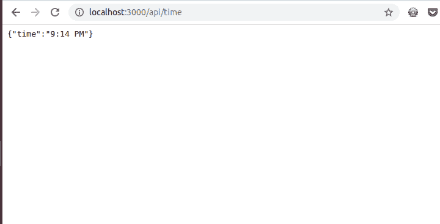
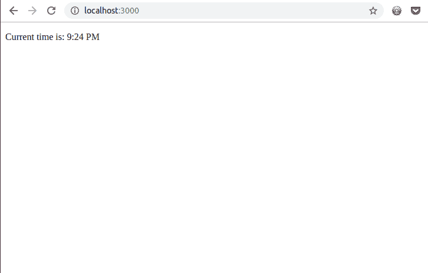
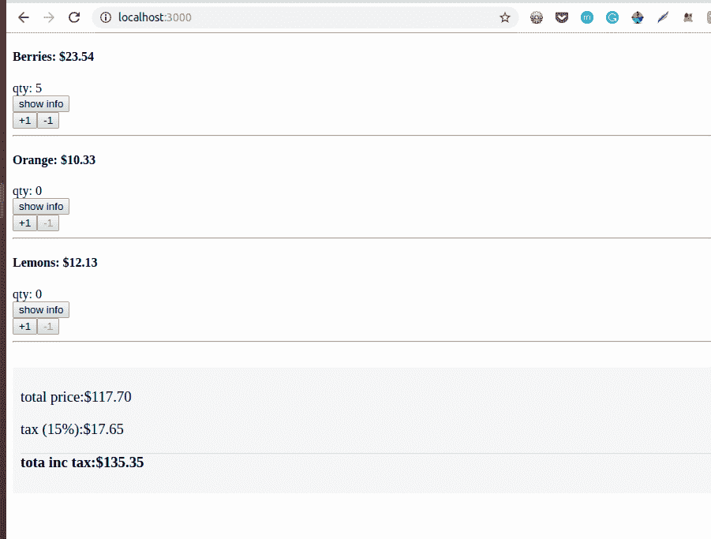

# 零服务器介绍，简化 web 开发的新工具

> 原文：<https://blog.logrocket.com/an-intro-to-zero-server-a-new-tool-to-simplify-web-development-42bee961e5d1/>

Zero Server 是一个应用捆绑器，用于简化 web 开发。它通过自动为您完成，消除了包裹管理和路由的麻烦。如[网站](https://zeroserver.io/)所述:

> 这就像在一个混合的 [Node.js](https://github.com/remoteinterview/zero/blob/master/docs/nodejs/README.md) 、 [React](https://github.com/remoteinterview/zero/blob/master/docs/react/README.md) 、 [HTML](https://github.com/remoteinterview/zero/blob/master/docs/html/README.md) 、 [MDX](https://github.com/remoteinterview/zero/blob/master/docs/mdx/README.md) 、 [Vue](https://github.com/remoteinterview/zero/blob/master/docs/vue/README.md) 和[静态文件](https://github.com/remoteinterview/zero/blob/master/docs/static/README.md)中编写你的代码并把它们全部放在一个文件夹中一样简单。零将为他们所有人服务。Zero 抽象了路由、捆绑和传输的常用项目配置，使其更容易开始。

Zero Server 提供了几个特性，使其成为开发下一个 web 应用程序的绝佳选择:

### 自动配置

您的项目文件夹不需要配置文件。您只需放置您的代码，它就会自动编译、打包并提供服务。

### 基于文件系统的路由

如果你的代码驻留在`./api/login.js`中，它在`[http://<SERVER>/api/login](http://<SERVER>/api/login)`被暴露。

### 自动依赖关系解析

如果一个文件做了`require('underscore')`，它会自动安装并解析。您总是可以创建自己的`package.json`文件来安装软件包的特定版本。

### 多种语言

Zero 旨在支持用多种语言编写的代码，所有代码都在一个项目下。想象一下:

*   将 Tensorflow 模型作为 Python API 公开
*   使用 React 页面来消费它
*   在 Node.js 中编写用户登录代码
*   HTML 或 Markdown/MDX 混合格式的登录页面

您可以将所有这些作为单个 web 应用程序放在单个项目文件夹下。

### 改进的错误处理

每个端点都在自己的进程中运行。因此，如果`/api/login`由于某种原因崩溃，它不会影响`/chatroom`页面或`/api/chat` API。当下一个用户访问崩溃的端点时，它们会自动重新启动。

在本教程中，我们将学习如何使用零服务器建立一个应用程序，并通过构建一个小型 React 电子商务应用程序来演示这个过程。让我们开始吧。

## 先决条件

要学习本教程，您需要对 React 和 Node.js 有一个基本的了解。HTML/CSS 知识也是必需的，但不是强制性的。

为了构建所需的应用程序，我们将使用以下几个工具:

### 探索零服务器

要开始使用 Zero，您需要首先在开发机器上全局安装它。为此，请在终端中键入以下内容:

```
npm install -g zero
```

完成后，您就可以开始使用它的功能构建您的应用程序了。让我们做一个快速演示，看看 Zero 的独特之处。创建一个名为 `zero 的测试文件夹，并定义以下文件夹结构:`

```
zero/
         api/
```

在`api`文件夹中，创建一个`time.js`文件，并向其中添加以下代码:

```
// api/time.js
    const moment = require("moment")

    module.exports = (req, res) => {
      var time = moment().format('LT');   // 11:51 AM
      res.send({time: time })
    }
```

在我们的文件中，我们:

*   导入`moment.js`
*   导出一个接受`Request`和`Response`对象的函数( [like Express](https://expressjs.com/en/4x/api.html#res) )

就是这样！您的 API 已经准备好了。现在，当你运行你的服务器时，Zero 做两件事:

*   自动安装并使`moment.js`可供您在文件中使用
*   将您新创建的 API 暴露给 URL `/api/time`

要运行您的文件，通过您的终端导航到创建的文件夹，并键入命令`**zero**`。完成后，您应该会在终端中看到以下内容:


现在，当您在浏览器中访问 [http://localhost:3000](http://localhost:3000/) 时，您会看到:



如您所见，无需安装任何库或配置路由，您已经实现了一个基本的 API。Zero 通过在幕后为您完成所有这些工作来减少您的工作量。这样，您就可以专注于对您的项目真正重要的东西:您的代码。

现在我们有了一个正在运行的 API，让我们看看如何在前端使用 React 来使用它。在目录的根目录下，创建一个`index.jsx`，并向其中添加以下代码行:

```
// ./index.jsx

    import React from 'react'

    export default class extends React.Component {
      static async getInitialProps(){
        var json = await fetch("/api/time").then((resp) => resp.json())
        return {time: json.time}
      }

      render() {
        return <p>Current time is: {this.props.time}</p>
      }
    }
```

在我们的文件中，我们初始化了一个标准的 React 组件，并为初始数据填充增加了一个钩子。

`getInitialProps`是页面加载时由`zero`调用的一个`async`静态方法。这个方法可以返回一个普通的对象，这个对象填充了`props`。

现在，转到这个网址: [http://localhost:3000](http://localhost:3000/) 。在获取您之前创建的 API 端点时，您应该看到 React 呈现的当前服务器时间:



就是这样！您已经创建了一个没有任何安装或额外配置的基本应用程序。这是非常强大的，它是零服务器的基础。

**注意**，你可以随时创建自己的`package.json`文件来安装软件包的特定版本。

## 用零服务器引导电子商务应用程序

现在我们已经了解了 Zero 是如何工作的，让我们继续引导一个小的电子商务应用程序。

更新您的文件夹结构，如下所示:

```
zero/
         api/
         components/
           Product.jsx
           ProductList.jsx
           Total.jsx
         index.jsx
```

在我们的组件目录中，我们定义了三个文件:

*   产品组件来保存单个产品的数据
*   一个用于服务、获取和展示产品的组件
*   一个`Total`组件来存储我们当前的购物车数据

最后，我们的`**index.jsx**`将容纳我们所有的组件。如上所述，Zero 目前支持以下语言:

为了区分 Node.js 和 React，Zero 使用文件扩展名。您需要用扩展名`jsx`命名 React 组件，用扩展名`js`命名节点 API，以使 Zero 能够正确处理您的文件。

## 创建我们的组件

首先，让我们定义我们的`Product`组件。打开文件并添加以下代码行:

```
// ./components/Product.jsx
    import React from 'react'
    import 'bootstrap/dist/css/bootstrap.css';

    export default class Product extends React.Component {
      constructor(props) {
        super(props);
        this.state = {
          qty: 0
        };
        this.add = this.add.bind(this);
        this.subtract = this.subtract.bind(this);
        this.showInfo = this.showInfo.bind(this);
      }

      add() {
        this.setState({
          qty: this.state.qty + 1
        });
        this.props.handleTotal(this.props.price);
      }

      subtract() {
        this.setState({
          qty: this.state.qty - 1
        });
        this.props.handleTotal(-this.props.price);
      }

      showInfo() {
        this.props.handleShow(this.props.info);
      }

      render() {
        return (
          <div>
            <div className="row form-group">
              <div className="col-sm-10">
                <h4>{this.props.name}: ${this.props.price}</h4>
              </div>
              <div className="col-sm-2 text-right">qty: {this.state.qty}</div>
            </div>
            <div className="row btn-toolbar">
              <div className="col-6">
                <button className="btn btn-outline-primary">
                  show info
                </button>
              </div>
              <div className="col-6 text-right">
                <button className="btn btn-outline-primary" onClick={this.add}>
                  +1
                </button>
                <button className="btn btn-outline-primary" onClick={this.subtract} disabled={this.state.qty < 1}>
                  -1
                </button>
              </div>
            </div>
            <hr />
          </div>
        );
      }
    }
```

这里，我们显示了一个产品，并定义了从状态中添加和删除商品的函数，当前购物车数据就存储在状态中。

在我们创建我们的`ProductList`组件之前，让我们创建我们的`Total`组件。这将包含当前的购物车状态。打开你的`Total.jsx`，添加下面几行代码:

```
// ./components/Total.jsx

    import React from 'react'
    import 'bootstrap/dist/css/bootstrap.css';

    export default class Total extends React.Component {
      constructor(props) {
        super(props);
      }
      render() {
        let total = this.props.total.toFixed(2);
        let tax = (this.props.total * 0.15).toFixed(2);
        let totalIncTax = (+total + +tax).toFixed(2);
        let mystyle = {
          borderTop: "1px solid #ddd",
          marginTop: "10px"
        };
        return (
          <div style={{"marginTop": "30px", "backgroundColor":"#F6F6F6","padding": "10px"}}>
            <h3 className="row" style={{ fontWeight: 400 }}>
              <span className="col-6">total price:</span>
              <span className="col-6 text-right">${total}</span>
            </h3>
            <h3 className="row" style={{ fontWeight: 400 }}>
              <span className="col-6">tax (15%):</span>
              <span className="col-6 text-right">${tax}</span>
            </h3>
            <h3 className="row" style={mystyle}>
              <span className="col-6">tota inc tax:</span>
              <span className="col-6 text-right">${totalIncTax}</span>
            </h3>

          </div>
        );
      }
    }
```

在我们的`Total.jsx`文件中，我们计算购物车中产品的总额和应税金额。

为了让我们的`ProductList.jsx`文件显示产品列表，让我们添加以下代码:

```
// ./components/ProductList.jsx
    import React from 'react'
    import Total from './Total'
    import Product from './Product'

    export default class Products extends React.Component {
      constructor(props) {
        super(props);

        this.state = {
          total: 0,
          productList: [
                        {
                          "name": "Berries",
                          "price": 23.54,
                          "description": "Sweet popsicles to help with the heat"
                        },
                        {
                          "name": "Orange",
                          "price": 10.33,
                          "description": "Mouth watering burger."
                        },
                        {
                          "name": "Lemons",
                          "price": 12.13,
                          "description": "Sumptuous egg sandwich"
                        }
          ],
        };

        this.calculateTotal = this.calculateTotal.bind(this);
      }

      showProduct(info){
        alert(`Details: ${info}`)
      }

      calculateTotal(price) {
        this.setState({
          total: this.state.total + price
        });
      }

      render() {
        if (!this.state.productList) return <p>loading products! </p>

        var component = this;
        var products = this.state.productList.map(function(product) {
          return (
            <Product
              name={product.name}
              price={product.price}
              info={product.description}
              handleShow={component.showProduct}
              handleTotal={component.calculateTotal}
            />
          );
        });

        return (
          <div>
            {products}
            <Total total={this.state.total} />
          </div>
        );
      }
    }
```

该组件做三件事:

*   设置我们的初始产品数据
*   定义函数来处理我们的应用程序的一部分，如计算购物车中商品的总价
*   将数据作为道具向下传递给其他组件

还剩下最后一步，在屏幕上查看我们的产品。我们需要做的就是将我们的`ProductList.jsx`导入到我们的索引组件中。更新您的`index.jsx`,如下所示:

```
// ./index.jsx
    import React from 'react'
    import ProductList from './components/ProductList'

    export default class extends React.Component {

      render() {
        return <ProductList />
      }
    }
```

现在，通过在终端中键入`zero`来启动您的服务器。一旦你访问 [http://localhost:3000](http://localhost:3000/) ，你会看到这个屏幕:



就是这样！我们已经创建了一个工作的 React 应用程序，无需安装或配置路线，或任何其他麻烦！全拜零服务器所赐。

## 结论

在本教程中，我们构建了一个简单的 React 应用程序，可以在其中添加和删除购物车中的商品。我们已经能够使用 Zero Server 编写我们的应用程序，而不需要任何额外的配置或包管理。

Zero 是一个强大的工具，有可能加速你的 web 开发。请务必[检查文档](https://github.com/remoteinterview/zero/tree/master/docs)。编码快乐！

## 使用 LogRocket 消除传统反应错误报告的噪音

[LogRocket](https://lp.logrocket.com/blg/react-signup-issue-free)

是一款 React analytics 解决方案，可保护您免受数百个误报错误警报的影响，只针对少数真正重要的项目。LogRocket 告诉您 React 应用程序中实际影响用户的最具影响力的 bug 和 UX 问题。

[ ](https://lp.logrocket.com/blg/react-signup-general) [  ](https://lp.logrocket.com/blg/react-signup-general) [LogRocket](https://lp.logrocket.com/blg/react-signup-issue-free)

自动聚合客户端错误、反应错误边界、还原状态、缓慢的组件加载时间、JS 异常、前端性能指标和用户交互。然后，LogRocket 使用机器学习来通知您影响大多数用户的最具影响力的问题，并提供您修复它所需的上下文。

关注重要的 React bug—[今天就试试 LogRocket】。](https://lp.logrocket.com/blg/react-signup-issue-free)