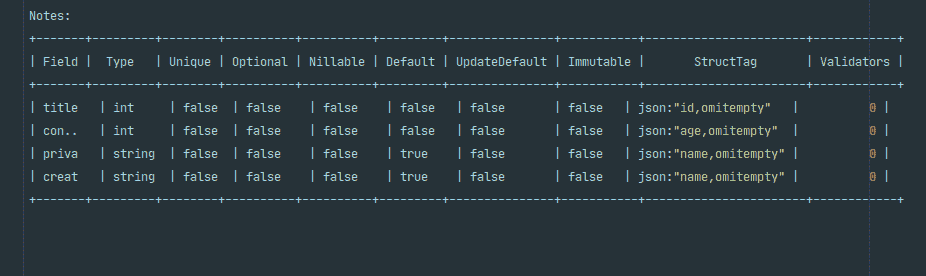
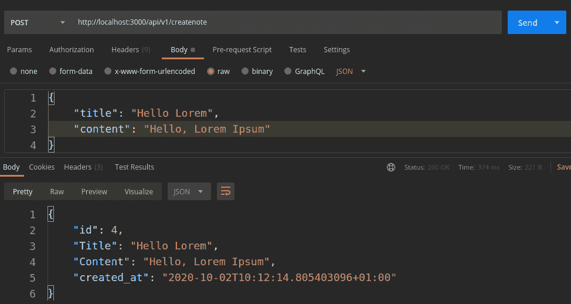
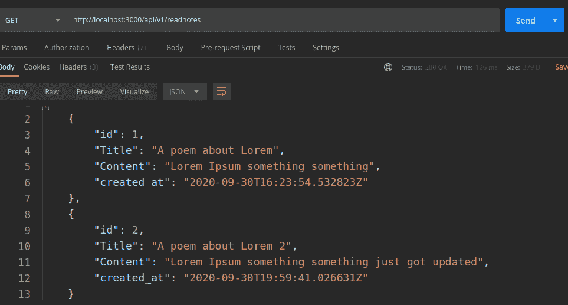

# 耳鼻喉科博客简介

> 原文：<https://blog.logrocket.com/an-introduction-to-ent/>

数据库系统是软件开发不可或缺的一部分。无论选择哪种编程语言，软件开发人员都需要熟练使用数据库。大多数编程语言都有各种工具/包，使得开发人员使用数据库管理系统变得容易。这些工具中的一些是编程语言所固有的，另一些是由围绕该语言的开发人员社区构建/维护的，并且可以免费使用。

由于 Go 编程语言缺乏基于图形的 ORM(对象关系映射),脸书的一个开发团队创建了 ent。Ent 是一个实体框架，通常用于在基于图形的结构中建模数据。ent 框架以其将数据建模为 Go 代码的能力而自豪，不像许多其他 ORM 将数据建模为 [struct 标签](https://golang.org/ref/spec#Tag)。由于 ent 框架的基于图的结构，查询存储在数据库中的数据可以很容易地完成，并采用图遍历的形式。ent 附带了一个命令行工具，我们可以使用它来自动生成代码模式并获得模式的可视化表示。

在这篇文章中，我们将探索 ent 框架的所有很酷的特性，并构建一个简单的 CRUD API 来利用 ent 的各种功能。

## 先决条件

要阅读这篇文章，您需要:

## 耳鼻喉科入门

使用 ent 框架的第一步是将它安装到我们的项目中。要安装 ent，运行下面的命令`go get github.com/facebook/ent/cmd/entc`。该命令将为 ent 包安装命令行工具 [entc](https://github.com/facebook/ent/tree/master/entc) 。

在本文中，我们将构建一个简单的利用 ent 的 CRUD(创建、读取、更新和删除)API。该 API 将包含五个端点，构建该 API 的目的是展示如何使用 ent 在数据库上执行常见的创建、读取、更新和删除操作。

首先，创建所需的文件和文件夹以匹配下面的树结构:

```
├── handlers/
│ ├── handler.go
├── database/
│ ├── db.go
└── main.go
```

*   `main.go`文件将包含与为 API 创建服务器相关的所有逻辑。我们将使用[纤程](https://github.com/gofiber/fiber)，Go 的快速风格框架来快速连接我们的 API 端点。[这篇文章](https://blog.logrocket.com/express-style-api-go-fiber/)是纤维的一个伟大开端
*   数据库目录中的`db.go`文件将包含与创建数据库连接和客户机相关的代码
*   `handler.go`文件将存放 API 处理程序

在下一节中，我们将开始构建 API 并探索 ent。

## 对耳鼻喉科的深入研究

要开始这个项目，运行项目根目录中的`go mod init`。这将初始化一个带有 Go 模块的新项目。接下来，我们必须通过在项目`github.com/gofiber/fiber/v2`的根目录下运行以下命令来安装 fiber，这是我们将在构建 API 时使用的框架。

在为一个假想的笔记应用程序构建 API 时，我们需要以下端点:

*   /API/v1/create notes
*   API 1/readnote؛
*   /api/v1/searchnote/:标题
*   /api/v1/updatenote/:id
*   /api/v1/deletenote/:id

在`main.go`文件中，添加以下代码行:

```
package main

import (
   "fmt"

   "github.com/gofiber/fiber/v2"
)

func Routes(app *fiber.App){
   api := app.Group("/api/v1")

   api.Get("/", func(c *fiber.Ctx) error {
      return c.SendString("Hello, World!")
   })
}

func main() {
   app := fiber.New()

   Routes(app)

   err := app.Listen(":3000")
   if err != nil {
      fmt.Println("Unable to start server")
   }
}
```

上面的代码创建了一个简单的 web 服务器。目前只有一个端点被连接，在接下来的部分中，我们将在`handler.go`文件中工作，以确保所有的 API 端点都正常工作。现在，您可以运行上面的文件并在浏览器上访问`localhost:3000/api/v1/`。如果一切顺利，您应该会看到“hello world”被打印出来。

## 创建模式

使用 ent 创建模式很容易，这要感谢我们在上面安装的命令行工具 entc。对于我们的 API，我们将创建一个名为 notes 的模式，在项目目录的根目录下创建模式 run `entc init Notes`。这个命令将自动生成我们的 Notes 模式。与模式相关的代码可以在`ent/schema/notes.go`中找到。此时，模式为空，不包含任何字段。对于我们的 API，我们的模式将有四个字段:

*   标题
*   内容
*   私人的
*   创建于

为了在我们的模式中定义字段，我们在`Field`函数中使用了 ent 提供的 fields 子包。我们调用字段的类型，像这样传入所需模式字段的名称:

```
field.String("Title")
```

对于我们的 API，我们将指定标题、内容和私有字段作为模式的属性。ent 目前支持所有 Go 数值类型、string、bool 和`time.Time`！将字段添加到模式后，我们的`notes.go`文件应该如下所示:

```
package schema

import (
   "time"

   "github.com/facebook/ent"
   "github.com/facebook/ent/schema/field"
)

// Notes holds the schema definition for the Notes entity.
type Notes struct {
   ent.Schema
}

// Fields of the Notes.
func (Notes) Fields() []ent.Field {
   return []ent.Field{
      field.String("Title").
         Unique(),
      field.String("Content"),
      field.Bool("Private").
         Default(false),
      field.Time("created_at").
         Default(time.Now),
   }
}

// Edges of the Notes.
func (Notes) Edges() []ent.Edge {
   return nil
}
```

field 子包还提供了 helper 函数来验证字段输入，如上面的代码片段所示。所有内置验证器的完整列表可以在[这里](https://entgo.io/docs/schema-fields/#validators)找到。现在我们已经添加了必要的字段，我们可以继续生成一些资产来使用数据库。

ent 自动生成资产，包括 CRUD 构建器和一个实体对象。要生成资产，在项目目录`go generate./ent`的根目录下运行下面的命令，您会注意到一堆文件将被添加到我们项目的`/ent`目录中。添加的文件包含与生成的资产相关的代码。在接下来的小节中，我们将学习如何使用这些生成的资产来执行 CRUD 操作，并继续构建 notes API。

## 可视化模式

entc 是 ent 框架的命令行工具，它使我们能够在终端中获得模式的可视化表示。要可视化模式，只需在项目目录的根目录下运行下面的命令`entc describe./ent/schema`，您应该会看到类似下图的 notes 模式的可视化表示。



## 连接到数据库

ent 为我们提供了连接到包括 PostgreSQL 在内的几个数据库的功能。在`database.go`文件中，我们创建了一个 [init](https://www.digitalocean.com/community/tutorials/understanding-init-in-go) 函数，它使用`ent.Open`函数连接到一个数据库，并返回一个类型为`ent.Client`的客户端。`Open`函数接受数据库的名称及其连接字符串。

对于我们正在构建的 API，我们将使用 PostgreSQL 数据库。首先，我们将启动 Postgres 的 docker 实例，并通过三个简单的步骤从本地机器连接到它。

要跟进，您必须在本地机器上安装[docker](https://docs.docker.com/engine/install/ubuntu/)。

现在我们已经连接好了数据库容器，接下来需要做的是导入 PostgreSQL 的驱动程序，作为我们项目的一个副作用。要安装驱动程序，请在项目目录的根目录下运行`go get github.com/lib/pq`。设置好一切后，将下面几行代码添加到`database.go`文件中:

```
var EntClient *ent.Client
func init() {
//Open a connection to the database
   Client, err := ent.Open("postgres","host=localhost port=5432 user=postgres dbname=notesdb password=mysecretpassword sslmode=disable")
   if err != nil {
      log.Fatal(err)
   }

   fmt.Println("Connected to database successfully")
   defer Client.Close()
// AutoMigration with ENT
   if err := Client.Schema.Create(context.Background()); err != nil {
      log.Fatalf("failed creating schema resources: %v", err)
   }
   EntClient = Client
}
```

## 保存到数据库

使用 ent 框架，执行创建操作/保存到数据库变得很容易。在本节中，我们将添加 create note 端点，它将负责将新的注释保存到数据库中。

首先，在`handler.go`文件中，我们创建了一个名为`createNotes`的函数，它实现了`fibers`处理程序接口。在`createNotes`函数内部，我们使用 fiber 提供的主体解析器函数解析请求主体。

ent 拥有由它的命令行工具`entc`自动生成的助手方法。我们调用`setTitle`和`setContent`方法，将它们各自的值作为类型字符串传入。最后，为了确保数据被保存，我们调用了传入上下文值的`save`方法:

```
func CreateNote(c *fiber.Ctx) error{
//Parse the request body
   note := new(struct{
      Title string
      Content string
      Private bool
   })

   if err := c.BodyParser(&note); err != nil {
      c.Status(400).JSON("Error  Parsing Input")
      return err
   }
//Save to the database
   createdNote, err := database.EntClient.Notes.
      Create().                      
      SetTitle(note.Title).
      SetContent(note.Content).
      SetPrivate(note.Private).
      Save(context.Background())  

   if err != nil {
      c.Status(500).JSON("Unable to save note")
      return err
   }
//Send the created note back with the appropriate code.
   c.Status(200).JSON(createdNote)

   return nil
}
```

至此，我们已经做好了准备，并添加了创建新实体的逻辑。要注册上述处理程序，只需将下面一行代码添加到我们在上面的`main.go`文件中创建的 routes 函数中:

```
api.Post("/createnote", handlers.CreateNote)
```

如果我们启动应用程序并向`localhost:3000/api/v1/createnote`发出 post 请求，传入一个注释的标题和内容，您应该会看到类似下图的输出，表明注释已经成功创建。



## 从数据库中读取

有了 ent，查询数据库变得很容易。`entc`为每个模式生成一个包，其中包含用于搜索数据库的有用资产。在客户端，为了与自动生成的构建器进行交互，我们调用了`Query`函数。该函数为模式返回一个查询生成器，生成器的一部分包括`Where`和`Select`。

在本节中，我们将编写两个端点的逻辑代码:

1.  `/api/v1/readnotes/`–该端点将使我们能够读取数据库中的所有笔记
2.  `/searchnotes/:title`–这个端点使我们能够通过标题在数据库中搜索特定的笔记

我们将从构建`/api/v1/readnotes/`端点开始。在`handlers.go`文件中，我们创建了一个名为`ReadNotes`的处理函数，类似于上面的`createnote`函数，它实现了纤程处理程序接口。在`ReadNotes`函数中，我们对`EntClient`变量调用`Query`。为了指定我们想要匹配查询的所有记录，我们在查询构建器上调用`All`。在这一点上，完整的`ReadNotes`函数应该看起来像这样:

```
func ReadNote(c *fiber.Ctx) error{
   readNotes, err := database.EntClient.Notes.
      Query().
      All(context.Background())
   if err != nil {
      c.Status(500).JSON("No Notes Found")
      log.Fatal(err)
   }
   c.Status(200).JSON(readNotes)
   return nil
}
```

`ReadNotes`处理函数已经准备好了，我们现在可以通过在`main.go`中的`Routes`函数中添加下面一行来在服务器上注册它:

```
api.Get("/readnotes", handlers.ReadNote)
```

我们现在可以启动我们的应用程序并访问路线`/api/v1/readnotes/`来测试它。如果一切顺利，您应该会看到一个包含数据库中所有笔记的数组，如下图所示:



用于读取数据库中存储的所有笔记的`readnotes`端点已经连接好，接下来我们将连接`searchnotes`端点，它将在数据库中搜索任何标题与搜索查询匹配的笔记。就像我们到目前为止对每个处理程序所做的一样，我们创建了一个名为`SearchNotes`的函数。

在这个函数中，我们使用 fibers 内置的`params`方法检索作为请求参数传递的搜索查询。接下来，我们在客户端调用`Query`构建器方法，就像我们调用`ReadNotes`函数一样。为了指定搜索查询，我们调用另一个名为`where`的方法，`where`方法向查询构建器添加了一个新的谓词。作为`where`方法的参数，我们可以传入由`entc`自动生成的标题谓词:

```
func SearchNotes(c *fiber.Ctx) error{
//extract search query
   query := c.Params("title")
   if query == "" {
      c.Status(400).JSON("No Search Query")
   }
 //Search the database
   createdNotes, err := database.EntClient.Notes.
      Query().
      Where(notes.Title(query)).
      All(context.Background())

   if err != nil {
      c.Status(500).JSON("No Notes Found")
      log.Fatal(err)
   }

   c.Status(200).JSON(createdNotes)
   return nil
}
```

最后，我们可以通过将下面一行代码添加到`main.go`文件来注册`SearchNotes`函数:

```
api.Get("/searchnotes/:title", handlers.SearchNotes)
```

我们已经完成了对`searchnotes`端点的测试，可以通过启动应用程序并访问`localhost:3000/api/v1/searchnotes/Lorem`来测试它。如果一切顺利，您应该会看到一个标题为 Lorem 的注释，如果它存在于数据库中的话。

## 更新记录

构建 API 时，提供更新数据库中记录的功能非常重要，因为它符合您的业务逻辑。由于所有生成的资产都包含构建函数，ent 使得更新记录变得容易。在本节中，我们将构建 notes API 的更新路径，并学习如何使用 ent 更新记录。

首先，我们转到`handlers.go`文件并创建一个名为`UpdateNotes`的函数。这个函数和`handler.go`文件中的其他函数一样，实现了纤程的处理程序接口。在`UpdateNotes`函数中，我们解析请求体以确保只有内容字段可以被更新。接下来，我们通过使用键调用`params`函数，从查询参数中检索要更新的记录的 ID。因为我们使用纤程作为类型字符串来检索查询参数，所以我们必须使用`strconv`包中可用的`Atoi`函数将检索到的参数转换为 Int，该 Int 对应于数据库中存储的类型。

为了更新记录，我们调用函数`UpdateOneId`并传递从上面的用户那里获取的 ID。调用`UpdateOneId`函数返回给定 ID 的更新构建器。接下来，我们调用`setContent`函数。`setContent`是根据我们上面声明的模式和字段自动生成的。`setContent`函数接受对我们模式的内容字段的指定更新。最后，我们可以通过使用上下文调用`Save`函数来保存更新的记录:

```
func UpdateNote(c *fiber.Ctx) error{
//Parse the request Body
   note := new(struct{
      Content string
   })

   if err := c.BodyParser(&note); err != nil {
      c.Status(400).JSON("Error  Parsing Input")
      return err
   }
//Extract & Convert the request parameter
   idParam := c.Params("id")
   if idParam == "" {
      c.Status(400).JSON("No Search Query")
   }
   id, _ := strconv.Atoi(idParam)
//Update the note in the database
   UpdatedNotes, err := database.EntClient.Notes.
      UpdateOneID(id).
      SetContent(note.Content).
      Save(context.Background())

   if err != nil {
      c.Status(500).JSON("No Notes Found")
      log.Fatal(err)
   }

   c.Status(200).JSON(UpdatedNotes)
   return nil
}
```

有了这样的`UpdateNote`函数，我们就可以通过向`Routes`函数添加下面一行代码来注册处理程序了:

```
api.Put("/updatenote/:id", handlers.UpdateNote)
```

向上述路由发出 put 请求并提供有效的记录 id，更新相应的记录。

## 删除记录

删除记录类似于更新操作，但是，当使用 ent 删除记录时，会使用不同的函数。要删除一条记录，使用接收 ID 并返回给定用户的删除生成器的函数`DeleteOneId`。我们还调用了`Exec`函数。`Exec`接收一个上下文并在数据库上执行删除操作:

```
func DeleteNotes(c *fiber.Ctx) error{
   idParam := c.Params("id")
   if idParam == "" {
      c.Status(400).JSON("No Search Query")
   }

   id, _ := strconv.Atoi(idParam)
//Delete the Record frm the databse
   err := database.EntClient.Notes.
      DeleteOneID(id).
      Exec(context.Background())

   if err != nil {
      c.Status(500).JSON("Unable to Perform Operation")
   }

   c.Status(200).JSON("Success")

   return nil
}
```

我们可以通过将下面一行代码添加到`handler.go`文件中的`route`函数来注册上面的处理函数:

```
api.Delete("/deletenote/:id", handlers.DeleteNotes)
```

`deletenote`路线都定好了！现在，您可以通过指定 ID 来删除数据库中的任何注释。

## 结论

到目前为止，我们已经使用 ent 框架为笔记应用程序构建了一个 API 来与 PostgreSQL 数据库进行交互。由于 ent 和 entc 生成的资产，我们不必编写任何 SQL 查询，也不必太担心执行 CRUD 操作的逻辑。本文旨在帮助您开始使用耳鼻喉科。我强烈建议您查看官方的[文档](https://entgo.io/)作为参考指南。这个项目的完整源代码可以在[这里](https://github.com/Ghvstcode/Facebook-Ent-Framework-API)找到。

## 使用 [LogRocket](https://lp.logrocket.com/blg/signup) 消除传统错误报告的干扰

[](https://lp.logrocket.com/blg/signup)

[LogRocket](https://lp.logrocket.com/blg/signup) 是一个数字体验分析解决方案，它可以保护您免受数百个假阳性错误警报的影响，只针对几个真正重要的项目。LogRocket 会告诉您应用程序中实际影响用户的最具影响力的 bug 和 UX 问题。

然后，使用具有深层技术遥测的会话重放来确切地查看用户看到了什么以及是什么导致了问题，就像你在他们身后看一样。

LogRocket 自动聚合客户端错误、JS 异常、前端性能指标和用户交互。然后 LogRocket 使用机器学习来告诉你哪些问题正在影响大多数用户，并提供你需要修复它的上下文。

关注重要的 bug—[今天就试试 LogRocket】。](https://lp.logrocket.com/blg/signup-issue-free)