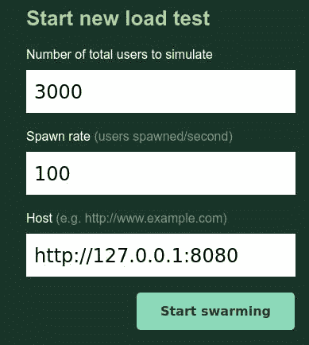
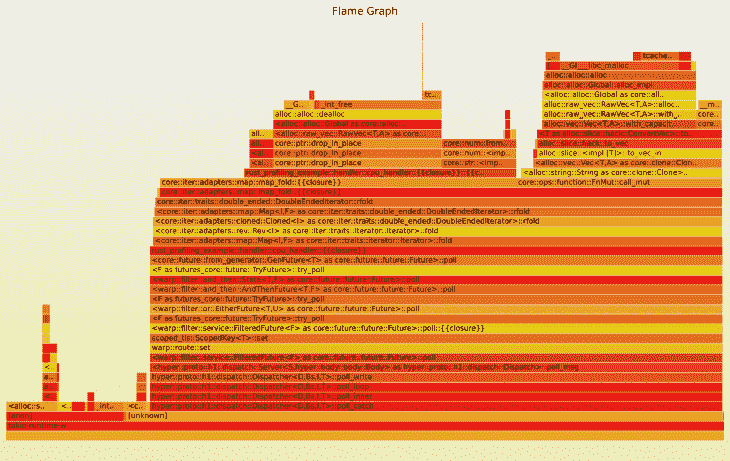
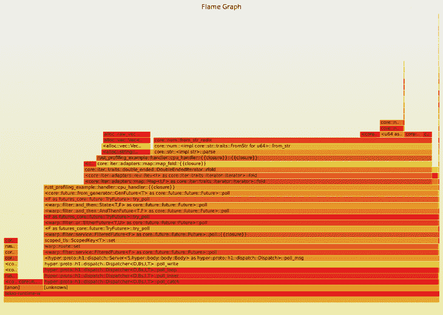

# 剖析 Rust web 应用程序的介绍——log rocket 博客

> 原文：<https://blog.logrocket.com/an-introduction-to-profiling-a-rust-web-application/>

在本文中，我们将了解一些分析和提高 Rust web 应用程序性能的技术。

Rust 中的性能优化领域广阔，本教程只能望其项背。为了更好地了解 Rust 的工具和技术，我强烈推荐 Nicholas Nethercote 的《Rust 性能》一书。

在本教程中，我们将研究一种测量 web 应用程序性能的方法，并探索一种工具来分析和改进您的 Rust 代码。

如果这篇文章达到了它的目标，你应该带走一些有用的知识来提高你的 Rust web 应用程序的性能，以及一些好的资源来深入这个主题。

我们开始吧！

## 设置

接下来，您需要的只是一个最新的 Rust 安装(1.45+)和一个能够运行 [Locust](https://locust.io/) 的 Python3 安装。

首先，创建一个新的 Rust 项目:

```
cargo new rust-web-profiling-example
cd rust-web-profiling-example

```

接下来，编辑 Cargo.toml 文件并添加您需要的依赖项:

```
[dependencies]
tokio = { version = "1.1", features = ["macros", "time", "rt-multi-thread", "sync"] }
warp = "0.3"

[profile.release]
debug = true

```

本教程所需要的只是一个小的 web 服务，所以我们将使用 Warp 和 Tokio 来创建它。然而，本文中讨论的技术将适用于任何其他 web 框架和库。

注意，我们为发布概要文件设置了`debug=true`,这意味着即使在发布版本中我们也会有调试信息。这样做的原因是，我们总是希望在所有编译器优化的`release`模式下进行性能优化。然而，我们也希望获得尽可能多的关于正在运行的代码的信息，这使得剖析更加容易。

## 一个最小的网络服务

首先，我们创建一个非常基本的 Warp web 服务，它有一个共享资源和几个要测试的端点。

我们首先定义一些类型:

```
type WebResult<T> = std::result::Result<T, Rejection>;

#[derive(Debug, Clone)]
pub struct Client {
    pub user_id: usize,
    pub subscribed_topics: Vec<String>,
}

pub type Clients = Arc<Mutex<HashMap<String, Client>>>;

```

`WebResult`只是我们的 web 处理程序的结果的一个助手类型。`Clients`类型是我们的共享资源——用户 id 到客户端的映射。一个`Client`有一个`user_id`和一个订阅主题列表，但这与我们的例子并不特别相关。

相关的是，这个资源将在我们的整个应用程序中共享，并且多个端点将同时访问它。为此，我们将它包装在`Mutex`中，以保护访问，并将其放入一个`Arc`智能指针中，这样我们就可以安全地传递它。

接下来，我们定义一些助手来初始化和传播我们的`Clients`:

```
fn with_clients(clients: Clients) -> impl Filter<Extract = (Clients,), Error = Infallible> + Clone {
    warp::any().map(move || clients.clone())
}

async fn initialize_clients(clients: &Clients) {
    let mut clients_lock = clients.lock().await;
    clients_lock.insert(
        String::from("87-89-34"),
        Client {
            user_id: 1,
            subscribed_topics: vec![String::from("cats"), String::from("dogs")],
        },
    );
    clients_lock.insert(
        String::from("22-38-21"),
        Client {
            user_id: 2,
            subscribed_topics: vec![String::from("cats"), String::from("reptiles")],
        },
    );
    clients_lock.insert(
        String::from("12-67-22"),
        Client {
            user_id: 3,
            subscribed_topics: vec![
                String::from("mice"),
                String::from("birds"),
                String::from("snakes"),
            ],
        },
    );
}

```

Warp 过滤器只是我们在 Warp web 框架中使资源可用于路由的一种方式。在`initialize_clients`中，我们将一些硬编码的值添加到我们共享的`Clients`地图中，但是实际值与这个例子并不特别相关。

然后，我们添加一个`handler`模块，它将使用共享的`Clients`:

```
use crate::{Clients, FasterClients, WebResult};
use std::time::Duration;
use warp::{reply, Reply};

pub async fn read_handler(clients: Clients) -> WebResult<impl Reply> {
    let clients_lock = clients.lock().await;
    let user_ids: Vec<String> = clients_lock
        .iter()
        .map(|(_, client)| client.user_id.to_string())
        .collect();
    tokio::time::sleep(Duration::from_millis(50)).await;
    let result = user_ids
        .iter()
        .rev()
        .map(|user_id| user_id.parse::<usize>().expect("can be parsed to usize"))
        .fold(0, |acc, x| acc + x);
    Ok(reply::html(result.to_string()))
}

```

这个异步 web 处理函数接收一个克隆的、共享的对`Clients`的引用，访问它，并从映射中获得一个`user_ids`的列表。

然后，我们使用`tokio::time::sleep`在这里异步暂停执行。这只是为了模拟在这个请求中传递一些时间——例如，这可能是一个数据库调用，或者是一个对真实应用程序中另一个服务的 HTTP 调用。

在处理程序从睡眠中恢复后，我们对`user_ids`进行另一个操作，将它们解析为数字，反转它们，将它们相加，然后返回给用户。

这只是为了不优化任何代码——在这种情况下，这应该模拟一些 CPU 受限的工作。

现在，让我们在`main`中连接所有东西:

```
#[tokio::main]
async fn main() {
    let clients: Clients = Clients::default();
    initialize_clients(&clients).await;

    let read_route = warp::path!("read")
        .and(with_clients(clients.clone()))
        .and_then(handler::read_handler);

    println!("Started server at localhost:8080");
    warp::serve(read_route)
        .run(([0, 0, 0, 0], 8080))
        .await;
}

```

我们简单地创建`Clients`，初始化它们，定义`read`路由，并在端口`8080`上用这个路由启动服务器。

当我们使用`cargo run`运行这个命令时，我们可以去[http://localhost:8080/read](http://localhost:8080/read)，我们将得到一个响应。

到目前为止，一切顺利。让我们看看这个表现如何。

## 负载测试

为了测试我们的 web 服务，特别是`read`处理程序的性能，我们将在本教程中使用[蝗虫](https://locust.io/)。然而，任何其他的负载测试应用程序(比如 [Gatling](https://gatling.io/) )或者你自己的工具来发送和测量对 web 服务器的大量请求就足够了。

安装 Locust 相当简单——你可以直接安装，或者在一个`virtualenv`内安装。

现在，安装了 Locust 之后，让我们在项目中创建`locust`文件夹，我们可以在其中添加一些负载测试定义:

```
from locust import HttpUser, task, between

class Basic(HttpUser):
    wait_time = between(0.5, 0.5)

    @task
    def read(self):
        self.client.get("/read")

```

编写一个 locustfile 相对简单，但是如果你想更深入，Locust [文档](https://docs.locust.io/en/stable/writing-a-locustfile.html)非常棒。

在上面的`read.py`示例中，我们基于`HttpUser`创建了一个名为`Basic`的类，它将为我们提供该类中所有的蝗虫助手。

然后我们定义一个名为`read`的`@task`，这个客户端使用 Locust 提供的 HTTP 客户端向`/read`发出一个`GET`请求。我们还定义了`wait_time`属性，它控制请求之间的等待时间。如果目标是模拟真实的用户行为，这是很有用的，但是在我们的例子中，我们将它设置为 0.5 秒。

让我们使用以下命令来运行它:

```
locust -f read.py --host=http://127.0.0.1:8080

```

现在我们可以导航到 [http://localhost:8089](http://localhost:8089) ，我们将会看到蝗虫网络界面。

在那里，我们可以设置我们想要模拟的用户数量以及他们应该以多快的速度繁殖(每秒)。



在这种情况下，我们希望产生 3000 个 100/s 的用户。这些用户将每 0.5 秒发出一个`/read`请求，直到我们停止。

这样，我们可以在 web 服务上创建一些负载，这将帮助我们找到代码中的性能瓶颈和热路径，我们将在后面看到。

在 Rust 中优化性能时需要注意的一件重要事情是，始终在`release`模式下编译。不要分析你的`debug`二进制文件，因为编译器没有在那里做任何优化，你可能只是优化了你的部分代码，编译器会改进，或者完全丢弃。

所以我们运行`cargo build` `--release`，然后使用`./target/release/rust-web-profiling-example`启动应用程序。现在我们的蝗虫可以开始成群结队了！

您可能需要在运行 Locust 的终端中使用类似于`ulimit -n 200000`的命令来增加`locust`进程允许打开的文件数量。

如果我们运行负载测试一段时间，至少直到所有用户都被生成并且响应时间稳定下来，我们可能会在停止负载测试时看到如下内容:


我们看到，我们设法获得了少得可怜的每秒 19.5 个请求，而这些请求平均花费了 18 多秒。我们的代码显然有问题——但我们没有做任何花哨的事情，Rust、Warp 和 Tokio 都超级快。发生了什么事？

## 提高锁定性能

如果我们回顾一下`read_handler`中的代码，我们可能会注意到我们在互斥锁方面做了一些非常低效的事情:

```
pub async fn read_handler(clients: Clients) -> WebResult<impl Reply> {
    let clients_lock = clients.lock().await;
    let user_ids: Vec<String> = clients_lock
        .iter()
        .map(|(_, client)| client.user_id.to_string())
        .collect();
    tokio::time::sleep(Duration::from_millis(50)).await;
    let result = user_ids
        .iter()
        .rev()
        .map(|user_id| user_id.parse::<usize>().expect("can be parsed to usize"))
        .fold(0, |acc, x| acc + x);
    Ok(reply::html(result.to_string()))
}

```

我们获得锁，访问数据，在这一点上，我们实际上完成了`clients`并且不再需要它。然而，由于`clients_lock`留在范围内，特别是在我们的假 DB 调用(sleep)的整个持续时间内，这意味着我们在这个处理程序的整个持续时间内锁定资源！

同样，在这个应用程序中，除了初始化之外，我们只从共享资源中获取`read`,但是互斥并不区分读和写访问，它只是一直锁定。

这里我们可以做两个简单的优化:

1.  我们用完锁后就把它扔掉
2.  我们使用一个`RwLock`而不是一个`Mutex`，因为如果只有读操作，它不会锁定，只有写操作才会锁定

所以在`main`中，我们使用一个`RwLock`来实现一个`FasterClients`类型:

```
pub type FasterClients = Arc<RwLock<HashMap<String, Client>>>;

#[tokio::main]
async fn main() {
    ...
    let faster_clients: FasterClients = FasterClients::default();
    initialize_faster_clients(&faster_clients).await;
    ...
    let fast_route = warp::path!("fast")
        .and(with_faster_clients(faster_clients.clone()))
        .and_then(handler::fast_read_handler);
    ...
    warp::serve(read_route.or(fast_route).or(cpu_route).or(cpu_route_alloc))
        .run(([0, 0, 0, 0], 8080))
        .await;
}

fn with_faster_clients(
    clients: FasterClients,
) -> impl Filter<Extract = (FasterClients,), Error = Infallible> + Clone {
    warp::any().map(move || clients.clone())
}

async fn initialize_faster_clients(clients: &FasterClients) {
    let mut clients_lock = clients.write().await;
    clients_lock.insert(
        String::from("87-89-34"),
        Client {
            user_id: 1,
            subscribed_topics: vec![String::from("cats"), String::from("dogs")],
        },
    );
    clients_lock.insert(
        String::from("22-38-21"),
        Client {
            user_id: 2,
            subscribed_topics: vec![String::from("cats"), String::from("reptiles")],
        },
    );
    clients_lock.insert(
        String::from("12-67-22"),
        Client {
            user_id: 3,
            subscribed_topics: vec![
                String::from("mice"),
                String::from("birds"),
                String::from("snakes"),
            ],
        },
    );
}

```

我们以相同的方式初始化`FasterClients`，并以与使用过滤器传递`Clients`相同的方式传递它。我们还用下面的处理程序定义了一条到`/fast`的路线:

```
pub async fn fast_read_handler(clients: FasterClients) -> WebResult<impl Reply> {
    let clients_lock = clients.read().await;
    let user_ids: Vec<String> = clients_lock
        .iter()
        .map(|(_, client)| client.user_id.to_string())
        .collect();
    drop(clients_lock);
    tokio::time::sleep(Duration::from_millis(50)).await;
    let result = user_ids
        .iter()
        .rev()
        .map(|user_id| user_id.parse::<usize>().expect("can be parsed to usize"))
        .fold(0, |acc, x| acc + x);
    Ok(reply::html(result.to_string()))
}

```

正如你所看到的，我们现在越过了`FasterClients`，并且在我们使用完锁之后，我们立即`drop`了锁。这应该会大大提高我们的速度——让我们检查一下。

在`read.py` Locust 文件中，您可以注释掉之前的`/read`端点，并添加以下内容:

```
    @task
    def read(self):
        self.client.get("/fast")

```

让我们重新编译并再次运行 Locust。


这样更快，好吗！我们每秒收到大约 820 个请求，提高了 40 倍，这仅仅是因为我们改变了类型并提前释放了一个锁。

现在，在这一点上，你可能会对这个人为的例子翻白眼，我同意这可能不是你在真实系统中经常遇到的问题。然而，这篇文章是关于我们可以用来发现性能问题的工作流和工具，并且到目前为止概述的方法是一个很好的起点，可以发现应用程序的低效之处。

接下来，有了一个很好的方法来对我们的 web 应用程序进行负载测试，我们将进行一些实际的剖析，以更深入地了解在我们的 web 处理程序下发生了什么。

## 火焰图

接下来，我们将使用方便的 [cargo-flamegraph](https://github.com/flamegraph-rs/flamegraph) 工具来查看实际的分析技术，该工具包装并自动化了布伦丹·格雷格的 [flame graph](http://www.brendangregg.com/flamegraphs.html) 文章中概述的技术。

基本思想是，使用`perf`或`dtrace`等工具收集性能数据，特别是哪些函数在采样期间占用了多少 CPU 时间，然后以一种可以很好地解释的方式可视化结果。

除了其他分析之外，火焰图还可以用来进行[非 CPU 分析](http://www.brendangregg.com/offcpuanalysis.html)，例如，它可以帮助发现线程大量等待 I/O 的问题。

在这个例子中，我们将只做 CPU 时间分析，这是由 cargo-flamegraph 支持的。

首先，让我们构建一个处理程序，这样我们可以得到一个很好的可视化效果:

```
pub async fn cpu_handler_alloc(clients: FasterClients) -> WebResult<impl Reply> {
    let clients_lock = clients.read().await;
    let user_ids: Vec<String> = clients_lock
        .iter()
        .map(|(_, client)| client.user_id.to_string())
        .collect();
    drop(clients_lock);

    let mut result = 0;
    for i in 0..1000000 {
        result += user_ids
            .iter()
            .cloned()
            .rev()
            .map(|user_id| user_id.parse::<usize>().expect("can be parsed to usize"))
            .fold(i, |acc, x| acc + x);
    }
    Ok(reply::html(result.to_string()))
}

```

在这个例子中(也是相当做作的),我们重用了`/fast`处理程序的基础，但是我们将计算扩展到在一个长循环中运行。还要注意我们如何在迭代器上使用`.cloned()`，为每次迭代克隆整个列表。这是一个相当明显的性能问题，但是当你在处理引用和借用检查器时，奇怪的多余的`.clone()`可能会出现在你的代码中，这在热循环中可能会导致性能问题。

我们还在 main 中添加了处理程序:

```
...
    let cpu_route_alloc = warp::path!("cpualloc")
        .and(with_faster_clients(faster_clients.clone()))
        .and_then(handler::cpu_handler_alloc);
...

```

让我们使用以下命令运行`cargo flamegraph`来收集分析统计信息:

```
cargo flamegraph --bin rust-profiling-example

```

另外，我们在`/locust`中添加了另一个名为`cpu.py`的蝗虫文件:

```
from locust import HttpUser, task, between

class Basic(HttpUser):
    wait_time = between(0.5, 0.5)

    @task
    def cpu(self):
        self.client.get("/cpualloc")

```

这本质上和之前一样，只是调用了`/cpualloc`端点。

在我们分析的应用程序上运行这个负载测试，并使用 CTRL+C 停止正在运行的 Rust web 服务器之后，我们得到了一个类似这样的火焰图:



您可以看到这种可视化的好处。我们看到，堆积起来，在负载测试中我们花费了大部分时间。我们可以从 Tokio 运行时一直追溯到我们的`cpu_handler`和计算。需要注意的一点是，我们花了很多时间做分配。

这并不奇怪，因为我们在迭代器中添加了`.cloned()`,对于每次循环迭代，它在处理数据之前克隆列表的内容。我们可以看到，在分配块之间，我们也花了一些时间将字符串解析为数字。

让我们设法摆脱这些不必要的分配。同样，这是一个简单的例子，在实际代码中，您可能需要更深入地挖掘才能找到潜在的问题，但是本演示向您展示了解决代码中性能问题的工具和工作流程。

如果您正在专门寻找与内存相关的性能问题，您可能想看看 Rust Performance 一书的[分析](https://nnethercote.github.io/perf-book/profiling.html)部分中提到的工具，即 heaptrack、DHAT 或 cachegrind。

解决这个问题很容易，我们只需删除`.cloned()`就行了，因为我们不需要它，但是正如你可能已经注意到的，不必要的克隆会导致很大的性能影响，尤其是在热代码中。通常，还不熟悉 Rust 所有权系统的人会使用`.clone()`来让编译器不去管他们。

```
pub async fn cpu_handler(clients: FasterClients) -> WebResult<impl Reply> {
    let clients_lock = clients.read().await;
    let user_ids: Vec<String> = clients_lock
        .iter()
        .map(|(_, client)| client.user_id.to_string())
        .collect();
    drop(clients_lock);

    let mut result = 0;
    for i in 0..1000000 {
        result += user_ids
            .iter()
            .rev()
            .map(|user_id| user_id.parse::<usize>().expect("can be parsed to usize"))
            .fold(i, |acc, x| acc + x);
    }
    Ok(reply::html(result.to_string()))
}

```

总的来说:

```
...
let cpu_route = warp::path!("cpu")
.and(with_faster_clients(faster_clients.clone()))
.and_then(handler::cpu_handler);
...

```

我们再做一次取样。我们会得到这样的火焰图:



那是相当不同的！正如你所看到的，我们花在分配内存上的时间少了很多，而把大部分时间花在了把字符串解析成数字和计算结果上。

您也可以使用工具，如[热点](https://github.com/KDAB/hotspot)来创建和分析火焰图。使用这些更高级的工具的好处是，您不仅可以获得静态的。svg 文件，它隐藏了一些细节，但是你可以放大你的个人资料！

就是这样！完整的示例代码可以在 [GitHub](https://github.com/zupzup/rust-profiling-example) 上找到。

## 结论

在这篇文章中，我们深入探讨了 Rust web 应用程序的性能测量和改进。

这方面的可能性几乎和编写代码的不同方式一样无穷无尽。在本教程中，我试图向您提供一些技术，这些技术在过去帮助我找到了缓慢的代码和性能退化。

如果你对这种类型的东西感兴趣，并想深入研究，有一个巨大的兔子洞在等着你，你可以使用[Rust Performance Book](https://nnethercote.github.io/perf-book/)中提到的资源，作为你迈向闪电快速 Rust code 之旅的起点。

## [log rocket](https://lp.logrocket.com/blg/rust-signup):Rust 应用的 web 前端的全面可见性

调试 Rust 应用程序可能很困难，尤其是当用户遇到难以重现的问题时。如果您对监控和跟踪 Rust 应用程序的性能、自动显示错误、跟踪缓慢的网络请求和加载时间感兴趣，

[try LogRocket](https://lp.logrocket.com/blg/rust-signup)

.

[](https://lp.logrocket.com/blg/rust-signup)

LogRocket 就像是网络和移动应用程序的 DVR，记录你的 Rust 应用程序上发生的一切。您可以汇总并报告问题发生时应用程序的状态，而不是猜测问题发生的原因。LogRocket 还可以监控应用的性能，报告客户端 CPU 负载、客户端内存使用等指标。

现代化调试 Rust 应用的方式— [开始免费监控](https://lp.logrocket.com/blg/rust-signup)。