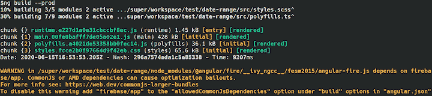

# Angular 10 现已上市。这里是你需要知道的——LogRocket 博客

> 原文：<https://blog.logrocket.com/angular-10-is-now-available-heres-what-you-need-to-know/>

# Angular 10 现已上市。以下是你需要知道的

## 

2020 年 7 月 13 日 2 分钟读完 618

为了与 JavaScript 生态系统保持同步，Angular 团队坚持每年发布两个主要版本。在版本 9 发布仅仅四个月后，该团队最近发布了 Angular 10，其中提供了完整的新功能、突破性的变化和过时的 API。

在本指南中，我们将分解新特性，并介绍任何可能影响您当前代码的突破性变化。

## Angular 10 中的新功能

最新的角度版本引入了以下功能。

### CommonJS 导入警告

CommonJS 最初是为服务器端模块设计的，而不是为了减少产品包的大小。使用与 CommonJS 打包在一起的依赖项会导致[更大的代码包和更慢的应用程序](https://web.dev/commonjs-larger-bundles/)。

Angular 版本 10 现在会在构建引入 CommonJS 模块时发出警告。



### 严格模式下的角度

在版本 10 中，您可以使用`--strict`标志建立具有更严格设置的新项目。

```
ng new --strict

```

这些可选设置有助于提高可维护性，提前捕捉错误，并允许 Angular CLI 对您的应用程序执行高级优化。

具体来说，`strict`标志执行以下操作。

*   在 TypeScript 中启用严格模式
*   将模板类型检查变为`Strict`
*   将默认捆绑包预算减少多达 75%
*   将林挺规则配置为[阻止类型`any`](https://palantir.github.io/tslint/rules/no-any/) 的声明
*   将您的应用程序配置为无副作用，以实现更高级的树摇动

### 更新的浏览器支持

Angular 10 停止了对旧的和不太流行的浏览器的支持，如 IE abd UC 浏览器。它也禁止了新项目的 ES5 构建。

如果您仍然希望支持旧的浏览器，只需将它们添加到`.browserslistrc`文件中。

## 重大变化

以下是与 Angular 10 相关的显著突破性变化的概述。

### 新的类型脚本版本

[TypeScript](https://blog.logrocket.com/tag/typescript/) 是 Angular 框架的主要依赖之一。Angular 10 自带对 Typescript 3.9 的支持。不再支持 Typescript 3.8 和 Typescript 3.7。

其他依赖项，如 TSLib 和 TSLint，也分别更新到了版本 2 和 6。

此外，为了更好地支持 ide 和构建工具解析类型和包配置的方式，Angular 团队添加了一个名为`tsconfig.base.json`的新 TypeScript 配置文件。

### 对`number`类型输入字段的改进

在版本 10 之前，类型为 [`number`](https://angular.io/api/common/DecimalPipe) 的输入字段触发了两次`valueChanges`事件:第一次是在输入字段中键入内容之后，第二次是在输入字段失去焦点时。

在这个新版本中，`number`类型的输入字段在每次值改变时只触发一次`valueChanges`事件。

### `minLength`和`maxLength`构成验证器

以前，`minLength`和`maxLength`表单验证器的行为造成了混乱，看起来好像它们处理数值。这些验证器现在验证一个值是否有数字的`length`属性，并且只有在这种情况下才调用验证。

### 未知属性和元素错误

具有未知属性绑定或元素名称的模板现在记录错误而不是警告。这不会破坏你的应用程序，但是它可能会使那些不希望通过`console.error`记录任何东西的工具出错。

### `UrlMatcher`现在返回`null`

`UrlMatcher`的返回类型`UrlMatchResult`，现在支持`null`。

### 至少一个`EMPTY`解析器的导航取消。

当只有一个解析器的路径解析出一个空的可观测量时(没有下一个，只有完成，如`EmptyObservable`)，导航被取消。

对于多个解析器路径，空的可观测值与单个解析器的处理方式不同。例如，如果两个解析器中的一个解析为空的可观测值，导航不会取消，但相应的路径数据字段会因此而未定义。

在 Angular 版本 10 中不再是这种情况。如果至少有一个解析器解析出空的可观测值，导航被取消。

## 更新到角度 10

要更新到角度 10:

```
ng update @angular/cli @angular/core

```

有关安装角度 10 的详细信息，请参考[角度更新指南](https://update.angular.io/)。

## 像用户一样体验 Angular 应用程序

调试 Angular 应用程序可能很困难，尤其是当用户遇到难以重现的问题时。如果您对监视和跟踪生产中所有用户的角度状态和动作感兴趣，

[try LogRocket](https://lp.logrocket.com/blg/angular-signup)

.

[](https://lp.logrocket.com/blg/angular-signup)[https://logrocket.com/signup/](https://lp.logrocket.com/blg/angular-signup)

LogRocket 就像是网络和移动应用程序的 DVR，记录你网站上发生的一切，包括网络请求、JavaScript 错误等等。您可以汇总并报告问题发生时应用程序的状态，而不是猜测问题发生的原因。

LogRocket NgRx 插件将角度状态和动作记录到 LogRocket 控制台，为您提供导致错误的环境，以及出现问题时应用程序的状态。

现代化调试 Angular 应用的方式- [开始免费监控](https://lp.logrocket.com/blg/angular-signup)。