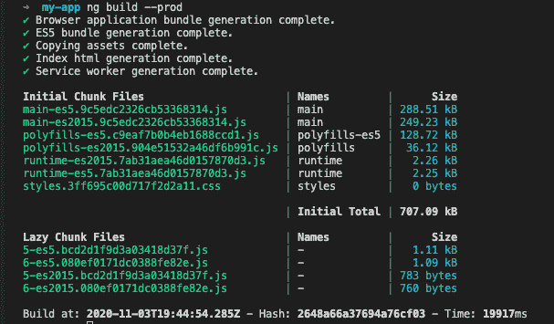

# Angular 11:升级后会发生什么

> 原文：<https://blog.logrocket.com/angular-11-what-to-expect/>

## 介绍

Angular 是 Google 提供的一个基于类型脚本的框架，用于构建 web 应用程序、移动应用程序和桌面应用程序。谷歌在 GitHub 问题跟踪器上检查了 Angular 开发者和公司提出的问题后，于 2020 年 11 月 14 日发布了新的 Angular 11 更新。

因此，他们决定发布 Angular 的另一个版本，目的是通过解决社区提出的问题来改善开发人员的体验。

Angular 11 的发布也提供了一些改进，只关注开发过程。就开发而言，它们也让每个 Angular 用户的事情变得更容易。Angular 11 通过内嵌字体和对 TypeScript 4.0 的支持来优化更快的构建系统。

让我们看看 Angular 11 在使用 CLI 和组件处理框架时给平台带来的更新。我们还将讨论 Angular 自发布以来所做的改变。

## Angular 11 的新功能和变化

### 组件测试线束

组件测试装具是随着 Angular 版本 9 的发布而添加到 Angular 中的新特性。它用于测试有角度的材料组件，并且它还提供了一个健壮和清晰的 API 表面，以帮助开发人员测试材料组件。

组件测试工具也为开发人员提供了一种使用支持的 API 与 Angular material 组件进行交互的方式。

新 Angular 的发布为组件测试工具带来了一些升级。现在，开发人员可以自由地在所有组件中使用组件测试工具。开发人员也可以创建更健壮的测试套件。

并行功能、性能提升、新 API 也是 Angular 11 随版本带来的一些更新。parallel 函数有助于测试中的异步操作，允许开发人员并行执行与组件的多个异步交互。

此外，手动变更检测让开发人员可以自由地禁用单元测试中的自动变更检测，并对变更检测进行更细粒度的控制。

## TypeScript 4.0 支持

新的 Angular 11 从 3.9 版本升级了对 TypeScript 的支持。现在，Angular 也支持 TypeScript 4.0。这次更新的目标是提高构建速度。因此，新的 Angular 确保了在旧版本的构建系统速度上的改进，并且更新了 ngcc 的速度。

## webpack 5 支持

webpack 是一个让开发者编译更大的 JavaScript 模块的工具。它也被称为模块捆扎机。它会编译大量文件，并生成一个可以运行应用程序的文件。新的 webpack 5 于上个月发布，但使用起来并不完全稳定。新的 Angular 11 支持最新发布的 webpack。它支持新 webpack 的原因是因为 Angular 希望在完全稳定的情况下，通过持久的磁盘缓存和小捆绑包来实现更快的构建。

为了进行试验，我们可以将下面的代码行添加到一个`package.json`文件中，或者我们可以使用`Yarn`。`npm`目前不支持 resolutions 属性。

```
"resolutions": {
    "webpack": "5.4.0"
}
```

## 搬到 ESLint

Angular 一直默认使用 TSLint 实现林挺，在新版本发布之前，它一直是其最受欢迎的林挺工具之一。新版本采用了 ESLint 的用法，因为现在流行的 TSLint 正在贬值。由于这个原因，TSlint 林挺的角度实现将不再可用，我们也不能将 TSLint 用于林挺目的。

这一升级是在 Angular 社区成员以及詹姆斯·亨利的帮助下实现的。他们开发了一个第三方迁移路径，该路径是用 [typescript-eslint](https://github.com/typescript-eslint/typescript-eslint) 、 [angular-eslint](https://github.com/angular-eslint/angular-eslint) 和 [tslint-to-eslint-config](https://github.com/typescript-eslint/tslint-to-eslint-config) 构建的。

若要迁移，请将下面的代码添加到项目依赖项中:

```
ng add @angular-eslint/schematics
```

在您的项目上运行以下原理图:

```
ng g @angular-eslint/schematics:convert-tslint-to-eslint {{YOUR_PROJECT_NAME_GOES_HERE}}
```

最后，完成 ESLint 设置后，删除`tslint.json`并从项目中卸载 TSLint。

### 更新了热模块更换(HMR)支持

热模块替换是一种允许在不完全刷新浏览器的情况下替换模块的机制。对于 Angular 开发人员来说，这是一个老概念，Angular 11 的发布减少了配置 HMR 所需的工作量。Angular 11 允许 CLI 在使用`ng serve`启动应用程序时启用 HMR。

在终端上运行以下命令开始:

```
ng serve --hmr
```

运行上面的命令后，一旦本地服务器开始运行，就打开控制台。将显示一条消息，确认 HMR 现已激活。

### 更新的语言服务预览

在 Angular 11 发布之前，Angular 一直基于视图引擎服务。即使是当前版本的 Angular 也支持它。Angular 使用这种语言服务来提供工具，帮助用 Angular 来创建有趣的建筑。

* * *

### 更多来自 LogRocket 的精彩文章:

* * *

Angular 11 的发布带来了即将发布的新语言服务的引入。该服务将基于 Ivy 语言服务，尽管该功能仍处于开发阶段。

这项新服务将使开发者能够通过一个更好的引擎和渲染器视图预览事物是如何工作的。此外，这种语言将能够像 TypeScript 编译器一样正确地推断模板中的泛型类型。

### 自动字体内联

Angular 11 的发布带来了自动字体内联的引入。Angular 11 CLI 下载应用程序中正在使用和链接的内嵌字体，并在编译时进行优化。内嵌字体的优化现在提高了我们应用程序的速度。

Angular 11 中的生产配置默认启用这些功能。

### 改进的日志记录和报告

与以前的版本相比，Angular 11 的发布使日志和报告更容易阅读和理解，从而使开发期间报告的 builder phase info 更加用户友好。



### 更新到版本 11

如果我们准备好了，并且想要将已经安装在我们系统中的旧版本 Angular 更新到新版本，我们可以运行下面的命令来更新它。

```
ng update @angular/cli @angular/core
```

## 结论

在本文中，我们讨论了 Angular 11 的新特性、好处以及新版本修复的错误。通过新功能和更新，我们可以看到 Angular 11 是一个非常大的版本，带有许多有趣的功能。尤其是更快的构建和内嵌字体。这些特征是我最感兴趣的。

如需更多更新信息，您可以随时访问 [update.angular.io](https://update.angular.io/) 了解更多信息。

## 像用户一样体验 Angular 应用程序

调试 Angular 应用程序可能很困难，尤其是当用户遇到难以重现的问题时。如果您对监视和跟踪生产中所有用户的角度状态和动作感兴趣，

[try LogRocket](https://lp.logrocket.com/blg/angular-signup)

.

[](https://lp.logrocket.com/blg/angular-signup)[https://logrocket.com/signup/](https://lp.logrocket.com/blg/angular-signup)

LogRocket 就像是网络和移动应用程序的 DVR，记录你网站上发生的一切，包括网络请求、JavaScript 错误等等。您可以汇总并报告问题发生时应用程序的状态，而不是猜测问题发生的原因。

LogRocket NgRx 插件将角度状态和动作记录到 LogRocket 控制台，为您提供导致错误的环境，以及出现问题时应用程序的状态。

现代化调试 Angular 应用的方式- [开始免费监控](https://lp.logrocket.com/blg/angular-signup)。