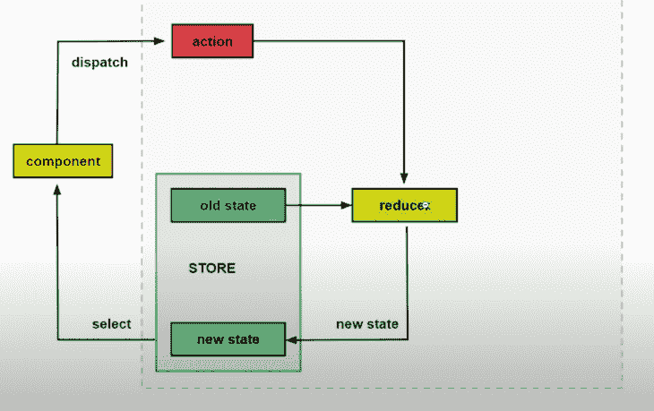
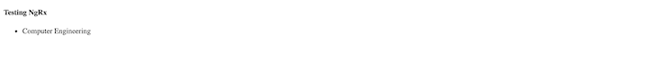
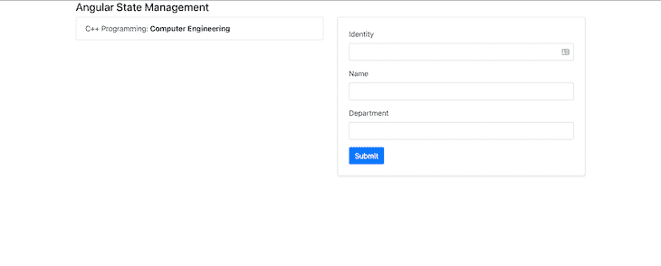

# NgRx - LogRocket 博客简化了角度状态管理

> 原文：<https://blog.logrocket.com/angular-state-management-made-simple-with-ngrx/>

在处理 Angular 应用程序时，没有现成的、快速的数据持久性解决方案。因此，开发一个需要在组件之间进行大量数据通信的非常大的应用程序的经历会非常紧张。

在这个角度状态管理教程中，我们将向你展示如何使用 [NgRx](https://ngrx.io/) ，一个反应式扩展的库集合，来管理你的角度应用程序中的状态。

以下是我们将要介绍的内容:

要学习本教程，您应该具备:

*   对 TypeScript 的基本理解
*   文本编辑器(我们将使用[和代码](https://code.visualstudio.com/)
*   对角度的深刻理解

## 管理前端应用程序中的状态

与使用数据库进行状态管理的后端应用程序不同，前端应用程序需要某种机制来处理数据。这些数据可以是从 HTTP 请求获得的服务器响应，也可以是输入数据和用户路由。

为了便于管理和数据通信，将所有应用程序状态组合在一个中央存储区中是一个很好的做法。所以，基本上，我们的状态是实际存在于商店中的应用程序的表示。

## NgRx 是什么？

NgRx 是一组用于反应式扩展和状态管理的 Angular 库。它通过简化应用程序在对象中的状态和加强单向数据流，使得 Angular 开发变得更加容易。

完整的状态管理系统应该使您能够对状态进行建模，例如，创建状态的简单表示，更新其值，在值发生变化时监视状态，以及检索状态的值。

NgRx 包中包含的库包括:

对于本教程，我们将主要关注商店图书馆。具体来说，我们将演示角度组件如何从单个存储中获取值。

## NgRx Store 是什么？

NgRx Store 是一个受 Redux 启发的状态管理系统,使您能够使用 observables 来管理 Angular 应用程序中的状态。使用 NgRx 存储的主要优点是能够将所有状态存储在一个树中，从应用程序的任何部分都可以访问这个树。

## NgRx 和 Redux

NgRx 使用 [Redux 模式](https://blog.logrocket.com/redux-isnt-dead/)，它由三个主要概念组成:

1.  Store 是保存所有应用程序状态的中央存储区
2.  动作，它描述了应用程序状态的所有变化
3.  Reducers，它通过使用已定义的操作来执行状态转换，从而将存储和操作联系在一起，具体取决于操作



上图清楚地说明了 Redux 的概念，并展示了它如何管理状态。注意 NgRx 也使用这种模式。

比方说，我们在一个特定的组件中有一个按钮，单击它会改变页面标题的值。我们将使用 NgRx 来处理这个问题。

首先，组件调度一个动作。该动作然后传递到减速器。reducer 是一个简单的方法，它将当前状态和动作作为参数，然后返回一个新状态。当 reducer 返回新状态时，组件订阅选择器以获取新值。

状态永远不会直接改变。相反，缩减器总是创建一个新的状态。这就是所谓的不变性。

## 在 NgRx 中使用存储状态、操作和缩减器

在这一节中，我们将演示如何使用存储状态、动作和减少器来简化 Angular 中的状态管理。

### 存储状态

store 基本上是一个 JavaScript 对象，保存我们将在应用程序中使用的数据。

简单存储采用以下格式:

```
const state = {
    persons: [
        {
            name: "Wisdom Ekpot",
            age: 10
        }, {
            name: "John Cat",
            age: 40
        },
        {
            name: "James John",
            age: 11
        }
    ],
    bookDescription: {
        name: "Name of book",
        author: "Wisdom Ekpot"
    }
}

```

### 行动

动作是组件在调用事件时调度的方法。

在这里，您可以定义一个类型以及它将发送的有效载荷:

```
const ChangeNameAction = {
    type: "Change Name",
    name: "Wisdom"
}

```

### 还原剂

`createReducer`方法处理状态转换。

为了访问状态，我们必须将初始状态导入 reducer 文件。为了触发一个动作，我们使用`on`事件，该事件将动作的名称作为参数:

```
const _reducer = createReducer(
    initialState,
    on(nameOfAction, (state, action) => {
        return {
            ...state,
            someState: action.anyState
        }
    })
)

```

## 使用 NgRx Store 构建简单的 Angular 应用程序

首先设置一个新的角度应用程序。如果您的本地机器上没有安装 Angular，您可以打开您的终端并运行`npm i @angular/cli -g`。`-g`标志将确保 [Angular CLI](https://blog.logrocket.com/6-useful-features-in-angular-cli-eb502bd95874/) 被全局安装在您的本地机器上。

要创建新项目，请在您的终端上运行`ng new course-list`。安装完成后，通过运行`cd course-list`进入项目。

接下来，通过在终端中运行以下命令将 NgRx 存储安装到您的项目中(确保您的终端在项目工作目录中):

```
npm install @ngrx/store --save

```

安装后，在 VS 代码上打开应用程序，并使用以下命令服务应用程序:

```
code . && ng serve

```

在您的`src/app`目录中创建一个`store`目录。这是添加所有 NgRx 特性的地方。

在`store`目录中，创建一个`models`目录，并在其中创建一个`courseItem.model.ts`文件。我们将在这个文件中为我们的课程列表定义接口:

```
export interface CourseItem {
  id: string;
  department: string;
  name: string;
}

```

接下来，在`store`目录中创建一个`Actions`目录。这是定义所有 NgRx 动作的地方。

在`actions`目录中创建一个`course.action.ts`文件，并添加以下内容:

```
import { Action } from '@ngrx/store';
import { CourseItem } from '../models/courseItem.model';
export enum CourseActionType {
  ADD_ITEM = '[COURSE] Add Course',
}
export class AddItemAction implements Action {
  readonly type = CourseActionType.ADD_ITEM;
  //add an optional payload
  constructor(public payload: CourseItem) {}
}
export type CourseAction = AddItemAction;

```

我们首先从商店导入 NgRx 动作，然后导入我们定义的`coureitem`接口。这有很多用例；在这里，我们将使用它作为我们行动的简单验证。

我们将使用 [TypeScript enum](https://blog.logrocket.com/why-typescript-enums-suck/) 来定义一个动作，该动作允许我们声明一组命名的常量，例如相关的数字或字符串值的集合。

这样做之后，我们创建了一个`AddItemAction`，它实现了 NgRx 动作。每个 [NgRx 动作](https://ngrx.io/guide/store/actions)都有两个主要属性:一个类型和一个可选的有效载荷。类型通常是一个只读字符串，表示我们将分派到存储中的动作类型。因为这是一个类，我们可以使用类构造函数接受可选的有效载荷。

接下来，我们将导出一个`CourseAction`类型，其值将是`AddItemAction`动作。
有了这个定义，我们需要创建我们的减速器来帮助从`stateX`过渡到`stateY`。

让我们在`store`目录中创建一个`reducers`目录。在`reducers`目录中，创建一个`course.reducer.ts`文件并添加以下内容:

```
// import the interface
import { CourseItem } from '../models/courseItem.model';
import { CourseAction, CourseActionType } from '../actions/course.action';
//create a dummy initial state
const initialState: Array<CourseItem> = [
  {
    id: '1',
    department: 'Computer Engineering',
    name: 'C++ Programming',
  },
];
export function courseReducer(
  state: Array<CourseItem> = initialState,
  action: CourseAction
) {
  switch (action.type) {
    case CourseActionType.ADD_ITEM:
      return [...state, action.payload];
    default:
      return state;
  }
}

```

首先要做的是导入`courseItem`模型、`CourseAction`动作和`CourseActionType`动作。现在，我们将创建一个使用`CourseItem`接口进行验证的初始状态。

我们创建一个 reducer 函数，它将一个`state`和一个动作作为参数。state 参数将是一种数组类型，其值将是我们刚刚创建的已定义的初始状态。我们使用 JavaScript 语句来检查动作类型是否在我们的动作文件中定义。如果确实存在，它将返回状态和操作负载。如果没有，它只是返回状态。

回想一下，NgRx 或任何状态管理系统的目标都是将所有应用程序状态保存在一个存储中，以便可以从应用程序的任何部分访问它。让我们在模型目录中创建一个`state.model.ts`文件。

将以下内容添加到您刚刚创建的文件中:

```
import { CourseItem } from './courseItem.model';

export interface State {
  readonly courses: Array<CourseItem>;
}

```

现在我们必须在我们的根`app.modules.ts`文件中注册 NgRx。导入`CourseReducer`，然后在 imports 数组中注册它。我们还将导入[角度模板](https://angular.io/api/forms/FormsModule)，我们很快就会用到它:

```
import { CourseReducer } from './store/reducers/course.reducer';
import { FormsModule } from '@angular/forms';

```

导入模块后，将其注册到`imports`数组中:

```
imports: [
    FormsModule,
    StoreModule.forRoot({
      course: CourseReducer,
    }),
  ],

```

我们现在可以在组件中使用 NgRx。让我们从修改根文件`app.component.ts`开始，如下所示:

```
import { Component, OnInit } from '@angular/core';
import { Store } from '@ngrx/store';
import { Observable } from 'rxjs';
import { CourseItem } from './store/models/courseItem.model';
import { AppState } from './store/models/app-state.model';
@Component({
  selector: 'app-root',
  templateUrl: './app.component.html',
  styleUrls: ['./app.component.css'],
})
export class AppComponent implements OnInit {
  courseItems$: Observable<Array<CourseItem>>;
  constructor(private store: Store<AppState>) {}
  ngOnInit(): void {
    this.courseItems$ = this.store.select((store) => store.course);
  }
}

```

我们引入了 [RxJS 观察值](https://rxjs-dev.firebaseapp.com/guide/observable?ref=codebldr)，我们定义的`courseItem`接口，以及我们的应用程序状态。我们将`courseItems$`设置为一种可观察类型，这将是一种数组类型。然后，我们将`courseItems$`的值设置为返回的商店。

我们现在可以在模板中使用它。我们将删除`app.component.html`中的所有模板 HTML，并将其转换为以下内容:

```
<h4>Testing NgRx</h4>
<ul>
  <li *ngFor="let course of courseItems$ | async">
    {{course.department}}
  </li>
</ul>

```

我们可以使用`async`自动订阅一个可观察对象，并使用`ng serve`命令运行我们的应用程序。在浏览器上运行应用程序将显示以下内容:



这是因为我们没有调用任何 reducer 而返回的，所以它只是返回状态。

### 添加课程

我们要处理的下一个功能是在课程列表中添加一门课程。我们将为用户创建一个简单的表单来添加新课程。

为了一个好看的用户界面，我们将使用[引导程序](https://blog.logrocket.com/using-bootstrap-components-with-custom-javascript/)。我们将把引导 CSS CDN 添加到我们的`app/index.html`:

```
<!doctype html>
<html lang="en">
<head>
  <meta charset="utf-8">
  <title>CourseList</title>
  <base href="/">
  <meta name="viewport" content="width=device-width, initial-scale=1">
  <link rel="icon" type="image/x-icon" href="favicon.ico">
  <link rel="stylesheet" href="https://cdn.jsdelivr.net/npm/[email protected]/dist/css/bootstrap.min.css"
    integrity="sha384-B0vP5xmATw1+K9KRQjQERJvTumQW0nPEzvF6L/Z6nronJ3oUOFUFpCjEUQouq2+l" crossorigin="anonymous">
</head>
<body>
  <app-root></app-root>
</body>
</html>

```

为了创建一个简单的表单，在我们的用户界面中添加课程名称和系，让我们修改我们的`app.component.html`文件，如下所示:

```
<section>
  <div class="container">
    <div class="row">
      <div class="col-md-12">
        <h4>Angular State Management</h4>
      </div>
      <div class="col-md-6">
        <ul class="list-group">
          <li class="list-group-item" *ngFor="let course of courseItems$ | async">
            {{course.name}}: <b>{{course.department}}</b>
          </li>
        </ul>
      </div>
      <div class="col-md-6">
        <div class="card p-4 shadow-sm">
          <form #myform="ngForm" (ngSubmit)="addCourse(myform)">
            <div class="form-group">
                          <label for="name">Identity</label>
                          <input type="text" class="form-control" ngModel name="id" id="id" aria-describedby="identity" required>
                        </div>
            <div class="form-group">
              <label for="name">Name</label>
              <input type="text" class="form-control" ngModel name="name" id="name" aria-describedby="name">
            </div>
            <div class="form-group">
              <label for="department">Department</label>
              <input type="text" class="form-control" ngModel name="department" id="department">
            </div>
            <button type="submit" class="btn btn-primary">Submit</button>
          </form>
        </div>
      </div>
    </div>
  </div>
</section>

```

这是一个基本的代码重构。这里，我们使用角度形式 [ngModel](https://angular.io/api/forms/NgModel) 来获取该形式的值。接下来，我们需要在我们的 TypeScript 文件中导入`NgForm`，并创建一个方法来分派`AddItemAction`:

```
import { NgForm } from '@angular/forms';
import { AddItemAction } from './store/actions/course.action';

//create the method for adding a new course and then reset the form

 addCourse(form: NgForm) {
    this.store.dispatch(new AddItemAction(form.value));
    form.reset();
}

```

我们现在可以使用我们创建的表单添加新课程:



## 结论

处理大型应用程序需要良好的架构和有组织的结构。NgRx 等状态管理工具可以帮助您在应用程序扩展时维护一个可读的代码库。

无论您是否是 Angular 开发人员，理解状态管理背后的基本概念将使您更容易在项目中使用 Redux 和 [Vuex](https://blog.logrocket.com/do-you-really-need-vuex/) 等工具。

本文的源代码可以在 [GitHub](https://github.com/Wisdom132/ngrx-playground) 上找到。

## 像用户一样体验 Angular 应用程序

调试 Angular 应用程序可能很困难，尤其是当用户遇到难以重现的问题时。如果您对监视和跟踪生产中所有用户的角度状态和动作感兴趣，

[try LogRocket](https://lp.logrocket.com/blg/angular-signup)

.

[](https://lp.logrocket.com/blg/angular-signup)[https://logrocket.com/signup/](https://lp.logrocket.com/blg/angular-signup)

LogRocket 就像是网络和移动应用程序的 DVR，记录你网站上发生的一切，包括网络请求、JavaScript 错误等等。您可以汇总并报告问题发生时应用程序的状态，而不是猜测问题发生的原因。

LogRocket NgRx 插件将角度状态和动作记录到 LogRocket 控制台，为您提供导致错误的环境，以及出现问题时应用程序的状态。

现代化调试 Angular 应用的方式- [开始免费监控](https://lp.logrocket.com/blg/angular-signup)。