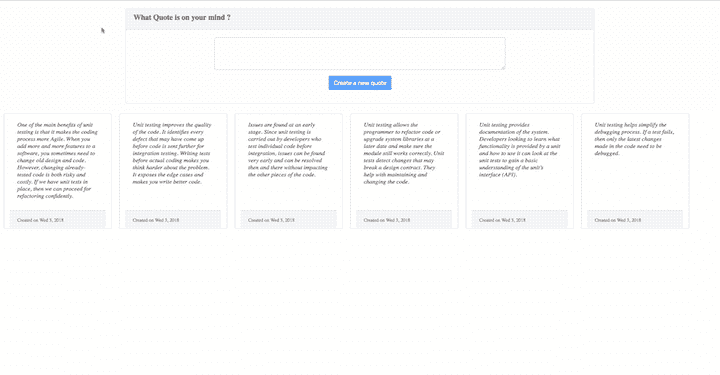
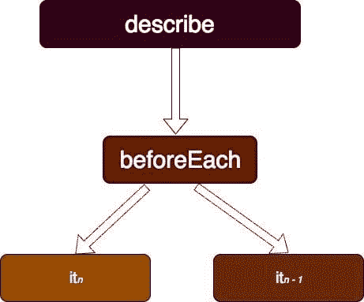
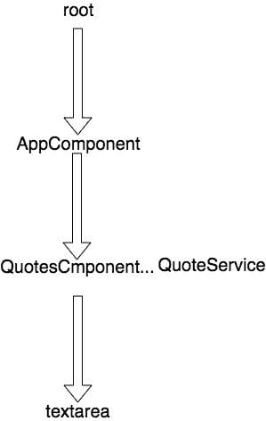
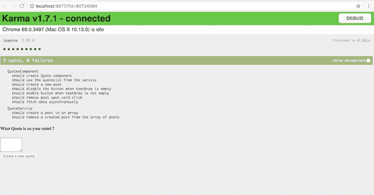

# 带示例的角度单元测试教程

> 原文：<https://blog.logrocket.com/angular-unit-testing-tutorial/>

***编者按:*** *本教程最后一次更新是在 2022 年 12 月 7 日，以确保它与 Angular 的最新版本(撰写本文时为 v15)兼容，并增加了如何自动生成 Angular 单元测试的部分。如果你对*[*React Native*](https://blog.logrocket.com/unit-testing-react-native/)*或*[*React and Cypress*](https://blog.logrocket.com/unit-testing-react-cypress/)中的单元测试感兴趣，可以看看这些文章。

在这个角度单元测试教程中，我们将演示如何构建一个简单的角度应用程序，然后通过例子一步一步地完成单元测试过程。

我们将详细介绍以下内容:

按照本教程，你应该对如何使用[角度](https://angular.io/guide/testing-services)有一个基本的了解。

## 什么是角度测试？

[角度测试](https://angular.io/guide/testing)是使用[角度 CLI](https://angular.io/cli) 设置的每个项目的核心功能。

为了与 JavaScript 生态系统保持同步，Angular 团队每年都会发布两个主要的 Angular 版本。从最初到最近的版本 [Angular 15](https://blog.angular.io/angular-v15-is-now-available-df7be7f2f4c8) ，Angular 的设计就考虑到了可测试性。

有两种角度测试:

1.  单元测试是测试小的、孤立的代码片段的过程。也称为隔离测试，单元测试不使用外部资源，如网络或数据库
2.  **功能测试**是指从用户体验的角度测试 Angular 应用的功能，例如，当应用在浏览器中运行时，就像用户一样与应用进行交互

[https://www.youtube.com/embed/BumgayeUC08](https://www.youtube.com/embed/BumgayeUC08)

视频

## 什么是角度单位测试？

[角度上的单元测试](https://docs.angularjs.org/guide/unit-testing)是指测试单个代码单元的过程。

角度单元测试旨在发现诸如不正确的逻辑、行为不当的函数等问题。通过分离代码片段。这有时比听起来更困难，尤其是对于关注点分离不良的复杂项目。Angular 旨在帮助你以这样一种方式编写代码，使你能够单独测试你的应用程序的功能。

## 为什么应该对 Angular 应用进行单元测试

角度单元测试使你能够基于用户行为测试你的应用。虽然测试每一种可能的行为是乏味、低效和无效的，但是为应用程序中的每一个耦合块编写测试有助于演示这些块的行为。

测试这些块的强度的最简单的方法之一是为每个块编写一个测试。您不必等到用户抱怨单击按钮时输入字段的行为。通过为你的模块(组件、服务等)编写单元测试。)，可以很容易的察觉到什么时候有断档。

我们的示例 Angular 应用程序有一个服务、一个组件和一个异步任务来模拟从服务器获取的数据:



## 角度测试怎么写？

当您使用 Angular CLI ( `ng new appName`)创建新项目时，会添加一个默认组件和测试文件。另外——如果你像我一样，总是在寻找捷径——测试脚本总是与你使用 Angular CLI 创建的任何组件模块(服务、组件)一起创建。

这个以`.spec.ts`结尾的测试脚本总是被添加。让我们来看看最初的测试脚本文件，它是`app.component.spec.ts`:

```
import { TestBed, async } from '@angular/core/testing';
import { AppComponent } from './app.component';
describe('AppComponent', () => {
  beforeEach(async(() => {
    TestBed.configureTestingModule({
      declarations: [
        AppComponent
      ],
    }).compileComponents();
  }));
  it('should create the app', async(() => {
    const fixture = TestBed.createComponent(AppComponent);
    const app = fixture.debugElement.componentInstance;
    expect(app).toBeTruthy();
  }));
  it(`should have as title 'angular-unit-test'`, async(() => {
    const fixture = TestBed.createComponent(AppComponent);
    const app = fixture.debugElement.componentInstance;
    expect(app.title).toEqual('angular-unit-test');
  }));
  it('should render title in a h1 tag', async(() => {
    const fixture = TestBed.createComponent(AppComponent);
    fixture.detectChanges();
    const compiled = fixture.debugElement.nativeElement;
    expect(compiled.querySelector('h1').textContent).toContain('Welcome to angular-unit-test!');
  }));
});

```

让我们运行第一个测试，以确保没有任何问题发生:

```
ng test

```

您可能想知道，即使项目在浏览器中呈现，我们如何通过简单地编写测试来模拟用户行为？随着我们的继续，我将演示如何模拟在浏览器上运行的 Angular 应用程序。

## 《角》中的业力是什么？

[Karma](https://karma-runner.github.io/latest/index.html) 是一个 JavaScript 测试运行程序，在 Angular 中运行单元测试片段。Karma 还确保测试结果在控制台或文件日志中打印出来。

默认情况下，Angular 运行在 Karma 上。其他参赛选手包括[摩卡](https://blog.logrocket.com/a-quick-and-complete-guide-to-mocha-testing-d0e0ea09f09d/)和[茉莉](https://jasmine.github.io/)。Karma 提供了一些工具，使得在用 Angular 编写代码时调用 Jasmine 测试变得更加容易。

## 如何用 Angular 编写单元测试

角度测试包包括两个名为`TestBed`和`async`的实用程序。`TestBed`是主要的 Angular utility 包。



`describe`容器包含不同的块(`it`、`beforeEach`、`xit`等)。).`beforeEach`跑在任何其他街区之前。其他块的运行互不依赖。

从`app.component.spec.ts`文件开始，第一个块是容器内的`beforeEach`(`describe`)。这是唯一一个在任何其他程序块之前运行的程序块(`it`)。`app.module.ts`文件中 app 模块的声明在`beforeEach`块中模拟(声明)。在`beforeEach`块中声明的组件(`AppComponent`)是我们希望在这个测试环境中拥有的主要组件。同样的逻辑也适用于其他测试声明。

调用`compileComponents`对象来编译组件的资源，如模板、样式等。如果使用 webpack，您可能不一定要编译组件:

```
beforeEach(async(() => {
   TestBed.configureTestingModule({
      declarations: [
         AppComponent
      ],
   }).compileComponents();
}));

```

现在组件已经在`beforeEach`块中声明了，让我们检查组件是否被创建。

`fixture.debugElement.componentInstance`创建该类的一个实例(`AppComponent`)。我们将测试这个类的实例是否是真正使用`toBeTruthy`创建的:

```
it('should create the app', async(() => {
    const fixture = TestBed.createComponent(AppComponent);
    const app = fixture.debugElement.componentInstance;
    expect(app).toBeTruthy();
}));

```

第三块演示了如何访问已创建组件的属性(`AppComponent`)。默认情况下添加的唯一属性是标题。您可以从创建的组件实例(`AppComponent`)中轻松检查您设置的标题是否已更改:

```
it(`should have as title 'angular-unit-test'`, async(() => {
     const fixture = TestBed.createComponent(AppComponent);
     const app = fixture.debugElement.componentInstance;
     expect(app.title).toEqual('angular-unit-test');
}));

```

第四块演示了测试在浏览器环境中的行为。在创建组件之后，调用所创建组件的实例(`detectChanges`)来模拟在浏览器环境中运行。现在组件已经被渲染了，您可以通过访问渲染组件的`nativeElelment`对象(`fixture.debugElement.nativeElement`)来访问它的子元素:

```
it('should render title in a h1 tag', async(() => {
   const fixture = TestBed.createComponent(AppComponent);
   fixture.detectChanges();
   const compiled = fixture.debugElement.nativeElement;
 expect(compiled.querySelector('h1').textContent).toContain('Welcome to angular-unit-test!');
}));

```

现在，您已经熟悉了测试组件的基础知识，让我们测试我们的 Angular 示例应用程序:



## 如何测试角度服务

服务通常依赖于 Angular 注入到构造函数中的其他服务。在许多情况下，通过向可注入对象添加`providedIn: root`来创建和注入这些依赖项是很容易的，这使得任何组件或服务都可以访问它:

```
import { Injectable } from "@angular/core";
import { QuoteModel } from "../model/QuoteModel";

@Injectable({
  providedIn: "root"
})
export class QuoteService {
  public quoteList: QuoteModel[] = [];

  private daysOfTheWeeks = ["Sun", "Mon", "Tue", "Wed", "Thurs", "Fri", "Sat"];

  constructor() {}

  addNewQuote(quote: String) {
    const date = new Date();
    const dayOfTheWeek = this.daysOfTheWeeks[date.getDate()];
    const day = date.getDay();
    const year = date.getFullYear();
    this.quoteList.push(
      new QuoteModel(quote, `${dayOfTheWeek} ${day}, ${year}`)
    );
  }

  getQuote() {
    return this.quoteList;
  }

  removeQuote(index:number) {
    this.quoteList.splice(index, 1);
  }
}

```

下面是测试`QuoteService`类的几种方法:

```
/* tslint:disable:no-unused-variable */
import { QuoteService } from "./Quote.service";

describe("QuoteService", () => {
  let service: QuoteService;

  beforeEach(() => {
    service = new QuoteService();
  });

  it("should create a post in an array", () => {
    const qouteText = "This is my first post";
    service.addNewQuote(qouteText);
    expect(service.quoteList.length).toBeGreaterThanOrEqual(1);
  });

  it("should remove a created post from the array of posts", () => {
    service.addNewQuote("This is my first post");
    service.removeQuote(0);
    expect(service.quoteList.length).toBeLessThan(1);
  });
});

```

在第一个块`beforeEach`中，创建了一个`QuoteService`的实例，以确保它只被创建一次，并避免在其他块中重复，除了一些例外情况:

```
it("should create a post in an array", () => {
    const qouteText = "This is my first post";
    service.addNewQuote(qouteText);
    expect(service.quoteList.length).toBeGreaterThanOrEqual(1);
  });

```

第一个块通过检查数组的长度来测试 post 模型`QuoteModel(text, date)`是否被创建到数组中。`quoteList`的长度预计为`1`:

```
it("should remove a created post from the array of posts", () => {
    service.addNewQuote("This is my first post");
    service.removeQuote(0);
    expect(service.quoteList.length).toBeLessThan(1);
  });

```

第二个块在数组中创建一个 post，并通过调用服务对象中的`removeQuote`立即删除它。`quoteList`的长度预计为`0`。

## 如何测试角度组件

在我们的角度单元测试示例应用程序中，`service`被注入到`QuoteComponent`中以访问其属性，这将是视图所需要的:

```
import { Component, OnInit } from '@angular/core';
import { QuoteService } from '../service/Quote.service';
import { QuoteModel } from '../model/QuoteModel';

@Component({
  selector: 'app-Quotes',
  templateUrl: './Quotes.component.html',
  styleUrls: ['./Quotes.component.css']
})
export class QuotesComponent implements OnInit {

  public quoteList: QuoteModel[];
  public quoteText: String ="";

  constructor(private service: QuoteService) { }

  ngOnInit() {
    this.quoteList = this.service.getQuote();
  }

  createNewQuote() {
    this.service.addNewQuote(this.quoteText);
    this.quoteText ="";
  }

  removeQuote(index) {
    this.service.removeQuote(index);
  }
}
<div class="container-fluid">
  <div class="row">
    <div class="col-8 col-sm-8 mb-3 offset-2">
      <div class="card">
        <div class="card-header">
          <h5>What Quote is on your mind ?</h5>
        </div>
        <div class="card-body">
          <div role="form">
            <div class="form-group col-8 offset-2">
              <textarea #quote class="form-control" rows="3" cols="8" [(ngModel)]="quoteText" name="quoteText"></textarea>
            </div>
            <div class="form-group text-center">
              <button class="btn btn-primary" (click)="createNewQuote()" [disabled]="quoteText == null">Create a new
                quote</button>
            </div>
          </div>
        </div>
      </div>
    </div>
  </div>

  <div class="row">
    <div class="card mb-3 col-5 list-card" id="quote-cards" style="max-width: 18rem;" *ngFor="let quote of quoteList; let i = index"
      (click)="removeQuote(i)">
      <div class="card-body">
        <h6>{{ quote.text }}</h6>
      </div>
      <div class="card-footer text-muted">
        <small>Created on {{ quote.timeCreated }}</small>
      </div>
    </div>
  </div>
</div>

```

`describe`容器中的前两个程序块连续运行。在第一个块中，`FormsModule`被导入到配置测试中。这确保了可以使用表单的相关指令，比如`ngModel`。

同样，`QuotesComponent`在`configTestMod`中声明，类似于组件在`appModule`文件中的`ngModule`中声明。第二个块`creates` a `QuoteComponent`及其`instance`，将被其他块使用:

```
let component: QuotesComponent;
  let fixture: ComponentFixture<QuotesComponent>;

  beforeEach(() => {
    TestBed.configureTestingModule({
      imports: [FormsModule],
      declarations: [QuotesComponent]
    });
  });

  beforeEach(() => {
    fixture = TestBed.createComponent(QuotesComponent);
    component = fixture.debugElement.componentInstance;
  });

```

此块测试所创建的组件实例是否已定义:

```
it("should create Quote component", () => {
    expect(component).toBeTruthy();
  });

```

注入的服务处理所有操作的操作(`add`、`remove`、`fetch`)。`quoteService`变量保存注入的服务(`QuoteService`)。此时，组件还没有被渲染，直到调用了`detectChanges`方法:

```
it("should use the quoteList from the service", () => {
    const quoteService = fixture.debugElement.injector.get(QuoteService);
    fixture.detectChanges();
    expect(quoteService.getQuote()).toEqual(component.quoteList);
  });

```

现在让我们测试一下我们是否能成功创建帖子。组件的属性可以在实例化时访问，所以当一个值被传递到`quoteText`模型中时，呈现的组件会检测到新的变化。`nativeElement`对象提供了对呈现的 HTML 元素的访问，这使得检查添加的`quote`是否是呈现的文本的一部分变得更加容易:

```
it("should create a new post", () => {
    component.quoteText = "I love this test";
    fixture.detectChanges();
    const compiled = fixture.debugElement.nativeElement;
    expect(compiled.innerHTML).toContain("I love this test");
  });

```

除了可以访问 HTML 内容之外，您还可以通过元素的 CSS 属性来获取元素。当`quoteText`模型为空或 null 时，按钮将被禁用:

```
it("should disable the button when textArea is empty", () => {
    fixture.detectChanges();
    const button = fixture.debugElement.query(By.css("button"));
    expect(button.nativeElement.disabled).toBeTruthy();
  });
it("should enable button when textArea is not empty", () => {
    component.quoteText = "I love this test";
    fixture.detectChanges();
    const button = fixture.debugElement.query(By.css("button"));
    expect(button.nativeElement.disabled).toBeFalsy();
  });

```

就像我们用 CSS 属性访问元素一样，我们也可以通过类名访问元素。使用`By e.g By.css(‘.className.className’)`可以同时访问多个类。

通过调用`triggerEventHandler`来模拟按钮点击。必须指定`event`类型，在本例中是`click`。点击时，显示的报价将从`quoteList`中删除:

```
it("should remove post upon card click", () => {
    component.quoteText = "This is a fresh post";
    fixture.detectChanges();

    fixture.debugElement
      .query(By.css(".row"))
      .query(By.css(".card"))
      .triggerEventHandler("click", null);
    const compiled = fixture.debugElement.nativeElement;
    expect(compiled.innerHTML).toContain("This is a fresh post");
  });

```

## 如何在 Angular 中测试异步操作

不可避免的是，你最终需要远程获取数据。此操作最好被视为异步任务。

`fetchQoutesFromServer`表示一个异步任务，在两秒钟后返回一组引号:

```
fetchQuotesFromServer(): Promise<QuoteModel[]> {
    return new Promise((resolve, reject) => {
      setTimeout(() => {
        resolve([new QuoteModel("I love unit testing", "Mon 4, 2018")]);
      }, 2000);
    });
  }

```

`spyOn`对象模拟`fetchQuotesFromServer`方法如何工作。它接受两个参数:`quoteService`和`fetchQuotesFromServer`方法，前者被注入到组件中。

`fetchQuotesFromServer`有望回报承诺。`spyOn`将使用`and`的方法与使用`returnValue`返回的假承诺调用链接起来。因为我们想要模拟`fetchQuotesFromServer`的工作方式，所以我们需要传递一个`promise`，它将解析一个报价列表。

正如我们之前所做的，我们将调用`detectChanges`方法来获取更新的更改。`whenStable`允许访问所有`async`任务完成后的结果:

```
it("should fetch data asynchronously", async () => {
    const fakedFetchedList = [
      new QuoteModel("I love unit testing", "Mon 4, 2018")
    ];
    const quoteService = fixture.debugElement.injector.get(QuoteService);
    let spy = spyOn(quoteService, "fetchQuotesFromServer").and.returnValue(
      Promise.resolve(fakedFetchedList)
    );
    fixture.detectChanges();
    fixture.whenStable().then(() => {
      expect(component.fetchedList).toBe(fakedFetchedList);
    });
  });

```

## 如何自动生成角度单元测试

当您使用 Angular CLI 搭建项目时，它会为默认的 app 组件生成单元测试规范。在初始项目设置之后，我们需要为每个组件、指令等等编写测试规范。在大多数情况下，这将是耗时的，因为我们将不得不从头开始编写这些规范。幸运的是，Angular 生态系统创建了`ngentest`包来自动生成每个组件、指令和其他的测试规范。

假设您为您的组件编写了代码，并且想要为它编写一个测试，那么您必须安装`ngentest`包:

```
$ npm install ngentest -g

```

接下来，您将运行以下命令来为您的组件自动生成单元测试规格:

```
$ gentest component-name.ts

```

我们还可以为指令、管道和服务自动生成单元测试规范:

```
$ gentest directive-name.ts -s # output to directive-name.spec.ts
$ gentest pipe-name.ts # output to pipe-name.test.ts
$ gentest service-name.ts. # output to service-name.test.ts

```

## `ngentest`如何工作

`ngentest`解析`gentest`命令旁边的文件名，并确定正确的文件类型。在我们的例子中，它是在我们之前的命令中看到的`component-name.ts`。

接下来，`ngentest`使用文件的内容从解析的类型脚本中为单元测试构建数据，例如:

*   班级
*   进口
*   要测试的功能列表
*   输入和输出
*   嘲弄

最后，`ngentest`生成单元测试。

`gentest`包没有生成 100%的测试覆盖率，所以你需要修改生成的单元测试规格来达到这个目标。

## 结论

Angular 确保在浏览器中查看测试结果。这将更好地显示测试结果:



您可以在这个 [GitHub 库](https://github.com/emmanuelhashy/angular-unit-tests)中找到这个项目的源代码，它是用最新的 Angular 版本构建的。

## [LogRocket](https://lp.logrocket.com/blg/typescript-signup) :全面了解您的网络和移动应用

[](https://lp.logrocket.com/blg/typescript-signup)

LogRocket 是一个前端应用程序监控解决方案，可以让您回放问题，就像问题发生在您自己的浏览器中一样。LogRocket 不需要猜测错误发生的原因，也不需要向用户询问截图和日志转储，而是让您重放会话以快速了解哪里出错了。它可以与任何应用程序完美配合，不管是什么框架，并且有插件可以记录来自 Redux、Vuex 和@ngrx/store 的额外上下文。

除了记录 Redux 操作和状态，LogRocket 还记录控制台日志、JavaScript 错误、堆栈跟踪、带有头+正文的网络请求/响应、浏览器元数据和自定义日志。它还使用 DOM 来记录页面上的 HTML 和 CSS，甚至为最复杂的单页面和移动应用程序重新创建像素级完美视频。

[Try it for free](https://lp.logrocket.com/blg/typescript-signup)

.