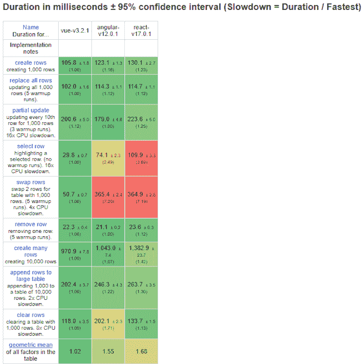
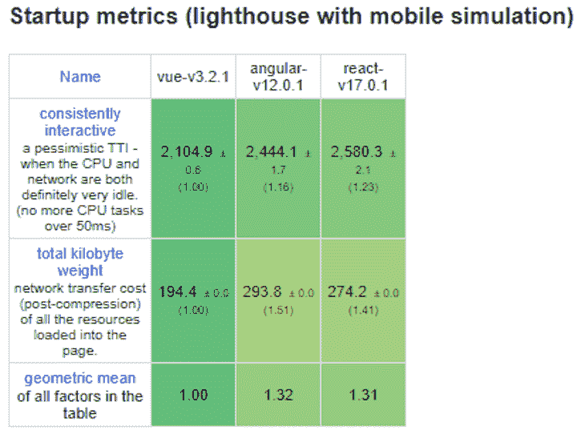
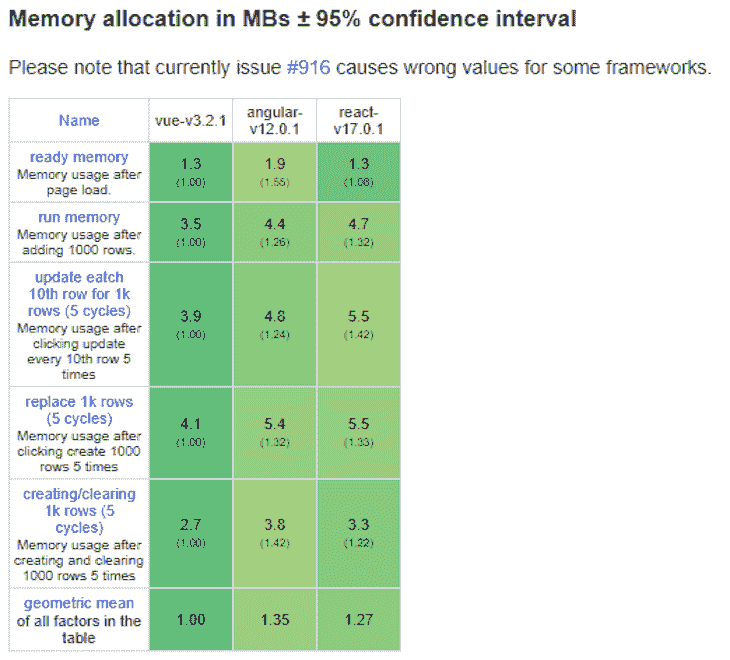

# Angular vs. React vs. Vue.js:性能比较

> 原文：<https://blog.logrocket.com/angular-vs-react-vs-vue-js-comparing-performance/>

***编者按*** : *本帖最后更新于**2021 年 10 月 26 日* *更新任何过时的信息，包括框架和平台版本更新。*

在这个不断变化的技术世界中，一些工具已经存在，而许多其他工具随着时间的推移已经淡出人们的视线。然而，我们都同意的一件事是，JavaScript 编程语言将长期存在。

这项令人惊叹的技术因其多功能性而受到数百万人的喜爱；它可以部署在移动应用程序和桌面的服务器端和客户端。

然而，JavaScript 可能是一种复杂的语言，因为它有特定的语法和特性。我承认我发现自己很多次看着一段 JavaScript 代码，想知道幕后到底发生了什么。

为了解决 JavaScript 有时令人费解的本质，人们创建了框架。

框架是我们应用程序的骨架，它定义了开发项目的指导方针和最佳实践，同时简化了我们的许多因素，比如代码结构和维护。

虽然 Angular、React 和 Vue 框架已经存在了一段时间，但这并不意味着它们已经过时；相反，它们仍然是一些最流行的框架。

在本文中，我们将比较这三种基于 JavaScript 的解决方案的性能，以及为什么它们仍然是过去十年中最重要的 JavaScript 框架。

## 我如何选择一个 JavaScript 框架？

很多时候，当你发现自己想知道在开始一个新项目时使用什么框架时，你可能会在没有完全分析它的情况下选择一个。但是当您意识到所选择的框架不能满足您的应用程序需求时，这就成问题了。

例如，如果您有一个非常重要的项目，它有不同的瓶颈，您需要一个详细的图片来说明哪个框架会执行得更好。

通过快速介绍每个框架并为您提供性能分析，您可以有效地指导您的选择并挑选出最适合您的框架。

## 什么是有角的，为什么要用？

在一个旧的、新的和新兴的前端 JavaScript 框架世界中， [Angular 很快确立了自己的地位，成为数百万开发者使用的主流技术](https://blog.logrocket.com/form-builders-angular-8-validate-reactive-forms/)。

这不仅是因为一个最优的版本，还因为 Angular 提供了一个令人难以置信的结构，提供了简单的双向数据绑定、MVC 模型、内置模块系统、路由包、依赖注入和其他令人兴奋的特性。

### Angular 最重要的特征是什么？

由于其 MVC 结构，Angular 可以将任务分成逻辑块，减少网页的初始加载时间。MVC 模型还允许关注点的分离，视图部分呈现在客户端，大大减少了后台的查询。此外，与该工具的通信以异步模式工作，这意味着对服务器的调用较少。

### 棱角分明有什么好处？

Angular 很受欢迎，也很好用。因为它在开发者空间中具有吸引力，所以许多社区和专业人士都支持它。

Angular 提供了丰富的文档和许多内置功能，允许您创建复杂的应用程序，而无需第三方软件包。

此外，Angular 最好的特性之一是双向数据绑定，它以一种简单、高效和直观的方式将对模型的更改立即复制到视图中。

### 棱角分明有什么问题？

使用 Angular 时发现的一个常见问题是它会产生较重的应用程序。由于这个框架的许多特性，有时它们会给你的项目带来负担，转化成一个比 React 或 Vue 更重、性能更慢的应用程序。

加上经常引入的新的重大变化和陡峭的学习曲线，开发人员可能会面临尝试适应和学习 Angular 的许多功能的挑战，使其更难了解其对手 React 和 Vue。

## React 是什么，为什么要用它？

React 是一个前端库,用于创建有状态和可重用的 UI 组件，用于开发大型 web 应用程序，无需重新加载页面即可更改数据。

React 背后的主要任务是简单、可伸缩和快速。因为它是一个前端库，React 没有实现 MVC 模板，但是你可以把它看作是它的视图部分。

### 是什么让 React 性能更快？

使用 React 的最大优势是它的性能。凭借 34.8KB 的 gzipped 文件大小，该库以其令人难以置信的速度和许多使其成为可能的功能而迅速闻名，例如:

*   通过仅根据需要重新渲染节点，使用虚拟 DOM 实现最高效率
*   支持捆绑和树摇动，以最小化最终用户的资源负载
*   支持服务器端渲染(SSR)以提高性能、搜索引擎可见性和社交共享

### React 的主要优势是什么？

通过使用虚拟 DOM，开发人员可以轻松提高性能并优化应用程序工作负载。

与 Angular 不同，React 的单向数据绑定确保了编写 React 应用程序时数据的单向流动，为开发人员提供了对整个项目的更好控制。

React 也很容易测试。在测试组件时，React 会监控所做操作的输出，使其更易于访问，这样您就可以对代码的执行方式有更多的控制。

### React 的缺点是什么？

正如本节介绍中所述，React 不实现 MVC。这意味着开发人员有时必须使用额外的库来实现状态和模型。

React 的文档也不充分。由于对该框架的不断更新，以及支持它的所有配套库的创建，React 技术发展如此之快，以至于没有时间编写适当的文档。

由于 React 不断变化，开发人员必须定期更新在框架内做事的新方法。

## Vue.js 是用来做什么的？

按照通常的定义， [Vue.js 是一个用于构建用户界面的渐进式框架](https://blog.logrocket.com/new-features-in-vue-3-and-how-to-use-them/)。与 Angular 这样的单一框架不同，Vue 是为用户增量采用而构建的。

它是 Github 上最受瞩目的 JavaScript 框架之一，这要归功于它的特性、相对简单的学习曲线以及创建高效、快速和复杂的单页面应用程序的能力。

尤其是在谈到 Vue 的时候，由于他们的使命相对相似，所以更容易将其进行比较以做出反应。一些相似之处包括:

*   他们利用虚拟的 DOM
*   它们使用反应式和可组合的视图组件
*   他们专注于核心库，将其他操作留给伙伴库

### Vue.js 的一般性能

说到性能，Vue 是一个异常快速的工具。gzipping 后的 22.9KB，这项技术可能会有很长的寿命。

### Vue.js 有什么用？

凭借其可管理的规模和逐步采用部分技术的能力，Vue 的整体性能涵盖了 Vue 成为伟大工具的很大一部分原因。

因为它很容易学习，不像 Angular 这样的其他框架，Vue 对于初学者和长期专业人士来说都是一个很好的框架。它的文档一直在更新，其简单的项目集成允许开发人员立即开始使用 Vue。

### Vue.js 有哪些缺点？

由于 Vue 是一个较新的框架，Vue 仍然需要时间将其社区发展到支持 React 或 Angular 的规模。

而且，由于它相对较新，更广泛的市场尚未采用与它采用 React 和 Angular 相同的 Vue。因此，我们可能需要一段时间才能在就业市场上看到对新的、熟练的 Vue 开发人员的大量需求。

## Angular，React，Vue.js 哪个好？

现在我们已经快速地回顾了所有的框架，让我们试着把它们放在一起进行适当的性能比较。最后，您将能够看到何时应该使用一个框架而不是另一个框架。

我们将分析的三个因素是:

*   dom 操作已确定
*   启动时间
*   存储器分配

DOM 操纵帮助我们确定哪个框架对于需要与 DOM 进行大量交互的高度动态的应用程序执行得更好，而启动时间表明哪个框架提供了更快的初始加载时间，这对需要更快速度的应用程序很有用。

最后，内存分配决定了哪个框架更好地使用内存——例如，执行批量操作，如从数据库中读取或写入数千条记录。

图像中的每种颜色都有特定的含义:

*   绿色表示该框架比其他框架执行得更好
*   红色和黄色表示给定框架的性能比另一个差

所有显示的测试都在框架的键控版本之间，所有时间单位都以毫秒表示。

### 执行基准测试

下面介绍的所有基准都来自 Stefan Krause 的精彩分析。你可以从 [Github 页面](https://github.com/krausest/js-framework-benchmark)找到在本地机器上测试每个框架的说明。

#### Angular、React 和 Vue.js DOM 操纵比较

正如您从第一批统计数据中看到的，Angular 在 DOM 操作方面表现得更好，除了一些表现较差的情况。所以，总的来说，Angular 在 DOM 操作方面表现更好。

#### Angular、React 和 Vue.js 启动时间比较

正如你可能已经猜到的，Vue 是启动时间的绝对赢家。如前所述，这个框架非常小，有助于极大地减少启动时间。

我们在 React 上也看到了非常相似的结果。不过 Angular 苦于结构较重。

#### Angular、React 和 Vue.js 内存分配比较

看看这些统计数据，我们首先可以看到 Angular 在这些类别中肯定比 Vue 和 React 慢。后两种框架都表现得非常好，这进一步证明了这两种框架在性能方面没有真正的显著差异。

然而，如果我们必须宣布一个赢家，这仍然是 Vue 在这种情况下。

## 我应该使用哪个 JavaScript 框架？

既然我们已经从性能的角度分析了所有三个框架，我们可以给出我们的结论了。但是，请记住，无论何时您选择基于性能的技术，都很难找到适用于所有情况的解决方案。

还要注意的是，我们讨论的所有工具通常表现良好，并且已经成为开发人员的既定技术。

### [H3]为什么需要 Angular？

Angular 对于创建具有动态内容的应用程序和大型企业级应用程序特别有用。

由于其结构和高效的数据绑定，Angular 对于必须根据用户行为动态改变显示内容的应用程序非常有用。Angular 确保一旦一个组件发生变化，与之链接的所有其他相关组件都会立即更新。

至于企业应用程序，即使如前所述，Angular 经常更新自己，因此需要频繁更新应用程序的代码，但其核心结构和工具仍然使其成为大型应用程序的优秀框架。

但是要注意，对于小尺寸的静态页面，Angular 绝对不是最佳选择。由于其整体结构，该框架在生成小的静态页面时不能很好地工作，增加了无用的开销，从而减少了加载时间和整体性能。

### 我需要什么反应？

当处理需要速度、多功能性、良好的 SEO，并且可以被国际观众访问的应用程序时，使用这个广受欢迎的框架可以提供许多优势。

React 的设计考虑了性能并支持虚拟 DOM，当您需要应用程序的速度和性能时，它是一个非常好的框架。由于良好的用户体验，它的速度和性能对于增强的 SEO(由 Google 决定)也是最佳的。

您基本上可以在任何地方使用 React，而不会牺牲性能，由于框架生态系统和其他框架(如 React Native for mobile app development)，您可以毫不费力地部署到不同的平台。

除了平台之外，还必须满足全球受众的需求，并使各种速度和容量的硬件和互联网连接能够访问应用程序。

使用 React 的更快的应用程序可以帮助您将您的产品带到世界上可能具有有限带宽或硬件能力的不同地方。

### 什么时候应该使用 Vue.js？

这个新创建的但是快速建立的框架被证明对于需要轻量级、快速、集成到现有应用中并且到达国际观众的应用是有用的。

与 React 一样，Vue.js 应用程序往往非常快，可以提高您的项目速度。

但是 Vue 不仅速度快，而且非常轻便，可以为资源有限的机器提供更好的性能，为连接速度较慢的人提供更好的可访问性，并为用户提供更好的整体体验。

与 React 类似，Vue 的速度和轻便性让互联网速度有限的国际用户有更多的机会从您的应用中受益。

将框架集成到现有的应用程序中，Vue 的内部结构，而不牺牲您的应用程序性能。从长远来看，这节省了时间和金钱，使 Vue 成为初创公司和不断增长的想法的非常有效的工具。

## 结论

今天就到这里吧！本指南应该已经帮助您探索了三个主要 JavaScript 框架中的哪一个适合您。

欢迎在下面留下你的评论；意见和反馈对于帮助每个人更好地学习极其有用。

更多类似的内容，请关注我的推特。

## 全面了解生产反应应用

调试 React 应用程序可能很困难，尤其是当用户遇到难以重现的问题时。如果您对监视和跟踪 Redux 状态、自动显示 JavaScript 错误、跟踪缓慢的网络请求和组件加载时间感兴趣，请尝试 LogRocket 。【T2

LogRocket 就像是网络应用程序的 DVR，记录 React 应用程序上发生的一切。您可以汇总并报告问题发生时应用程序的状态，而不是猜测问题发生的原因。LogRocket 还可以监控应用程序的性能，报告客户端 CPU 负载、客户端内存使用等指标。

LogRocket Redux 中间件包为您的用户会话增加了一层额外的可见性。LogRocket 记录 Redux 存储中的所有操作和状态。

现代化您调试 React 应用的方式— [开始免费监控](https://www2.logrocket.com/react-performance-monitoring)。

## 像用户一样体验您的 Vue 应用

调试 Vue.js 应用程序可能会很困难，尤其是当用户会话期间有几十个(如果不是几百个)突变时。如果您对监视和跟踪生产中所有用户的 Vue 突变感兴趣，

[try LogRocket](https://lp.logrocket.com/blg/vue-signup)

.

[https://logrocket.com/signup/](https://lp.logrocket.com/blg/vue-signup)

LogRocket 就像是网络和移动应用程序的 DVR，记录你的 Vue 应用程序中发生的一切，包括网络请求、JavaScript 错误、性能问题等等。您可以汇总并报告问题发生时应用程序的状态，而不是猜测问题发生的原因。

LogRocket Vuex 插件将 Vuex 突变记录到 LogRocket 控制台，为您提供导致错误的环境，以及出现问题时应用程序的状态。

现代化您调试 Vue 应用的方式- [开始免费监控](https://lp.logrocket.com/blg/vue-signup)。