# 使用 CSS 制作移动菜单动画

> 原文：<https://blog.logrocket.com/animating-mobile-menus-using-css/>

手机屏幕没有台式机和笔记本电脑屏幕宽。当建立网站时，经常需要设计一种方法来向移动用户显示网站的菜单和导航。

在手机屏幕上显示菜单项有多种方式。最流行的技术之一是在屏幕上隐藏菜单，并在需要或提示时显示出来。在许多情况下，这是单击菜单图标的时候。

在本教程中，我们将向您展示如何创建移动菜单，使其慢慢进入您的视野，并具有动画效果。我们将只使用 HTML 和 CSS。

首先，我们需要为我们的项目创建一个文件夹，然后在项目文件夹中创建`index.html`和`styles.css`文件。

在 HTML 文件中，让我们添加启动样板文件。如果您使用的是 VSCode，您可以按键盘上的`!`和`enter`来获取启动样板文件。不要忘记在你的 HTML 文件中导入你的`styles.css`文件。

下面是我们将使用的入门样板文件:

```
<!DOCTYPE html>
<html lang="en">
<head>
<meta charset="UTF-8">
<meta http-equiv="X-UA-Compatible" *content*="IE=edge">
<meta name="viewport" content="width=device-width, initial-scale=1.0">
<title>Document</title>
<link rel="stylesheet" *href*="styles.css">
</head>
<body>
</body>
</html>

```

### 创建移动屏幕内容

接下来，我们将创建移动屏幕和一些页面内容。添加下面几行代码，我们一起来看一下:

```
<div class="screen1_container">
    <!-- The nav bar with logo and menu items-->
    <nav class="screen1_menu_container">
        <h4>Logo</h4>
        <label for="screen1_menu_check" class="screen1_menu_btn">
            <!-- checkbox to track when the hamburger menu is clicked on -->
            <input
            type="checkbox"
            id="screen1_menu_check"
            />
            <!-- the hamburger menu -->
            <div class="screen1_menu_hamburger"></div>
            <!-- menu items -->
            <ul class="screen1_menu_items">
            <li>Home</li>
            <li>About</li>
            <li>Contact</li>
            </ul>
        </label>
    </nav>

    <!-- The page body content -->
    <div class="page_content">
    <h3>This is the first screen</h3>
    <p>We are creating animated mobile menus</p>
    </div>
</div>

```

最外面的`div`代表手机的机身，也是菜单栏和页面内容的包装器。它有两个元素:一个是 **`nav`** ，另一个是包含页面内容的 div。

像许多其他菜单栏一样，我们的菜单栏将有一个与`nav`元素对齐的徽标和汉堡菜单。

在`nav`元素中，我们有一个复选框，用于跟踪汉堡包是否被点击、汉堡包分区和`nav`项。

让我们看看他们现在的样子:

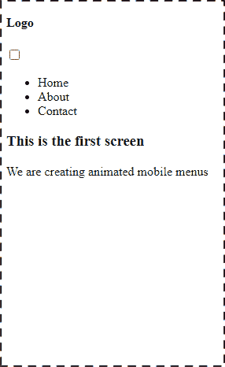

现在让我们开始设计我们的手机屏幕。

### 设计手机屏幕

```
* {
margin: 0;
padding: 0;
box-sizing: border-box;
}

body{
display: flex;
justify-content: center;
align-items: center;
column-gap: 40px;
min-height: 100vh;
font-family: 'Lucida Sans', 'Lucida Sans Regular', 'Lucida Grande', 'Lucida Sans Unicode', Geneva, Verdana, sans-serif;
}

```

这是页面的常规样式。现在页面应该看起来像这样:

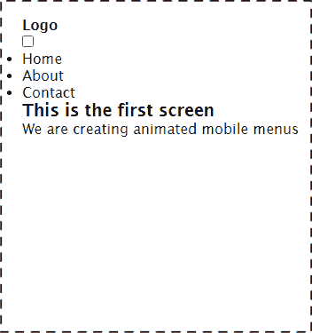

现在让我们来设计移动容器的样式。在 CSS 文件中添加以下代码行:

```
.screen1_container{
        width: 17em;
        height: 80vh;
        background-color: #533557;
        position: relative;
        overflow: hidden;
        border: 15px solid rgb(54, 53, 53);
        border-top: 30px solid rgb(54, 53, 53);
        border-bottom: 30px solid rgb(54, 53, 53);
        border-radius: 60px;
}

```

这是第一个屏幕的移动容器。我们给它一个宽度和高度，以及一个背景颜色。我们也给了它一个相对位置，并为容器添加了边框和边框半径。

现在应该是这样的:

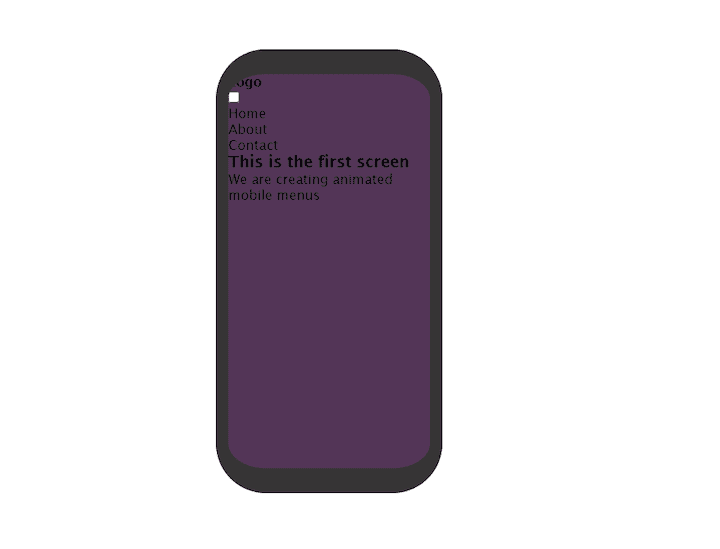

在我们的身体样式中，让我们添加`color:white`。这将给页面一个更好的对比，我们可以很容易地看到我们在做什么。

### 设计导航栏的样式

为了设计`navbar`的样式，我们将在`styles.css`中添加以下代码行:

```
.screen1_menu_container{
        display: flex;
        align-items: center;
        justify-content: space-between;
        background-color: #f1d6f5;
        color: #533557;
        padding: 0 10px;
}

.screen1_menu_btn{
        display: flex;
        justify-content: center;
        align-items: center;
        width: 50px;
        height: 50px;
        cursor: pointer;
        transition: all .5s ease-in-out;
}

```

我们在导航条(`.screen1menucontainer`)中添加了`display:flex`，使其中的项目具有水平布局。

现在应该是这样的:

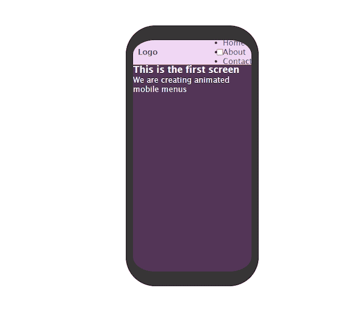

让我们暂时把`ul`藏起来，这样我们就可以不被打扰地做汉堡了。

```
ul{display: none;}

```

### 制作汉堡

对于我们的汉堡风格，让我们从在`styles.css`中添加以下几行开始:

```
.screen1_menu_hamburger{
        width: 20px;
        height: 2px;
        background-color: #533557;
        border-radius: 5px;
        z-index: 10;
        transition: all .5s ease;
}

```

现在，我们应该在屏幕上看到类似这样的内容:

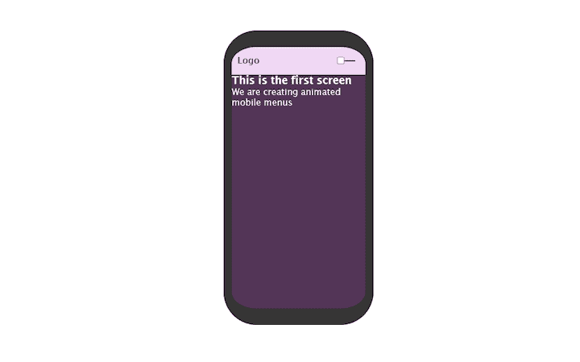

它显示一个单独的条形。让我们写一些代码，使它看起来像我们都知道和喜欢的汉堡包。

```
.screen1_menu_hamburger::before,
.screen1_menu_hamburger::after{
        content: '';
        position: absolute;
        width: 20px;
        height: 2px;
        background: #533557;
        border-radius: 5px;
        transition: all .5s ease;
}

.screen1_menu_hamburger::before{
    transform: translateY(-6px);
}

.screen1_menu_hamburger::after{
    transform: translateY(6px);
}

```

我们使用了`before`和`after`伪元素来添加顶部和底部的汉堡条。

对于顶栏，我们使用`translateY`将其推到汉堡上方。对于底部的酒吧，我们把它推到汉堡下面。

如果你现在检查进度，你会看到我们都习惯在网站上看到的典型汉堡:

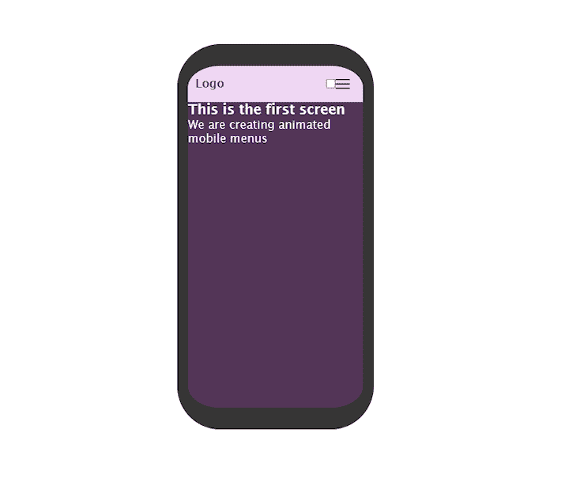

为了设计手机屏幕上的菜单项，我们将在文件中添加以下样式。

```
.screen1_menu_items{
        background:  #f1d6f5;
        color: #533557;
        position: absolute;
        height: 100%;
        width: 70%;
        padding-top: 70px;
        top: 0;
        transition: all .5s ease-in-out;
}

```

给菜单项一个`100%`的高度意味着它将占据整个屏幕。我们也给了它一个绝对位置，并通过使用`top:0`确保菜单和屏幕顶部之间没有空间。

当我们这样做的时候，让我们也来设计列表项的样式

### 设置菜单中列表项的样式

为了让列表项看起来更好看，我们将在我们的`styles.css`文件中添加以下几行:

```
.screen1_menu_items li{
        padding: 10px 0;
        text-align: center;
        list-style-type: none;
        transition: all .2s ease;
}

.screen1_menu_items li:hover{
        letter-spacing: 2px;
        opacity: .6;
}

```

我们为列表项添加了顶部和底部填充，并将它们在容器的中心对齐。我们还为菜单中的列表项添加了悬停效果，每当它们被悬停时增加字母间距。

让我们现在制作汉堡包的动画。

* * *

### 更多来自 LogRocket 的精彩文章:

* * *

### 制作汉堡动画

我们从中间的开始。总的想法是让它在被点击时消失，这样顶部和底部的条形成一个退出或关闭的标志。

我们如何做到这一点？

我们可以使用复选框输入来跟踪汉堡包被点击的时间。选中时，我们添加我们想要的样式；如果未选中该复选框，样式不会生效。

让我们将以下内容添加到我们的`styles.css`文件中:

```
.screen1_menu_btn input:checked ~.screen1_menu_hamburger{
        transform: translateX(-50px);
        background: transparent;
    }

```

当你点击汉堡菜单时，你会发现它消失了。我们通过将菜单向左移动并使其透明来做到这一点。进步！

让我们添加顶部和底部条形图的样式:

```
.screen1_menu_btn input:checked ~.screen1_menu_hamburger::before{
    transform: rotate(45deg) translate(35px, -35px);
}

.screen1_menu_btn input:checked ~.screen1_menu_hamburger::after{
    transform: rotate(-45deg) translate(35px);
}

```

如果您检查该项目，您会注意到当单击汉堡包时，顶部和底部的条形成一个“X”。这是通过旋转顶部的条`45 degrees`和底部的`-45 degrees`来实现的，平移值是为了防止它们随着中间的汉堡条向左移动。

让我们给我们的工作做一些最后的润色。

在`.screen1_menu_items`中添加以下一行:

```
left: 100*%*;

```

当汉堡包未被选中时，这将把菜单项推出屏幕。

现在应该是这样的:

```
.screen1_menu_items{
        background:  #f1d6f5;
        color: #533557;
        position: absolute;
        left: 100%;
        height: 100%;
        width: 70%;
        padding-top: 70px;
        top: 0;
        transition: all .5s ease-in-out;
}

```

接下来，添加下面一行代码，以便在汉堡被选中时将它带回屏幕:

```
.screen1_menu_btn input:checked ~.screen1_menu_items{
    left: 40%;
}

```

### 最后的步骤

我们快完成了！现在让我们隐藏复选框输入，使页面主体看起来更像样:

```
.screen1_menu_btn input{
        display: none;
}

.page_content{
    text-align: center;
    margin-top: 3em;
}

.page_content h3{
    padding-bottom: 10px;
}

```

就是这样！我们已经成功地创建了一个滑动进出的移动动画菜单。我们也给了汉堡包一个点击时的动画效果。

我们的屏幕现在应该是这样的:

对于这个例子，屏幕看起来像第一个屏幕，但是不同的是菜单项。菜单不会从侧面滑入；相反，它会从顶部滑落。

### 创建移动屏幕内容

在我们的 HTML 文件中，添加以下代码行:

```
<!-- screen two -->

<div class="screen2_container">
    <nav class="screen2_menu_container">
        <h4>Logo</h4>

        <label for="screen2-menu_check" class="screen2_menu_btn">
            <input type="checkbox" id="screen2-menu_check"/>

            <div class="screen2_menu_hamburger"></div>

            <ul class="screen2_menu_items">
            <li>Home</li>
            <li>About</li>
            <li>Contact</li>
            </ul>
        </label>
    </nav>

    <div class="page_content">
        <h3>This is the second screen</h3>
        <p>We are creating animated mobile menus</p>
    </div>
</div>

```

它看起来就像第一个，因为它有相同的必需标记。

这就是我们对 HTML 的所有需求。现在让我们来设计我们的下拉菜单。

如果您在本地服务器上签出项目，您会注意到只有复选框显示。这是因为当我们在第一个屏幕上工作时，我们将页面颜色设置为白色。

让我们给第二个屏幕容器添加一些样式。

### 设计手机屏幕

将以下几行添加到您的`styles.css`文件中:

```
.screen2_container{
    width: 17em;
    height: 80vh;
    position: relative;
    overflow: hidden;
    color: rgb(54, 53, 53);
    border: 15px solid rgb(54, 53, 53);
    border-top: 30px solid rgb(54, 53, 53);
    border-bottom: 30px solid rgb(54, 53, 53);
    border-radius: 60px;
}

```

上面的样式创建了我们的屏幕容器和，并使我们能够通过添加深色样式来使内容可见。

由于我们在第一个屏幕中使用的页面样式，页面上的内容看起来还不错。现在应该是这样的:

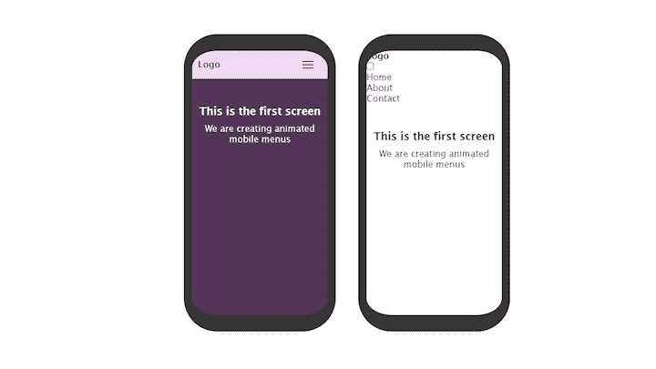

### 设计导航栏的样式

为了设计导航条的样式，我们将把以下样式添加到我们的`styles.css`文件中:

```
.screen2_menu_container{
    display: flex;
    align-items: center;
    justify-content: space-between;
    padding: 0 10px;
    background-color: #533557;
    color: white;
}

```

这些样式将导航条的背景颜色以及`nav`的布局改为水平的。`Justify-content: space-between`使导航栏中的项目停留在容器的两端，并在它们之间留有空间。

导航栏现在应该是这样的:

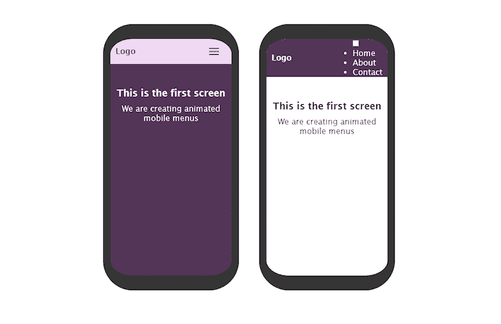

让我们把我们的`ul`藏起来，这样我们可以先设计我们的汉堡菜单。我们将使用下面的代码行来完成它:

```
ul{display: none;}

```

现在添加这一行来设计汉堡菜单包装:

```
.screen2_menu_btn{
    display: flex;
    justify-content: center;
    align-items: center;
    width: 50px;
    height: 50px;
    cursor: pointer;
    transition: all .5s ease-in-out;
}

```

我们给了它一个显示`flex`，加了一个高度和宽度，做了光标指针。

### 给汉堡做造型

我们还看不到汉堡店。让我们通过在`styles.css`中添加以下几行来使它们可见:

```
.screen2_menu_hamburger{
    width: 20px;
    height: 2px;
    background-color: white;
    border-radius: 5px;
    z-index: 10;
    transition: all .5s ease;
}

.screen2_menu_hamburger::before,
.screen2_menu_hamburger::after{
    content: '';
    position: absolute;
    width: 20px;
    height: 2px;
    background: white;
    border-radius: 5px;
    transition: all .5s ease;
}

.screen2_menu_hamburger::before{
    transform: translateY(-6px);
}

.screen2_menu_hamburger::after{
    transform: translateY(6px);
}

```

正如我们在创建第一个屏幕时所做的那样，我们有一个中间栏的标记，并使用 before 和 after 伪元素来添加顶部和底部栏。我们还抬高了顶栏，把底栏推到了汉堡菜单中间栏的下方。

现在应该是这样的:

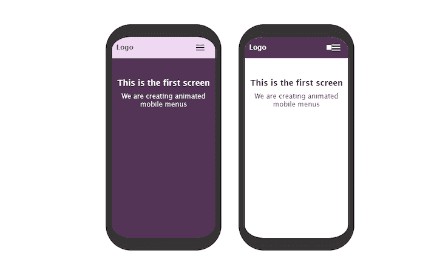

### 制作汉堡动画

点击汉堡时，我们将添加以下样式来制作动画:

```
.screen2_menu_btn input:checked ~.screen2_menu_hamburger::before{
    transform: rotate(45deg) translate(35px, -35px);
}

.screen2_menu_btn input:checked ~.screen2_menu_hamburger::after{
    transform: rotate(-45deg) translate(35px, 35px);
}

.screen2_menu_btn input:checked ~.screen2_menu_hamburger{
    transform: translateX(-50px);
    background: transparent;
}

```

就像在第一个屏幕中一样，我们将中间的栏移出视图，并在单击时使顶部和底部的栏形成一个“X”符号。当复选框未选中时，它们会恢复到原来的位置。

你可以试着在你的服务器上检查一下，当菜单被点击时预览一下效果。

我们需要删除之前用来隐藏`ul`元素的样式，并将以下内容添加到样式表中:

```
.screen2_menu_items{
    position: absolute;
    top: 0;
    background:  #533557;
    height: 100%;
    width: 100%;
    left: 0;
    transition: all .5s ease-out;
    padding-top: 50px;
}

```

菜单项被绝对定位到它的容器，并且是全角的。我们也给了它一个`100%`的高度。我们添加了顶部填充，以便在菜单和屏幕之间创建一些空间。我们给它一个顶部值`0`让它贴在顶部，以达到造型的目的。我们很快就会改变这种情况。

现在我们的菜单看起来像这样:

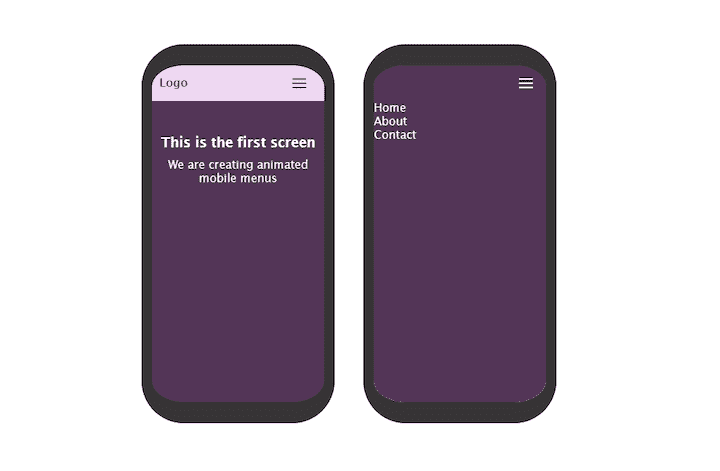

让我们用下面几行来设计菜单中的项目:

```
.screen2_menu_items li{
    border-bottom: .5px solid rgb(182, 181, 181);
    padding: 24px 0;
    text-align: center;
    transition: all .2s ease-out;
    }

```

接下来，用下面几行向列表项添加悬停效果:

```
.screen2_menu_items li:hover{
    letter-spacing: 2px;
    opacity: .6;
}

```

现在让我们将菜单项推出视图，这样我们就可以看到单击汉堡包菜单时的动画效果。我们通过给屏幕菜单项一个顶部值`-500px`来实现这一点。

菜单现在应该是这样的:

```
.screen2_menu_items{
    position: absolute;
    top: -500px;
    background:  #533557;
    height: 100%;
    width: 100%;
    left: 0;
    transition: all .5s ease-out;
    padding-top: 50px;
}

```

现在我们的菜单项被隐藏起来。我们将让它在汉堡被点击时向下滑动，当我们点击关闭标志时又返回。

将以下几行添加到您的`styles.css`中:

```
.screen2_menu_btn input:checked ~.screen2_menu_items{
    top:0;
}

```

记住，我们把菜单推到了视野之外。现在，使用我们刚刚添加的代码行，每当复选框被选中时，菜单就会向下滑动。未选中时，它会滑回原位。

### 最后的步骤

我们差不多完成了第二个屏幕。让我们用下面几行代码隐藏复选框，做最后的润色:

```
.screen2_menu_btn input{
display: none;
}

```

就是这样！我们完成了第二个屏幕。单击时，它会向下滑动。单击关闭图标时，它会从视图中消失。

我们完成的菜单现在应该是这样的:

查看我们完成的示例菜单的[演示](https://css-menus.netlify.app/)。

## 结论

如果你已经到了这一步，你应该已经掌握了只用 HTML 和 CSS 创建两种动画菜单的基础知识——不需要 JavaScript。

有了你所获得的新技能，你可以创建不同种类的 CSS 移动菜单，并使它们如你所愿的那样漂亮。要开始练习，你可以修改我们一起建立的，创造你自己的魔法。

虽然我们在上面建立的菜单适用于许多网站和应用程序，但也有一些菜单有多个相互嵌套的层次。让我们试着不使用 JavaScript 来构建类似的东西。

我们将使用与我们构建的其他菜单相同的方法，其中输入用于跟踪菜单是否打开。让我们开始吧。

我们的菜单项最初看起来像这样:

```
<ul class="screen1_menu_items">
    <li>Home</li>
    <li>About</li>
    <li>Contact</li>
</ul>

```

我们现在让它看起来像这样:

```
<ul class="screen1_menu_items">
    <li>Home</li>
    <li> 
        <!-- sub menu items -->
        <label for="screen1_submenu_check">
            <p>About &downarrow; </p>

            <input 
            type="checkbox"
            id="screen1_submenu_check"
            class="submenu_input"
            />

            <ul class="screen1_submenu">
                <li>Careers</li>
                <li>Policy</li>
                <li>More</li>
            </ul>
        </label>
    </li>
    <li>Contact</li>
</ul>

```

菜单项`ul`以前只包含三个列表项，但是现在第二个列表项中有一个包含三个列表项的子菜单。与前面的菜单使用的方式相同，这些子菜单项被包装在一个标签和一个复选框输入中，我们将使用它们来跟踪子菜单项的打开和关闭。

您可能会注意到`p`标签中的`&downarrow;`；我们将使用它来指示哪里有额外的菜单项。

现在应该是这样的:

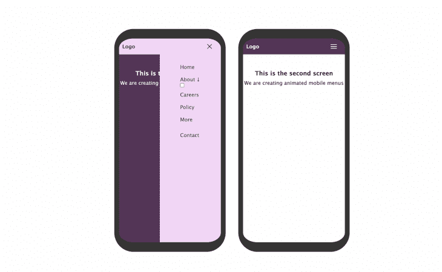

让我们用下面几行代码添加一些样式:

```
submenu_input{
    display: none;
}
.screen1_submenu{
    position:relative;
    left: 100%;
    transition: all .5s ease-in-out;
    height: 0;
    padding-left: 10%;
}
.screen1_submenu li{
    text-decoration: underline;
}
.submenu_input:checked ~.screen1_submenu{
    left: 0;
    height: auto;
    margin-top: 10px;
}

```

当复选框不活动时，上面的样式隐藏复选框输入并将子菜单推出视图。当点击关于的**时，复选框被激活，其子菜单项出现。**

让我们用下面几行代码向菜单添加一个额外的级别:

```
<ul class="screen1_submenu">
    <li>Careers</li>
    <li>Policy</li>
    <li>
        <!-- second level sub menu items -->
        <label for="screen1_submenu2_check">
            <p>More &downarrow; </p>

            <input 
            type="checkbox"
            id="screen1_submenu2_check"
            class="submenu2_input"
            />

            <ul class="screen1_submenu2">
                <li>Office</li>
                <li>Hangouts</li>
            </ul>
        </label>
    </li>
</ul>

```

正如我们对第一个子菜单所做的那样，我们用一个`label`标签包装包含子菜单项的菜单，并在其中添加一个输入来跟踪点击。现在应该是这样的:

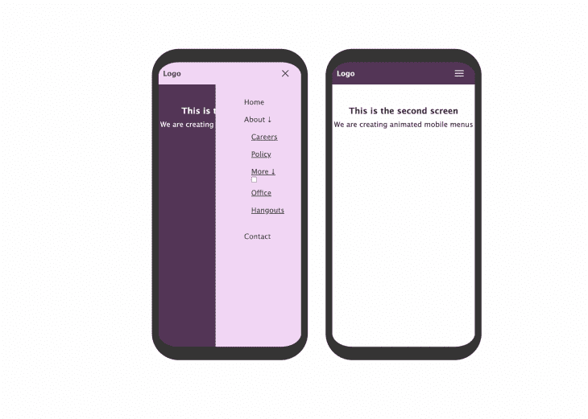

如果你现在点击**更多的**，什么都不会发生。那是因为我们还没有添加我们的风格。让我们添加它们:

```
.screen1_submenu2{
    position:relative;
    left: 100%;
    transition: all .5s ease-in-out;
    height: 0;
    padding-left: 10%;
}
.submenu2_input{
    display: none;
}
.submenu2_input:checked ~.screen1_submenu2{
    left: 0;
    height: auto;
    margin-top: 10px;
}

```

添加了样式后，当点击 **More** 时，它的子菜单项变得可见，当你再次点击时，它就消失了。

我们的菜单现在应该是这样的:

我们找到了。我们的多层次菜单准备好了。您可以在菜单中嵌套任意多的级别；只要确保不会变得乱七八糟。

您可以查看我们完成的示例菜单的演示。

也可以看一下[代码](https://codepen.io/hafsah_/pen/VwQNEjL)。

## 你的前端是否占用了用户的 CPU？

随着 web 前端变得越来越复杂，资源贪婪的特性对浏览器的要求越来越高。如果您对监控和跟踪生产环境中所有用户的客户端 CPU 使用、内存使用等感兴趣，

[try LogRocket](https://lp.logrocket.com/blg/css-signup)

.

[](https://lp.logrocket.com/blg/css-signup)[https://logrocket.com/signup/](https://lp.logrocket.com/blg/css-signup)

LogRocket 就像是网络和移动应用的 DVR，记录你的网络应用或网站上发生的一切。您可以汇总和报告关键的前端性能指标，重放用户会话和应用程序状态，记录网络请求，并自动显示所有错误，而不是猜测问题发生的原因。

现代化您调试 web 和移动应用的方式— [开始免费监控](https://lp.logrocket.com/blg/css-signup)。