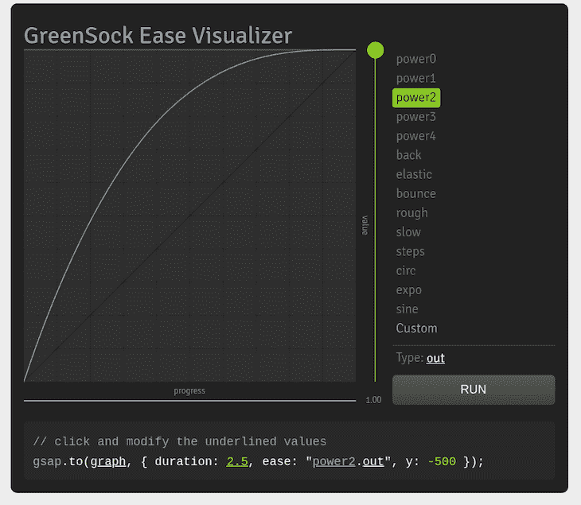

# 用 GreenSock 制作 Vue 动画

> 原文：<https://blog.logrocket.com/animating-vue-with-greensock/>

人类的[平均认知负荷能力](https://en.wikipedia.org/wiki/Cognitive_load#History)(一个人一瞬间可以处理的信息量)是七个正负两个单位的信息，工作记忆中的信息量持续[10 秒左右](http://theelearningcoach.com/learning/what-is-cognitive-load/)。

根据[时间](https://time.com/12933/what-you-think-you-know-about-the-web-is-wrong/)，网站访问者只需 15 秒钟就可以决定是访问网站还是离开页面。这意味着你只有一刻钟的时间来吸引访客的注意力。

这和动画有什么关系？

冗长的文本和枯燥的界面会增加用户的认知负荷。动画和微互动有助于保持用户的参与度，减少用户在使用网站时的认知负担。

然而，如果处理不当，动画会妨碍用户与产品的互动，并对销售产生负面影响。像 GreenSock 这样的高性能和易于使用的工具的存在，使我们的 Vue 应用程序动画激动人心。

## 什么是绿松石？

GreenSock Animation Platform，也称为 GSAP，是一个强大的 JavaScript 动画库，帮助开发人员构建高性能和引人入胜的动画。它的学习曲线非常浅，并且几乎不需要 JavaScript 知识。

据该平台的官方网站称，GSAP“将 JavaScript 能触及的任何东西(CSS 属性、SVG、React、canvas、通用对象，无论什么)做成动画，并解决了无数的浏览器不一致问题，所有这些都以惊人的速度(比 jQuery 快 20 倍[)](https://greensock.com/js/speed.html)

GSAP 是框架无关的，可以在 JavaScript 运行的任何地方使用。它有一个非常小的包大小，不会膨胀你的应用程序。它是向后兼容的，可以很好地与 SVG 一起工作。

在本教程中，我们将探索 GreenSock 的构建模块，并学习如何使用它通过动画制作我们的 Vue 应用程序内容来使用户界面变得生动。

## 先决条件

本教程使用最新版本的格林斯托克 GSAP 3.0，需要遵循以下要求:

您可以使用 Yarn 通过以下命令安装 Vue CLI:

```
yarn global add @vue/cli
```

## 入门指南

首先，使用以下命令创建一个项目:

```
vue create vue-gsap 
```

接下来，使用以下命令切换到项目的根目录:

```
cd vue-gsap 
```

键入以下内容，将 GSAP 作为一个包添加到我们的项目中:

```
Using Yarn

yarn add gsap 
```

您可以使用以下命令在页面或组件文件中包含 GSAP:

```
import { gsap } from "gsap"; 
```

## GSAP 的基础

让我们仔细看看 GSAP 的基本建筑。

### 图汶

补间是在将对象从网页上的一点动画到另一点的过程中，将预定义属性值应用到对象的单个实例。

它接受三个参数:

1.  `Target`指您想要制作动画的项目。它可以是一个 CSS 选择器或者一个对象
2.  `varsObject`是包含要在目标中更改的属性的对象，也称为配置变量。它们可以是 CSS 属性，但是在 camelCase 格式中，`background-color`变成了`backgroundColor`，而`border-radius`变成了`borderRadius`
3.  `position`用于设置动画序列中补间的插入点。它可以是字符串或数字

补间以下列格式编写:

```
gsap.method('selector', { }, 'position ' ) 
```

### GSAP 方法

GSAP 提供了无数种制作动画的方法。以下是其中最重要的。

`gsap.to()`定义一个对象应被动画化的值，即动画对象的结束属性值，如下所示:

```
gsap.to('.circle', {x:500, duration: 3}) 
```

该命令将在三秒钟内将一个类别为`circle` 500px 的元素移动到 x 轴上。如果没有设置持续时间，将使用默认值 500 毫秒。

注意:CSS 变换属性`translateX`和`translateY`对于像素度量的变换分别表示为`x`和`y`，对于基于百分比的变换分别表示为`xPercent`和`yPercent`。

参见 [CodePen](https://codepen.io) 上 Anjolaoluwa([@卫英琦 _ 阿德巴约](https://codepen.io/jola_adebayor) )
的 Pen [gsap-circle](https://codepen.io/jola_adebayor/pen/oNNmzjy) 。

`gsap.from()`定义对象动画的起始值，即动画的起始值:

```
 gsap.from('.square', {duration:4, scale: 2}) 
```

这个命令用一个类`square`从 2 调整元素的大小。

参见 [CodePen](https://codepen.io) 上 Anjolaoluwa([@卫英琦 _ 阿德巴约](https://codepen.io/jola_adebayor) )
的笔 [gsap-square](https://codepen.io/jola_adebayor/pen/YzzBNKV) 。

`gsap.fromTo()`允许您定义动画的开始和结束值。这是一种结合了`from()`和`to()`的方法。

```
gsap.fromTo('.circle',{opacity:0 }, {opacity: 1 , x: 500 , duration: 2 }); 
```

该命令在 2 秒钟内将类为`circle`的元素在 x 轴上从不透明度 0 变为不透明度 1。

参见 [CodePen](https://codepen.io) 上 Anjolaoluwa([@卫英琦 _ 阿德巴约](https://codepen.io/jola_adebayor) )
的 Pen [gsap-fromTo](https://codepen.io/jola_adebayor/pen/yLLZgzB) 。

注意:当设置位置属性的动画时，比如`left`和`top`，你正在设置动画的元素必须有一个 CSS `position`值`absolute`、`relative`或`fixed`。

### 松开

缓动决定了对象如何从一点移动到另一点。缓动控制 GSAP 中动画的变化率，并用于设置对象动画的样式。

GSAP 提供了不同类型的缓动和选项，让您可以更好地控制动画的行为。它还提供了一个[缓动可视化工具](https://greensock.com/docs/v3/Eases)来帮助你选择你喜欢的缓动设置。



有三种类型的缓动，它们在开始或结束动画的方式上有所不同。

*   `in()` —动作开始缓慢，然后在动画结束时加快速度
*   `out()` —动画开始时很快，然后在动画结束时变慢
*   `inOut()` —动画缓慢开始，中途加快速度，然后缓慢结束

参见 [CodePen](https://codepen.io) 上 Anjolaoluwa([@卫英琦 _ 阿德巴约](https://codepen.io/jola_adebayor) )
的 Pen [gsap-eases](https://codepen.io/jola_adebayor/pen/OJJdQQg) 。

在上一个示例中，我们链接了三个显示可用缓动类型的补间动画，但是我们必须在开始下一个之前设置动画完成所需的延迟秒数。您可以通过将补间放在时间轴中来避免这种情况。

### 时间表

一个`Timeline`用作多个补间动画的容器。它在序列中激活补间动画，每个补间动画的开始都紧跟在最后一个补间动画的结束之后，除非另有设置，并且它不依赖于前一个补间动画的持续时间。这消除了在下一个补间动画开始之前设置延迟的需要。

时间线可以按以下格式创建

```
gsap.timeline(); //creates an instance of a timeline 
```

您也可以将多个补间链接到时间轴，如下所示:

```
gsap.timeline()
    .add() // add tween to timeline 
    .to('element', {})
    .from('element', {}) 
```

或者

* * *

### 更多来自 LogRocket 的精彩文章:

* * *

```
const tl = gsap.timeline(); // create an instance and assign it to variable tl
tl.add(); // add tween to timeline 
tl.to('element', {});
tl.from('element', {}); 
```

让我们用时间线重新创建前面的例子:

参见 [CodePen](https://codepen.io) 上 Anjolaoluwa([@卫英琦 _ 阿德巴约](https://codepen.io/jola_adebayor) )
的 Pen[gsap-timeline](https://codepen.io/jola_adebayor/pen/WNNmeaM)。

位置

### 位置参数是使用时间轴制作动画的一个重要因素，因为它设置了动画序列中补间的插入点。正如我们前面所学的，它是补间方法中的第三个参数，位于 config 对象之后。

默认位置是`"+=0"`，它只是在一个序列的末尾插入一个补间。

```
.method( target, {config object}, position ) 
```

您可以将 position 参数设置为多种类型的值，但是我们将重点讨论一些最重要的值。

`"Number"`指该数的绝对时间。

上面的命令从时间轴的开始处正好 5 秒插入补间。

```
gsap.method('selector',{}, 5 ) 
```

`"+=Number"`或`"-=Number"`在正或负相对时间插入补间，如下所示:

`"<"`或`">"`相对于前一个补间的开始或结束时间插入一个补间。

```
gsap.method('selector',{}, "-=1" ) //insert a tween 1 second before end of timeline

gsap.method('selector',{}, "+=1" ) //Inserts a tween 1 second after end of timeline 
```

[GreenSock 的官方网站](https://greensock.com/position-parameter)提供了额外的提示，帮助你彻底了解仓位参数。

```
gsap.method('selector',{}, "<" ) //Inserts a tween at the start of the previous tween

gsap.method('selector',{}, ">" ) //Inserts a tween at the end of the previous tween 
```

制作 Vue 动画的 GSAP 替代品

## 虽然 GSAP 是制作 Vue 应用动画的一个非常好的选择，但还有其他选择，包括:

结论

## 在本文中，我们已经介绍了如何使用 GreenSock 来创建动画。使用 GreenSock 制作动画的可能性是无限的，因为您可以用更少的代码完成更多的工作，而不用担心向后兼容性，同时保持跨浏览器的高性能。

除了肤浅的学习曲线，GSAP 还有非常大的用户群体，丰富的资源和活跃的 T2 论坛，这些论坛包含了你可能正在寻找的答案。

官方 GreenSock 文档非常广泛，涵盖了本文中没有提到的特性和其他有用的方法。你也可以看看这个由莎拉·德拉斯纳开源的 [Vue 动画工作室知识库](https://github.com/sdras/animating-vue-workshop)。

像用户一样体验您的 Vue 应用

## 调试 Vue.js 应用程序可能会很困难，尤其是当用户会话期间有几十个(如果不是几百个)突变时。如果您对监视和跟踪生产中所有用户的 Vue 突变感兴趣，

.

[try LogRocket](https://lp.logrocket.com/blg/vue-signup)

LogRocket 就像是网络和移动应用程序的 DVR，记录你的 Vue 应用程序中发生的一切，包括网络请求、JavaScript 错误、性能问题等等。您可以汇总并报告问题发生时应用程序的状态，而不是猜测问题发生的原因。

[](https://lp.logrocket.com/blg/vue-signup)[https://logrocket.com/signup/](https://lp.logrocket.com/blg/vue-signup)

LogRocket Vuex 插件将 Vuex 突变记录到 LogRocket 控制台，为您提供导致错误的环境，以及出现问题时应用程序的状态。

现代化您调试 Vue 应用的方式- [开始免费监控](https://lp.logrocket.com/blg/vue-signup)。

Modernize how you debug your Vue apps - [Start monitoring for free](https://lp.logrocket.com/blg/vue-signup).