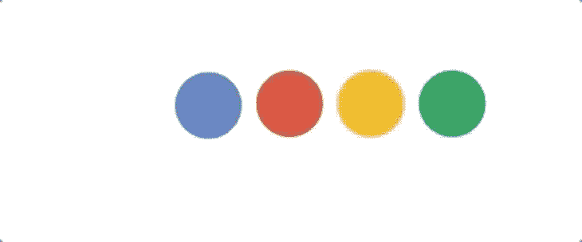
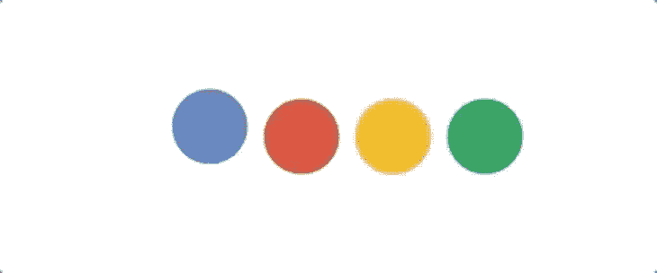
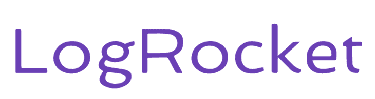

# 使用 React 钩子和 GreenSock 的动画

> 原文：<https://blog.logrocket.com/animations-react-hooks-greensock/>

编者按:这篇文章于 2021 年 10 月 13 日更新，删除了已被弃用的 TweenMax 动画制作方法，并进一步更新了教程。我们还改变了一些语言，以反映当前的方式提到 GSAP。

钻研网络上的动画世界可能是一次伟大的旅程，也可能是一次令人厌倦的旅程。我的目标是让它成为一个伟大的旅程，同时也使用 React Hooks 的力量来进一步吸引您的学习体验。

## 我需要知道什么？

本文不应被视为 JavaScript 或 React 的初级读本。我将解释我们使用的每一个概念，但是你至少应该对这两个概念有一点了解。如果您需要开始，可以[查看 React 文档](https://reactjs.org/docs/getting-started.html)。

## 我们将创造什么？

我们将创建两个难度逐渐增加的独立动画。我们的第一个动画将是一个简单的加载器，类似于谷歌的:


我们的第二个将是使 LogRocket 标志更好的动画！


## 什么是 GreenSock 动画平台？

GreenSock 动画平台(GSAP) 是一个 JavaScript 库，允许我们在网络上创建高质量、高性能的动画。它包含一个工具集，开发人员可以使用它来快速创建出色的动画。

我们可以使用 GSAP 来创建 SVG 和 CSS 动画，也可以使用它来创建身临其境的 WebGL 动画。我们也可以使用绿宝石创建画布动画。大多数流行的动画库，如 Three.js，都使用 GreenSock 来制作对象的动画。此外，GSAP 可以用于其他动画软件，如 Adobe Animate 和 Easel JS。

## 制作谷歌风格加载器的动画

设置简单快捷:我已经[创建了一个 CodeSandbox](https://codesandbox.io/s/greensock-set-up-forked-zp5de) ，它有 GreenSock npm 模块和 React，所以你可以派生它并跟随它。

现在，让我们开始创建我们的`Loader`组件。

### 渲染加载程序图形

我们的加载器首先需要的是我们的图形，我已经在上面创建了。SVG 是一个带有少量标记的基本 SVG。

```
<svg viewBox="0 0 150 33.2" width="180" height="150">
  <circle ref={circle} cx="16.1" cy="16.6" r="16.1" fill="#527abd" />
  <circle ref={circle} cx="55.2" cy="16.6" r="16.1" fill="#de4431" />
  <circle ref={circle} cx="94.3" cy="16.6" r="16.1" fill="#f4b61a" />
  <circle ref={circle} cx="133.4" cy="16.6" r="16.1" fill="#009e52" />
</svg>

```

然后，在我们的源代码中，我们可以创建一个`Loader`组件，这就是神奇的地方。在`Loader`组件中，我们想要呈现我们的图形。

```
import React from "react";
const Loader = () => {
  return (
    <svg viewBox="0 0 150 33.2" width="180" height="150">
      <circle cx="16.1" cy="16.6" r="16.1" fill="#527abd" />
      <circle cx="55.2" cy="16.6" r="16.1" fill="#de4431" />
      <circle cx="94.3" cy="16.6" r="16.1" fill="#f4b61a" />
      <circle cx="133.4" cy="16.6" r="16.1" fill="#009e52" />
    </svg>
  );
};
export default Loader;

```

您现在应该会看到:


太棒了。我们现在已经有了我们的图形，所以让我们去动画它。

## 引用动画元素

当制作动画时，你需要的第一件事是引用你计划制作动画的元素。为了获得对我们元素的引用，我们可以使用`useRef`钩子。`useRef`返回一个具有`current`属性的引用对象，这是我们动画的目标。

创建一个`useRef`非常简单:

```
const myElement = useRef(null) 

```

因此，对于我们的情况，我们有四个需要瞄准的元素。我们将创建四个引用，如下所示:

```
const blue = useRef(null);
const red = useRef(null);
const yellow = useRef(null);
const green = useRef(null);

```

然后，我们可以将这些引用添加到我们的 SVG 中:

```
<svg viewBox="0 0 150 33.2" width="180" height="150">
  <circle ref={blue} cx="16.1" cy="16.6" r="16.1" fill="#527abd" />
  <circle ref={red} cx="55.2" cy="16.6" r="16.1" fill="#de4431" />
  <circle ref={yellow} cx="94.3" cy="16.6" r="16.1" fill="#f4b61a" />
  <circle ref={green} cx="133.4" cy="16.6" r="16.1" fill="#009e52" />
</svg>
```

我们的组件现在看起来像这样:

```
// src/loader.jsx
import React, { useRef } from "react";

const Loader = () => {
  const blue = useRef(null);
  const red = useRef(null);
  const yellow = useRef(null);
  const green = useRef(null);

  return (
    <svg viewBox="0 0 150 33.2" width="180" height="150">
      <circle ref={blue} cx="16.1" cy="16.6" r="16.1" fill="#527abd" />
      <circle ref={red} cx="55.2" cy="16.6" r="16.1" fill="#de4431" />
      <circle ref={yellow} cx="94.3" cy="16.6" r="16.1" fill="#f4b61a" />
      <circle ref={green} cx="133.4" cy="16.6" r="16.1" fill="#009e52" />
    </svg>
  );
};

export default Loader;

```

一切就绪后，我们就可以开始使用绿麻袋了。

## 用 GreenSock 反弹动画:谷歌风格的加载器

首先，我们导入`gsap`。

```
import { gsap } from "gsap";

```

是 GreenSock 的一个全功能模块，它将帮助我们创建动画。它有许多方法，我们将利用几个！格林斯托克还为我们提供了 [TweenLite](https://greensock.com/tweenlite/) ，这是一个功能较少但更轻量级的模块。

对于我们的动画，我们希望它发生在组件挂载的时候。在传统的基于类的组件中，我们将使用`componentDidMount`，但是对于钩子，我们将使用`useEffect`，除了一些小的不同，它的行为是相同的。要真正深入了解钩子，你应该看看这篇[的好文章](https://blog.logrocket.com/guide-to-react-useeffect-hook/)。

所以当我们的组件挂载时，我们将使用`gsap`的`fromTo`方法来激活我们的圆圈。`fromTo`方法是通过了四个论证:

```
fromTo(element(s), duration, start, end)

```

让我们专注于让`blue`圆圈上下移动。为了做到这一点，我们将目标锁定在动画的`y`属性上。

所以我们的代码如下:

```
gsap.fromTo(blue.current, 5, { y: 18 }, { y: -18 });

```

我们首先定位我们的元素，然后我们设置一个持续时间`5s`。我们从`y`位置`18`出发，在`-18`结束。这看起来像下面这样:



好了，我们已经取得了一点进展，但它仍然有一些问题——它太慢了，我们还需要动画是无限的。

为了实现这一点，我们需要做的就是将`yoyo`和`repeat`属性添加到我们的`to`对象中。

```
gsap.fromTo(blue.current, 0.5, { y: 18 }, { y: -18, yoyo: true, repeat: -1 });

```

`yoyo`意味着我们的动画将在开始和结束位置之间来回移动。设置`repeat`为`-1`会让我们的动画无限。我们还将持续时间设置为半秒，这样会快很多。

现在，随着我们新资产的到位，我们有:



从本文顶部完成的动画中可以看出，黄色圆圈的行为与蓝色圆圈相同。记住这一点，我们可以将一个元素数组(我们的`blue`和`yellow`引用)传递给我们的`fromTo`方法。

```
gsap.fromTo(
  [blue.current, yellow.current],
  0.5,
  { y: 18 },
  { y: -18, yoyo: true, repeat: -1 }
);

```

所以现在我们有:


成功！我想你现在可以开始看到格林斯托克有多强大了。为了完成我们的动画，我们只需要以相反的方式制作红色和绿色的球，就像这样:

```
gsap.fromTo(
  [red.current, green.current],
  0.5,
  { y: -18 },
  { y: 18, repeat: -1, yoyo: true }
);

```

这段代码与上面的代码几乎完全相同，只是这次我们从`y:-18`开始，到`y:18`结束。

我们的最终动画现在完成了，它应该是这样的:


你可以在这里找到完整的代码。

## 绿色填充动画:LogRocket 标志

一个动画结束，还有一个！

我为 LogRocket 图标创建了一个`SVG`，它很大，所以我将它包含在 starter CodeSandbox 中，你可以在这里[查看。](https://codesandbox.io/s/starter-logrocket-animation-forked-pvuhs?file=/src/index.js)

最终的动画将是这样的:


正如你从上面看到的，这比我们的第一部动画要复杂得多，所以让我们开始吧！

我们要关注的第一部分是火箭，它从底部向上运动。我们有一个带有`rocket`的`id`的`g`元素。这是我们要用绿色岩石瞄准的元素。

### 带`TimelineMax`的连续动画

以前，我们会使用`gsap`来做这件事，但是现在我们将使用`TimelineMax`,因为我们希望我们的每个元素按顺序动画，而不是一次全部。

我们这样导入`TimelineMax`:

```
import { TimelineMax } from "gsap";

```

我们首先需要创建一个`Timeline`，我们通过创建一个`TimelineMax`类的实例来做到这一点:

```
const tl = new TimelineMax();

```

与`TweenMax`类似，我们的实例(`tl`)也有一个我们将使用的`fromTo`方法:

```
tl.fromTo("#rocket", 2, { y: 50 }, { y: 0 });

```

这与我们的第一个动画非常相似，除了这里没有使用`ref`，我们只是传递 ID——两种方式都可以。

现在我们的火箭应该像这样从底部升起:


下一部分是给我们写信。我们所有的字母`path`都被包裹在带有`id` `letters`的`g`标签中，所以它们很容易成为我们的目标。

为了获得绘图效果，我们需要使用几个`attributes`，它们是`stroke-dasharray`和`stroke-dashoffset`。这些相当复杂，要阅读更详细的内容，我推荐[到这里](https://developer.mozilla.org/en-US/docs/Web/SVG/Attribute/stroke-dashoffset)。

### 什么是`stroke-dasharray`

是一个 SVG 和 CSS 属性，用来用虚线绘制线条。它用于指定线中虚线和间隙的长度。`stroke-dasharray`用于 SVG 元素，如`circle`和`line`。

示例:

```
<circle
  cx="50"
  cy="50"
  r="40"
  stroke="black"
  stroke-width="3"
  fill="transparent"
  stroke-dasharray="1, 3"
/>

```

这将用虚线画出圆形。第一个数字是破折号的长度，第二个数字是缺口的长度。

### 什么是`stroke-dashoffset`？

`stroke-dashoffset`用于指定进入破折号模式开始破折号的距离。它与`stroke-dasharray`结合使用，创建一条虚线。

示例:

```
<circle
  cx="50"
  cy="50"
  r="40"
  stroke="black"
  stroke-width="3"
  fill="transparent"
  stroke-dasharray="1, 3"
  stroke-dashoffset="1"
/>

```

这将使笔画模式的长度为`1`。

在我们的例子中，我们使用这些属性将路径分成小块，这样我们就可以将它们动画化，这就是我们的绘图效果。我的经验是将这两个属性的值设置为相同，一旦我们的文本消失，我们就可以开始了。`100`是我们将采用的值。

在我们的`styles.css`文件中，我们将在路径上设置这两个属性。顺便提一下，`stroke`必须出现在`path`上才能工作(这包括从父节点继承`stroke`的`path`)。

```
svg #letters path {
  stroke-dasharray: 100;
  stroke-dashoffset: 100;
}

```

因此，现在您会看到以下内容:



这与我们之前的一样，但字母没有那么粗——这是因为我们去掉了`stroke`，但它仍然有一个`fill`。下一步是将`fill-opacity`设置为`0`。

```
svg #letters path {
  stroke-dasharray: 100;
  stroke-dashoffset: 100;
  fill-opacity: 0;
}

```

有了这个，我们的信就不见了，所以现在我们集中精力把它们找回来。
我们所要做的就是将我们的`strokeDashoffset`动画回`0`。我们将使用我们的`tl`实例和`to`方法。

```
tl.to("#letters path", 3, {
  strokeDashoffset: 0
});

```

正如您所看到的，我们使用我们的`letters`选择器，然后将该组中的每个`path`作为目标。有了这些，我们的字母现在应该开始绘制了:


拼图的最后一块是将我们的`fill-opacity`制作成`1`的动画。我们再次使用我们的`tl`实例和`to`方法。

```
tl.to("#letters path", 3, { "fill-opacity": 1 });

```

就这样吧！我们的 LogRocket 动画现在完成了——不算太坏，是吧？


在这里可以看到`TimelineMax`的威力。通常，要连续运行动画，你必须使用延迟，但是`TimelineMax`会为我们处理这个问题。

完整的 CodeSandbox 可以在下面找到。

结论

## 就这些了，伙计们。这绝对是对 GreenSock 的介绍，而不是对 React Hooks 的介绍，但我希望你对这两者都有所了解。GreenSock 的家伙们已经为他们的库投入了大量的工作，所以一定要更进一步，创造出伟大的动画。

使用 LogRocket 消除传统反应错误报告的噪音

## 是一款 React analytics 解决方案，可保护您免受数百个误报错误警报的影响，只针对少数真正重要的项目。LogRocket 告诉您 React 应用程序中实际影响用户的最具影响力的 bug 和 UX 问题。

[LogRocket](https://lp.logrocket.com/blg/react-signup-issue-free)

自动聚合客户端错误、反应错误边界、还原状态、缓慢的组件加载时间、JS 异常、前端性能指标和用户交互。然后，LogRocket 使用机器学习来通知您影响大多数用户的最具影响力的问题，并提供您修复它所需的上下文。

[ ](https://lp.logrocket.com/blg/react-signup-general) [  ](https://lp.logrocket.com/blg/react-signup-general) [LogRocket](https://lp.logrocket.com/blg/react-signup-issue-free)

关注重要的 React bug—[今天就试试 LogRocket】。](https://lp.logrocket.com/blg/react-signup-issue-free)

Focus on the React bugs that matter — [try LogRocket today](https://lp.logrocket.com/blg/react-signup-issue-free).