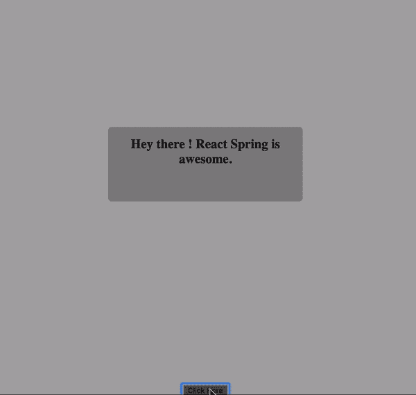
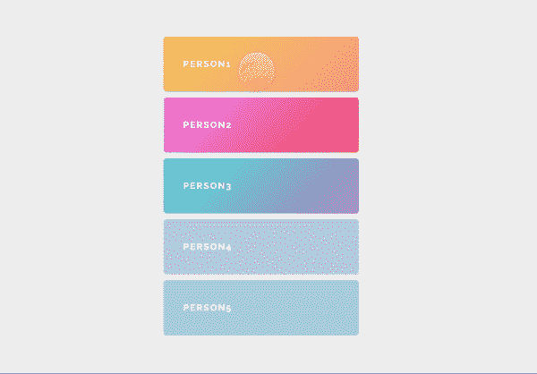

# 使用 React Spring 制作动画:上下文和示例

> 原文：<https://blog.logrocket.com/animations-with-react-spring/>

## 反应中的动画

动画已经发展到非常复杂的 UI 元素操作。它们被用来增加网页上的交互性，并在用户使用网站时给用户一种引人入胜的体验。开发人员一直在寻找更好的方法来实现动画，而不会导致主要的性能瓶颈。

动画效果应用在通常被频繁调用的 UI 线程上，因此，添加某些动画/动画库可能会对您的站点产生负面影响。这就是为什么我们选择讨论 [React Spring](https://www.react-spring.io/) 作为你应该考虑使用的工具来激活你的 React 应用。通过以下视频中的示例了解更多信息。

 [https://www.youtube.com/embed/AR5Zbw2u_Ug?version=3&rel=1&showsearch=0&showinfo=1&iv_load_policy=1&fs=1&hl=en-US&autohide=2&wmode=transparent](https://www.youtube.com/embed/AR5Zbw2u_Ug?version=3&rel=1&showsearch=0&showinfo=1&iv_load_policy=1&fs=1&hl=en-US&autohide=2&wmode=transparent)

视频

反作用弹簧

## React Spring 是一个基于 Spring 物理学的动画库，支持 React 中大多数 UI 相关的动画。它是两个现有 React 动画库的桥梁；[反应动作](https://alligator.io/react/react-motion/)和[动画](https://www.npmjs.com/package/react-animated-css)。考虑到动画库的性能，React Spring 是两全其美的。它继承了动画强大的插值和性能，同时保持 react-motion 的易用性。

了解了什么是 React Spring，以及它提供了什么，让我们看看如何在 React 应用程序中使用它来构建无缝动画。我们将探索它的特性，以便更好地理解它的优势。

先决条件

## 在我们进一步讨论之前，本文假设:

反应弹簧示例设置

## 将 React Spring 添加到应用程序的最佳方式是通过包管理器。只需在项目的根目录下打开一个终端窗口，然后运行下面的安装命令:

这使得 React Spring 在您的应用程序中广泛可用，以供以后使用。

```
npm install react-spring
#OR
yarn add react-spring
```

随着 React 中钩子的引入，您可以向功能组件添加状态。React Spring 通过提供一个基于 API 的 [hook，允许你定义和转换你通常会作为道具传递给动画数据的数据。](https://www.react-spring.io/docs/hooks/basics)

为了更好地展示 React Spring 的一些特性，让我们仔细看看 React-spring 模块中可用的钩子。目前，React Spring 中有五个主要的挂钩:

`useSpring` —单个弹簧，将数据从 A 移动到 b

*   `useSprings` —主要用于列表的多个弹簧，其中每个弹簧从 a - > b 移动数据
*   `useTrail` —单个数据集的多个弹簧，一个弹簧跟随或落后于另一个弹簧
*   `useTransition` —用于装载/卸载转换(列出添加/移除/更新的项目)
*   `useChain` —将多个动画排队或链接在一起
*   对于这些钩子中的每一个，都有几个你可以实现的动画效果，它是无限的，你的想象力会带你走多远就走多远。我们将看看`useSpring`、`useSprings`和`useTrail`的一些用例，来演示如何在 React 应用程序中实现它们。

在 React 中使用`useSpring`

## `useSpring`是一种最简单的反应弹簧挂钩。它将定义的值转换成动画值。它通过两种方式来实现这一点，要么在组件重新渲染时用一组不同的属性覆盖现有的属性，要么传递一个 updater 函数，该函数返回一组不同的属性，然后使用`set`来更新属性。

像这样将它导入到所需的组件中，因为我们将在本解释中使用 hooks API:

以下是使用`useSpring`挂钩的两种方法:

```
import {useSpring, animated} from 'react-spring'
```

**1)覆盖现有道具**

在这里，如果您使用更改的道具重新渲染组件，动画将自动更新。

```
const props = useSpring({opacity: toggle ? 1 : 0})
```

**2)传递更新器函数**

在这种情况下，没有重新渲染。这种方法主要应用于快速更新。它还有一个可选参数(`stop`)来停止动画。

因为我们正在制作动画，所以我们会将数据从一个状态移动到另一个状态。Spring 自然自带两个道具:`from`和`to`来表示动画的初始位置和结束位置。

```
const [props, set, stop] = useSpring(() => ({opacity: 1}))
    // Update spring with new props
    set({opacity: toggle ? 1 : 0})
    // Stop animation
    stop()
```

我们将在解释[渲染道具 API](https://www.react-spring.io/docs/props/) 时进一步讨论这个问题。现在，为了感受一下 useSpring hook API 是如何工作的，这里有一个小的演示，展示了一个简单的动画贺卡作为登录页面:



**在 CodeSandbox 上:**

**On CodeSandbox:**

从上面的演示中我们可以看到，前几行代码表达了我们试图制作动画的盒子的初始状态和最终位置:

在本例中，内容从页面顶部向下滑动到中央。`-500` `marginTop`的值是设置位置`off-screen`，然后定义一个`0`的不透明度作为我们的`from`道具的值。我们这样做是为了获得盒子的某种外观。这些值被分配给`contentProps`，然后我们将它们作为道具传递给`animated.div`，如下所示:

```
const contentProps = useSpring({
opacity: greetingStatus ? 1 : 0,
marginTop: greetingStatus ? 0 : -500
});
```

用`useSprings`创建多个字符串

```
<a.div className="box" style={contentProps}>
<h1>Hey there ! React Spring is awesome.</h1>
</a.div>
```

## `useSprings`就好比`useSpring`；唯一的区别是它用于创建多个弹簧，每个弹簧都有自己的配置。它主要用于列表，其中每个 spring 将数据从初始状态移动到最终状态。这也为我们提供了两个如何实现的选项。因为我们使用多个值，所以这个方法以两种形式工作。

覆盖值以更改动画

### 在这里，通过触发道具改变，动画被更新到每个元素。它是这样简单地实现的:

从上面的代码片段中，我们可以看到列表项被映射为让 useSpring 方法作用于每个元素。这样，我们可以在每个元素上触发动画。

```
const springs = useSprings(number, items.map(item => ({ opacity: item.opacity }))
```

传递返回值的函数，并使用“set”进行更新

### 你会得到一个更新功能回来。它不会像覆盖那样渲染组件(当然，动画仍然会执行)。像这样处理更新对于快速更新最有用。

我们如何使用这个？假设我们有一个人的列表，我们想让用户确切地知道哪个人被选中了，一个让这个列表更生动的很酷的方法是探索 Paul Henschel 的演示。

```
const [springs, set, stop] = useSprings(number, index => ({opacity: 1}))
// Update springs with new props
set(index => ({opacity: 0}))
// Stop all springs
stop()
```



**在 CodeSandbox 上:**

**On CodeSandbox:**

带`useTrail`的单一配置示例

## `useTrial`使我们能够用一种配置制造多种弹簧。它的配置与`useSpring`几乎相同，只是实现方式有所不同。它为元素列表的第一项设置动画，而其余的元素形成一条自然的轨迹，并跟随它们的前一个兄弟元素:

它接受任何类型的项目及其键的列表。后者默认为`item => item`，但是，如果您的项目作为一个键是自给自足的，它通常就足够好了。

```
return trail.map(props => <animated.div style={props} />)
```


**在 CodeSandbox 上:**

**On CodeSandbox:**

演示中的上面一行配置了 spring 的[通用 API](https://www.react-spring.io/docs/hooks/api) 来设置参数的默认值。

```
const config = { mass: 5, tension: 2000, friction: 200 };
```

上面的代码片段使用列出的 props 来设置元素的初始和最终条件，使用三元运算符来指示开关。

```
const trail = useTrail(items.length, {
config,
opacity: toggle ? 1 : 0,
x: toggle ? 0 : 20,
height: toggle ? 80 : 0,
from: { opacity: 0, x: 20, height: 0 }
});
```

渲染道具 API

## 这种在项目中实现 React Spring 的方法被用在类组件中，在 React 钩子被引入 React v16.8 之前，这是默认模式。出于包容性考虑，我们也来探讨一下，以适应老版本 React 上的开发者。使用这种方法，导入到项目中是有点不同的。

`Spring`类组件示例

### 使用 React Spring 制作单个元素动画的类组件实现将使用`spring`而不是`useSpring`。因此，我们会将它导入到项目中，如下所示:

正如我们前面提到的，Spring/useSpring 使用两个道具`from`和`to`来显示动画的初始位置和结束位置，如下所示:

```
import {Spring} from 'react-spring/renderprops'
```

`Trail`类组件示例

```
<Spring
  from={{ opacity: 0 }}
  to={{ opacity: 1 }}>
  {props => <div style={props}>hello</div>}
</Spring>
```

### 在这种情况下，我们处理的是等价于`useTrail`的类组件，它被导入为:

工作原理保持不变，但是转换模式变为:

```
import {Trail} from 'react-spring/renderprops'
```

我们可以注意到在上面的例子中使用了新的道具。它们的行为类似于用于指定动画在哪个项目上执行的关键点。你可以在[文档](https://www.react-spring.io/docs/props/trail)示例中找到更多被试用接受的道具示例。

```
<Trail items={items} keys={item => item.key} from={{transform: 'translate3d(0,-40px,0)'}} to={{transform: 'translate3d(0,0px,0)'}}>
  {item => props => <span style={props}>{item.text}</span>}
</Trail>
```

反作用弹簧的性能优势

## 与其他动画库相比，React Spring 的主要优势在于它能够应用动画，而不依赖 React 逐帧渲染更新。这种优势通常在处理嵌套路线或图表时会被注意到。有关具体性能提升实现的更多信息，请查看官方[文档](https://www.react-spring.io/docs/props/performance)。

结论

## 在本文中，我们分析了一些使用 React Spring 的 Hooks API 的用例，并探讨了类组件的等价类。看到 React Spring 的性能优势和简单语法，我强烈建议在您的项目中使用它，因为流畅的动画有助于确保出色的用户体验。

[LogRocket](https://lp.logrocket.com/blg/react-signup-general) :全面了解您的生产 React 应用

## 调试 React 应用程序可能很困难，尤其是当用户遇到难以重现的问题时。如果您对监视和跟踪 Redux 状态、自动显示 JavaScript 错误以及跟踪缓慢的网络请求和组件加载时间感兴趣，

.

[try LogRocket](https://lp.logrocket.com/blg/react-signup-general)

LogRocket 结合了会话回放、产品分析和错误跟踪，使软件团队能够创建理想的 web 和移动产品体验。这对你来说意味着什么？

[ ](https://lp.logrocket.com/blg/react-signup-general) [](https://lp.logrocket.com/blg/react-signup-general) 

LogRocket 不是猜测错误发生的原因，也不是要求用户提供截图和日志转储，而是让您回放问题，就像它们发生在您自己的浏览器中一样，以快速了解哪里出错了。

不再有嘈杂的警报。智能错误跟踪允许您对问题进行分类，然后从中学习。获得有影响的用户问题的通知，而不是误报。警报越少，有用的信号越多。

LogRocket Redux 中间件包为您的用户会话增加了一层额外的可见性。LogRocket 记录 Redux 存储中的所有操作和状态。

现代化您调试 React 应用的方式— [开始免费监控](https://lp.logrocket.com/blg/react-signup-general)。

Modernize how you debug your React apps — [start monitoring for free](https://lp.logrocket.com/blg/react-signup-general).