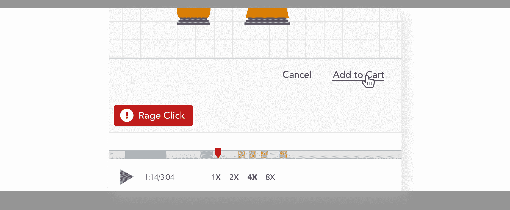
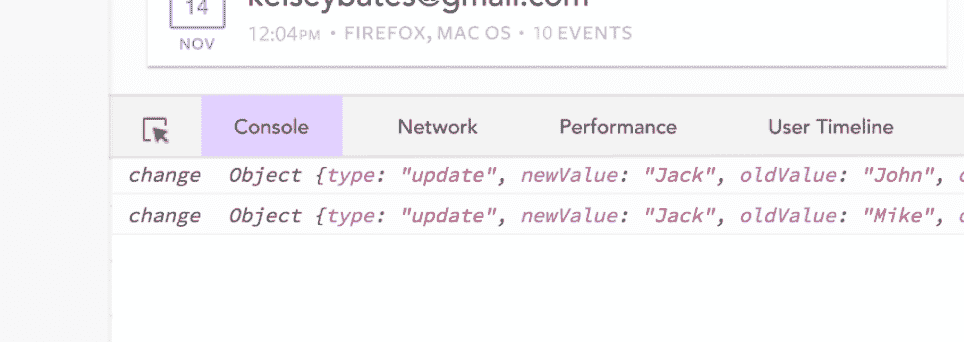
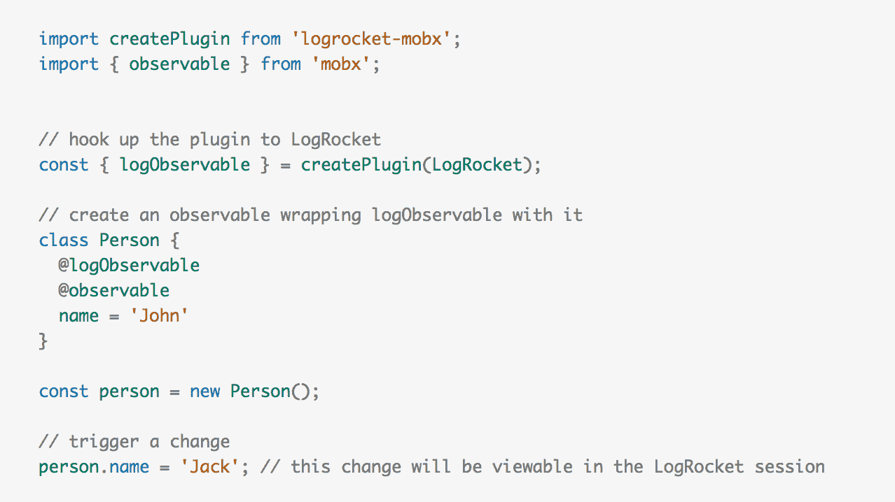

# 为 MobX - LogRocket 博客发布 LogRocket

> 原文：<https://blog.logrocket.com/announcing-logrocket-for-mobx-a9b65d8e6ed7/>

# 宣布面向 MobX 的 LogRocket

## 2017 年 6 月 19 日 1 分钟阅读 464

今天，我们很兴奋地宣布在 [LogRocket](https://logrocket.com) 正式支持 MobX。使用新的`logrocket-mobx` npm 包，开发人员可以在生产中记录 MobX 数据，帮助更快地修复错误和用户问题。

### 什么是 LogRocket？

### [](https://logrocket.com/signup/)

[https://logrocket.com/signup/](https://logrocket.com/signup/)

LogRocket 是一个前端日志工具，可以让你回放问题，就像它们发生在你自己的浏览器中一样。LogRocket 不需要猜测错误发生的原因，也不需要向用户询问截图和日志转储，而是让您重放会话以快速了解哪里出错了。它可以与任何应用程序完美配合，不管是什么框架，并且有插件可以记录来自 React、Redux 和 MobX 的额外上下文。

除了 MobX 日志，LogRocket 还记录控制台日志、JavaScript 错误、stacktraces、带有头+体的网络请求/响应、浏览器元数据和自定义日志。它还使用 DOM 来记录页面上的 HTML 和 CSS，甚至为最复杂的单页面应用程序重新创建像素级完美视频。

为什么它有帮助

### MobX 日志通常是解决错误和用户报告问题的关键。


LogRocket 集成了错误报告工具，如 Sentry 和 Bugsnag，让您看到每个 bug 的 MobX 日志和视频。这不仅有助于修复错误，也有助于理解错误的影响，因为有些 JavaScript 错误是完全无害的。通过观看视频和查看错误发生时的日志，您可以很容易地判断它是否确实影响了用户，或者可以忽略。

改进关键流程并发现 UX 问题

#### 

LogRocket 还可以在事后智能地发现 bug。您可以基于事件进行搜索和过滤，例如*显示完成了我的入职培训但没有转换*的用户，或者让我们的自动化系统检测用户沮丧的时刻，例如愤怒的点击和按钮损坏。

LogRocket 允许您搜索特定的 MobX 日志，并根据用户电子邮件、姓名、注册日期、位置、状态、持续时间、访问页面等属性过滤会话。如果它发生在你的应用程序中，你可以用 LogRocket 搜索找到它。

MobX 插件

### 

LogRocket MobX 插件很容易集成。首先，使用 npm 安装:

然后，导入 LogRocket 并初始化插件。如果你还没有在你的应用程序中设置 LogRocket，你可以创建一个免费帐户，并按照这里的设置指南进行操作:[https://logrocket.com](https://logrocket.com)。

```
npm i ---save logrocket-mobx
```

你可以这样装饰你想记录的可观察的事物:



然后，当您查看 LogRocket 会话时，您将看到发生的所有可观察到的变化。点击了解更多文档[。](https://docs.logrocket.com/docs/mobx-plugin)

入门指南

### 要开始使用 LogRocket，请在[https://logrocket.com](https://logrocket.com)创建一个免费帐户

[*LogRocket*](https://logrocket.com) *是帮助你更快修复 bug 的 JavaScript 日志记录和回放工具。通过捕获应用程序的每个日志、网络请求和用户会话，您可以解决问题，而无需来回切换。*

* * *

[*LogRocket*](https://logrocket.com) *is the JavaScript logging and replay tool that helps you fix bugs faster. By capturing every log, network request and user session of your app, you can fix problems without back and forth.*