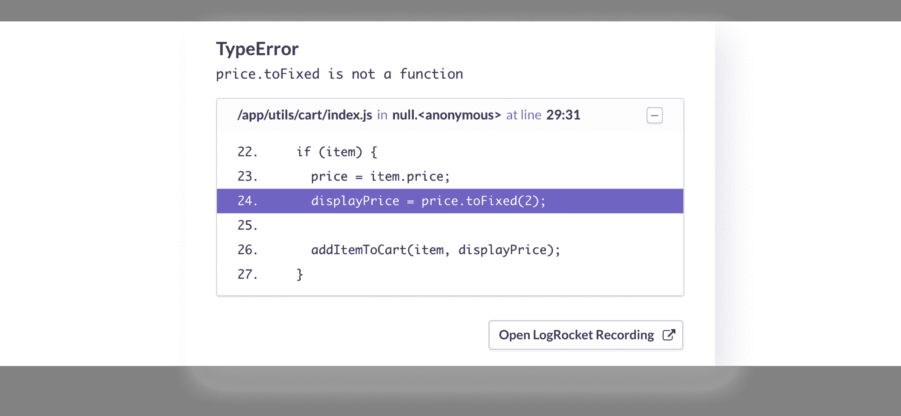
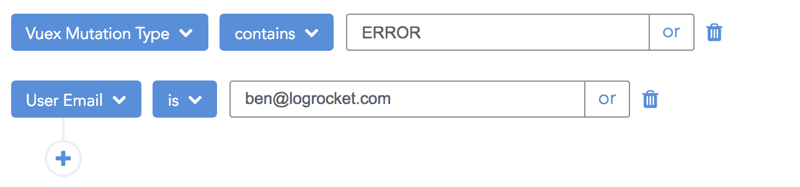

# 为 Vue.js - LogRocket 博客发布 LogRocket

> 原文：<https://blog.logrocket.com/announcing-support-for-vue-js-and-vuex-e44e5856b1d7/>

# 宣布 Vue.js 的 LogRocket

## 

2017 年 5 月 23 日 1 分钟阅读 376

今天，我们很兴奋地宣布官方支持 Vue.js 和 Vuex。使用新的 logrocket-vuex npm 包，开发人员可以记录生产中的突变，帮助更快地修复错误和用户问题。

不使用 Vuex 的 Vue.js 开发人员仍然可以利用所有其他 LogRocket 特性，包括控制台和错误日志记录、网络请求/响应日志记录和会话重放(DOM 记录)。

### 什么是 LogRocket？

[](https://logrocket.com/signup/)

[https://logrocket.com/signup/](https://logrocket.com/signup/)

LogRocket 是第一个 webapps 的生产日志工具。它有一个高度优化的 JavaScript SDK 和插件，用于 Redux、ngrx 和 Vuex。

除了记录 Vuex 突变，LogRocket 还记录控制台日志、JavaScript 错误、堆栈跟踪、带有头+体的网络请求/响应、浏览器元数据和自定义日志。它还使用 DOM 来记录页面上的 HTML 和 CSS，甚至为最复杂的单页面应用程序重新创建像素级完美视频。

### 为什么它有帮助

Vuex 日志通常是解决错误和用户报告问题的关键。



LogRocket 集成了错误报告工具，如 Sentry 和 Bugsnag，让您看到每个 bug 的 Vuex 日志和视频。这不仅有助于修复错误，也有助于理解错误的影响，因为有些 JavaScript 错误是完全无害的。通过观看视频和查看错误发生时的日志，您可以很容易地判断它是否确实影响了用户，或者可以忽略。

### Vuex 外挂程式

Vuex 插件将突变记录到您的应用商店。设置只需要几行代码:

```
import createPlugin from 'logrocket-vuex';
const logrocketPlugin = createPlugin(LogRocket);
const store = new Vuex.Store({
  // ...
  plugins: [logrocketPlugin]
});
```

默认情况下，所有的突变都会被记录，但是该插件允许您指定一个杀毒功能来阻止某些突变被记录，或者隐藏突变负载中的敏感信息。

### `Vuex mutation search`



LogRocket 有一个强大的搜索界面，可以让您跨会话搜索特定的 Vuex 突变。您可以组合搜索过滤器来查找给定用户或应用程序中某个页面的突变。

### 入门指南

要开始使用 LogRocket，请在[https://logrocket.com 创建一个免费账户。](https://logrocket.com.)

* * *

[*LogRocket*](https://logrocket.com) *是帮助你更快修复 bug 的 JavaScript 日志记录和回放工具。通过捕获应用程序的每个日志、网络请求和用户会话，您可以解决问题，而无需来回切换。*

## 像用户一样体验您的 Vue 应用

调试 Vue.js 应用程序可能会很困难，尤其是当用户会话期间有几十个(如果不是几百个)突变时。如果您对监视和跟踪生产中所有用户的 Vue 突变感兴趣，

[try LogRocket](https://lp.logrocket.com/blg/vue-signup)

.

[](https://lp.logrocket.com/blg/vue-signup)[https://logrocket.com/signup/](https://lp.logrocket.com/blg/vue-signup)

LogRocket 就像是网络和移动应用程序的 DVR，记录你的 Vue 应用程序中发生的一切，包括网络请求、JavaScript 错误、性能问题等等。您可以汇总并报告问题发生时应用程序的状态，而不是猜测问题发生的原因。

LogRocket Vuex 插件将 Vuex 突变记录到 LogRocket 控制台，为您提供导致错误的环境，以及出现问题时应用程序的状态。

现代化您调试 Vue 应用的方式- [开始免费监控](https://lp.logrocket.com/blg/vue-signup)。