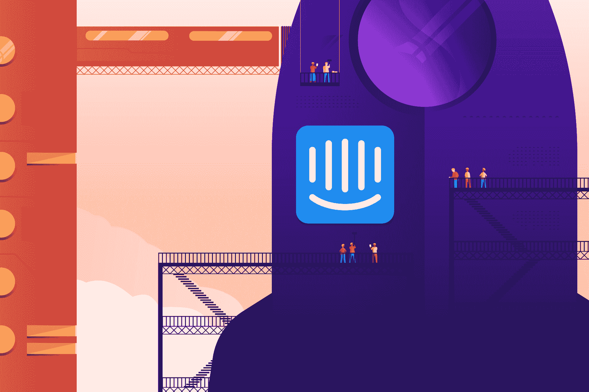
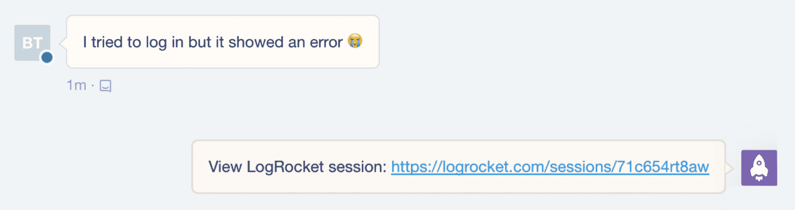

# 宣布 LogRocket 内部通信集成- LogRocket 博客

> 原文：<https://blog.logrocket.com/announcing-the-logrocket-intercom-integration-1d8a5ac960d9/>

# 宣布 LogRocket 对讲机集成

## 

2018 年 2 月 8 日 1 分钟阅读 494

当用户需要帮助时，提供快速智能的帮助是您整体客户体验的重要组成部分。在许多情况下，这可能意味着一个快乐的用户和一个搅拌的用户之间的差异。

作为一名快乐的对讲机客户，我们直接了解用户在提问时的满意度，我们的支持团队成员可以在几秒钟内回答问题。

但是当用户报告一个技术问题时，比如“我无法登录”，很难知道他们是否真的遇到了一个错误或者仅仅是困惑。在这些情况下，支持代理会要求澄清、截图和日志转储，但这些问题会浪费双方的时间，并降低整体支持体验。

这就是为什么今天我们非常兴奋地宣布我们与 Intercom 的集成，它可以帮助您快速了解用户问题，而无需请求澄清。

它是这样工作的:

 [https://www.youtube.com/embed/1GFbKYQhDMU?version=3&rel=1&showsearch=0&showinfo=1&iv_load_policy=1&fs=1&hl=en-US&autohide=2&wmode=transparent](https://www.youtube.com/embed/1GFbKYQhDMU?version=3&rel=1&showsearch=0&showinfo=1&iv_load_policy=1&fs=1&hl=en-US&autohide=2&wmode=transparent)

视频

当用户抱怨某个问题时，LogRocket bot 会自动在内部通话中添加一条注释。点击这个笔记会直接带你进入他们的 LogRocket 会话，让你准确地回放他们导致这个问题的行为。

LogRocket 的视频回放会向您展示用户到底做了什么，以及问题是如何表现出来的。该视频回放了他们讨论问题的整个过程，并在您向他们介绍解决方案时继续向您展示他们的活动。

除了每个视频之外，LogRocket 还包括用户的高级上下文和他们会话的细节。您可以查看他们使用的浏览器、IP 地址等信息，以及来自您的应用程序的自定义信息，如他们的计划或他们所在的组织。

### 技术支持(第 2 层)

视频有助于从用户的角度来看你的应用程序，但是有时候，仅仅从视频来看并不清楚“幕后”发生了什么。很难知道用户是不理解 UI，还是真的遇到了 bug。通过查看会话中的控制台和网络日志，您可以很容易地做出这种区分。

日志查看器允许您过滤日志，仅显示警告和错误。这将向您显示在观看视频时用户会话中发生的错误。

同样，网络活动查看器允许您过滤网络错误。在这里，通过键入“4 ”,我们可以快速看到用户遇到的任何 400 个请求。

### TLDR

如果您熟悉 Intercom，您会知道它是一个与用户互动并提供高度个性化支持体验的绝佳工具。通过添加 LogRocket 集成，您可以快速获得用户在您的应用程序中遇到的任何问题的上下文，并引导他们找到解决方案。

如果您是现有的 LogRocket 用户，您可以访问仪表板中的 integrations 页面来启用内部通信集成。否则，要开始，请访问 https://logrocket.com。