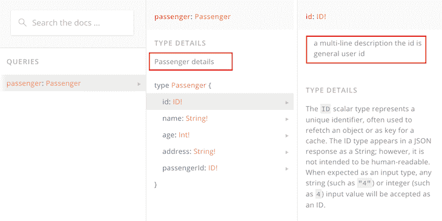

# GraphQL 模式设计中的常见反模式

> 原文：<https://blog.logrocket.com/anti-patterns-graphql-schema-design/>

GraphQL 最近在各种团队和公司中迅速普及。模式在 GraphQL 服务器中扮演着重要的角色，在构建数据库时需要特别注意。在这篇文章中，我们将分析一些在设计模式时可能遇到的反模式或常见错误，以及可能的解决方案。

## 可空字段

在 GraphQL 模式中，默认情况下每个字段都可以为空。数据可能为空有许多可能的原因，无论是由于网络错误、数据库连接问题、错误的参数等。为了解决这些问题，默认情况下所有字段都允许空值，即使没有值，查询在前端也不会失败。

这是最流行的反模式之一，因为客户端需要字段或错误的数据。但是它接收`null`时没有错误，结果可能会破坏前端。

使这些字段不可为空有助于我们解决这个问题。在模式设计中，当在字段旁边添加感叹号`!`时，该字段变得不可为空。将字段标记为不可空通常是基于产品需求，因此在设计模式时必须严格考虑。

```
# Nullable fields (Default)
type Passenger {
  name: String
  age: Int
  address: String
}

# Non-nullable fields
type Passenger {
  name: String!
  age: Int!
  address: String!
}
```

## 文档中的沟通错误

GraphQL 为我们的查询和变异提供了非常棒的自生成文档。大多数情况下，这些查询是不言自明的，前端开发人员很容易理解。但是，有时可能会混淆字段名或类型的含义。

文档字符串在这里起着关键的作用，它帮助我们添加对字段/类型的描述，并在生成的文档中显示它们。它支持单行和多行字符串，并支持关于模式的清晰通信。

单行字符串封装在`"`标记之间，而多行字符串封装在`"""`标记之间。让我们给上面的例子添加一些描述:

```
# A single line, type-level description
"Passenger details"
type Passenger {
  """  a multi-line description
  the id is general user id """
  id: ID!
  name: String!
  age: Int!
  address: String!
  "single line description: it is passenger id"
  passengerId: ID!
}
```

文档看起来像这样:



现在，这为`id`和`passenger Id`之间的差异提供了一些清晰性。

## 突变的冗长论证

变异是 GraphQL 中的写/编辑或删除操作，通常需要一些参数来处理。让我们考虑添加新乘客的例子。类型和突变可能看起来像:

```
type MutationResponse { 
  status: String!
}

type Mutation {
  createPassenger(name: String!, age: String!, address: String!): MutationResponse
}

# Query in Frontend looks like:
mutation PassengerMutation($name: String!, $age: String!, $address: String! ) {
  createPassenger(name: $name, age: $age, address: $address ) { 
    status
  }
}
```

这种方法既不可维护也不可读。添加一个或多个字段会使上述变异在前端变得非常不可读。这个问题的解决方案是输入对象。

输入对象将所有参数作为单个对象传递给一个变异，从而使它更具可读性和易维护性。让我们给上面的变异添加一个输入对象:

```
type MutationResponse { 
  status: String!
}

type PassengerData {
  name: String! 
  age: String! 
  address: String!
}

type Mutation {
  createPassenger(passenger: PassengerData!): MutationResponse
}

# Query in Frontend looks like:
mutation PassengerMutation($passenger: PassengerData! ) {
  createPassenger(passenger: $passenger) { 
    status
  }
}

```

## 突变反应不足

GraphQL 生态系统中的任何数据变化都需要突变。变异的美妙之处在于，我们可以发送响应数据，这些数据可以像查询一样在前端使用。关于突变的详细信息，如状态、响应代码、错误消息等。，在突变响应中发送。

然而，在现实世界的应用程序中，在后端的每次数据更改后，都需要更新前端的数据。考虑到这种情况，在每一次成功的变异之后，我们将不得不手动启动另一个查询来获取前端的更新数据。

为了避免这个问题，在每次突变之后，受影响/修改的数据可以作为对突变本身的响应而被发送。前端可以利用突变响应并更新其本地状态，从而避免额外的查询。前一个例子中的变异就属于这种反模式。解决它将导致如下突变:

```
type MutationResponse { 
  status: String!
  updatedPassenger: Passenger
}

type Passenger {
  id: ID!
  name: String! 
  age: String! 
  address: String!
}

type PassengerData {
  name: String! 
  age: String! 
  address: String!
}

type Mutation {
  createPassenger(passenger: PassengerData!): MutationResponse
}

# Query in Frontend looks like:
mutation PassengerMutation($passenger: PassengerData! ) {
  createPassenger(passenger: $passenger) { 
    status
    updatedPassenger
  }
}
```

## 允许无效输入

GraphQL 只支持有限的标量类型:`Int`、`Float`、`String`、`Boolean`和`ID`。假设它们是不言自明的，那么在很多情况下，我们可以在查询和变异中允许无效的输入/参数。这可以在解析器内部进行验证，并且会抛出一个错误，但是这不是一个最佳的方法。

自定义标量和枚举是解决这个问题的有效方法。

### 自定义标量

当需求不适合默认的标量类型时，您可以构建一个定制的标量类型。这将使验证状态本身的输入无效，是一个高度可伸缩的解决方案。自定义标量的一个很好的例子是`Date`类型。目前，在 GraphQL 中，日期必须作为字符串传递。然而，可以使用`GraphQLScalarType`创建一个定制的`Date`类型。

来自阿波罗官方文件:

```
# Schema implementation of custom Date type
scalar Date

type MyType {
   created: Date
}

# Resolver / Logic implementation for the same
import { GraphQLScalarType } from 'graphql';
import { Kind } from 'graphql/language';

const resolverMap = {
  Date: new GraphQLScalarType({
    name: 'Date',
    description: 'Date custom scalar type',
    parseValue(value) {
      return new Date(value); // value from the client
    },
    serialize(value) {
      return value.getTime(); // value sent to the client
    },
    parseLiteral(ast) {
      if (ast.kind === Kind.INT) {
        return new Date(+ast.value) // ast value is always in string format
      }
      return null;
    },
  }),
};
```

### 枚举

enum(枚举)是一组预定义的值，一个字段应该包含这些值中的一个才是有效的输入。一个很好的用例可能是一个国家名称。

国家名称总是一个字符串，这使得 GraphQL 服务器能够接受从客户端发送的任何字符串值。使用 enum，我们可以限制服务器只接受有效的国家名称，并在出现随机字符串时抛出错误。

枚举确保了数据的可靠性，避免了应用程序中的冗余。默认情况下，枚举也在文档中列出。一个示例实现:

```
# Enum of allowed countries: 
enum AllowedCountry {
  Germany
  USA
  Sweden
  Denmark
}

type Passenger {
  name: String!
  age: Int!
  country: AllowedCountry! 
#Country accepts only one of the values from the enum
}
```

## 循环引用

根据不同的场景，循环引用可能会产生潜在的反模式。考虑下面的例子:

```
type Passenger {
  name: String!
  location: Location!
}

type Location {
  country: String!
  passenger: Passenger!
}
```

这个特殊的模式有被利用的风险，因为它可以被无限深度地查询。在许多情况下，嵌套查询是一种优势，但在循环引用中可能会变得致命。无限嵌套查询甚至会使服务器崩溃。下面是这种循环引用查询的一个小例子:

```
query getPassenger {
  name
  location {
    country
    passenger {
      name 
      location {
        country 
        passenger {
          name
          location {
            country
          }
        }
      }
    }
  }
}
```

上面的查询可以达到无限的深度。为了避免这种情况，最好在设计模式时避免循环引用。在无法避免循环引用的异常情况下，像`graphql-depth-limit`这样的 npm 实用程序可以防止嵌套超过特定深度。

## 海量数据作为回应

现实世界中的应用程序会有大量的数据。考虑到前面的例子，如果我们从一个旅游门户查询乘客列表，结果将有几百万条记录，如果不是几十亿条的话。在客户端使用所有这些记录可能会导致客户端崩溃。因此，GraphQL 支持开箱即用的`limit`和`offset`分页。

然而，在错误的世界中，可以在没有`limit`值的情况下启动查询，导致从服务器获取大量数据。这个问题可以通过在模式设计时为`limit`指定一个默认值来缓解。一个示例实现:

```
type Passenger {
  name: String!
  age: Int!
}

type Query {
  # a limit of 10 makes sure, when a limit is not passed, 
  # it doesnt send more than 10 values
  getAllPassenger(limit: Int = 10): [Passenger!]!
}
```

## 结论

这些是 GraphQL 中少数常见的反模式。除了以上所述，当没有以正确的方式实现时，一些最佳实践也可能变成反模式。在实现任何工具之前，最好了解其内部结构，以便最大限度地利用它。快乐编码🙂

* * *

### 更多来自 LogRocket 的精彩文章:

* * *

## 监控生产中失败和缓慢的 GraphQL 请求

虽然 GraphQL 有一些调试请求和响应的特性，但确保 GraphQL 可靠地为您的生产应用程序提供资源是一件比较困难的事情。如果您对确保对后端或第三方服务的网络请求成功感兴趣，

[try LogRocket](https://lp.logrocket.com/blg/graphql-signup)

.

[](https://lp.logrocket.com/blg/graphql-signup)[https://logrocket.com/signup/](https://lp.logrocket.com/blg/graphql-signup)

LogRocket 就像是网络和移动应用的 DVR，记录下你网站上发生的每一件事。您可以汇总并报告有问题的 GraphQL 请求，以快速了解根本原因，而不是猜测问题发生的原因。此外，您可以跟踪 Apollo 客户机状态并检查 GraphQL 查询的键值对。

LogRocket 检测您的应用程序以记录基线性能计时，如页面加载时间、到达第一个字节的时间、慢速网络请求，还记录 Redux、NgRx 和 Vuex 操作/状态。

[Start monitoring for free](https://lp.logrocket.com/blg/graphql-signup)

.