# Apache Kafka:实时数据流应用程序| LogRocket 博客

> 原文：<https://blog.logrocket.com/apache-kafka-real-time-data-streaming-app/>

***编者按:**这篇文章于 2022 年 3 月 3 日更新，包括了关于 Apache Kafka 版本 3.1.0 的信息，以及卡夫的概述。*

麦肯锡全球研究所的一项研究显示，数据驱动的组织获得客户的可能性是 23 倍，留住客户的可能性是 6 倍，盈利的可能性是 19 倍。

以一种易于理解和使用的格式，数据可以帮助推动业务需求。然而，大型科技公司以原始形式收集用户数据。因此，挑战在于处理和(如果必要的话)转换或清理数据以使其有意义。

基本的数据流应用程序将数据从源桶移动到目的桶。涉及流的更复杂的应用程序会动态地执行一些魔术，比如改变输出数据的结构，或者用新的属性或字段丰富它。

在本文中，我们将回顾 Apache Kafka 的关键概念和术语，并演示如何使用 Kafka 构建一个最小的实时数据流应用程序。

我们的教程将遵循这些步骤:

## 先决条件

要学习本教程，需要具备以下先决条件:

*   安装了 Node.js 和 npm 的[最新版本](https://nodejs.org/en/)
*   安装了最新的 Java 版本( [JVM](https://www.java.com/download/) )
*   卡夫卡安装 ***注意:**，在本教程中，我们将回顾在本地安装卡夫卡*
*   对编写 Node.js 应用程序的基本理解

## 成批处理

数据转换和/或丰富主要是在输入主题被另一个应用程序或输出主题使用时处理的。这是数据工程中非常常见的场景，因为总是需要清理、转换、聚集，甚至重新处理 Kafka 主题中通常原始的和临时存储的数据，以使其符合特定的标准或格式。

## 背景和关键概念

据其[网站](https://kafka.apache.org/)介绍，Kafka 是一个开源、高度分布式的流媒体平台。Kafka 由 LinkedIn(现在是 Apache 软件基金会的一部分)的工程师构建，是一个可靠、有弹性和可扩展的系统，支持流媒体事件/应用程序。它是可水平扩展的，默认情况下是容错的，并提供高速。Kafka 有各种各样的[用例](https://kafka.apache.org/uses)，其中之一是构建数据管道或应用程序，实时处理流事件和/或批量数据的处理。在撰写本文时，最新的 Kafka 版本是 3.1.0。

以下是卡夫卡的一些基本概念和术语:

*   主题:Kafka 主题是跨越多个 Kafka 代理的一组分区或组。该主题充当集群中流数据的间歇存储机制。对于每个 Kafka 主题，我们可以选择设置复制因子和其他参数，如分区数量
*   生产者、消费者和集群:生产者是向 Kafka 经纪人或更准确地说是 Kafka 主题生产或写入数据的客户。另一方面，消费者从 Kafka 主题或 Kafka 经纪人那里读取数据或——顾名思义——消费数据。集群只是一组代理或服务器，为当前的 Kafka 实例提供动力
*   KRaft:最近发布的 Kafka 引入了 [Kafka Raft 元数据模式(KRaft)](https://blogs.apache.org/kafka/entry/what-s-new-in-apache6) ，通过消除对[动物园管理员](https://kafka.apache.org/documentation/#zk)的依赖，简化了 Kafka 的架构。在引入 KRaft 之前，ZooKeeper 用于跟踪 Kafka 的集群状态，并控制 Kafka 代理或服务器的同步和配置。作为第二个系统，动物园管理员增加了卡夫卡建筑的复杂性。在 Zookeeper 下，元数据存储在 Kafka 之外的 Zookeeper 集群中。在 KRaft 下，所有元数据都在 Kafka 内部存储和管理

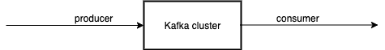

Relationship between Producers, Clusters, and Consumers in Kafka.

关于所有这些重要概念的更多详细信息，请查看 Apache Kafka 文档。

在本文中，您将学习如何使用 Apache Kafka 构建数据管道来移动批处理数据。作为演示，我们将模拟一个在数据源生成的大型 JSON 数据存储。然后，我们将编写一个生成的脚本，该脚本从一个源(比如说，点 A)向我们的本地代理/集群 Kafka 设置上的特定主题写入这个 JSON 数据。最后，我们将编写一个消费者脚本，该脚本从指定的 Kafka 主题中消费存储的数据。

## 安装 Kafka

要安装 Kafka，请在此处下载最新版本[并使用以下命令解压:](https://www.apache.org/dyn/closer.cgi?path=/kafka/3.1.0/kafka_2.13-3.1.0.tgz)

```
tar -xzf kafka_2.13-3.1.0.tgz
cd kafka_2.13-3.1.0

```

`tar`命令提取下载的 Kafka 二进制文件。Kafka 二进制文件可以在我们想要的任何路径上下载。

接下来，导航到 Kafka 的安装目录并运行`ls`命令。然后，`cd`进入`bin`目录，再次运行`ls`:

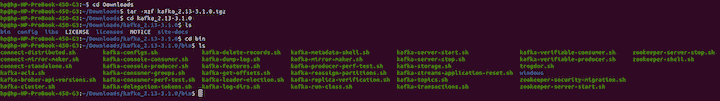

Contents of Kafka’s `bin` folder.

如果我们使用`cd ..`命令并运行`ls`，我们会发现一个`config`文件夹。

`config`文件夹包含一个`server.properties`文件，我们将使用它来配置 Kafka 服务器，并包含任何所需的更改或配置。

现在，运行以下命令:

```
cd ..
ls
cd config
ls
nano server.properties

```

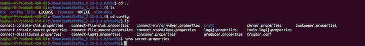

Contents of Kafka’s `config` directory.

KRaft 的控制器用于存储 Kafka 内部的所有元数据。卡夫主管负责向 Kafka 经纪人提供最新状态。其他 KRaft 控制器始终处于备用状态，以防主控制器出现故障。

现在，我们将开始为 Kafka 服务器编写配置，以设置 Kafka 集群。

## 配置 Kafka 集群

在这里，我们将设置我们的 Kafka 集群，它将由正在运行的 Kafka 代理(服务器)组成。所有配置都将在`config`目录和`server.properties`文件中完成。

首先，我们将确保我们仍然在`config`目录中。然后，我们将运行这些命令:

```
cd kraft
ls

```


Contents of KRaft.

接下来，将`server.properties`复制到一个名为`server1.properties`的新文件中，并使用以下命令开始编辑该文件:

```
cp server.properties server1.properties
nano server1.properties

```

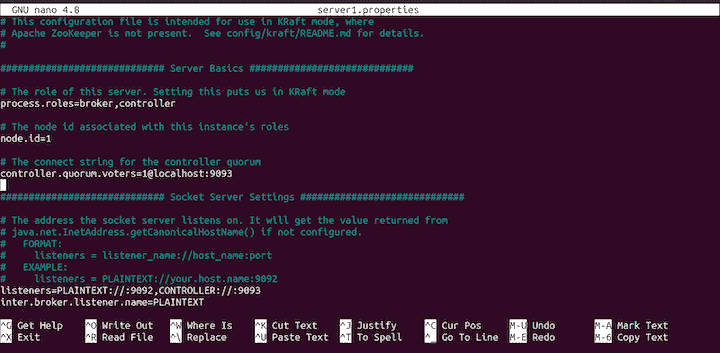

KRaft `config` file.

在这段代码中，`process.roles`被设置为`broker`和`controller.`，这意味着同一个服务器将充当`broker`和`controller`。

我们将有三个 id 为`1`、`2`和`3`的服务器和三个运行在端口`localhost:19092`、`localhost:19093`和`locahost:19094`上的控制器。以下 Kafka 经纪人将在港口运行:`9092`、`9093`、`9094`。

现在，打开 KRaft `config`文件，将`controller.qorum.voters`设置如下:

```
[email protected]:19092,[email protected]:19093,[email protected]:19094

```

接下来，向下滚动并设置监听器，如下所示:

```
listeners=PLAINTEXT://:9092,CONTROLLER://:19092

```

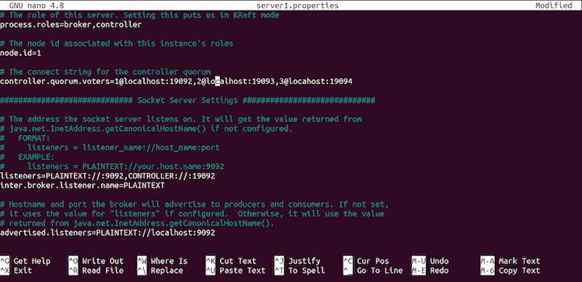

Configurations added to the KRaft `config` file.

我们需要更改日志文件的目的地，如下所示:

```
log.dirs=/tmp/server1/kraft-combined-logs

```

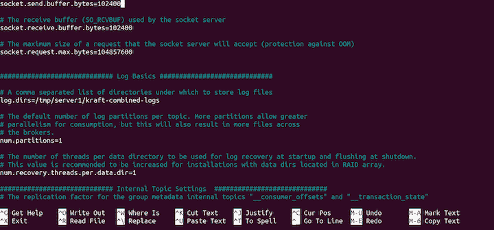

Configurations showing the log file.

最后，在提示符下键入 **CTRL X** 和 **yes** 来保存我们的配置。

现在，我们已经成功创建了一个服务器的拷贝，并配置了该拷贝。接下来，我们将从`server1.properties`创建服务器的另外两个副本。运行以下命令:

```
cp server1.properties server2.properties
cp server1.properties server3.properties
ls

```

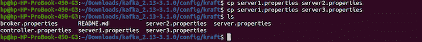

Creation of the two additional copies of the server.

接下来，您将通过运行以下命令向`server2.properties`添加配置:

```
nano server2.properties

```

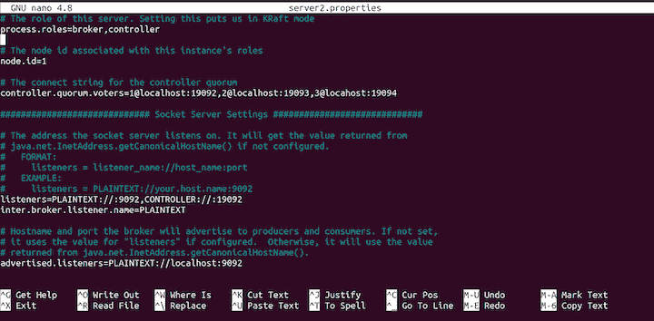

Content of `server2.properties` file.

将`node.id`改为`2`:

```
node.id=2

```

然后，改变`listeners`，如下所示:

```
listeners=PLAINTEXT://:9093,CONTROLLER://:19093

```

同样改变`advertised.listeners`:

```
advertised.listeners=PLAINTEXT://localhost:9093

```

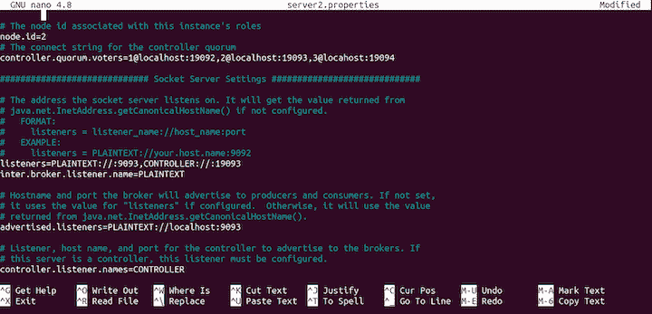

Configurations for `server2.properties`.

接下来，更改日志目录`log.dirs`:

```
log.dirs=/tmp/server2/kraft-combined-logs

```

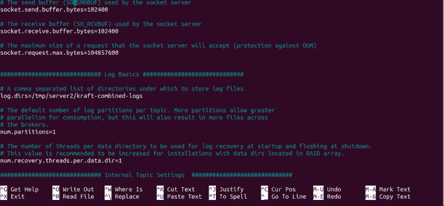

Additional configurations for `server2.properties`.

这就是`server2.properties`服务器的所有配置。在提示符下键入 **CTRL X** 和 **yes** 来保存我们的配置。

接下来，我们将配置第三台服务器`server3.properties`。

运行以下命令开始配置文件:

```
nano server3.properties

```

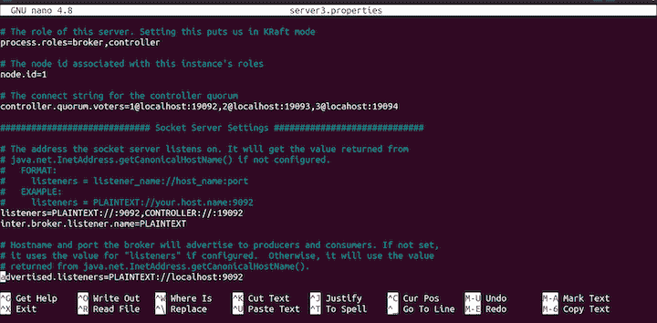

Content of the `server3.properties` file.

将`node.id`更新为`3`,如下所示:

```
node.id=3

```

然后，改变`listeners`，像这样:

```
listeners=PLAINTEXT://:9094,CONTROLLER://:19094

```

将`advertised.listeners`更改如下:

```
advertised.listeners=PLAINTEXT://localhost:9094

```

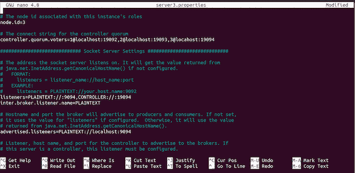

Configurations for the `server3.properties` file.

使用以下命令更改日志目录`log.dirs`:

```
log.dirs=/tmp/server3/kraft-combined-logs

```

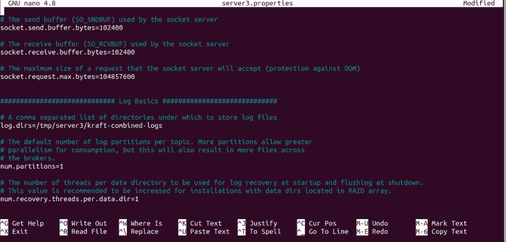

Additional configurations for `server3.properties`.

接下来，使用以下命令为我们的集群创建一个 ID:

```
cd ..
cd ..
./bin/kafka-storage.sh random-uuid

```

运行这些命令后，将会注销一个唯一的 ID。请务必复制 ID，因为我们稍后会用到它:


Creation of a unique ID.

接下来，我们将格式化日志目录的位置，以允许 Kafka 存储日志:

```
./bin/kafka-storage.sh format -t iKDSfyiITuqsq1u8b9hEQQ -c ./config/kraft/server1.properties

./bin/kafka-storage.sh format -t iKDSfyiITuqsq1u8b9hEQQ -c ./config/kraft/server2.properties

./bin/kafka-storage.sh format -t iKDSfyiITuqsq1u8b9hEQQ -c ./config/kraft/server3.properties

```

以下是输出结果:

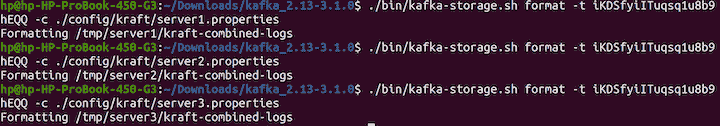

KRaft output.

此时，我们的服务器没有运行。使用以下命令启动服务器:

```
export KAFKA_HEAP_OPTS="-Xmx200M -Xms100M"
./bin/kafka-server-start.sh -daemon ./config/kraft/server1.properties
./bin/kafka-server-start.sh -daemon ./config/kraft/server2.properties
./bin/kafka-server-start.sh -daemon ./config/kraft/server3.properties
ps -ef | grep kafka

```

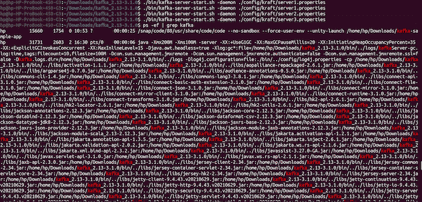

Output, showing servers are running.

现在我们知道了如何配置 Kafka 服务器，是时候学习如何创建主题了。
运行以下命令:

```
./bin/kafka-topics.sh --create --topic kraft-test --partitions 3 --replication-factor 3 --bootstrap-server localhost:9092

```

在本教程中，我们将使用用于 Node.js 的 [kafka-node](https://www.npmjs.com/package/kafka-node) 客户端库。kafka 还有用于其他编程语言的[其他客户端](https://cwiki.apache.org/confluence/display/KAFKA/Clients)，所以您可以随意使用 Kafka 来编写您选择的任何语言。在撰写本文时，KRaft 还不能用于生产，只能用于开发模式。对于本教程，我们将使用 ZooKeeper。

## 引导应用程序并安装依赖项

因为我们在这个练习中使用 Node.js，所以我们将从引导一个具有最小结构的基本应用程序开始。

首先，我们将创建一个新目录来存放项目并导航到其中，如下所示:

```
mkdir kafka-sample-app
cd kafka-sample-app

```

接下来，我们将通过运行`npm init`命令创建一个`package.json`文件。然后，我们将按照说明像往常一样设置项目。

项目建立后,`package.json`文件应该是这样的:

```
{
  "name": "kafka-producer_consumer_tutorial",
  "version": "1.0.0",
  "description": "Building a real-time data streaming application pipeline with Apache Kafka\"",
  "main": "app.js",
  "scripts": {
    "test": "echo \"Error: no test specified\" && exit 1",
    "start": "node producer.js"
  },
  "author": "Deborah Emeni",
  "license": "ISC",
  "dependencies": {
    "dotenv": "^16.0.0",
    "kafka-node": "^5.0.0"
  }
}

```

我们已经安装了两个以后会用到的依赖项。为了安装`kafka-node`客户端，我们在终端上运行`npm install kafka-node`。`kafka-node`的[文档](https://www.npmjs.com/package/kafka-node)可在 npm 上获得。`dotenv`包用于为 app 设置环境变量。

我们可以通过运行`npm install dotenv`来安装包。

现在我们已经完成了依赖项的安装，让我们创建所有必需的文件，如下图所示:

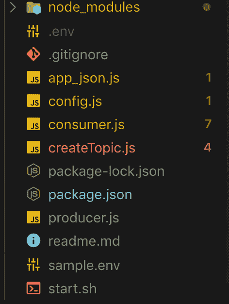

File hierarchy.

## 创建主题

上图显示了应用程序所需的所有必要文件。让我们仔细看看每个文件，以了解发生了什么。

首先，让我们使用下面的命令从终端手动创建一个新主题，它有三个分区和副本:

```
./kafka-topics.sh --create --zookeeper  --replication-factor  --partitions  --topic 

```

在实际应用中，我们应该始终用真实值更新`<ZOOKEEPER_URL:PORT>`、`<NO_OF_REPLICATIONS>`、`<NO_OF_PARTITIONS>`和`<TOPIC_NAME>`。然而，出于本教程的目的，我们将用一个脚本来处理它。创建新主题的代码可以在 [`[createTopic.js]`文件](https://github.com/firebase007/kafka_producer_consumer_tutorial/blob/master/createTopic.js)中找到。

代码如下:

```
const kafka = require('kafka-node');
const config  = require('./config');

const client = new kafka.KafkaClient({kafkaHost: config.KafkaHost});

const topicToCreate = [{
  topic: config.KafkaTopic,
  partitions: 1,
  replicationFactor: 1
}
];

client.createTopics(topicToCreate, (error, result) => {
  // result is an array of any errors if a given topic could not be created
  console.log(result, 'topic created successfully');
});

```

在这里，我们导入 Kafka 客户端并连接到 Kafka 设置。您会注意到我们从未在用例中配置复制因子。然而，这并不反映现实生活中的场景。

在生产用例中，我们可以根据我们要处理的数据量或消息量来设置多个 Kafka 代理。让我们看看如何在本地设置中实现这一点。

## 生产内容

现在我们已经创建了一个主题，我们可以为主题生成(或写入)数据(或内容)。写主题的代码可以在 [`[producer.js]`文件](https://github.com/firebase007/kafka_producer_consumer_tutorial/blob/master/producer.js)中找到。

代码如下:

```
const Kafka = require('kafka-node');
const config  = require('./config');

const Producer = Kafka.Producer;
const client = new Kafka.KafkaClient({kafkaHost: config.KafkaHost});
const producer = new Producer(client,  {requireAcks: 0, partitionerType: 2});

const pushDataToKafka =(dataToPush) => {

  try {
  let payloadToKafkaTopic = [{topic: config.KafkaTopic, messages: JSON.stringify(dataToPush) }];
  console.log(payloadToKafkaTopic);
  producer.on('ready', async function() {
    producer.send(payloadToKafkaTopic, (err, data) => {
          console.log('data: ', data);
  });

  producer.on('error', function(err) {
    //  handle error cases here
  })
  })
  }
catch(error) {
  console.log(error);
}

};

const jsonData = require('./app_json.js');

pushDataToKafka(jsonData);

```

在这里，我们导入了`kafka-node`库，并设置了`client`来接收来自卡夫卡`producer`或经纪人的连接。一旦建立了连接，我们就向指定的`KafkaTopic`生成数据。注意，在现实世界的应用程序中，一旦发布任务通过调用`client.close()`方法完成，客户端的连接应该总是关闭的。

现在，如果我们使用`./start.sh`命令运行启动脚本，我们将把数据写入我们的 Kafka 主题:

```
npm start

```

## 消费内容

要读取主题数据(或内容)，我们可以使用 [`[consumer.js]`文件](https://github.com/firebase007/kafka_producer_consumer_tutorial/blob/master/consumer.js)中的消费者脚本。
如果我们运行`node ./consumer.js`，我们将得到以下输出:

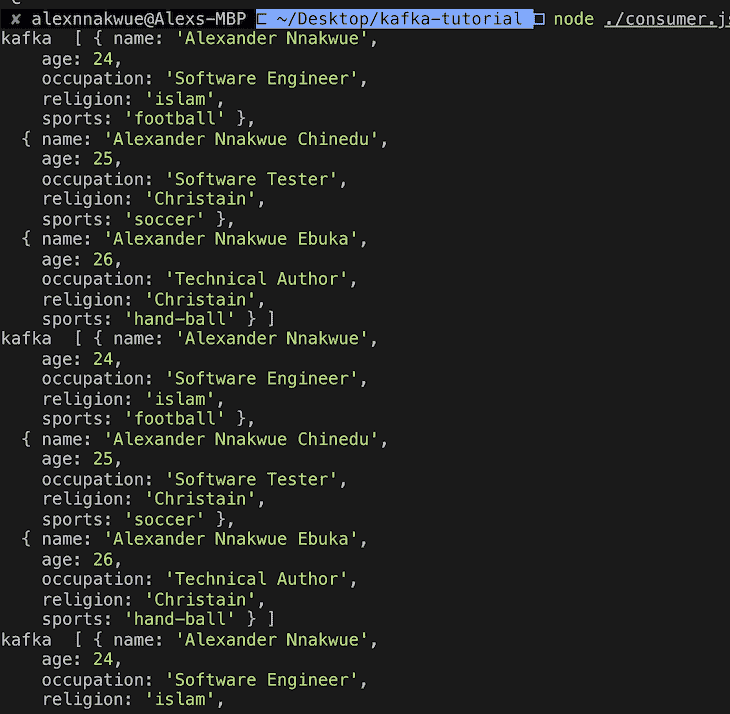

Running the consumer script to read from a Kafka topic.

下面是`consumer.js`文件的代码:

```
const kafka = require('kafka-node');
const config = require('./config');

try {
 const Consumer = kafka.Consumer;
 const client = new kafka.KafkaClient({idleConnection: 24 * 60 * 60 * 1000,  kafkaHost: config.KafkaHost});

 let consumer = new Consumer(
    client,
    [{ topic: config.KafkaTopic, partition: 0 }],
    {
      autoCommit: true,
      fetchMaxWaitMs: 1000,
      fetchMaxBytes: 1024 * 1024,
      encoding: 'utf8',
      // fromOffset: false
    }
  );
  consumer.on('message', async function(message) {
    console.log(
      'kafka ',
      JSON.parse(message.value)
    );
  })
  consumer.on('error', function(error) {
    //  handle error 
    console.log('error', error);
  });
}
catch(error) {
  // catch error trace
  console.log(error);
}

```

在这里，我们连接到 Kafka 客户端，并使用来自预定义的 Kafka 主题的数据。

## 运行应用程序

现在我们已经完成了设置，我们需要在运行应用程序之前启动 ZooKeeper 服务器。这一步是必要的，因为 Kafka 服务器依赖于 ZooKeeper 服务器来运行。

要启动 ZooKeeper 服务器，请运行以下命令:

```
bin/zookeeper-server-start.sh config/zookeeper.properties

```

接下来，运行以下命令启动 Kafka 服务器:

```
bin/Kafka-server-start.sh config/server.properties

```

我们可以通过运行以下命令来检查代理中可用 Kafka 主题的数量:

```
bin/Kafka-topics.sh --list --zookeeper localhost:2181

```

我们还可以通过运行`console-consumer`命令来使用 Kafka 主题中的数据:

```
bin/kafka-console-consumer.sh --bootstrap-server localhost:9092 --topic kafka-example-topic  --from-beginning

```

此外，Kafka 提供了一个`create`脚本，允许开发人员在他们的集群上手动创建一个主题:

```
./kafka-topics.sh --create --zookeeper  --replication-factor  --partitions  --topic 

```

需要注意的是，在创建 Kafka 主题之前，我们需要在不同的终端窗口上分别强制启动 ZooKeeper 和 Kafka 服务器。

## 结论

Kafka 可以充当发布者/订阅者类型的系统，用于构建类似于 [RabbitMQ](https://www.rabbitmq.com) 的批量数据的读写流。它还可以用于构建高弹性、可伸缩的实时流和处理应用程序。

请注意，这种类型的流处理可以基于一些预定义的事件动态完成。此外，就像消息传递系统一样，Kafka 有一个由高度容忍的集群组成的存储机制，这些集群是复制的和高度分布式的。我们所说的复制是指数据可以分布在多个不同的集群中，从而最大限度地减少整个链中的数据丢失。

Kafka 可以作为一个独立的插件集成到其他系统中。在这种情况下，它可以根据需要独立扩展。这意味着我们可以独立地扩展生产者和消费者，而不会对整个应用程序产生任何副作用。

我们已经看到，构建数据管道涉及到将数据从生成数据的源点移动到另一个应用程序需要或使用的目标点。源点也可以指从另一个应用程序输出的数据，

本教程的代码可以在这个 [GitHub repo](https://github.com/firebase007/kafka_producer_consumer_tutorial) 上获得。为了感受卡夫卡的设计哲学，你可以查看[文档的这一部分](https://kafka.apache.org/documentation/#design)。在未来的教程中，我们可以看看通过 Kafka API 提供的其他工具，如 Kafka streams 和 Kafka connect。有关介绍，您可以查看[文档的本节](https://kafka.apache.org/documentation/#api)。

希望您现在已经准备好探索更复杂的用例了。如果您有任何问题，请不要犹豫，在下面的评论区与我联系，或者在 [Twitter](https://twitter.com/alex_nnakwue) 上与我联系。

## 200 只显示器出现故障，生产中网络请求缓慢

部署基于节点的 web 应用程序或网站是容易的部分。确保您的节点实例继续为您的应用程序提供资源是事情变得更加困难的地方。如果您对确保对后端或第三方服务的请求成功感兴趣，

[try LogRocket](https://lp.logrocket.com/blg/node-signup)

.

[](https://lp.logrocket.com/blg/node-signup)[https://logrocket.com/signup/](https://lp.logrocket.com/blg/node-signup)

LogRocket 就像是网络和移动应用程序的 DVR，记录下用户与你的应用程序交互时发生的一切。您可以汇总并报告有问题的网络请求，以快速了解根本原因，而不是猜测问题发生的原因。

LogRocket 检测您的应用程序以记录基线性能计时，如页面加载时间、到达第一个字节的时间、慢速网络请求，还记录 Redux、NgRx 和 Vuex 操作/状态。

[Start monitoring for free](https://lp.logrocket.com/blg/node-signup)

.