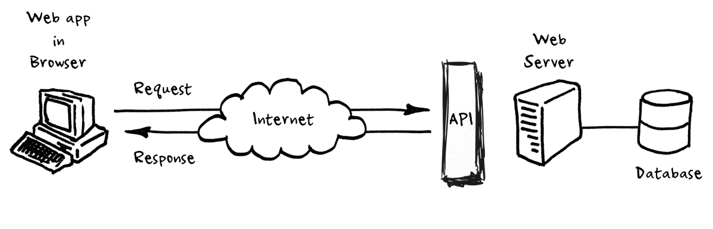
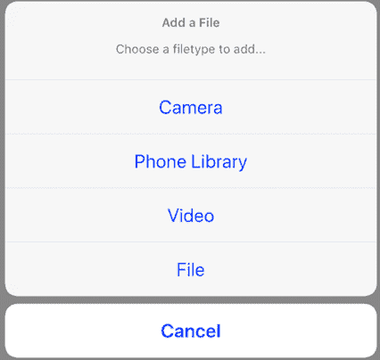
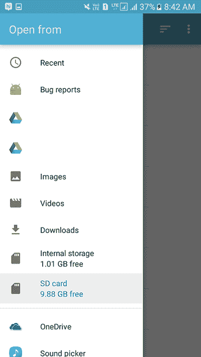
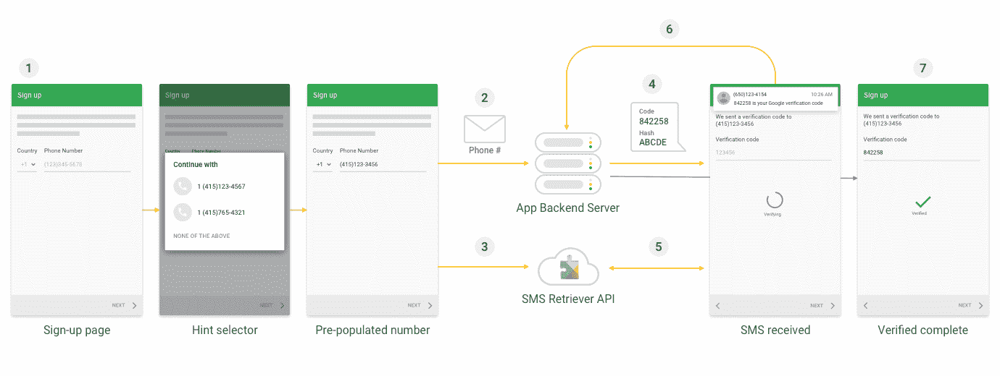

# web 中缺失的 API

> 原文：<https://blog.logrocket.com/apis-that-are-missing-from-the-web/>

随着技术和设备功能的进步，网络和移动应用之间的界限变得越来越模糊。渐进式网络应用程序(PWAs)的引入进一步模糊了这一界限，因为它使构建允许类似本机应用程序体验的网络应用程序成为可能。再加上帮助 pwa 利用移动设备的某些功能的 API 的进一步开发，意味着 pwa 的采用已经飞速增长。

在本文中，我们将看看目前为止 web(和 PWAs)中缺少的 API，这些 API 对于本地应用程序是可用的。

其中一些 API 目前正在 web 上进行不同阶段的测试(主要是在 Chrome 和基于 Chrome 的浏览器上),但它们是非标准的，本文主要关注目前为止 web 上的标准 API。

## 什么是 API？

首先，我们将简要介绍什么是 API。API 代表应用编程接口，它是允许两个软件之间通信的一组协议和定义。它们是用于构建和集成能够访问另一个应用程序的功能或数据的应用程序软件的指令。

根据维基百科，API 是:

> 软件组件或系统的[计算接口](https://en.wikipedia.org/wiki/Interface_(computing))，它定义了其他组件或系统如何使用它。它定义了可以进行的调用或请求的种类、如何进行、应该使用的数据格式、应该遵循的约定等等。它还可以提供扩展机制，以便用户可以以各种方式和不同程度扩展现有功能。

source: [Perry Eising](https://medium.com/@perrysetgo)

## 文件系统 API

文件系统 API 使应用程序能够与用户设备上的文件、照片、视频和文本等文件进行交互。它使应用程序能够读取、修改和保存设备上的文件(在用户许可的情况下)，它还允许应用程序读取用户选择的任何目录的内容。

当这个 API 被调用时，它显示一个文件选择器对话框，并提示用户选择一个文件。选择文件后，API 允许用户执行其他操作，例如选择多个文件或目录:

credits: [Deepakraj Murugesan](https://medium.com/@deepakrajmurugesan)

credits: [Juned Mughal](https://www.android-examples.com/author/junedmughal/)

文件提供者 API，在网络上被称为[本地文件系统 API](https://web.dev/native-file-system/) ，目前在 Chrome 浏览器中处于其原始试用阶段。

[原生文件系统 API](https://web.dev/native-file-system/) 将使网站能够访问文件和目录，修改文件和目录，并在请求用户许可后将其保存回设备存储器，给予网站/web 应用程序的许可将持续到标签关闭。一旦标签被关闭，站点将无法修改用户设备上的文件。

该 API 还考虑了安全风险，因此它限制保存到某些文件夹，如操作系统文件夹。

Origin 试用版允许您尝试新功能，并向 web 标准社区提供关于其可用性、实用性和有效性的反馈。有关更多信息，请参见[面向 Web 开发人员的 Origin 试用指南](https://github.com/GoogleChrome/OriginTrials/blob/gh-pages/developer-guide.md)。要注册这个或另一个 origin 试用版，请访问[注册页面](https://developers.chrome.com/origintrials/#/trials/active)。

## 联系人 API

根据官方 [Android 文档](https://developer.android.com/guide/topics/providers/contacts-provider):

> 这个 API 允许应用程序访问用户的联系人。它允许显示、编辑、选择和修改用户在您的应用程序中为某人收集的联系人。

它使用户能够从他们的联系人列表中选择条目，并与应用程序共享所选条目的有限细节。它允许用户在他们想要的时候只分享他们想要的东西，并使用户更容易与他们的朋友和家人联系。

该 API 的一个完美用例是在基于 web 的电子邮件客户端上选择电子邮件的收件人，在 IP 语音应用程序上查找要呼叫的电话号码。一个社交网络应用程序，使用您的联系人来发现哪些朋友已经加入，或者从您的设备中选择联系人信息并将其添加到 web 表单中。

[联系人选择器 API](https://web.dev/contact-picker/) 已经完成了原始试用，目前在 Chrome 80+中可用。

## 生物识别 API

保护应用程序中信息的一种常见方法是请求生物认证，例如使用面部识别或指纹识别，并使用通行码或密码作为后备选项。

[生物识别 API](https://source.android.com/security/biometric) 使用人脸或指纹识别等认证机制，帮助应用安全地识别用户并授权对其个人数据的请求。

[web 认证 API](https://developer.mozilla.org/en-US/docs/Web/API/Web_Authentication_API) 可用于 Web 上的无密码认证，并可作为现有方法的替代或补充，以注册新帐户或登录 Web 应用程序上的现有帐户。

## 地理围栏 API

[地理围栏 API](https://developers.google.com/location-context/geofencing) 允许应用程序绘制地理边界，并在设备进入或离开这些区域时触发一个事件。这个 [API](https://developer.apple.com/documentation/corelocation) 使用设备上的组件收集数据，如 Wi-Fi、GPS、蓝牙、磁力计、气压计和蜂窝硬件。

地理围栏 API 在一些情况下特别有用，例如当孩子离开某个位置时通知父母，以及当车辆被盗时向警方报警。

这种 API 在 web 上的一个完美用例是在社交网络 web 应用程序中检索用户的位置信息，以显示与其位置相关的个性化信息，或者在基于 web 的地图上绘制用户的位置。

## 消息传递 API

这个 API 允许应用程序访问设备上的消息系统(SMS 和 MMS)。这使他们能够浏览、创建和管理消息，而无需离开应用程序。

在这个 API 下是 SMS 检索器 API。这使得应用程序能够自动检索应用程序的验证码(OTP)，而不需要用户手动输入验证码，也不需要任何额外的应用程序权限。

credits: [Android docs](https://developers.google.com/identity/sms-retriever/overview)

一个关于 Web OTP API 的提议已经被提出，这个 API 有一个独特的任务，就是使用 SMS 作为传输工具来发送一次性密码消息。

Web OTP API 允许您的应用程序接收绑定到应用程序源的特殊格式的消息。由此，您可以通过编程从 SMS 消息中获取 OTP，并更容易地验证用户的电话号码。

[Web OTP API](https://web.dev/web-otp/) 已经完成了 origin 试用，预计可以在 Google Chrome 81+中使用。

## 近场通信(NFC) API

这种 API 使应用程序能够检测、读取和写入附近的 NFC 设备。它允许两个近距离设备之间的无线通信，通常需要 4 厘米或更短的距离来启动连接。它通常用于将文件从一个设备传输到另一个设备。

可能使用[网络 NFC](https://web.dev/nfc/) 的站点示例包括:

*   当用户将他们的设备接触展品附近的 NFC 卡时，博物馆和美术馆可以显示关于显示器的附加信息
*   库存管理站点可以向容器上的 NFC 标签读取或写入数据，以更新其内容的信息
*   会议现场可以在活动期间使用它来扫描 NFC 徽章
*   站点可以使用它来共享设备或服务供应场景所需的初始机密，还可以在操作模式下部署配置数据

Web NFC API 将在 Android 上作为 Chrome 81 的原始试用版。origin 试用预计在 Chrome 84 结束。

## 唤醒锁定 API

唤醒锁 API 是一种机制，允许您的应用程序与设备通信以保持开机状态。当应用程序需要它继续运行时，它可以防止设备调暗或锁定屏幕。

* * *

### 更多来自 LogRocket 的精彩文章:

* * *

根据官方[文档](https://w3c.github.io/screen-wake-lock/):

> [屏幕唤醒锁定 API](https://w3c.github.io/wake-lock/) 提供了一种防止设备变暗和锁定屏幕的方法。这一功能实现了迄今为止需要本机应用程序才能实现的新体验。

在构建基于网络的游戏、视频流平台或电视网络应用程序时，它非常方便。

在 Chrome 79 中，[屏幕唤醒锁定 API](https://w3c.github.io/wake-lock/) 作为原始试用版提供。

## 蓝牙 API

该 API 允许设备与其他蓝牙设备无线交换数据。它提供对蓝牙功能的访问。该 API 允许应用程序无线连接到其他蓝牙设备，实现点对点和多点无线功能。

[网络蓝牙](https://developer.mozilla.org/en-US/docs/Web/API/Web_Bluetooth_API)允许用户通过浏览器以安全和保护隐私的方式直接与蓝牙低能耗设备进行通信和交互。这些包括各种硬件设备，如心率监测器，IOT 设备，如灯泡，玩具，甚至无人机！比如这架由网络应用程序控制的[无人机。](https://www.youtube.com/watch?v=yILD_ZdXJW4)

该 API 在 Chrome 上的起源测试已于 2017 年 1 月成功结束。

## 传感器 API

接近传感器 API 和环境光 API 都能够提供高精度和准确度的原始数据，如果您想要监控三维设备移动或定位，或者如果您想要监控设备附近周围环境的变化，这两种 API 都很有用。它使应用程序能够从加速度计和陀螺仪、计步器、磁力计和气压计中读取数据。

[接近传感器 API](https://w3c.github.io/proximity/) 是一种了解用户何时靠近设备的便捷方式。这使得对这种变化做出反应成为可能，例如，当用户将设备靠近耳朵打电话时，可以关闭智能手机的屏幕。

[环境光 API](https://developer.mozilla.org/en-US/docs/Web/API/Ambient_Light_Sensor_API) 允许网络应用程序访问由设备的光传感器测量的光强度水平，通常内置于设备的摄像头中。当试图在您的应用程序中实现白天和夜晚模式之间的自动切换时，这很方便。

## 结论

在这篇文章中，我们看了一下 web 上没有的但可用于移动应用程序的 API。现代网络应用编程接口的发展使得这个列表越来越短。要了解关于 Web API 的更多信息，您可以查看 [MDN Web API 文档](https://developer.mozilla.org/en-US/docs/Web/API)。你也可以点击这里查看谷歌项目“府谷”[中提议的网络功能，并点击这个](https://web.dev/fugu-status/)[网站](https://whatwebcando.today/)查看目前的网络功能。

哪种 API 对你来说最突出，你希望哪种 API 能很快实现？请在评论区告诉我们。