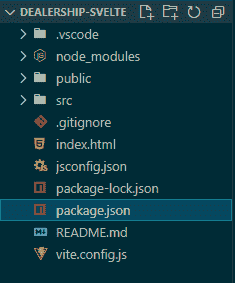

# 使用 svelet-log rocket 博客进行应用状态管理

> 原文：<https://blog.logrocket.com/application-state-management-svelte/>

***编者按**:这篇文章的最后一次准确性验证是在 2022 年 11 月 16 日。*

在早期的 JavaScript 框架中，比如 Angular，通常将应用程序中的所有状态嵌入到路由、服务、控制器、本地存储和会话存储中。然而，随着应用程序变得越来越大，跟踪什么存储在哪里变得越来越困难。

改进的形式是像 Redux 和 Vuex 这样的状态管理库。像 Svelte 这样的新框架采用了更简单的状态管理方法，不需要安装库，而是提供管理框架内状态的存储。在本文中，我们将探索 Svelte 如何管理和处理应用程序中的状态。

目录

## 瘦上下文 API

## Svelte 的上下文 API 非常适合跨组件通信，而不必通过传递道具来使您的代码库变得复杂。[上下文 API](https://svelte.dev/tutorial/context-api) 由两个内置的瘦函数`getContext`和`setContext`启用。通过在上下文中设置对象或值并将其与一个键相关联，您可以使其在应用程序中的任何位置可用，如下面的代码示例所示:

要使`thisKey`在应用程序的不同组件中可用，只需使用`getContext`函数导入它:

```
<script>
  import { setContext } from 'svelte'

  const thisObject = {}

  setContext('thisKey', thisObject)
</script>

```

请记住，您只能使用`getContext`来检索使用了`setContext`的组件或同一组件树中的组件的键。为了在不同树中的两个组件之间传递属性和值，Svelte 使用了[存储](https://svelte.dev/docs#svelte_store)。

```
<script>
  import { getContext } from 'svelte'

  const thisObject = getContext('thisKey')
</script>

```

与苗条商店合作

## 随着应用程序规模的增加，它的复杂性也会增加。此时，在应用程序的组件层次结构中嵌套应用程序状态的某些部分并不是一个好主意；您将拥有一些需要由不同组件访问的属性。

Svelte 通过 stores 处理这种类型的属性，stores 是保存一个值的对象，当值改变时可以通知您。Svelte 有两种存储来处理应用程序中的状态，`writable`和`readable`存储。

可写商店

### [可写存储](https://svelte.dev/docs#writable)是保存值或属性的对象，可由应用程序中的不同组件访问。让我们使用可写存储来保存一个值，然后我们可以在我们的应用程序中修改或传递这个值。要访问这个值，您可以从存储中导出它，并将其保存为一个 JavaScript 文件:

然后，您可以将它导入到需要它的任何其他组件中，如下所示:

```
<!-- location.js -->
<script>
  import writable from 'svelte/store'

  export const city = writable('New York')
</script>

```

可写存储器中的值可以改变。如果您需要在导入的任何组件中更改`city`的值，您可以使用`set()`方法:

```
<scipt>
  import { city } from './location.js'
</script>

```

或者，您可以使用`update()`方法运行回调，将当前值作为参数传递:

```
<!-- Map.svelte -->

<script>
  import { city } from './location.js'

  city.set('Washington')

</script>

```

或者，您可以使用 Svelte 的`subscribe()`方法让组件监视您在商店中设置的值的变化:

```
<!-- Map.svelte -->

<script>
  import { city } from './location.js'

  const newCity = 'Washington'

  function changeCity() {
    city.update(existing => newCity)
  }

</script>

```

可读存储

```
<!-- Map.svelte -->

<script>
  import { city } from './location.js'

  const watch = city.subscribe(value => {
    console.log(value);
  });
</script>

```

### 像可写存储一样，可读存储保存对象，但是不能从外部组件更新它们。使用可读存储时，您必须在创建它时设置它的值。可读存储主要用于处理需要不可变的数据。下面是一个使用可读存储和计数器来处理的示例:

然后可以将上面的计数器导入到另一个组件中，如下所示:

```
<!-- counter.js -->

<script>
  import { readable } from 'svelte/store'

  export const counter = readable(0, set => {
    setTimeout(() => {
     set(1)
    }, 1000)
  })
</script>

```

用苗条的商店建立数据集

```
<!-- Home.svelte-->

<script>
  import { counter } from './store.js'
</script>

<h1>You have {$counter} seconds left!<h1>

```

## 让我们建立一个真正的应用程序，在那里我们将管理苗条的状态。我们的应用程序将只是一个基本的更新列表。首先，[我们将创建一个苗条的项目](https://blog.logrocket.com/how-to-build-simple-svelte-js-app/)。在您的终端中，输入以下命令:

然后，导航到项目目录并安装该项目的所有依赖项:

```
npm create [email protected] dealership-svelte -- --template svelte

```

完整的应用程序应具有类似如下的文件夹结构:

```
npm install

```



一旦应用程序构建完成，在您的终端上运行`npm run dev`来部署它。这将在端口`localhost:5000`上部署应用程序。

建一个苗条的商店

## 在我们项目的`src`文件夹中，让我们创建一个`store`文件夹，我们将使用它来保存我们的商店。接下来，我们将创建一个文件来包含我们需要存储的内容，定义更新存储值的方法，并将它们重置为默认值。我们将这个文件称为`cars.js`:

您现在可以将导出的方法`subscribe`、`addCar`和`reset`导入到任何组件中，并分别使用它们来订阅、添加新值和重置我们的汽车列表。

```
 // src/store/cars.js

 import { writable } from 'svelte/store';

 const CARS = [
     { make: "Ford", model: "Taurus", year: "2015" },
     { make: "Toyota", model: "Avalon", year: "2013" }
 ];

 const { subscribe, set, update } = writable(CARS);

 const addCar = car => update(cars => {
     return [...cars, car];
 });

 const reset = () => {
     set(CARS);
 };

 export default {
     subscribe,
     addCar,
     reset
 }

```

创建组件

## 接下来，我们将创建接收从我们的存储中导出的方法的组件。我们将创建两个组件，`CarPage`，当我们想要添加一辆新车时将使用它，和`CarList`，它将显示添加的汽车列表。`CarPage`将更新所有添加的汽车并自动响应变化:

接下来，我们将创建`CarList`，这是一个允许我们相应地更新和删除车辆的表单:

```
<!-- src/CarPage.svelte -->
<script>
        import cars from "./store/cars";
</script>

<div id="carPage">
        { #each $cars as car }
                <p>{car.make} {car.model}</p>
                <p>{car.year}</p>
                <hr />
        { /each }
</div>

```

最后，我们将把`CarList`和`CarPage`导入到`App.svelte`中:

```
<!-- src/CarList.svelte -->
<script>
        import cars from "./store/cars";

        // binding values
        let make = "";
        let model = "";
        let year = "";

        // submit car
        const submitCar = () => {
                cars.addCar({ make, model, year });
                // reset values
                make = model = year = "";
        }
</script>

<div id="carList">
    <input type="text"  bind:value={make} placeholder="Enter vehicle make" />
    <input type="text"  bind:value={model} placeholder="Enter vehicle model" />
    <input type="year" bind:value={year} placeholder="Enter vehicle year" />
    <input type="submit" on:click={submitCar} value="Include Vehicle" />
    <input type="submit" on:click={cars.reset} value="Reset Vehicle list" />
</div>

```

Lastly, we’ll import both `CarList` and `CarPage` into `App.svelte`:

此时，我们将有一个应用程序显示使用 Svelte 管理状态的基本原理。我们的应用程序的行为应该模仿下面视频中的行为:

```
<!-- src/App.svelte-->

<script>
    import CarList from "./CarList.svelte";
    import CarPage from "./CarPage.svelte";
</script>
<main>
    <h1>Car Dealership</h1>
    <CarList />
    <CarPage />
</main>

```

 [https://www.youtube.com/embed/xCP013FPmDE?version=3&rel=1&showsearch=0&showinfo=1&iv_load_policy=1&fs=1&hl=en-US&autohide=2&wmode=transparent](https://www.youtube.com/embed/xCP013FPmDE?version=3&rel=1&showsearch=0&showinfo=1&iv_load_policy=1&fs=1&hl=en-US&autohide=2&wmode=transparent)

视频

结论

## [Svelte 的适应性使其成为构建需要管理状态的小规模应用的绝佳选择](https://blog.logrocket.com/svelte-vs-vue-comparing-framework-internals/#reactivity)。它提供的可定制商店非常棒，可以让你通过商店隔离偏好。当然，随着 GitHub 上[苗条报告](https://github.com/sveltejs/svelte)的更多贡献者，我们应该会看到更多有前途的功能和改变。

[Svelte’s adaptability makes it a great choice](https://blog.logrocket.com/svelte-vs-vue-comparing-framework-internals/#reactivity) for building small scale apps that require you to manage state. Its offering of customizable stores to choose from is brilliant, allowing you to isolate preferences via stores. Certainly, we should see more promising features and alterations on this with more contributors to the [Svelte repo](https://github.com/sveltejs/svelte) on GitHub.