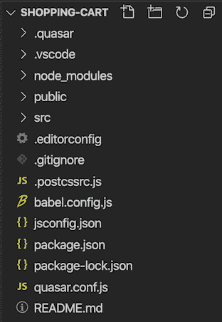
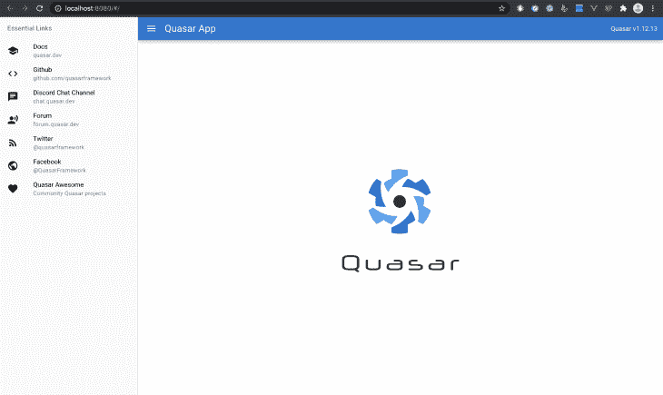
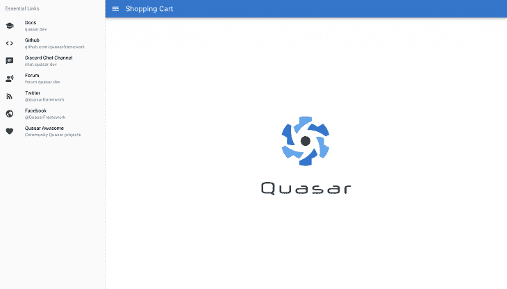
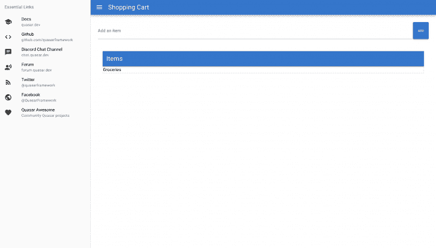

# 用 Quasar - LogRocket 博客构建跨平台应用

> 原文：<https://blog.logrocket.com/applications-with-quasar/>

前端开发有很多选择，为团队选择一个特定的框架可能是一个艰难的决定。当你跨移动和网络平台开发时，事情变得更加棘手。最近一个被证明是非常好的解决两个平台(移动和网络)的框架是 [Quasar](https://quasar.dev/) 。

基于 Vue.js，它为开发人员提供了跨不同平台扩展单个代码库的能力。在本帖中，我们将通过构建一个购物车原型并将其同时部署在移动和网络平台上来演示 Quasar 是如何工作的。

## 安装 Quasar

让我们从在我们的机器上安装 Quasar 的 CLI 开始。前往您的终端，使用以下命令安装 Quasar:

```
$ npm install -g @quasar/cli
```

接下来，我们将创建一个新项目:

```
$ quasar create shopping-cart
```

该命令启动 Quasar 脚手架工具包，以这种方式回答问题:

```
? Project name (internal usage for dev) /* provide your project's name */
? Project product name (must start with letter if building mobile apps) 
  /* Your app''s name */
? Project description /* a description of the project */
? Author /* Your name <your email> */
? Pick your favorite CSS preprocessor: (can be changed later) /* none */
? Pick a Quasar components & directives import strategy: (can be changed later) 
 /* Auto import */
? Check the features needed for your project: /* toggle to none */
? Continue to install project dependencies after the project has been created? (recommended) /* choose NPM */
```

完成后，您应该有一个类似于下面的项目文件夹:


项目安装后，使用以下命令启动它:

```
$ cd shopping-cart
$ npx quasar dev
```

这会以默认状态打开您的项目:


太好了！现在让我们开始构建应用程序。

## 构建购物车的界面

我们要做的第一件事是重命名我们的应用程序的标题。在您的项目文件夹中，导航到`src/layout/MainLayout.vue`并更改工具栏上的标题，同时删除包含正在使用的 Quasar 版本的`div`:

```
<q-toolbar-title>
  Shopping Cart List
</q-toolbar-title>
```

Quasar 带有热重新加载功能——一旦进行了更改并保存，它们就会反映在应用程序上。



接下来，我们将添加一个输入组件，该组件从用户那里获取文本输入，指定他们想要添加到购物车中的商品。导航到`src/pages/Index.vue`，用 Quasar 的`QInput`组件替换`template`标签中的默认文本:

```
<template>
  <div class="row q-mb-lg">
      <q-input placeholder="Enter your item here" class="col" />
  </div>
</template>
```

然后，在这个输入旁边，我们将添加一个按钮，单击该按钮会将输入的每个商品添加到购物车中。为此，我们将利用类星体的`QBtn`组件:

```
<template>
  <div class="row q-mb-lg">
      <q-input placeholder="Enter your item here" class="col" />
      <q-btn color="primary" size="sm" label="Add" />
  </div>
</template>
```

在此之后，我们将添加购物车。这将基本上是一个列表的形式，其中可以添加和删除项目。在 Quasar 应用程序中，可以使用`QList`组件创建列表。我们还将添加一个标题:

```
<template>
  <div class="q-pa-md q-lb-mg" >
    <q-toolbar class="bg-primary text-white shadow-2">
      <q-toolbar-title>Items</q-toolbar-title>
    </q-toolbar>
    <q-list>
        Groceries
    </q-list>
  </div>
</template>
```

此时，下面是我们的应用程序在生产中的样子:


## 使用 Vue 方法和 Quasar 的 API

现在我们已经有了购物车应该是什么样子的基本视图，但我们仍然希望向它添加一些逻辑和功能。我们的购物车应该能够承担以下功能:

*   用户添加一个项目，在添加的项目旁边是一个按钮
*   用户可以点击这个按钮，让项目返回

让我们首先创建一个部分，当按钮被单击时，项目将被移动到这个部分。在`src/index.vue`中，我们将创建第二个列表，并将其命名为`Returned Items`:

```
<template>
  <div class="q-pa-md q-lb-mg" >
    <q-toolbar class="bg-primary text-white shadow-2">
      <q-toolbar-title>Returned Items</q-toolbar-title>
    </q-toolbar>
    <q-list>
      Batteries   
    </q-list>
  </div>
</template>
```

让我们重新加载我们的页面，看看:

 [https://www.youtube.com/embed/dX8DxCocBKk?version=3&rel=1&showsearch=0&showinfo=1&iv_load_policy=1&fs=1&hl=en-US&autohide=2&wmode=transparent](https://www.youtube.com/embed/dX8DxCocBKk?version=3&rel=1&showsearch=0&showinfo=1&iv_load_policy=1&fs=1&hl=en-US&autohide=2&wmode=transparent)

视频

`ADD`按钮还不能用。让我们创建方法来启用`ADD`按钮以及返回项目的按钮。在`src/index.vue`中，我们有一个默认启动的 Vue 实例。我们将在这个 Vue 实例中嵌入我们的方法，从向购物车添加商品的方法开始:

```
<script>
export default {
  name: 'PageIndex',
  data() {
    return {
      Items: [],
      newItem: ""
    }
  },
  methods: {
    addItem() {
        this.Items.push(this.newItem)
        this.newItem = ''
    },
  }
}
</script>
```

接下来，我们将这个新创建的`newItem`输入和`addItem()`方法分别附加到`QInput`和`QBtn`组件上:

```
<template>
  <q-page padding>
    <div class="row q-mb-lg">
      <q-input v-model="newItem" placeholder="Add an item" class="col" />
      <q-btn
        color="primary"
        size="sm"
        label="Add"
        @click.native="addItem"
      />
   </div>
</template>
```

为了在添加时显示每个项目，我们将使用 Vue 的`v-for`指令在模板中创建每个项目的列表，我们还将添加一个按钮，单击该按钮将返回一个项目:

```
<template>
  <div class="q-pa-md q-lb-mg" >
    <q-list>
      <q-item v-for="(item, index) in Items" :key="item.id" class="q-my-sm" clickable v-ripple>
        <q-item-section main>
          <q-item-label color="primary">
            {{ item }}
          </q-item-label>
        </q-item-section>
        <q-item-section side>
          <q-icon name="close" color="red" />
        </q-item-section>
      </q-item>
    </q-list>
  </div>
</template>
```

现在让我们来看看这是如何工作的:

 [https://www.youtube.com/embed/mzEB4ORjrm4?version=3&rel=1&showsearch=0&showinfo=1&iv_load_policy=1&fs=1&hl=en-US&autohide=2&wmode=transparent](https://www.youtube.com/embed/mzEB4ORjrm4?version=3&rel=1&showsearch=0&showinfo=1&iv_load_policy=1&fs=1&hl=en-US&autohide=2&wmode=transparent)

视频

从购物车中删除所选商品的按钮现在还不起作用。现在，我们希望能够将项目移动到`Returned Items`部分。我们将通过一个新创建的方法`returnItem()`来做到这一点:

```
// src/index.vue

export default {
 name: 'PageIndex',
 data() {
   return {
     Items: [],
     returnItems: [],
     newItem: ""
   }
 },
 methods: {
   addItem() {
       this.Items.push(this.newItem)
       this.newItem = ''
   },
    returnItem(index) {
     this.returnItems.push(this.Items[index])
     this.Items.splice(index, 1 )
   },
 }
}
```

接下来，我们将为按钮提供此功能:

```
<template>
    <q-list bordered>
      <q-item v-for="(item, index) in Items" :key="item.id" class="q-my-sm" clickable v-ripple>
        <q-item-section main>
          <q-item-label color="primary">
            {{ item }}
          </q-item-label>
        </q-item-section>
         <q-item-section side>
          <q-icon name="close" color="red" @click.native="returnItem(index)" />
        </q-item-section>
           </q-item>
    </q-list>
</template>
```

然后，我们将显示每个返回的项目:

```
<template>
  <div class="q-pa-md q-lb-mg" >
    <q-list>
      <q-item v-for="(item, index) in returnItems" :key="item.id" class="q-my-sm" clickable v-ripple>
        <q-item-section main>
          <q-item-label color="primary">
            {{ item }}
          </q-item-label>
        </q-item-section>
         <q-item-section side>
          <q-icon name="close" color="red" @click.native="returnItem(index)" />
        </q-item-section>
           </q-item>
    </q-list>
  </div>
</template>
```

现在让我们来看看这是如何工作的:

 [https://www.youtube.com/embed/X-495mALYBk?version=3&rel=1&showsearch=0&showinfo=1&iv_load_policy=1&fs=1&hl=en-US&autohide=2&wmode=transparent](https://www.youtube.com/embed/X-495mALYBk?version=3&rel=1&showsearch=0&showinfo=1&iv_load_policy=1&fs=1&hl=en-US&autohide=2&wmode=transparent)

视频

## 转换到移动和桌面平台

我们已经设置好了我们的应用程序，剩下的就是将我们所拥有的转换为移动版本。为此，我们需要在我们的平台上安装 Cordova。导航到您的终端，全球安装科尔多瓦:

```
$ npm install - g cordova
```

完成后，我们将让我们的应用程序在 iOS 模拟器上运行。为此，导航到您的终端并运行以下命令:

```
$ quasar dev -m cordova -T ios
```

模拟器加载完成后，我们应该可以看到应用程序的移动版本:

 [https://www.youtube.com/embed/Pwh7T60NNEw?version=3&rel=1&showsearch=0&showinfo=1&iv_load_policy=1&fs=1&hl=en-US&autohide=2&wmode=transparent](https://www.youtube.com/embed/Pwh7T60NNEw?version=3&rel=1&showsearch=0&showinfo=1&iv_load_policy=1&fs=1&hl=en-US&autohide=2&wmode=transparent)

视频

太好了！现在让我们运行应用程序的桌面版本。导航到您的终端，并使用电子启动桌面版本:

```
$ quasar dev -m electron
```

让我们看看桌面模式下的应用程序:

 [https://www.youtube.com/embed/QKKEgznvkdc?version=3&rel=1&showsearch=0&showinfo=1&iv_load_policy=1&fs=1&hl=en-US&autohide=2&wmode=transparent](https://www.youtube.com/embed/QKKEgznvkdc?version=3&rel=1&showsearch=0&showinfo=1&iv_load_policy=1&fs=1&hl=en-US&autohide=2&wmode=transparent)

视频

## 摘要

对于前端应用程序来说，拥有构建可伸缩解决方案的选项是非常棒的。Quasar 提供了一个工具包，它具有最小的依赖性，并为多个平台提供了选项，让您可以在不妨碍您的情况下工作。如果您想查看这篇博文的完整应用程序，您可以在这里的 [GitHub](https://github.com/fullstackmafia/shopping-cart-quasar) 找到源代码。

## 使用 [LogRocket](https://lp.logrocket.com/blg/signup) 消除传统错误报告的干扰

[](https://lp.logrocket.com/blg/signup)

[LogRocket](https://lp.logrocket.com/blg/signup) 是一个数字体验分析解决方案，它可以保护您免受数百个假阳性错误警报的影响，只针对几个真正重要的项目。LogRocket 会告诉您应用程序中实际影响用户的最具影响力的 bug 和 UX 问题。

然后，使用具有深层技术遥测的会话重放来确切地查看用户看到了什么以及是什么导致了问题，就像你在他们身后看一样。

LogRocket 自动聚合客户端错误、JS 异常、前端性能指标和用户交互。然后 LogRocket 使用机器学习来告诉你哪些问题正在影响大多数用户，并提供你需要修复它的上下文。

关注重要的 bug—[今天就试试 LogRocket】。](https://lp.logrocket.com/blg/signup-issue-free)