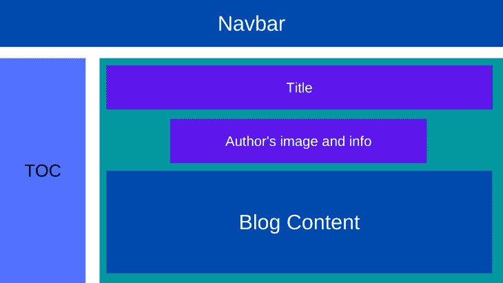
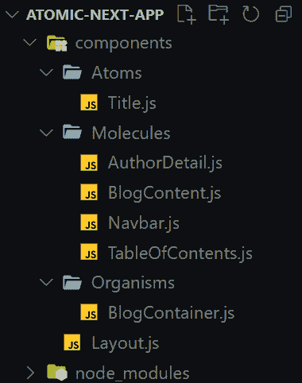
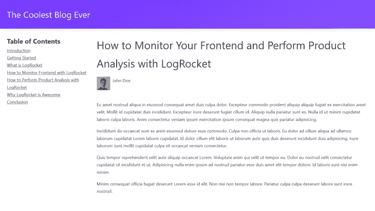

# 将原子设计应用于您的 Next.js 项目

> 原文：<https://blog.logrocket.com/applying-atomic-design-next-js-project/>

当开始一个新项目时，CSS 很容易编写。然而，随着项目规模的扩大，组件、样式表和代码行数的增加，CSS 变成了维护的噩梦。幸运的是，CSS 方法为编写模块化、可重用和可伸缩的代码创造了指导原则。

有一些流行的方法，包括原子设计、BEM、SMACSS 和 OOCSS。在本文中，我们将关注原子设计，学习其原理，并应用它们在一个 [Next.js](https://blog.logrocket.com/tag/nextjs/) 应用程序中创建一个基本的博客页面。

*向前跳转:*

## 先决条件

要跟随本教程，您需要了解 Next.js、CSS、SCSS 和[原子设计方法学](https://blog.logrocket.com/atomic-design-react-native/)。

## CSS 中的原子设计是什么？

原子设计是由布拉德·弗罗斯特创造的 CSS 方法论。它为创建可伸缩系统、可重用组件和设计系统提供了方向。原子设计的灵感来自化学，这就是为什么构建模块被称为原子、分子、有机体、模板和页面。

原子是最小的构建块，由 HTML 标签和 HTML 元素组成。原子的例子包括输入、按钮和标题。

类似于他们的化学灵感，原子设计的分子是原子的组合。例如，表单是一个分子，因为它结合了标签、输入和按钮元素。

当我们结合分子或原子时，我们得到有机体。有机体是分子和原子的组合，它们结合在一起形成相对复杂、不同的 UI 组件和界面部分。

继续化学主题，模板是由生物体组成的。它们是内容的结构，用于创建页面的布局、蓝图和线框。

最后，页面是最终产品。例如，在建筑领域，模板就是建筑的蓝图，而页面就是完成的建筑。

## 创建 Next.js 应用程序

现在，让我们构建 Next.js 应用程序。

首先，通过在终端中运行以下命令创建一个新的 Next.js 项目:

```
npx create-next-app atomic-next-app

```

接下来，我们导航到项目目录:

```
cd atomic-next-app

```

我们将使用 [Sass](https://sass-lang.com/install) 进行造型，所以安装如下:

```
npm install --save-dev sass

```

然后，运行命令启动应用程序:

```
npm run dev

```

## 在 Next.js 中使用原子设计

我们将创建一个带有导航栏、目录、博客内容和作者详细信息的基本博客页面。我们的标题将是我们创建的唯一原子，而导航栏、目录、作者详细信息和博客内容将是我们的分子。博客容器将由这些分子组成，并将成为我们的有机体。博客的结构应该是这样的:



项目的文件夹结构应该如下所示:



现在我们已经定义了原子、分子、有机体、模板和页面，让我们创建组件。您可以使用任何组件库、CSS 处理器或工具。对于本文，我们将使用 Sass 和 [CSS 模块](https://blog.logrocket.com/a-deep-dive-into-css-modules/)。

## 创建标题原子

我们将使用标题原子设置我们的博客页面标题。作为一个原子，它只会有一个`h1`元素。要创建标题，将一个`components/Title.js`文件添加到应用程序的根目录并粘贴以下代码:

```
import styles from "../../styles/title.module.scss";

export default function Title() {
  return (
    <h1 className={styles.blogTitle}>
      How to Monitor Your Frontend and Perform Product Analysis with LogRocket
    </h1>
  );
}

```

然后，对于样式，添加一个`title.module.scss`文件到`styles`文件夹，并输入以下样式:

```
.blogTitle {
  font-size: 2.5rem;
  font-weight: 500;
  margin-bottom: 1rem;
  display: inline-block;
}

```

## 设置 navbar 分子

navbar 分子由`nav`、一个`a` HTML 元素和 Next.js' `Link`组件组成。

创建一个`components/Navbar.js`文件并粘贴代码:

```
import styles from "../../styles/navbar.module.scss";
import Link from "next/link";

export default function Navbar() {
  return (
    <nav className={styles.navbarContainer}>
      <Link href="#">
        <a>The Coolest Blog Ever</a>
      </Link>
    </nav>
  );
}

```

要编辑样式，添加一个`navbar.module.scss`文件到`styles`并粘贴以下样式:

```
.navbarContainer {
  padding: 1.6rem;
  background-color: #8652ff;
  box-shadow: 0 4px 16px 0 rgba(41, 0, 135, 0.12);
  background-image: linear-gradient(150deg, rgba(99, 31, 255, 0.6), #8652ff);

  a {
    color: rgb(241, 235, 255);
    font-size: 2rem;
  }
}

```

## 在 Next.js 中构建目录分子

像 navbar 分子一样，这个分子由`nav`、`ul`、`a` HTML 元素和`Link`组件组成。

要设置它，创建一个`components/TableOfContents.js`文件并粘贴下面的代码:

```
import styles from "../../styles/tableOfContents.module.scss";
import Link from "next/link";

const TableofContentRoutes = [
  { label: "Introduction", href: "#" },
  { label: "Getting Started", href: "#" },
  { label: "What is LogRocket", href: "#" },
  { label: "How to Monitor Frontend with LogRocket", href: "#" },
  { label: "How to Perform Product Analysis with LogRocket", href: "#" },
  { label: "Why LogRocket is Awesome", href: "#" },
  { label: "Conclusion", href: "#" },
];

export default function TableOfContents() {
  return (
    <div className={styles.tableOfContentsContainer}>
      <h2>Table of Contents</h2>
      <nav>
        <ul>
          {TableofContentRoutes.map((route) => (
            <Link href={route.href} key={route.label}>
              <a>{route.label}</a>
            </Link>
          ))}
        </ul>
      </nav>
    </div>
  );
}

```

我们在上面的代码中用`label`和`href`创建了一个`TableofContentRoutes`数组。然后，我们绘制了`TableofContentRoutes`路线，并为每条路线绘制了一个链接。

现在，对于样式，添加一个`tableOfContents.module.scss`文件到`styles`并插入样式:

```
.tableOfContentsContainer {
  ul {
    display: flex;
    flex-direction: column;
    list-style: none;
    a {
      color: inherit;
      text-decoration: underline;
    }
  }

  @media (min-width: 768px) {
    width: 300px;
  }
}

```

## 添加作者的详细信息分子

作者的分子会包含作者的形象和名字。在本教程中，我们将命名我们的作者约翰多伊。我们将使用`Image`组件和一个`span`标签来设置它。

首先，将一个`Author.js`文件添加到 components 文件夹，并插入以下代码:

```
import styles from "../../styles/authorDetail.module.scss";
import Image from "next/image";

export default function AuthorDetail() {
  return (
    <div className={styles.authorDetailContainer}>
      <div className="img-box">
        <Image
          alt="Author's avatar"
          src="/author.jpg"
          width="50px"
          height="50px"
        />
      </div>
      <span>John Doe</span>
    </div>
  );
}

```

要编辑样式，将`authorDetail.module.scss`添加到`styles`并粘贴以下样式:

```
.authorDetailContainer {
  display: flex;
  gap: 0.5rem;
  margin-bottom: 2rem;

  .img-box {
    position: relative;
    border-radius: 50%;
  }
}

```

## 设计博客内容分子

接下来，我们将设置 blog content 分子来存放 blog 的文本，这是一组`p`标签。为此，将`BlogContent.js`添加到组件文件夹:

```
import styles from "../../styles/blogContent.module.scss";

export default function BlogContent() {
  return (
    <div className={styles.blogContentContainer}>
      <p>
        Eu amet nostrud aliqua in eiusmod consequat amet duis culpa dolor.
        Excepteur commodo proident aliquip aliquip fugiat ex exercitation amet
        velit. Mollit id cupidatat duis incididunt. Excepteur irure deserunt
        fugiat cillum id. Aliquip nulla pariatur sunt ex. Nulla id ut minim
        cupidatat laboris culpa laboris. Anim consectetur veniam ipsum
        exercitation ipsum consequat magna quis pariatur adipisicing.
      </p>
    </div>
  );
}

```

现在我们已经为我们的文本设置了分子，我们需要编辑样式。为此，向`styles`添加一个`blogContent.module.scss`文件，并包含以下代码:

```
.blogContentContainer {
  p {
    margin-bottom: 1rem;
    font-size: 1rem;
  }
}

```

## 构建博客容器

我们在上面的步骤中设置了我们博客页面的所有分子。为了创建博客容器有机体，我们将组合`Title`、`Author`和`BlogContent`组件。为此，添加一个`BlogContainer.js`文件到组件文件夹:

```
import Title from "../Atoms/Title";
import AuthorDetail from "../Molecules/AuthorDetail";
import BlogContent from "../Molecules/BlogContent";

export default function BlogContainer() {
  return (
    <div className="blog-container">
      <Title />
      <AuthorDetail />
      <BlogContent />
    </div>
  );
}

```

这里我们导入了`Title`、`AuthorDetail`、`BlogContent`并插入`BlogContainer`。正如您所看到的，这个组件不需要任何样式。现在，我们将构建布局模板！

## 使用原子设计创建布局模板

布局模板是我们定义页面上每个其他组件的位置的地方。要设置它，在 components 文件夹中创建一个`Layout.js`文件:

```
import styles from "../styles/layout.module.scss";
import Navbar from "../components/Molecules/Navbar";
import TableOfContents from "../components/Molecules/TableOfContents";
import BlogContainer from "../components/Organisms/BlogContainer";

export default function Layout() {
  return (
    <div className={styles.layoutContainer}>
      <header>
        <Navbar />
      </header>
      <main>
        <aside>
          <TableOfContents />
        </aside>
        <article>
          <BlogContainer />
        </article>
      </main>
    </div>
  );
}

```

这里，我们导入了`Navbar`、`TableOfContents`和`BlogContainer`组件，并将它们插入到`Layout`组件中。

接下来，对于样式，添加一个`layout.module.scss`到`styles`并粘贴下面的样式:

```
.layoutContainer {
  main {
    display: flex;
    flex-direction: column;
    gap: 2rem;
    padding: 1.6rem;

    @media (min-width: 768px) {
      flex-direction: row;
      justify-content: space-between;
    }
  }
}

```

## 最终确定 Next.js 博客项目

最后，我们将把`Layout`放入`index.js`文件来创建页面。

```
import Head from "next/head";
import Layout from "../components/Layout";

export default function Home() {
  return (
    <div>
      <Head>
        <title>The Coolest Blog Ever</title>
      </Head>
      <Layout />
    </div>
  );
}

```

这样，我们成功地应用了原子设计的原则，在 Next.js 中创建了一个博客。



## 结论

在本文中，我们应用了原子设计的原则来创建 Next.js 博客的 UI。通过将网页分成独立的组件，原子设计防止了重复，并促进了一致性和可伸缩性。

虽然我们在本文中将原子设计应用于一个 web 开发项目，但是它的原理也可以为 UI/UX 设计创建设计系统。

## [LogRocket](https://lp.logrocket.com/blg/nextjs-signup) :全面了解生产 Next.js 应用

调试下一个应用程序可能会很困难，尤其是当用户遇到难以重现的问题时。如果您对监视和跟踪状态、自动显示 JavaScript 错误、跟踪缓慢的网络请求和组件加载时间感兴趣，

[try LogRocket](https://lp.logrocket.com/blg/nextjs-signup)

.

[](https://lp.logrocket.com/blg/nextjs-signup)[](https://lp.logrocket.com/blg/nextjs-signup)

LogRocket 就像是网络和移动应用的 DVR，记录下你的 Next.js 应用上发生的一切。您可以汇总并报告问题发生时应用程序的状态，而不是猜测问题发生的原因。LogRocket 还可以监控应用程序的性能，报告客户端 CPU 负载、客户端内存使用等指标。

LogRocket Redux 中间件包为您的用户会话增加了一层额外的可见性。LogRocket 记录 Redux 存储中的所有操作和状态。

让您调试 Next.js 应用的方式现代化— [开始免费监控](https://lp.logrocket.com/blg/nextjs-signup)。