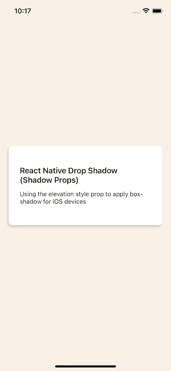
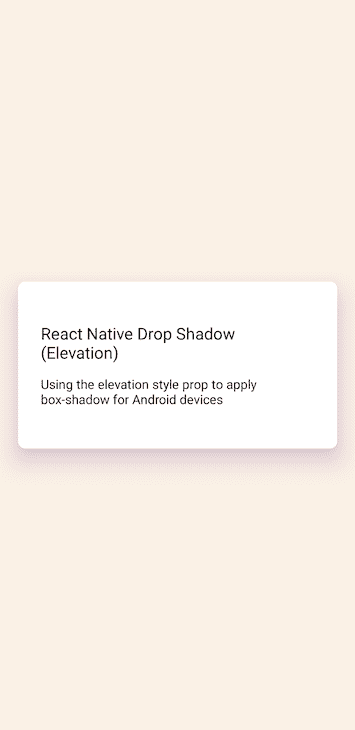
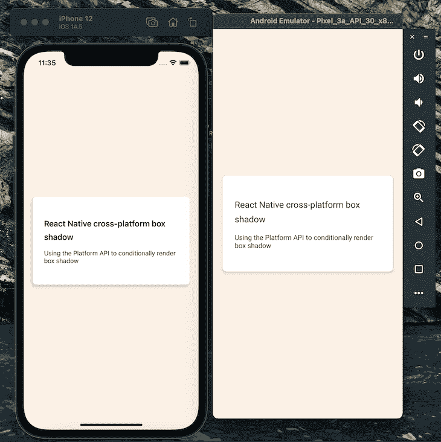
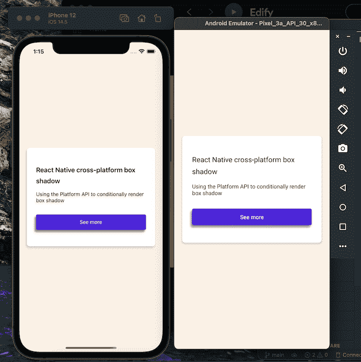

# 在 React Native 中应用框阴影

> 原文：<https://blog.logrocket.com/applying-box-shadows-in-react-native/>

在 React 原生应用中应用框阴影并不总是简单明了的。因为开发人员必须同时为 Android 和 iOS 平台构建，所以使用不同平台特定的实现过程来应用一致的框阴影可能会很繁琐。

在本文中，我们将学习如何在跨 Android 和 iOS 平台的 React 原生应用程序中实现框阴影。

## 对 iOS 框阴影使用 React 原生阴影道具

要为 iOS 设备创建阴影盒，我们可以使用[四个 React 原生阴影道具](https://facebook.github.io/react-native/docs/shadow-props)。

第一个是`shadowColor`，它决定了盒子阴影的颜色。注意，这是唯一适用于 Android 设备的影子道具。

第二个属性`shadowOffset`接受包含带有数值的宽度和高度属性的对象:

```
{ width: number; height: number}

```

因为它是由相对于应用框阴影的元素的 X 和 Y 偏移量来描述的，所以`width`属性确定阴影的 X 偏移量，而`height`属性确定 Y 偏移量。

宽度和高度属性都可以接受正值和负值。

第三个道具是`shadowOpacity`，设置盒子阴影的透明度。道具的值从`0`到`1`，其中`0`代表完全透明，`1`代表完全不透明。

第四个道具是`shadowRadius`，它接受一个数字作为它的值来设置组件的模糊半径。值越大，模糊越大，标志着阴影越大越亮。此属性不接受负值。

让我们通过应用一个盒子阴影到一个卡片组件来使用这些道具，如下:

```
// wherever your return statement is   
  <View style={[styles.card, styles.shadowProp]}>
        <View>
          <Text style={styles.heading}>
            React Native Box Shadow (Shadow Props)
          </Text>
        </View>
        <Text>
          Using the elevation style prop to apply box-shadow for iOS devices
        </Text>
      </View>

```

接下来，导入`StyleSheet`以将多种样式应用于卡片组件:

```
// remember to import StyleSheet from react-native
const styles = StyleSheet.create({
  heading: {
    fontSize: 18,
    fontWeight: '600',
    marginBottom: 13,
  },
  card: {
    backgroundColor: 'white',
    borderRadius: 8,
    paddingVertical: 45,
    paddingHorizontal: 25,
    width: '100%',
    marginVertical: 10,
  },
  shadowProp: {
    shadowColor: '#171717',
    shadowOffset: {width: -2, height: 4},
    shadowOpacity: 0.2,
    shadowRadius: 3,
  },
});

```

添加代码后，应用程序会呈现一张带有方框阴影的卡片。



## 为 Android 添加`styles.elevation`道具

在 Android 中添加框阴影，我们可以使用 [elevation prop，它使用了](https://reactnative.dev/docs/view-style-props#elevation-android)[Android Elevation API](https://developer.android.com/training/material/shadows-clipping.html#Elevation)[。](https://reactnative.dev/docs/view-style-props#elevation-android)

为了学习如何使用这种方法的方框阴影，让我们应用一个方框阴影到一个卡组件。请注意，`styles.elevation` prop 仅在应用于`<View>`组件时有效:

```
// wherever your return statement is
<View style={[styles.card, styles.elevation]}>
        <View>
          <Text style={styles.heading}>
            React Native Box Shadow (Elevation)
          </Text>
        </View>
        <Text>
          Using the elevation style prop to apply box-shadow for Android devices
        </Text>
</View>

```

接下来，再次导入`StyleSheet`来设计卡片:

```
// remember to import StyleSheet from react-native
const styles = StyleSheet.create({
  heading: {
    fontSize: 18,
    fontWeight: '600',
    marginBottom: 13,
  },
  card: {
    backgroundColor: 'white',
    borderRadius: 8,
    paddingVertical: 45,
    paddingHorizontal: 25,
    width: '100%',
    marginVertical: 10,
  },
  elevation: {
    elevation: 20,
    shadowColor: '#52006A',
  },
});

```

通过用一个`shadowColor`将仰角设置为`20`，我们可以对我们的 Android 卡组件应用一个框阴影。



请注意，没有控制框阴影的模糊半径、不透明度和偏移；我们只能控制阴影的颜色。

## 反应原生跨平台框阴影

在这一节中，我们将结合仰角风格道具和阴影道具来实现 Android 和 iOS 设备的框阴影，而不是使用两个单独的过程。

使用 React Native 的[平台 API](https://reactnative.dev/docs/platform) ,让我们创建一个函数，稍后我们可以调用该函数根据用户的设备有条件地为我们的卡组件呈现一个框阴影。

我们将从设置卡片开始:

```
 <View style={[styles.card, styles.boxShadow]}>
        <View>
          <Text style={styles.heading}>
            React Native cross-platform box shadow
          </Text>
        </View>
        <Text>Using the Platform API to conditionally render box shadow</Text>
</View>

```

接下来，在我们的样式对象下，让我们创建`generateBoxShadowStyle`函数，它根据用户的操作系统应用框阴影:

```
const generateBoxShadowStyle = (
  xOffset,
  yOffset,
  shadowColorIos,
  shadowOpacity,
  shadowRadius,
  elevation,
  shadowColorAndroid,
) => {
  if (Platform.OS === 'ios') {
    styles.boxShadow = {
      shadowColor: shadowColorIos,
      shadowOffset: {width: xOffset, height: yOffset},
      shadowOpacity,
      shadowRadius,
    };
  } else if (Platform.OS === 'android') {
    styles.boxShadow = {
      elevation,
      shadowColor: shadowColorAndroid,
    };
  }
};

```

使用我们刚刚实现的代码，我们的应用程序现在可以检查用户的设备平台，并应用适当的盒子阴影道具。

现在让我们调用`generateBoxShadowStyle`函数，并将阴影和仰角属性的值作为参数传入:

```
generateBoxShadowStyle(-2, 4, '#171717', 0.2, 3, 4, '#171717');

```

然后，它向两个平台呈现以下内容:



为了简化我们的工作流程，使用[React 原生阴影生成器工具来生成盒子阴影的代码，并在 Android 和 iOS 上查看盒子阴影的预览](https://ethercreative.github.io/react-native-shadow-generator/)。

### 跨平台框阴影限制

虽然我们应用了标准的盒子阴影，但有时我们可能需要完全控制盒子阴影的偏移、不透明度和模糊半径。这可以包括:

*   对带有自定义样式的`[<FlatList>](https://reactnative.dev/docs/flatlist)`或`[<Pressable>](https://reactnative.dev/docs/pressable)`组件应用方框阴影
*   添加在 Andriod 和 iOS 平台上一致的自定义框阴影设计

对于当前的实现，这种设计灵活性是不可能的。然而，我们可以用`[react-native-drop-shadow](https://www.npmjs.com/package/react-native-drop-shadow)`来克服这些限制。

## 用`react-native-drop-shadow`应用方框阴影

`react-native-drop-shadow`包是一个`View`组件，它获取其嵌套组件，创建位图表示，然后根据样式的阴影值对其进行模糊和着色，类似于在 iOS 中使用阴影道具应用阴影。

首先，使用以下命令之一安装`react-native-drop-shadow`包:

```
yarn add react-native-drop-shadow
#or
npm i react-native-drop-shadow

```

安装完成后，重新同步 Android Gradle build toolkit 或重启开发服务器。

接下来，我们可以导入包:

```
import DropShadow from "react-native-drop-shadow";

```

现在，让我们使用`<Pressable>`组件创建一个定制按钮，并用我们刚刚导入的`DropShadow`组件包装它。

下面截图中按钮上的方框阴影就是我们要创建的。请注意 Android 和 iOS 平台的一致性:


`DropShadow`组件是我们的`<Pressable>`组件的父组件，我们把它设计成按钮的样子。我们希望它按照这个顺序，因为我们希望对按钮应用投影，而不是按钮中的文本:

```
// wherever your return statement is
// Don't forget to import the Pressable component from react-native
<DropShadow style={styles.shadowProp}>
          <Pressable
            style={styles.button}
            onPress={() => console.log('pressed')}>
            <Text style={(styles.text, styles.buttonText)}>See more</Text>
          </Pressable>
</DropShadow>

```

为了使我们的`<Pressable>`组件看起来像一个按钮，并为`DropShadow`组件添加阴影，添加以下样式表:

```
const styles = StyleSheet.create({
shadowProp: {
    shadowColor: '#171717',
    shadowOffset: {width: 0, height: 3},
    shadowOpacity: 0.4,
    shadowRadius: 2,
  },
  button: {
    backgroundColor: '#4830D3',
    alignItems: 'center',
    justifyContent: 'center',
    height: 42,
    borderRadius: 4,
    marginTop: 30,
  },
  buttonText: {
    color: '#fff',
  },
  text: {
    fontSize: 16,
    lineHeight: 21,
    fontWeight: 'bold',
    letterSpacing: 0.25,
  },
});

```

## 使用`react-native-shadow-2`

`[react-native-shadow-2](https://github.com/SrBrahma/react-native-shadow-2)`包是`[react-native-shadow](https://github.com/879479119/react-native-shadow)`的改进版本，提供了更多的功能、类型脚本支持，并从头开始编写，以减少影响性能的依赖性。

与使用`react-native-drop-shadow`实现投影(创建其子组件的位图表示)不同，`react-native-shadow-2`使用 [react-native-svg](https://blog.logrocket.com/the-top-8-react-native-chart-libraries-for-2021/#react-native-svg) shadow 插件在 Android 和 iOS 平台上实现一致。

首先，将这两个包安装在项目根目录下:

```
yarn add react-native-svg react-native-shadow-2
#or 
npm i react-native-svg react-native-shadow-2

```

为了确保在 iOS 上运行，将 CD 放入`ios`目录并运行`pod install`来同步我们刚刚安装的包:

```
// import the package right at the top
import {Shadow} from 'react-native-shadow-2';

// wherever your return statement is
<Shadow
        distance={5}
        startColor={'#00000010'}
        containerViewStyle={{marginVertical: 20}}
        radius={8}>
        <View style={[styles.card, {marginVertical: 0}]}>
          <View>
            <Text style={styles.heading}>
              React Native cross-platform box shadow
            </Text>
          </View>
          <Text style={styles.boxShadow}>
            Using the Platform API to conditionally render box shadow
          </Text>
          <DropShadow style={styles.shadowProp}>
            <Pressable
              style={styles.button}
              onPress={() => console.log('pressed')}>
              <Text style={(styles.text, styles.buttonText)}>See more</Text>
            </Pressable>
          </DropShadow>
        </View>
      </Shadow>

```

该代码产生以下内容:



## 结论

React Native 中阴影道具的主要问题是它们不能在 Android 应用程序中使用。

然而，通过使用`react-native-drop-shadow`和`react-native-shadow-2`，我们可以轻松地在 Android 和 iOS 平台的 React 原生应用中实现一致的框阴影。

本教程中使用的完整代码可在 [GitHub](https://github.com/ejirocodes/React-Native-Box-Shadow) 上获得。请随意发表评论，让我知道你对这篇文章的看法。你也可以在[推特](https://twitter.com/ejirocodes)和 [GitHub](https://github.com/ejirocodes) 上找到我。感谢您的阅读！

## [LogRocket](https://lp.logrocket.com/blg/react-native-signup) :即时重现 React 原生应用中的问题。

[](https://lp.logrocket.com/blg/react-native-signup)

[LogRocket](https://lp.logrocket.com/blg/react-native-signup) 是一款 React 原生监控解决方案，可帮助您即时重现问题、确定 bug 的优先级并了解 React 原生应用的性能。

LogRocket 还可以向你展示用户是如何与你的应用程序互动的，从而帮助你提高转化率和产品使用率。LogRocket 的产品分析功能揭示了用户不完成特定流程或不采用新功能的原因。

开始主动监控您的 React 原生应用— [免费试用 LogRocket】。](https://lp.logrocket.com/blg/react-native-signup)