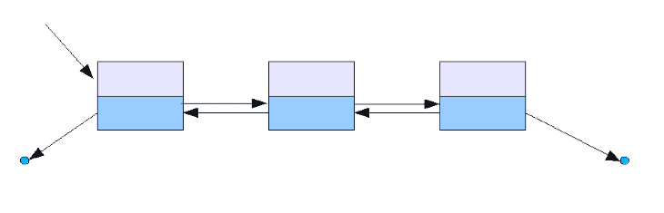

# Kotlin 数据结构的 ArrayList 与 LinkedList

> 原文：<https://blog.logrocket.com/arraylist-vs-linkedlist-kotlin-data-structure/>

Kotlin 提供了几个数据收集实现。此外，由于它与 JVM 的互操作性，您可以在众多的 [Java 集合](https://docs.oracle.com/en/java/javase/16/docs/api/java.base/java/util/Collections.html)中选择。当涉及到性能和资源使用时，采用正确的数据收集会带来很大的不同。

这就是为什么您应该知道您正在使用的编程语言所提供的每个最流行的数据集合的特征。详细地说，`ArrayList`和`LinkedList`代表了最广泛采用的两种 JVM 数据收集结构。

在这里，您将了解它们是如何在 Kotlin 中实现的，它们是如何工作的，以及它们提供了哪些性能优势。特别是，到本文结束时，您将能够很容易地判断何时以及为什么采用`ArrayList`比采用`LinkedList`更好，或者反之亦然。

让我们来挖掘一下科特林的`ArrayList`和`LinkedList`！

*TL；博士:* *在这篇文章中，你将找到你需要知道的关于* `ArrayList` *和* `LinkedList` *的一切，学习如何在两者之间选择正确的数据收集结构。*

## Kotlin 中的 an `ArrayList`是什么？

在 Kotlin 中，`[ArrayList](https://kotlinlang.org/api/latest/jvm/stdlib/kotlin.collections/-array-list/)`提供了一个使用数组作为后备存储的`[MutableList](https://kotlinlang.org/api/latest/jvm/stdlib/kotlin.collections/-mutable-list/index.html#kotlin.collections.MutableList)`实现。具体来说，当一个元素被添加到一个`ArrayList`时，它被插入到数组中。幕后发生的是创建一个新的更大的数组，并替换被删除的旧数组。换句话说，`ArrayList`允许您创建一个大小可以递增或递减的动态数组。

`ArrayList`是一个非同步数据集合，这意味着它不是线程安全的。另外，`ArrayList`可以包含重复的元素，并提供读写功能。注意，您可以通过一个[泛型](https://blog.logrocket.com/understanding-kotlin-generics/)来指定列表可以包含的元素类型。

具体来说，`ArrayList`类提供的最重要的方法和属性是:

*   `[add()](https://kotlinlang.org/api/latest/jvm/stdlib/kotlin.collections/-array-list/add.html)`:向列表中添加一个新元素

    ```
    // initializing an empty ArrayList var list = ArrayList<Int>() // adding 1 to the list list.add(1) // adding 2 to the list list.add(2) println(list) // [1, 2]  // adding 3 in position 1 list.add(1, 3) println(list) // [1, 3, 2]
    ```

*   `[addAll()](https://kotlinlang.org/api/latest/jvm/stdlib/kotlin.collections/-array-list/add-all.html)`:将指定集合的所有元素添加到当前列表

    ```
    var list = ArrayList<Int>() // adding 1, 2, 3 to the list list.addAll(listOf(1, 2, 3)) println(list) // [1, 2, 3]
    ```

*   `[get()](https://kotlinlang.org/api/latest/jvm/stdlib/kotlin.collections/-array-list/get.html)`:返回指定索引处的元素或一个`[IndexOutOfBoundsException](https://kotlinlang.org/api/latest/jvm/stdlib/kotlin/-index-out-of-bounds-exception/)`

    ```
    var list = ArrayList<Int>() list.addAll(listOf(1, 2, 3)) // getting the element of index 1 println(list.get(1)) // 2
    ```

*   `[set()](https://kotlinlang.org/api/latest/jvm/stdlib/kotlin.collections/-array-list/set.html)`:用列表

    ```
    var list = ArrayList<Int>() list.addAll(listOf(1, 2, 3)) // setting 4 in position 1 list.set(1, 4) println(list) // [1, 4, 3]
    ```

    中作为参数传递的元素替换指定位置的元素
*   `[indexOf()](https://kotlinlang.org/api/latest/jvm/stdlib/kotlin.collections/-array-list/index-of.html)`:返回列表中指定元素第一次出现的索引，如果元素不存在则返回`-1`

    ```
    var list = ArrayList<Int>() list.addAll(listOf(1, 2, 3)) println(list.indexOf(1)) // 0 println(list.indexOf(4)) // -1
    ```

*   `[remove()](https://kotlinlang.org/api/latest/jvm/stdlib/kotlin.collections/-array-list/remove.html)`:删除列表中第一个出现的特定元素

    ```
    var list = ArrayList<Int>() list.addAll(listOf(1, 2, 3)) // removing the element 2 from the list list.remove(2) println(list) // [1, 3]
    ```

*   `[removeAt()](https://kotlinlang.org/api/latest/jvm/stdlib/kotlin.collections/-array-list/remove-at.html)`:删除列表中指定索引处的元素

    ```
    var list = ArrayList<Int>() list.addAll(listOf(1, 2, 3)) // removing the element of index 0 from the list list.removeAt(0) println(list) // [2, 3]
    ```

*   `[clear()](https://kotlinlang.org/api/latest/jvm/stdlib/kotlin.collections/-array-list/clear.html)`:删除列表中的所有元素

    ```
    var list = ArrayList<Int>() list.addAll(listOf(1, 2, 3)) // clearing the list list.clear() println(list) // []
    ```

*   `[size](https://kotlinlang.org/api/latest/jvm/stdlib/kotlin.collections/-array-list/size.html)`:返回列表的大小

    ```
    var list = ArrayList<Int>() // adding 1, 2, 3 to the list list.addAll(listOf(1, 2, 3)) println(list.size) // 3
    ```

此外，您可以通过将元素集合传递给构造函数来初始化`ArrayList`:

```
// initializing an ArrayList with the [1, 2, 3] list
val list2 = ArrayList<Int>(listOf(1,2,3))
println(list2)

```

这段代码将打印出来:

```
[1, 2, 3]

```

否则，您可以编写`[arrayListOf()](https://kotlinlang.org/api/latest/jvm/stdlib/kotlin.collections/array-list-of.html)` Kotlin 函数，从给定的元素列表中直接获得一个新的`ArrayList`:

```
// getting an ArrayList from the [1, 2, 3] list
val list = arrayListOf(1, 2, 3)
// printing the Class name of list
println(list::class.simpleName) 
println(list)

```

这将返回:

```
ArrayList
[1, 2, 3]

```

注意，在这种情况下，您不必显式指定`ArrayList`的泛型类型。这将从在`arrayListOf()`中作为参数传递的元素类型中自动推断出来。

## 什么是`LinkedList`？

Kotlin 没有提供`LinkedList`实现。然而，由于 Kotlin JVM 与 Java 的互操作性，您仍然可以使用`LinkedList`。这是因为`LinkedList`是一个数据集合，是 JVM 实现的一部分。那么，我们来了解一下什么是`[LinkedList](https://docs.oracle.com/en/java/javase/16/docs/api/java.base/java/util/LinkedList.html)`。

在 Java 中，`LinkedList`提供了一个基于指针的非同步数据收集结构。A `LinkedList`不使用数组作为后备存储器。这意味着它的所有元素都不是存储在一个连续的位置。具体来说，`LinkedList`是一个双向链表，它的元素由一对指针链接，如下所示:



双向链表[源](https://it.m.wikipedia.org/wiki/File:Doubly_linked_list.png)

详细来说，一个`LinkedList`将其元素存储在节点中。每个节点都有一个指向列表中前一个节点的指针和一个指向下一个节点的指针。要向列表中添加一个元素，需要将该元素放入一个新节点中，然后将该节点链接到列表中的两个相邻元素。您可以通过泛型来声明节点元素的类型。

`LinkedList`类具有与`ArrayList`类相同的方法，因为它们都实现了`List`接口。然而，`LinkedList`类也实现了`[Deque](https://docs.oracle.com/en/java/javase/16/docs/api/java.base/java/util/Deque.html)`接口，它提供了以下方法:

*   `[getFirst()](https://docs.oracle.com/en/java/javase/16/docs/api/java.base/java/util/LinkedList.html#getFirst())`:返回列表开头的元素
*   `[getLast()](https://docs.oracle.com/en/java/javase/16/docs/api/java.base/java/util/LinkedList.html#getLast())`:返回列表末尾的元素
*   `[addFirst()](https://docs.oracle.com/en/java/javase/16/docs/api/java.base/java/util/LinkedList.html#getLast())`:在列表的开头添加一个元素
*   `[addLast()](https://docs.oracle.com/en/java/javase/16/docs/api/java.base/java/util/LinkedList.html#addLast(E))`:在列表末尾添加一个元素
*   `[removeFirst()](https://docs.oracle.com/en/java/javase/16/docs/api/java.base/java/util/LinkedList.html#removeFirst())`:删除列表开头的元素
*   `[removeLast()](https://docs.oracle.com/en/java/javase/16/docs/api/java.base/java/util/LinkedList.html#removeLast())`:删除列表末尾的元素

## 为什么 Kotlin 不提供一个`LinkedList`实现

看起来 Kotlin 开发者[决定不实现](https://discuss.kotlinlang.org/t/why-kotlin-does-not-provide-linkedlist-implementation/15991) `[LinkedList](https://discuss.kotlinlang.org/t/why-kotlin-does-not-provide-linkedlist-implementation/15991)`是因为`LinkedList`的 Java 实现在几乎所有情况下都是次优的。此外，考虑到最初只有 Kotlin JVM，Kotlin 开发人员更喜欢依赖 Java 实现。

另外，正如您将要了解的，几乎在所有情况下，`LinkedList`都比 ArrayList 表现得更好。因此，他们可能认为没有真正需要 Kotlin 实现`LinkedList`。

## 何时使用`ArrayList`而不是`LinkedList`

`ArrayList`是更高效的随机读取访问解决方案。这是因为你可以在恒定时间内抓取任何元素。这是因为幕后有一个数组。因此，`get()`方法只需返回由作为参数传递的索引指定的元素。相反，`LinkedList`只提供顺序访问，在性能方面更昂贵。

另外，`ArrayList`数据结构不涉及开销。相反，一个`LinkedList`为每个元素定义了两个指针。所以一个`LinkedList`会比一个`ArrayList`占用更多的元素。在处理大型列表时，这很容易成为一个问题。

另外，考虑到一个`ArrayList`是基于一个数组的，元素被顺序存储在内存中。所以，`ArrayList` s 也可以利用[的局部性原则](https://en.wikipedia.org/wiki/Locality_of_reference)。这使得`ArrayList`比`LinkedList`更适合缓存，后者的元素分散在整个 RAM 中。

因此，使用`ArrayList` s，当附近的元素在短时间内被访问时，您可以体验到额外的性能提升。

详细来说，对于一个`ArrayList<E>`:

*   `get(index : Int)`是`O(1)`
*   `add(element : E)`是`O(1)` [摊销](https://en.wikipedia.org/wiki/Amortized_analysis)，但`O(n)`时底层数组不得不调整大小
*   `add(index: Int, element : E)`是`O(n)`
*   `remove(index : Int)`是`O(n)`
*   `remove()`上对应的`[MutableListIterator](https://kotlinlang.org/api/latest/jvm/stdlib/kotlin.collections/-mutable-list-iterator/)`对象是`O(n)`
*   `add(element : E)`上对应的`MutableListIterator`对象是`O(n)`

注意`get()`方法上的`O(1)`复杂性。这就是`ArrayList`相对于`LinkedList`的主要好处。另外，不要忘记您可以通过调用`[listIterator()](https://kotlinlang.org/api/latest/jvm/stdlib/kotlin.collections/-array-list/list-iterator.html)`方法从`ArrayList`中获得`MutableListIterator`对象。

## 何时使用`LinkedList`而不是`ArrayList`

在列表的开头或结尾插入元素时，允许固定时间的插入或删除。当当前节点已知时也是如此。换句话说，当使用带有[迭代器](https://kotlinlang.org/docs/iterators.html)的`LinkedList`时，可以在`O(1)`中插入一个元素。这是`LinkedList`相对于`ArrayList`的主要好处。

此外，当使用`LinkedList`时，您可以无限期地插入元素。另一方面，`ArrayList`使用的数组最终需要调整大小。这是一个昂贵的手术，在`LinkedList`可以避免。另外，考虑到此操作可能不会在每次对`ArrayList`执行写操作时都执行，底层数组可能会浪费地变空。在这个特定的场景中，`ArrayList`可能比`LinkedList`拥有更多的分配内存。

在所有其他场景中，`LinkedList`差于或等于`ArrayList`。确切地说，是为了一个`LinkedList<E>`

*   `get(index : Int)`是`O(n)`
*   `getFirst()`和`getLast()`是`O(1)`
*   `add(index : Int, element : E)`是`O(n)`
*   `addFirst(element : E)`和`addLast(element : E)`是`O(1)`
*   `remove(index : Int)`是`O(n)`
*   `removeFirst()`和`removeLast()`是`O(n)`
*   `remove()`上对应的`[ListIterator](https://docs.oracle.com/en/java/javase/16/docs/api/java.base/java/util/ListIterator.html)`对象是`O(1)`
*   `add(element : E)`上对应的`ListIterator`对象是`O(1)`

就像对`ArrayList`一样，你可以通过调用`[iteratorList()](https://docs.oracle.com/en/java/javase/16/docs/api/java.base/java/util/LinkedList.html#listIterator(int))`方法得到一个`ListIterator`对象。

## 结论

在本文中，您了解了 Kotlin 中`ArrayList`和`LinkedList`的主要区别。如图所示，Kotlin 提供了一个内置的`ArrayList`实现，而它依赖于 Java `LinkedList`实现。

尽管它们提供了相似的功能，但通常情况下，`ArrayList`比`LinkedList`更受青睐。Kotlin 开发人员倾向于选择`ArrayList`有几个原因，在这里您了解了为什么会发生这种情况。

具体来说，您已经了解了什么是`ArrayList`和`LinkedList`，并深入研究了在不同的最坏情况下，这两种数据收集结构在性能和内存使用方面的表现。

感谢阅读！我希望这篇文章对你有所帮助。如果有任何问题、意见或建议，请随时联系我。

## LogRocket :即时重现你的安卓应用中的问题。

[](https://lp.logrocket.com/blg/kotlin-signup)

[LogRocket](https://lp.logrocket.com/blg/kotlin-signup) 是一款 Android 监控解决方案，可以帮助您即时重现问题，确定 bug 的优先级，并了解您的 Android 应用程序的性能。

LogRocket 还可以向你展示用户是如何与你的应用程序互动的，从而帮助你提高转化率和产品使用率。LogRocket 的产品分析功能揭示了用户不完成特定流程或不采用新功能的原因。

开始主动监控您的 Android 应用程序— [免费试用 LogRocket】。](hhttps://lp.logrocket.com/blg/kotlin-signup)