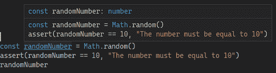
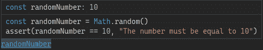

# TypeScript 中的断言函数

> 原文：<https://blog.logrocket.com/assertion-functions-typescript/>

TypeScript 中的断言函数是一种非常有表现力的函数类型，其签名声明如果函数本身返回，则验证给定的条件。

在其基本形式中，一个典型的`assert`函数只是检查一个给定的谓词，如果这个谓词为假，就抛出一个错误。例如，如果谓词为假，Node.js 的 assert 将抛出一个`AssertionError`。

自 3.7 版以来，TypeScript 通过在类型系统级别实现对断言的支持，已经超越了这一点。

在本文中，我们将探索 TypeScript 中的断言函数，并了解如何使用它们来表达变量的不变量。

## 目录

## 类似 JavaScript 的断言

Node.js 带有一个预定义的 assert 函数。正如我们在引言中提到的，如果给定的谓词为假，它会抛出一个`AssertionError`:

```
const aValue = 10
assert(aValue === 20)
```

在 JavaScript 中，这有助于防止函数中出现不正确的类型:

```
function sumNumbers(x, y) {
  assert(typeof x === "number");
  assert(typeof y === "number");
  return x + y;
}
```

不幸的是，代码流分析没有考虑这些断言。事实上，它们只是在运行时被评估，然后就被遗忘了。

通过断言函数，TypeScript 的代码流分析将能够使用函数的类型(简而言之，它的签名)来推断我们代码的一些属性。我们可以使用这个新特性在整个代码中保证我们的类型。

## 类似类型脚本的断言

断言函数在其签名中指定了要评估的类型谓词。例如，下面的函数确保给定值是一个`string`:

```
function isString(value: unknown): asserts value is string {
  if (typeof value !== "string") throw new Error("Not a string")
}
```

如果我们用一个给定的参数调用上面的函数，并且它正确地返回，TypeScript 知道值的类型是`string`。因此，它会将其类型缩小到`string`:

```
const aValue: string|number = "Hello"
isString(aValue)
// The type of aValue is narrowed to string here
```

当然，没有什么能阻止我们弄乱这个断言。例如，我们可以编写如下(错误的)函数:

```
function isString(value: unknown): asserts value is string {
  if (typeof value !== "number") throw new Error("Not a string")
}

```

注意，我们现在正在检查`value's`类型是否不是`number`，而不是`string`。在这种情况下，TypeScript 的代码流分析将看到类型为`never`的`Value`，而不是上面的`string`。

断言函数对于[枚举](https://blog.logrocket.com/writing-readable-code-with-typescript-enums-a84864f340e9/)非常有用:

```
type AccessLevel = "r" | "w" | "rw"

const writeOnly = "w"

function allowsReadAccess(level: AccessLevel): asserts level is "r" | "rw" {
    if (!level.includes("r")) throw new Error("Read not allowed")
}

allowsReadAccess(writeOnly)
```

在上面的例子中，我们首先定义了一个类型，它的值只能是`"r"`、`"w"`或`"rw"`。让我们假设这种类型简单地定义了对给定资源的三种访问类型。然后，我们声明一个断言函数，如果它的实际参数不允许读操作，就抛出。

如您所见，我们正在明确地缩小类型，声明如果函数返回，值必须是`"r"`或`"rw"`。如果我们用`writeOnly`作为实际参数调用`allowsReadAccess`，我们将得到一个预期的错误，表明`"Read access is not allowed"`。

断言函数的另一个常见用途是表达不可空性。下面的代码片段展示了一种确保值被定义的方法，即它既不是`null`也不是`undefined`:

```
function assertIsDefined<T>(value: T): asserts value is NonNullable<T> {
  if (value === undefined || value === null) {
    throw new Error(`${value} is not defined`)
  }
}
```

其中`NonNullable<T>`是一个类型脚本类型，它从类型 t 的合法值中排除了`null`和`undefined`

### 函数声明和表达式

在撰写本文时，断言函数可能没有被定义为普通函数表达式。一般来说，函数表达式可以看作匿名函数；也就是说，没有名称的函数:

```
// Function declaration
function fun() { ... }

// Function expression
const fun = function() { ... }
```

函数声明的主要优点是提升，这使得可以在文件中定义函数的任何地方使用函数。另一方面，函数表达式只能在创建后使用。

实际上有一个解决方法，就是把断言函数写成函数表达式。我们将不得不将其签名定义为一个独立的类型，而不是定义函数及其实现:

```
// Wrong
// Error: A type predicate is only allowed in return type position for functions and methods.
// Error: Type '(value: any) => void' is not assignable to type 'void'.
const assertIsNumber: asserts value is number = (value) => {
  if (typeof value !== 'number') throw Error('Not a number')
}

// Correct
type AssertIsNumber = (value: unknown) => asserts value is number
const assertIsNumber: AssertIsNumber = (value) => {
  if (typeof value !== 'number') throw Error('Not a number')
}
```

### 断言函数和类型保护

TypeScript 中的断言函数有点类似于类型守卫。最初引入类型保护是为了执行运行时检查，以保证给定范围内的值的类型。

特别是，类型保护是一个简单评估类型谓词的函数，返回`true`或`false`。这与断言函数略有不同，正如我们在上面看到的，如果谓词没有被验证，断言函数应该抛出一个错误，而不是返回`false`。

```
function isString(value: unknown): value is string {
    return typeof value === "string"
}

// Type guards can also be declared as function expression
const isStringExp = (value: unknown): value is string =>
    typeof value === "string"
```

不过，还有一个很大的不同。断言函数也可以在没有类型谓词的情况下使用，我们将在下一节中看到。

### 没有类型谓词的断言函数

到目前为止，我们看到的断言函数都在检查给定值是否有给定的类型。因此，它们都是为目标类型量身定做的。尽管如此，断言函数给了我们更多的能力。特别是，我们可以编写一个完全通用的函数来断言一个条件，该条件将输入作为一个参数:

```
function assert(condition: unknown, msg?: string): asserts condition {
  if (condition === false) throw new Error(msg)
}
```

`assert`函数现在输入一个`condition`，它的类型是`unknown`，可能还有一个`message`。它的身体只是评估这样一个条件。如果是`false`，那么`assert`抛出一个错误，这是意料之中的。

但是，请注意，签名使用了`asserts`之后的`condition`参数。通过这种方式，我们告诉 TypeScript 代码流分析，如果函数正确返回，它可以假设我们传入的任何谓词实际上都经过了验证。

TypeScript 的 Playground 为我们提供了一个非常好的代码流分析的可视化表示。让我们考虑下面的代码片段，其中我们生成一个随机数，然后调用`assert`来确保生成的数字是`10`:

```
const randomNumber = Math.random()
assert(randomNumber == 10, "The number must be equal to 10")
randomNumber
```

如果我们在调用`assert`之前检查`randomValue`的推断属性，TypeScript 只是告诉我们类型(图 1)。



Figure 1\. TypeScript is only able to infer the type of randomNumber before the call to assert.

然后，只要我们调用条件为`randomNumber == 10`的`assert`，TypeScript 就知道在剩余的执行过程中该值将为`10`(图 2)。



Figure 2\. TypeScript now tells us that `randomNumber` is set to 10.

最后，如果我们试图检查`randomNumber`和另一个数字的相等性，TypeScript 将能够在甚至不运行程序的情况下评估该属性。例如，代码流分析将抱怨下面的赋值，说“这个条件将总是返回‘false’，因为类型‘10’和‘20’没有重叠。”：

```
const pred = (randomNumber === 20)
```

## 结论

在本文中，我们深入探讨了什么是 TypeScript 断言函数，以及如何使用它们让代码流分析推断出一组关于我们的值的属性。考虑到 TypeScript 被转换为 JavaScript，这是一个非常好的特性，给程序员带来了更多的灵活性。

特别是，我们看了一些用法，包括缩小类型范围和表示变量实际值的条件。最后，我们简要地提到了与类型保护的区别和相似之处，并掌握了断言函数的语法限制。

## [LogRocket](https://lp.logrocket.com/blg/typescript-signup) :全面了解您的网络和移动应用

[](https://lp.logrocket.com/blg/typescript-signup)

LogRocket 是一个前端应用程序监控解决方案，可以让您回放问题，就像问题发生在您自己的浏览器中一样。LogRocket 不需要猜测错误发生的原因，也不需要向用户询问截图和日志转储，而是让您重放会话以快速了解哪里出错了。它可以与任何应用程序完美配合，不管是什么框架，并且有插件可以记录来自 Redux、Vuex 和@ngrx/store 的额外上下文。

除了记录 Redux 操作和状态，LogRocket 还记录控制台日志、JavaScript 错误、堆栈跟踪、带有头+正文的网络请求/响应、浏览器元数据和自定义日志。它还使用 DOM 来记录页面上的 HTML 和 CSS，甚至为最复杂的单页面和移动应用程序重新创建像素级完美视频。

[Try it for free](https://lp.logrocket.com/blg/typescript-signup)

.