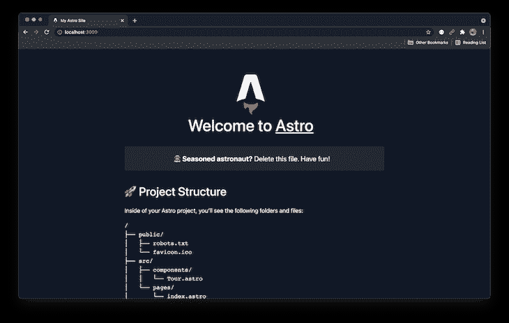
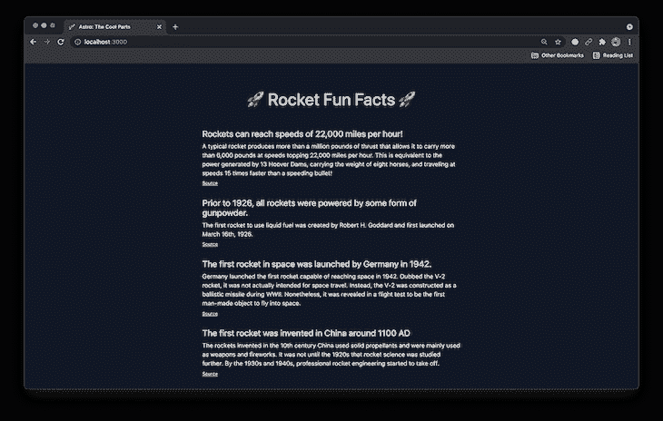

# Astro:用更少的 JavaScript 构建更快的应用程序

> 原文：<https://blog.logrocket.com/astro-build-faster-apps-less-javascript/>

Astro 是现场最新的[静态现场发生器](https://www.seancdavis.com/blog/wtf-is-ssg/)。而且，很酷！我对 Astro 感到兴奋，因为它如何看待自己作为一个框架的角色。它似乎有一个平衡的观点和能力。

Astro 没有提供非常强的观点(想想: [Next.js 的页面路由](https://blog.logrocket.com/prefetching-dynamic-routing-next-js/)， [Gatsby 的 GraphQL 层](https://blog.logrocket.com/tag/graphql/))，而是将许多流行的方法用于通用模式，并为开发人员提供了一个可以构建的基础。阿童木说，与其说“自己动手”，不如说“今天有一些常见的选择。选择一个(或多个)。”

你可以读到更多关于我为何如此兴奋的信息。另外，如果你还没看过 [Astro 的公告](https://astro.build/blog/introducing-astro)的话，也可以看看。这是该工具的一些很好的背景。

## 什么是阿童木？

Astro 是新出现的，但是已经有一些关于它的教程了。让我们不要让这个*成为另一个*吧。相反，让我们通过一个例子来探索让 Astro 如此令人兴奋的酷的部分。

我们将采用 Astro 项目的默认起点，并将它变成一个简单的单页网站，列出一些关于火箭的有趣事实！*为什么？*因为 Astro 和 LogRocket 搭配起来就像… *鳄梨和吐司？*

**警告！尚未做好生产准备**
你正处于太空之旅的最前沿——从技术上来说，它还没有做好生产准备。这可能还是一条出路，但它足够坚实，值得探索。如果你足够喜欢它，当然，生活在边缘，并把它投入生产。

## Astro 入门

先把这个东西安装好。为您的项目创建一个新目录，并导航到该目录:

```
mkdir astro-the-cool-parts
cd astro-the-cool-parts

```

然后你可以开始一个新的天文项目:

```
npm init astro

```

这将引导您回答几个问题。以下是我给出的答案:

*   `y`确认
*   `Starter Kit (Generic)`以此为起点
*   我的组件的`React`和`Svelte`

完成该步骤后，安装依赖项:

```
npm install

```

然后，您可以启动服务器:

```
npm start

```

现在，在您的网络浏览器中访问`localhost:3000`以显示默认起点。



Default Astro starting point.

## 创建静态构建

我建议探索这个项目的内容。它为展示 Astro 的能力提供了一个很好的基础。然而，在我们的例子中，我们将把其中的大部分去掉。

Astro 项目的页面在`src/pages`目录中。首页是`src/pages/index.astro`。我删除了大部分默认内容，代之以有趣的事实和一些支持的内联样式。[这是我的文件的样子](https://github.com/seancdavis/astro-the-cool-parts/blob/43e61450398aa40842607e84e09c16aa48aa1d00/src/pages/index.astro)。



Rocket fun facts, using styles from Astro’s default starter.

现在我们将构建项目并检查发生了什么。运行构建:

```
npm run build

```

输出文件在`dist`目录下的[。注意这里没有 JavaScript！](https://github.com/seancdavis/astro-the-cool-parts/tree/500a05d7c649a9872613a8db8b422e9040f1417b/dist)

## 向 Astro 添加组件

让我们添加一个组件来表示一个有趣的事实。在`src/components/FunFact.jsx`创建一个新文件，内容如下:

```
import styles from "./FunFact.module.css";

export default function FunFact({ children, heading, sourceUrl }) {
  return (
    <div className={styles.wrapper}>
      <h2 className={styles.heading}>{heading}</h2>
      <p className={styles.fact}>{children}</p>
      <p>
        <a href={sourceUrl}>Source</a>
      </p>
    </div>
  );
}

```

注意:这是一个反应组件。欢迎您使用不同的框架。根据需要更改语法、文件扩展名和导入。

注意，我们导入了一个尚不存在的样式文件(使用 [CSS 模块](https://blog.logrocket.com/a-deep-dive-into-css-modules/))。让我们现在在`src/components/FunFact.module.css`创建它，并加入这些样式:

```
.wrapper {
  margin-bottom: 2rem;
}

.heading {
  margin-bottom: 0.5rem;
  font-size: 1.4rem;
}

.fact {
  font-size: 1rem;
  line-height: 1.5;
  margin-bottom: 0.5rem;
}

.source {
  font-size: 0.75rem;
}

```

接下来，让我们重新排列`index.astro`来使用组件。

在文件的顶部，导入我们的新组件:

```
import FunFact from '../components/FunFact.jsx'
// ...

```

然后调整主体内容以使用`<FunFact />`组件:

```
<main>
  <FunFact
    heading="Rockets can reach speeds of 22,000 miles per hour!"
    sourceUrl="https://www.ulalaunch.com/explore/rocket-science/fun-facts">
      A typical rocket produces more than a million pounds of thrust that
      allows it to carry more than 6,000 pounds at speeds topping 22,000
      miles per hour. This is equivalent to the power generated by 13 Hoover
      Dams, carrying the weight of eight horses, and traveling at speeds 15
      times faster than a speeding bullet!
  </FunFact>

  <FunFact
    heading="Prior to 1926, all rockets were powered by some form of gunpowder."
    sourceUrl="https://www.factsjustforkids.com/technology-facts/rocket-facts-for-kids/">
      The first rocket to use liquid fuel was created by Robert H. Goddard
      and first launched on March 16th, 1926.
  </FunFact>

  <FunFact
    heading="The first rocket in space was launched by Germany in 1942."
    sourceUrl="https://facts.net/science/technology/rocket-facts/">
      Germany launched the first rocket capable of reaching space in 1942.
      Dubbed the V-2 rocket, it was not actually intended for space travel.
      Instead, the V-2 was constructed as a ballistic missile during WWII.
      Nonetheless, it was revealed in a flight test to be the first man-made
      object to fly into space.
  </FunFact>

  <FunFact
    heading="The first rocket was invented in China around 1100 AD"
    sourceUrl="https://facts.net/science/technology/rocket-facts/">
      The rockets invented in the 10th century China used solid propellants
      and were mainly used as weapons and fireworks. It was not until the
      1920s that rocket science was studied further. By the 1930s and 1940s,
      professional rocket engineering started to take off.
  </FunFact>
</main>

```

在这里你可以看到[我在这一步所做的所有改变](https://github.com/seancdavis/astro-the-cool-parts/commit/cd56042b7d5fe9c5dd4f80fcfa27b9c9713c61d6)。

当你的浏览器看起来不错时，再次运行构建(`npm run build`)并查看一下[`dist`目录](https://github.com/seancdavis/astro-the-cool-parts/tree/2b8f74231df7f438346c48e5828d4203623d4ebb/dist)。

注意[变化有多小](https://github.com/seancdavis/astro-the-cool-parts/commit/2b8f74231df7f438346c48e5828d4203623d4ebb)，更重要的是，仍然没有 JavaScript，尽管我们已经包含了一个 React 组件！

## 混合框架

举个简单的例子，假设另一个开发人员更喜欢 Svelte，那么他们将使用 Svelte 来构建标题。

使用主页中的以下代码在`src/components/Header.svelte`添加一个新组件:

```
<header>
  <div>
    <h1>🚀 Rocket Fun Facts 🚀</h1>
  </div>
</header>

<style>
  header {
    display: flex;
    flex-direction: column;
    gap: 1em;
    margin: 0 auto 3rem;
    max-width: min(100%, 68ch);
  }
</style>

```

现在，在`index.astro`中，您可以导入新的标题:

```
import Header from '../components/Header.svelte'

```

并在主页标记中使用它:

```
<head>
  <!-- ... -->

  <style>
    main {
      margin: 0 auto;
      max-width: 42rem;
    }
  </style>
</head>
<body>
  <Header />

  <!-- ... -->
</body>

```

快速提示:标题样式挂在`public/style/home.css`中，如果你将它用于生产，你可以(也应该)清理它。我将它们留在原处，因为这是一个概念的快速证明。

如果一切顺利，屏幕上的结果应该没有变化，因为您只做了一些重组。

[这里是我对](https://github.com/seancdavis/astro-the-cool-parts/commit/2f3a0a8ab9698bfc794b0e6b59c99048006c6f20)所做的改动，同样只导致了[微小的构建改动](https://github.com/seancdavis/astro-the-cool-parts/commit/f2081402601c40228dbccdbd106c8e60b58d9e16)，让[的`dist`目录变得干净整洁](https://github.com/seancdavis/astro-the-cool-parts/tree/f2081402601c40228dbccdbd106c8e60b58d9e16/dist)。

## 用 Astro 获取数据

我喜欢 Astro 在组件文件顶部获取数据的方式。它甚至支持[顶级`await`](https://docs.astro.build/guides/data-fetching#top-level-await) ，这有助于减少您必须编写的样板代码的数量。

我不想在这里做什么太花哨的东西，因为我们只是随便玩玩，所以我在`content/fun-facts.json`把所有内容放到一个 JSON 文件中。看起来是这样的:

```
[
  {
    "heading": "Rockets can reach speeds of 22,000 miles per hour!",
    "sourceUrl": "https://www.ulalaunch.com/explore/rocket-science/fun-facts",
    "body": "A typical rocket produces more than a million pounds of thrust that allows it to carry more than 6,000 pounds at speeds topping 22,000 miles per hour. This is equivalent to the power generated by 13 Hoover Dams, carrying the weight of eight horses, and traveling at speeds 15 times faster than a speeding bullet!"
  },

  {
    "heading": "Prior to 1926, all rockets were powered by some form of gunpowder.",
    "sourceUrl": "https://www.factsjustforkids.com/technology-facts/rocket-facts-for-kids/",
    "body": "The first rocket to use liquid fuel was created by Robert H. Goddard and first launched on March 16th, 1926."
  },

  {
    "heading": "The first rocket in space was launched by Germany in 1942.",
    "sourceUrl": "https://facts.net/science/technology/rocket-facts/",
    "body": "Germany launched the first rocket capable of reaching space in 1942\. Dubbed the V-2 rocket, it was not actually intended for space travel. Instead, the V-2 was constructed as a ballistic missile during WWII. Nonetheless, it was revealed in a flight test to be the first man-made object to fly into space."
  },

  {
    "heading": "The first rocket was invented in China around 1100 AD",
    "sourceUrl": "https://facts.net/science/technology/rocket-facts/",
    "body": "The rockets invented in the 10th century China used solid propellants and were mainly used as weapons and fireworks. It was not until the 1920s that rocket science was studied further. By the 1930s and 1940s, professional rocket engineering started to take off."
  }
]

```

然后我提交并推送代码，并使用[这个服务](https://raw.githack.com/)生成该文件的 URL。这将使我们感觉像是在从一个 API 获取数据。您可以遵循相同的过程，或者只使用我生成的 URL。

让我们从获取内容并将结果记录到控制台开始。调整`index.astro`文件顶部的代码:

```
const dataUrl = 'https://raw.githack.com/seancdavis/astro-the-cool-parts/77d3b5dd2ce2253c33d50fc91a21875f90a8ced5/content/fun-facts.json'
const response = await fetch(dataUrl);
const facts = await response.json();

console.log(facts);

```

现在，重新启动服务器。请注意，内容被记录到服务器中，而不是浏览器中。这是因为这段代码是在 Astro 构建过程中运行的，而不是在页面加载时运行的。

**在 Astro 中处理可迭代数据**
Astro 组件没有将逻辑嵌入标记部分。因此，我们将创建另一个组件来处理循环，而不是遍历从伪 API 返回的数据。

将组件添加到`src/components/FunFactList.jsx`，就像这样:

```
import FunFact from "./FunFact";

export default function FunFactList({ facts }) {
  return (
    <>
      {facts.map((fact, idx) => (
        <FunFact key={idx} heading={fact.heading} sourceUrl={fact.sourceUrl}>
          {fact.body}
        </FunFact>
      ))}
    </>
  );
}

```

请注意，这只是获取一个数据数组，遍历它，并生成单独的`<FunFact />`组件。

回到`index.astro`文件，将`import`改为使用`FunFactList`组件，而不是`FunFact`组件。

```
import FunFactList from '../components/FunFactList.jsx'

```

然后移除`console.log`并用单个`FunFactList`组件替换您现有的有趣事实:

```
<FunFactList facts={facts} />

```

[这里是组件变化](https://github.com/seancdavis/astro-the-cool-parts/commit/8962b0ab095f5b90f2f879f143d27310312b71cf)，而在构建的时候，[还是没有 JavaScript](https://github.com/seancdavis/astro-the-cool-parts/tree/6794a832ca429042b205054fead6e47ad3a38599/dist) ！我们正在引入动态数据！

## 使用 Astro 进行渐进增强

在 Astro 提供的所有功能中，渐进增强(或部分水合)可能是最酷的。我们可以有选择地告诉 Astro 什么时候水合组分，使它们相互作用。

假设我们希望默认折叠有趣的事实，并在单击标题时显示它们。我们还将切换一个表情符号来指示某个特定事实何时打开或关闭。

调整“有趣事实”组件中的代码:

```
import { useState } from "react";
import styles from "./FunFact.module.css";

export default function FunFact({ children, heading, sourceUrl }) {
  const [expanded, setExpanded] = useState(false);

  let wrapperClasses = styles.wrapper;
  if (expanded) wrapperClasses += ` ${styles.wrapperExpanded}`;

  return (
    <div className={wrapperClasses}>
      <h2 className={styles.heading}>
        <button onClick={() => setExpanded(!expanded)}>
          <span>{expanded ? "🟣" : "⚪️"}</span>
          <span>{heading}</span>
        </button>
      </h2>
      <p className={styles.fact}>{children}</p>
      <p>
        <a href={sourceUrl}>Source</a>
      </p>
    </div>
  );
}

```

让我们添加更多的样式:

```
.wrapper {
  margin-bottom: 2rem;
}

.wrapperExpanded .fact {
  display: block;
}

.heading {
  margin-bottom: 0.5rem;
  font-size: 1.4rem;
}

.heading button {
  background-color: inherit;
  border: inherit;
  color: inherit;
  display: inherit;
  font-size: inherit;
  line-height: inherit;
  margin: inherit;
  padding: inherit;
  text-align: inherit;
}

.heading button:hover {
  cursor: pointer;
}

.heading button span:first-child {
  display: inline-block;
  margin-right: 0.5rem;
}

.fact {
  display: none;
  font-size: 1rem;
  line-height: 1.5;
  margin-bottom: 0.5rem;
}

.source {
  font-size: 0.75rem;
}

```

这里是这些变化的提交。

现在在浏览器中加载主页。样式是有的，但是没有一个是有用的。什么鬼东西？

这是因为 Astro 的交互性是声明性的。你必须使用它的[客户端指令](https://docs.astro.build/core-concepts/component-hydration#hydrate-interactive-components)来选择进入它。在渲染`FunFactList`组件时，调整`index.astro`添加`client:visible`指令。

```
<FunFactList facts={facts} client:visible />

```

重新加载页面，现在一切都正常了。这里是[提交](https://github.com/seancdavis/astro-the-cool-parts/commit/ac8d2d889e430ffd059e057e84404467885ba5ff)。

有一些不同的指令可以使用，这都是关于时间的。在这种情况下，我们使用了`client:visible`，它将使组件只有在进入视口后才是交互式的。

现在看一看[`dist`目录](https://github.com/seancdavis/astro-the-cool-parts/tree/f49c4ce2261e5606a93b2e6a3b6efada6de20fb6/dist)。还有更多的内容，包括一些 JavaScript 文件。

## 结论

这是对我最感兴趣的 Astro 部分的快速探索。当然，还有很多要探索，Astro 将继续发展。但是 Astro 在这个已经拥挤不堪的静态站点生成器生态系统中有一席之地，我很高兴能在我的项目中将其付诸实践。

## 使用 [LogRocket](https://lp.logrocket.com/blg/signup) 消除传统错误报告的干扰

[](https://lp.logrocket.com/blg/signup)

[LogRocket](https://lp.logrocket.com/blg/signup) 是一个数字体验分析解决方案，它可以保护您免受数百个假阳性错误警报的影响，只针对几个真正重要的项目。LogRocket 会告诉您应用程序中实际影响用户的最具影响力的 bug 和 UX 问题。

然后，使用具有深层技术遥测的会话重放来确切地查看用户看到了什么以及是什么导致了问题，就像你在他们身后看一样。

LogRocket 自动聚合客户端错误、JS 异常、前端性能指标和用户交互。然后 LogRocket 使用机器学习来告诉你哪些问题正在影响大多数用户，并提供你需要修复它的上下文。

关注重要的 bug—[今天就试试 LogRocket】。](https://lp.logrocket.com/blg/signup-issue-free)